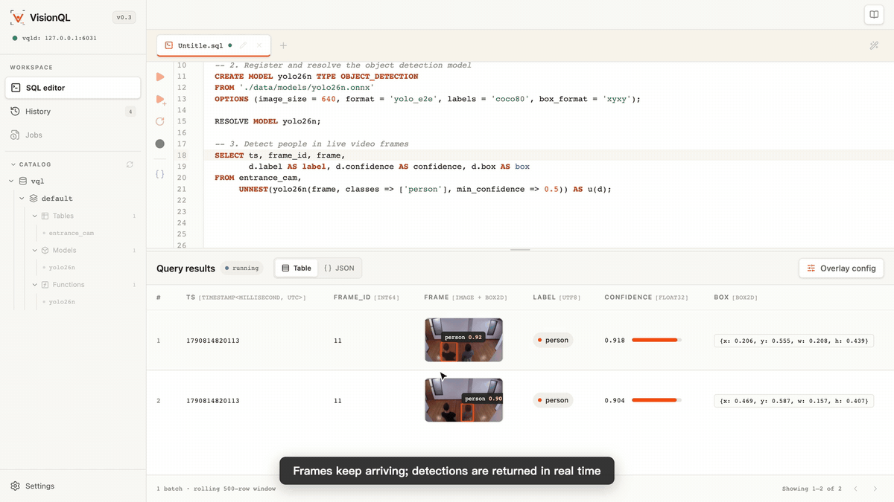
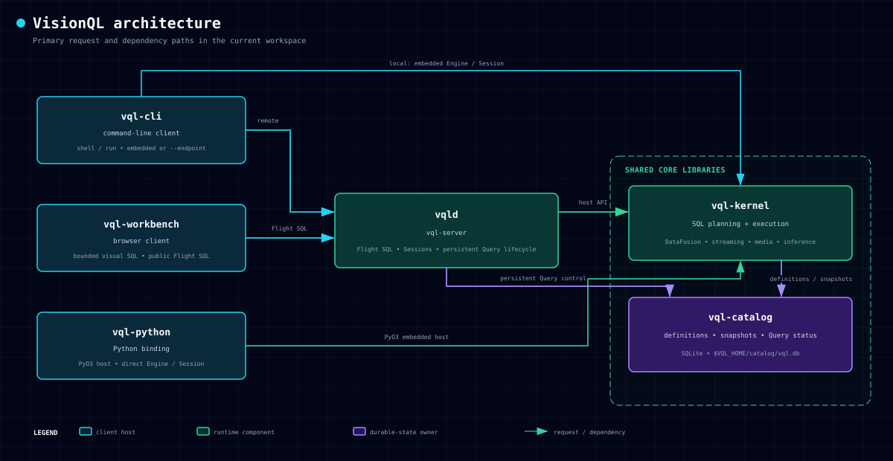

<div align="center">
  <h1>VisionQL — A Data Engine for Physical AI</h1>
  <p>
    <a href="https://github.com/zhenlohuang/visionql/actions/workflows/ci.yml">
      
    </a>
    
    
    
    <a href="LICENSE">
      
    </a>
  </p>
  <p>
    <a href="#quick-start">Quick start</a> ·
    <a href="#workbench">Workbench</a> ·
    <a href="#examples">Examples</a> ·
    <a href="#python-api">Python</a> ·
    <a href="#architecture">Architecture</a> ·
    <a href="ROADMAP.md">Roadmap</a> ·
    <a href="CHANGELOG.md">Changelog</a>
  </p>
</div>

## What is VisionQL

VisionQL is a unified batch and streaming engine for querying images, video files, and live camera streams with SQL. Register data sources and typed Models, compose inference with filters and aggregations, and return Arrow results or write continuously to Kafka. Use the embedded CLI or Python API, connect remotely through `vqld` and Arrow Flight SQL, or inspect visual results in the browser with Workbench.

> [!IMPORTANT]
> The latest published release is v0.2.0, which includes the embedded engine, single-node `vqld` service, Arrow Flight SQL, and Catalog-backed persistent Jobs. The current source also implements Workbench for the upcoming v0.3 release and uses `SHOW JOBS` for persistent Job listing. See the [Roadmap](ROADMAP.md) for release scope and the [Changelog](CHANGELOG.md) for changes since v0.2.0.

### Workbench demo

Workbench runs VQL against a live RTSP camera through `vqld`: register the stream and a YOLO26n detector, run person detection as an attached stream, then click a returned frame to inspect its bounding box, label, and confidence. Follow the [Workbench setup](#workbench) and [RTSP example](examples/README.md#rtsp-streaming-and-persistent-jobs) to use your own camera.

<p align="center">
  <a href="docs/assets/workbench-rtsp-detection.mp4">
    
  </a>
  <br>
  <sub><a href="docs/assets/workbench-rtsp-detection.mp4">▶ Watch the full demo video (79 s)</a></sub>
</p>

## Why VisionQL

Physical AI systems continuously produce camera, vehicle, and robot data. VisionQL turns decoding, sampling, inference, and aggregation into a declarative query plan:

- **Replace one-off pipelines with queries.** Images become rows and sampled video frames become time-aware relations. Compose visual inference with familiar filters, joins, `UNNEST`, and aggregations instead of rebuilding orchestration for every question.
- **Optimize inference, not just SQL.** Model calls stay visible in the plan rather than hiding inside black-box UDFs. VisionQL can push down frame sampling and time predicates, batch inference, and avoid decoding columns the query never reads.
- **Develop on history, move to live data.** One query model covers bounded image/video data and unbounded RTSP camera streams, with attached execution or explicit persistent Table writes.
- **Inspect the result where you query.** Workbench combines SQL drafts, thumbnail and bounding-box inspection, a namespace Catalog tree, and persistent Jobs management in one browser workspace.
- **Keep execution close to the data.** Run the engine in-process or host it through the single-node `vqld` service without requiring media uploads, a scheduler, or a control plane.

The [PRD](docs/prd.md) covers target users, representative Physical AI workflows, product boundaries, and the longer-term batch/stream value proposition.

## Quick start

Install the [prerequisites](docs/user_guide/installation.md#prerequisites), then build the current source and fetch the sample images:

```bash
git clone https://github.com/zhenlohuang/visionql.git
cd visionql

export VQL_HOME="$PWD/data/.vql"
python3 -m venv .venv
source .venv/bin/activate
cargo build --workspace --locked
python scripts/fetch_datasets.py
cargo run -q -p vql-cli -- shell
```

In the shell, register the sample images and run your first query:

```sql
CREATE TABLE sample_images
USING IMAGES
LOCATION './data/datasets/images/coco128/images'
OPTIONS (recursive = true);

SELECT uri, width, height
FROM sample_images
ORDER BY uri
LIMIT 5;
```

The Catalog persists the table definition across Sessions. See [Installation and configuration](docs/user_guide/installation.md) for Docker, `vqld`, Python, Workbench, and runtime settings.

## Workbench

Workbench provides SQL drafts, bounded and attached-stream execution, thumbnail and bounding-box inspection, a namespace Catalog tree, and persistent Jobs management. It connects to one `vqld` endpoint through public Flight SQL.

Follow the [startup instructions](docs/user_guide/installation.md#workbench), then open [http://127.0.0.1:6040](http://127.0.0.1:6040). The [Workbench user guide](docs/user_guide/workbench.md) covers connections, SQL drafts, visual inspection, Catalog, and Jobs. Closing the browser or cancelling an attached preview leaves persistent Jobs running in `vqld`.

## Examples

### Typed visual inference

Register a Model and call it by name. Its persisted interface fixes the typed arguments and result, while inference remains visible to the optimizer. Export the repository's YOLO26n detector first:

```bash
python -m pip install ultralytics huggingface_hub onnx
python scripts/export_yolo26.py --task detect --size n
```

The following SQL reuses `sample_images` from [Quick start](#quick-start). Run it through the shell or Workbench from the same repository checkout:

```sql
CREATE MODEL yolo TYPE OBJECT_DETECTION
FROM './data/models/yolo26n.onnx'
OPTIONS (
  image_size = 640,
  format = 'yolo_e2e',
  labels = 'coco80',
  box_format = 'xyxy'
);

RESOLVE MODEL yolo;

SELECT f.uri,
       f.image AS thumbnail,
       det.label,
       det.confidence,
       det.box
FROM sample_images AS f,
     UNNEST(yolo(f.image,
       classes => ['person'],
       min_confidence => 0.5
     )) AS u(det)
LIMIT 5;
```

`CREATE MODEL` declares a typed callable; `RESOLVE MODEL` validates and pins its execution contract. In Workbench, the thumbnail, normalized box, label, and confidence can be inspected together.

Continue with the [SQL reference](docs/user_guide/sql-reference.md) for Model versions, built-in AI, spatial functions, and streaming semantics, or the [examples](examples/README.md) for recorded video, RTSP, Kafka, and persistent Jobs.

## Python API

After [building the Python extension](docs/user_guide/installation.md#python-api), reuse the same Catalog and collect a PyArrow table:

```python
import visionql

session = visionql.connect()
table = session.sql("SELECT uri, width, height FROM sample_images LIMIT 5").collect()
print(table)
```

See the [Python and notebook examples](examples/README.md) for visual inference and batched Python UDFs.

## Architecture

[](docs/architecture.html)

The CLI and Python API can embed `vql-kernel`; `vqld` hosts the same engine over Flight SQL and owns service Sessions and persistent Job lifecycle. `vql-catalog` persists definitions and Jobs in one Catalog database. Workbench is an independent browser client of `vqld`.

Open the [interactive architecture diagram](docs/architecture.html) or the [High-Level Design](docs/high_level_design.md) for system boundaries and the component-design index.

## Documentation

| Document | Use it for |
|---|---|
| [Installation and configuration](docs/user_guide/installation.md) | Source builds, Docker, CLI, Python, `vqld`, Workbench, and runtime state |
| [SQL reference](docs/user_guide/sql-reference.md) | VQL types, provider Tables, Models, Functions, windows, and Jobs |
| [Built-in function reference](docs/user_guide/sql-functions.md) | Generated syntax, arguments, and examples for AI, spatial, and window functions |
| [Examples](examples/README.md) | Complete SQL, Python, notebook, and streaming workflows |
| [Workbench user guide](docs/user_guide/workbench.md) | Connections, SQL drafts, visual inspection, Catalog, Jobs, and history |
| [Product requirements](docs/prd.md) | Product value and public semantics |
| [Roadmap](ROADMAP.md) / [Changelog](CHANGELOG.md) | Release scope and delivered changes |
| [Contributing](CONTRIBUTING.md) | Development setup, tests, coverage, Git hooks, and review expectations |

## Contributing

Issues and pull requests are welcome. See [CONTRIBUTING.md](CONTRIBUTING.md) and the [Code of Conduct](CODE_OF_CONDUCT.md). Report vulnerabilities privately according to [SECURITY.md](SECURITY.md).

## License

VisionQL is licensed under the [Apache License 2.0](LICENSE).
