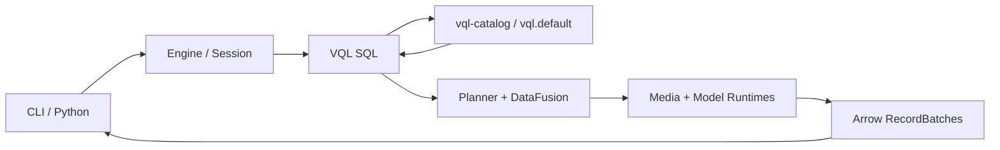

<div align="center">
  <h1>VisionQL — A Data Engine for Physical AI</h1>
  <p>
    <a href="https://github.com/zhenlohuang/visionql/actions/workflows/ci.yml">
      
    </a>
    
    
    
    <a href="LICENSE">
      
    </a>
  </p>
  <p>
    <a href="#quick-start">Quick start</a> ·
    <a href="#examples">Examples</a> ·
    <a href="#python-api">Python</a> ·
    <a href="#architecture">Architecture</a> ·
    <a href="ROADMAP.md">Roadmap</a>
  </p>
</div>

## What is VisionQL

VisionQL is a unified batch and streaming engine for querying and processing multimodal data. With SQL today—and a chainable DataFrame API planned for v0.2—users can work with images, video files, and live video streams through the same query model.

> [!IMPORTANT]
> VisionQL v0.1 is pre-release. Image sets, historical video, typed inference, RTSP ingestion, streaming `TUMBLE`, attached foreground execution, and Kafka output are implemented. `vqld`, Workbench, and vector search follow in later releases. See the [Roadmap](ROADMAP.md) for exact delivery status and version boundaries.

## Why VisionQL

Physical AI systems continuously produce camera, vehicle, and robot data. VisionQL turns decoding, sampling, inference, and aggregation into a declarative query plan:

- **Replace one-off pipelines with queries.** Images become rows and sampled video frames become time-aware relations. Compose visual inference with familiar filters, joins, `UNNEST`, and aggregations instead of rebuilding orchestration for every question.
- **Optimize inference, not just SQL.** Model calls stay visible in the plan rather than hiding inside black-box UDFs. VisionQL can push down frame sampling and time predicates, batch inference, and avoid decoding columns the query never reads.
- **Develop on history, move to live data.** v0.1 uses one query model for bounded image/video data and unbounded RTSP camera streams, with attached execution and Kafka output.
- **Keep execution close to the data.** The v0.1 engine runs in-process and does not require media uploads, a scheduler, or a control plane.

The [PRD](docs/prd.md) covers target users, representative Physical AI workflows, product boundaries, and the longer-term batch/stream value proposition.

## Quick start

### Prerequisites

- [Rust](https://www.rust-lang.org/tools/install), installed via `rustup`; the repository selects its pinned toolchain automatically.
- Python 3.10 or newer.
- [FFmpeg 8](https://ffmpeg.org/download.html), including development libraries for the default native video build and `ffmpeg` / `ffprobe` on `PATH` for sample preparation.
- A C/C++ build toolchain and `make` for the bundled `librdkafka` build. Kafka TLS uses vendored OpenSSL and does not require a system `librdkafka` installation.

### Build from source

```bash
git clone https://github.com/zhenlohuang/visionql.git
cd visionql

export VQL_HOME="$PWD/data/.vql"
python -m venv .venv
source .venv/bin/activate
cargo build --workspace --locked
python scripts/fetch_datasets.py
```

Open the SQL shell:

```bash
cargo run -q -p vql-cli -- shell
```

Then run a query against the downloaded COCO sample:

```sql
CREATE TABLE sample_images
USING IMAGES
LOCATION './data/datasets/images/coco128/images'
OPTIONS (recursive = true);

SELECT uri, width, height
FROM sample_images
ORDER BY uri
LIMIT 5;
```

VisionQL persists the table definition, so a new shell session can query `sample_images` without registering it again.

## Examples

### Typed visual inference

The v0.1 contract registers a Model and calls that Model by name. Its persisted interface fixes the typed arguments and result, while inference remains visible to the optimizer.

```sql
CREATE MODEL yolo TYPE OBJECT_DETECTION
FROM 'file:///models/yolo.onnx';

RESOLVE MODEL yolo;

SELECT uri,
       yolo(image,
         classes => ['person'],
         min_confidence => 0.5
       ) AS detections
FROM sample_images;
```

`CREATE MODEL` is local and free of I/O. An `.onnx` source selects ONNX Runtime; other unambiguous source schemes have fixed Runtime defaults, and `USING` is required otherwise. `RESOLVE MODEL` introspects the graph, downloads and verifies remote artifacts when needed, and publishes the first version. Flat `OPTIONS` supply only facts introspection cannot determine, such as `sha256`, `format`, `labels`, or a dynamic `image_size`.

Use `SHOW MODELS`, `SHOW MODEL VERSIONS yolo`, and `DESCRIBE MODEL yolo` to inspect the aggregate, versions, and callable interface. `SHOW CREATE TABLE|MODEL|FUNCTION <name>` returns sanitized canonical DDL; credential references are redacted.

### Built-in AI functions

The v0.1 built-in AI surface is organized by task shape: `VQL_CLASSIFY` judges a whole input,
`VQL_EXTRACT` extracts user-named fields, and `VQL_DETECT` discovers instances. Install the
release-managed YOLO26n ImageNet classifier and COCO detector under the active `VQL_HOME`:

```bash
python scripts/export_yolo26.py --task classify --install
python scripts/export_yolo26.py --task detect --install
```

Then use either function without creating or resolving a Catalog Model:

```sql
SELECT uri,
       VQL_CLASSIFY(image, ['football_helmet']) AS categories,
       VQL_DETECT(image,
         classes => ['person'],
         min_score => 0.5
       ) AS detections
FROM sample_images;
```

`VQL_CLASSIFY` also reserves a STRING overload. `VQL_EXTRACT` accepts IMAGE or STRING plus a
planning-time field map such as
`MAP {'title': 'What is the title?', 'items': STRUCT('List the items' AS question, TRUE AS list)}`.
Those overloads currently return `FEATURE_NOT_AVAILABLE`; IMAGE execution is available for
`VQL_CLASSIFY` and `VQL_DETECT`.

### Model sources

| Source | Example | Behavior |
|---|---|---|
| Local ONNX artifact | `'./model.onnx'` or `'file:///models/model.onnx'` | `RESOLVE MODEL` hashes it in place; no cache copy |
| Hugging Face artifact | `'hf://owner/repository@<commit>/model.onnx'` | `RESOLVE MODEL` downloads and caches it by digest |
| Inference service | `'triton+https://triton-prod:8000/detector@42'` | `RESOLVE MODEL` validates the service contract; service versions are volatile |

```sql
CREATE MODEL production_detector TYPE OBJECT_DETECTION
FROM 'triton+https://triton-prod:8000/detector@42';

RESOLVE MODEL production_detector;
```

`ONNX_RUNTIME` and `TRITON_INFERENCE_SERVER` are the v0.1 Runtime paths. ONNX resolution derives tensor binding and processing from graph metadata plus flat `OPTIONS`; Triton owns preprocessing and postprocessing and exposes the canonical capability result.

Set `HF_TOKEN` when resolving a private Hugging Face bundle. The resolver reads it from the process environment only during `RESOLVE MODEL`; it is never persisted in the Catalog or visible Model DDL.

### RTSP streaming

The v0.1 streaming path registers one live camera and runs an attached query until the client cancels it. FFmpeg decodes on a controlled worker, sampling uses event time, watermarks advance outside data rows, and disconnects retry with exponential backoff.

```sql
CREATE TABLE cam_entrance
USING RTSP
OPTIONS (
  url = 'rtsp://10.0.0.15:554/main',
  fps = 5,
  event_time = 'capture_time',
  watermark = '2 seconds',
  transport = 'tcp'
);

SELECT ts, frame_id, source, frame
FROM cam_entrance;

SELECT TUMBLE(ts, INTERVAL '10' SECOND) AS window_start,
       COUNT(*) AS frames,
       MIN(frame_id) AS first_frame,
       MAX(frame_id) AS last_frame
FROM cam_entrance
GROUP BY 1;
```

The shell and `vql run` print unbounded results incrementally. The first Ctrl-C stops source intake, drains admitted epochs, and flushes an attached table write; press Ctrl-C again while that shutdown is in progress to cancel immediately. An unbounded statement must be last in a `vql run` script so stopping it cannot start later SQL. `Projection`, `Filter`, `UNNEST`, scalar functions, typed inference, and one `TUMBLE` aggregate are accepted. Streaming windows support `COUNT`, `SUM`, `AVG`, `MIN`, and `MAX`; they close only after the watermark reaches the window end. `DISTINCT`, media-valued state, and unsupported unbounded plan shapes are rejected during planning. Live frames use epoch-scoped frame buffers internally and are encoded before crossing the result boundary. Cataloged endpoints currently reject embedded credentials and query parameters so secrets cannot be persisted accidentally.

Kafka output is a writable table declared with `CREATE TABLE ... USING KAFKA`. Authentication uses an opaque `credential_ref`; embedding hosts install a `SecretProvider` on `EngineConfig`, and resolved credentials never enter the Catalog or SQL text. `KafkaAuthentication` and `KafkaTlsConfig` are VisionQL-owned public types supporting TLS/mTLS, SASL/PLAIN, SCRAM-SHA-256/512, and static OAUTHBEARER tokens without exposing the internal Kafka client. The repository's local Compose profile uses plaintext Kafka and does not require a reference.

## Python API

The example below reuses the `sample_images` table and `VQL_HOME` from [Quick start](#quick-start). Build the Python extension into an active virtual environment with [Maturin](https://www.maturin.rs/):

```bash
export VQL_HOME="$PWD/data/.vql"
source .venv/bin/activate
python -m pip install "maturin>=1.9,<2"

cd vql-python
maturin develop --locked
cd ..
```

The synchronous API returns a `QueryHandle`; `collect()` materializes a PyArrow table.

```python
import visionql

session = visionql.connect()
result = session.sql("""
    SELECT uri, width, height
    FROM sample_images
    ORDER BY uri
    LIMIT 5
""")

table = result.collect()
print(table)
```

Python-hosted UDFs receive and return Arrow arrays in batches. They require the Python host and are not available in the standalone CLI.

## CLI

```text
vql shell
vql run <script.sql>
```

SQL `EXPLAIN` adds bounded/continuous mode, source pushdowns, stream topology, resolved inference semantics, and Table-write placement without opening sources or probing models and services. Run it through the shell or a SQL script like any other statement. During source development, replace `vql` with `cargo run -p vql-cli --`. Set `VQL_LOG_LEVEL=debug` when diagnosing execution.

In `vql shell`, enter `\q` on its own line or press Ctrl-D to exit. Ctrl-C clears pending input at the prompt; during an unbounded query, the first Ctrl-C requests a graceful stop and the second cancels immediately.

## Runtime state

VisionQL keeps configuration and local state under `VQL_HOME`, which defaults to `$HOME/.vql`. The optional `$VQL_HOME/config.toml` is loaded by the CLI and Python host; missing settings use the defaults below. The Catalog makes table, model, and function definitions reusable across sessions; planning takes one immutable definition snapshot so later DDL cannot change a running query.

```toml
version = 1

[log]
level = "info"

[catalog]
backend = "sqlite"

[catalog.sqlite]
path = "catalog/vql.db"

[kernel.session]
memory_limit = "512 MiB"
```

Relative paths are resolved from `VQL_HOME`. Configuration is strict: an unsupported version, backend, field, log level, or memory unit stops startup instead of being ignored.

| State or setting | Default and behavior |
|---|---|
| Configuration | `$VQL_HOME/config.toml`; optional, schema `version = 1` |
| Catalog | SQLite backend at `$VQL_HOME/catalog/vql.db`; Python and Rust hosts may explicitly override the path |
| Shell history | `$VQL_HOME/history` |
| Model cache | `$VQL_HOME/cache/models/`; local `file://` models stay at their source path |
| Session memory | 512 MiB shared by every query and retained result in one Session; Python may override it with `connect(session_memory_limit_bytes=...)` |
| `HF_TOKEN` | Authenticates private `hf://` downloads |
| `VQL_LOG_LEVEL` | Overrides `log.level`; accepts `error`, `warn`, `info`, `debug`, or `trace` |

An explicit host-side Catalog override changes only the SQLite Catalog path; configuration, shell history, and the model cache remain under the same `VQL_HOME`.

## Errors

Hard failures have a stable `VQL-CCDDD` identifier, a readable symbol, and a diagnostic message:

```text
[VQL-42001] INVALID_SQL: expected a statement
```

CLI output uses that form. Python raises `visionql.VisionQLError`, a `RuntimeError` subclass whose `code`, `symbol`, `message`, and `target_version` attributes avoid error-string matching. See the [Error Code Design](docs/error_codes.md) for the registry and compatibility rules.

## Architecture



The CLI and Python hosts share `vql-kernel`, which owns SQL planning, DataFusion execution, epoch-driven RTSP ingestion, media decoding, and model inference. The separate `vql-catalog` crate owns catalog domains, definition snapshots, backend ports, the SQLite implementation, and the Unity Catalog-compatible REST surface. SQL resolves unqualified names in `vql.default`. See the [High-Level Design](docs/high_level_design.md) and focused component designs below.

## Documentation

| Document | Use it for |
|---|---|
| [Examples](examples/README.md) | End-to-end SQL, Python, and notebook workflows |
| [Product requirements](docs/prd.md) | Product value, public semantics, and version scope |
| [High-level design](docs/high_level_design.md) | System boundaries, data paths, invariants, and dependency direction |
| [Kernel design](docs/kernel.md) | Planning, streaming, media, inference, resources, and security |
| [Catalog design](docs/catalog.md) | Namespaces, definitions, snapshots, providers, backends, and UC API |
| [Error code design](docs/error_codes.md) | Stable identifiers, symbols, host representation, and extension rules |
| [CLI design](docs/cli.md) | Shell, script execution, rendering, and signal behavior |
| [Python binding design](docs/python_binding.md) | PyO3 API, PyArrow results, and Python UDFs |
| [Testing design](docs/testing.md) | Test ownership, system scenarios, fixtures, and Compose services |
| [Roadmap](ROADMAP.md) | Delivered and planned capabilities by version |
| [Proposals](docs/proposals/README.md) | Focused designs for later features |
| [Datasets](data/datasets/README.md) / [models](data/models/README.md) | Sample provenance and ONNX export contract |
| [Contributing](CONTRIBUTING.md) | Development workflow, tests, and pull request expectations |
| [Security](SECURITY.md) | Supported versions and private vulnerability reporting |

## Development

The workspace declares Rust 1.88 as its minimum supported version and pins Rust 1.91.1 for repository development. Run the gates from the root:

```bash
cargo fmt --all -- --check
cargo clippy --workspace --all-targets --locked -- -D warnings
cargo test --workspace --locked
```

Run kernel-owned SQL contracts directly with:

```bash
cargo test -p vql-kernel --test slt --locked
```

Cases are grouped under `vql-kernel/tests/slt/{ddl,connectors,functions,models}`. The harness
generates its fixtures and uses `mock://` models, so the default workspace suite never depends on
downloaded data or models. Real data, models, RTSP, and Kafka remain in the feature-gated
`vql-testing` system suite.

Optional development and system-test services use profiles in the root Compose file. For example:

```bash
docker compose --profile rtsp up -d mediamtx
scripts/run-integration-tests.sh
```

Install the Git hooks with [pre-commit](https://pre-commit.com/):

```bash
python -m pip install pre-commit
pre-commit install
pre-commit run --all-files
pre-commit run --hook-stage pre-push --all-files
```

The feature-gated system suite owns real datasets, models, RTSP, and Kafka. Run one real-model SQL
scenario after installing the integration fixtures with:

```bash
VQL_TEST_CASE=models/mixed_size_images \
VQL_INTEGRATION_TEST=1 \
  cargo test -p vql-testing \
  --features system-tests \
  --test slt \
  --locked
```

## Contributing

Issues and pull requests are welcome. See [CONTRIBUTING.md](CONTRIBUTING.md) for setup, tests, and review expectations. Report vulnerabilities privately according to [SECURITY.md](SECURITY.md).

## License

VisionQL is licensed under the [Apache License 2.0](LICENSE).
