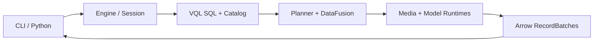

<div align="center">
  <h1>VisionQL — A Data Engine for Physical AI</h1>
  <p>
    Query images and recorded video with SQL—locally, without a service.
  </p>
  <p>
    <a href="https://github.com/zhenlohuang/visionql/actions/workflows/ci.yml">
      
    </a>
    
    
    
    <a href="LICENSE">
      
    </a>
  </p>
  <p>
    <a href="#quick-start">Quick start</a> ·
    <a href="#run-visual-inference">Examples</a> ·
    <a href="#python-api">Python</a> ·
    <a href="#architecture">Architecture</a> ·
    <a href="ROADMAP.md">Roadmap</a>
  </p>
</div>

After registering a video table and a model-backed `detect` function, inference composes like ordinary SQL:

```sql
SELECT uri, ts,
       COUNT_OBJECTS(detect(frame), 'person', 0.6) AS people
FROM entrance_videos
ORDER BY uri, ts;
```

> [!IMPORTANT]
> VisionQL v0.1 is a pre-1.0, local batch engine. Image sets and historical video are available now. RTSP streams, Kafka, `vqld`, Workbench, and vector search are roadmap items—not current functionality. See the [Roadmap](ROADMAP.md) for version boundaries.

## Why VisionQL

Physical AI systems continuously produce camera, vehicle, and robot data. VisionQL turns decoding, sampling, inference, and aggregation into a declarative query plan:

- **Replace one-off pipelines with queries.** Images become rows and sampled video frames become time-aware relations. Compose visual inference with familiar filters, joins, `UNNEST`, and aggregations instead of rebuilding orchestration for every question.
- **Optimize inference, not just SQL.** Model calls stay visible in the plan rather than hiding inside black-box UDFs. VisionQL can push down frame sampling and time predicates, batch inference, and avoid decoding columns the query never reads.
- **Develop on history, move to live data.** The product direction is one query model for bounded image/video data and unbounded camera streams. Historical batch processing ships in v0.1; RTSP streaming and Kafka output are explicitly scoped to v0.2.
- **Keep execution close to the data.** The v0.1 engine runs in-process and does not require media uploads, a scheduler, or a control plane.

The [PRD](docs/prd.md) covers target users, representative Physical AI workflows, product boundaries, and the longer-term batch/stream value proposition.

## Quick start

### Prerequisites

- [Rustup](https://rustup.rs/); the repository selects its pinned toolchain automatically.
- Python 3.10 or newer.
- [FFmpeg 8](https://ffmpeg.org/download.html), including development libraries for the default native video build and `ffmpeg` / `ffprobe` on `PATH` for sample preparation.

### Build from source

```bash
git clone https://github.com/zhenlohuang/visionql.git
cd visionql

export VQL_HOME="$PWD/data/.vql"
python -m venv .venv
source .venv/bin/activate
cargo build --workspace --locked
python scripts/fetch_datasets.py
```

Open the SQL shell:

```bash
cargo run -q -p vql-cli -- shell
```

Then run a query against the downloaded COCO sample:

```sql
CREATE TABLE sample_images
USING IMAGES
LOCATION './data/datasets/images/coco128/images'
WITH (recursive = true);

SELECT uri, width, height
FROM sample_images
ORDER BY uri
LIMIT 5;
```

VisionQL persists the table definition, so a new shell session can query `sample_images` without registering it again.

## Run visual inference

Complete [Build from source](#build-from-source) first so the sample videos, Rust workspace, and Python environment are ready. Then activate the environment and install the model export tools:

```bash
export VQL_HOME="$PWD/data/.vql"
source .venv/bin/activate
python -m pip install ultralytics huggingface_hub onnx
```

The examples use an official Ultralytics YOLO26 checkpoint exported explicitly to ONNX. Model preparation is separate from query execution: VisionQL does not embed PyTorch or execute model repository code.

```bash
python scripts/export_yolo26.py --size n

cargo run -p vql-cli -- run examples/sql/video_people_count.sql
```

The built-in `yolo26-detect-v1` processor supplies the official end-to-end tensor and COCO label defaults. Model options can override processor defaults; function options can narrow classes and confidence for a specific query interface. The [model guide](data/models/README.md) documents the exact export contract.

For a guided image workflow with a Python UDF and ONNX inference, see [`examples/python/image_filtering.py`](examples/python/image_filtering.py) and the [`examples` guide](examples/README.md).

### Model sources

| Source | Example | Behavior |
|---|---|---|
| Local | `'./model.onnx'` or `'file:///models/model.onnx'` | Read in place; never copied to cache |
| Hugging Face | `'hf://owner/repository@revision/model.onnx'` | Download one ONNX artifact into the content-addressed cache |
| HTTP | `'endpoint://https://inference.example.com/detect'` | Send batched JPEG inputs to a synchronous endpoint |

Set `HF_TOKEN` when accessing a private Hugging Face repository. HTTP endpoints receive and return JSON with one outer result row per input image:

- Request: `{"images":["<base64-jpeg>"]}`
- Response: `{"detections":[[{"label":"person","confidence":0.8,"box":[0.1,0.2,0.3,0.4]}]]}`

`box` is normalized `[x, y, width, height]` with a top-left origin. The default endpoint timeout is 30 seconds.

## Python API

The example below reuses the `sample_images` table and `VQL_HOME` from [Quick start](#quick-start). Build the Python extension into an active virtual environment with [Maturin](https://www.maturin.rs/):

```bash
export VQL_HOME="$PWD/data/.vql"
source .venv/bin/activate
python -m pip install "maturin>=1.9,<2"

cd vql-python
maturin develop --locked
cd ..
```

The synchronous API returns a `QueryHandle`; `collect()` materializes a PyArrow table.

```python
import visionql

session = visionql.connect()
result = session.sql("""
    SELECT uri, width, height
    FROM sample_images
    ORDER BY uri
    LIMIT 5
""")

table = result.collect()
print(table)
```

Python-hosted UDFs receive and return Arrow arrays in batches. They require the Python host and are not available in the standalone CLI.

## CLI

```text
vql [--catalog PATH] shell
vql [--catalog PATH] run <script.sql>
vql [--catalog PATH] explain <query-or-file>
```

During source development, replace `vql` with `cargo run -p vql-cli --`. Set `VQL_LOG` to a `tracing` filter such as `info` or `vql_kernel=debug` when diagnosing execution.

## Runtime state

VisionQL keeps local state under `VQL_HOME`, which defaults to `$HOME/.vql`. The revisioned catalog makes table, model, and function definitions reusable across sessions.

| State or setting | Default and behavior |
|---|---|
| Catalog | `$VQL_HOME/catalog/vql.db`; override with `VQL_CATALOG` or `--catalog PATH` |
| Shell history | `$VQL_HOME/history` |
| Model cache | `$VQL_HOME/cache/models/`; local `file://` models stay at their source path |
| `HF_TOKEN` | Authenticates private `hf://` downloads |
| `VQL_LOG` | Configures Rust tracing; default is off |

A catalog override changes only the SQLite path; shell history and the model cache remain under the same `VQL_HOME`.

## Architecture



The CLI and Python hosts share `vql-kernel`, which owns SQL planning, the revisioned catalog, DataFusion execution, media decoding, and model inference. For design rationale—including lazy media decoding, model-visible planning, and the future batch/stream boundary—read the [system design](docs/design.md).

## Documentation

| Document | Use it for |
|---|---|
| [Examples](examples/README.md) | End-to-end SQL, Python, and notebook workflows |
| [Product requirements](docs/prd.md) | Product value, public semantics, and version scope |
| [System design](docs/design.md) | Engine architecture, contracts, and extension boundaries |
| [Roadmap](ROADMAP.md) | Delivered and planned capabilities by version |
| [Proposals](docs/proposals/README.md) | Focused designs for later features |
| [SQL behavior tests](vql-kernel/tests/README.md) | Golden-case workflow and test fixtures |
| [Datasets](data/datasets/README.md) / [models](data/models/README.md) | Sample provenance and ONNX export contract |
| [Contributing](CONTRIBUTING.md) | Development workflow, tests, and pull request expectations |
| [Security](SECURITY.md) | Supported versions and private vulnerability reporting |

## Development

The workspace declares Rust 1.88 as its minimum supported version and pins Rust 1.91.1 for repository development. Run the gates from the root:

```bash
cargo fmt --all -- --check
cargo clippy --workspace --all-targets --locked -- -D warnings
cargo test --workspace --locked
```

Run the executable SQL behavior suite directly with:

```bash
cargo test -p vql-kernel --test sql_cases
```

Install the Git hooks with [pre-commit](https://pre-commit.com/):

```bash
python -m pip install pre-commit
pre-commit install
pre-commit run --all-files
pre-commit run --hook-stage pre-push --all-files
```

The real-model test is intentionally ignored in the default suite. Run it with an exported model:

```bash
VQL_YOLO26_ONNX=./data/models/yolo26n.onnx \
  cargo test real_yolo26_onnx_e2e -- --ignored
```

## Contributing

Issues and pull requests are welcome. See [CONTRIBUTING.md](CONTRIBUTING.md) for setup, tests, and review expectations. Report vulnerabilities privately according to [SECURITY.md](SECURITY.md).

## License

VisionQL is licensed under the [Apache License 2.0](LICENSE).
