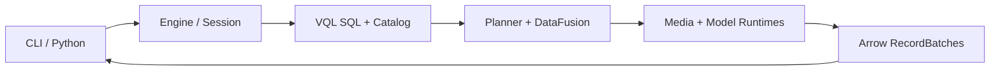

<div align="center">
  <h1>VisionQL — A Data Engine for Physical AI</h1>
  <p>
    <a href="https://github.com/zhenlohuang/visionql/actions/workflows/ci.yml">
      
    </a>
    
    
    
    <a href="LICENSE">
      
    </a>
  </p>
  <p>
    <a href="#quick-start">Quick start</a> ·
    <a href="#examples">Examples</a> ·
    <a href="#python-api">Python</a> ·
    <a href="#architecture">Architecture</a> ·
    <a href="ROADMAP.md">Roadmap</a>
  </p>
</div>

## What is VisionQL

VisionQL is a unified batch and streaming engine for querying and processing multimodal data. With SQL or the DataFrame API, users can work with images, video files, and live video streams through the same query model.

> [!IMPORTANT]
> VisionQL v0.1 is pre-release. Image sets, historical video, typed inference, and the first RTSP source slice are implemented. Streaming `TUMBLE` and Kafka remain v0.1 roadmap items; `vqld`, Workbench, and vector search follow in later releases. See the [Roadmap](ROADMAP.md) for exact delivery status and version boundaries.

## Why VisionQL

Physical AI systems continuously produce camera, vehicle, and robot data. VisionQL turns decoding, sampling, inference, and aggregation into a declarative query plan:

- **Replace one-off pipelines with queries.** Images become rows and sampled video frames become time-aware relations. Compose visual inference with familiar filters, joins, `UNNEST`, and aggregations instead of rebuilding orchestration for every question.
- **Optimize inference, not just SQL.** Model calls stay visible in the plan rather than hiding inside black-box UDFs. VisionQL can push down frame sampling and time predicates, batch inference, and avoid decoding columns the query never reads.
- **Develop on history, move to live data.** v0.1 uses one query model for bounded image/video data and unbounded RTSP camera streams, with attached execution and Kafka output.
- **Keep execution close to the data.** The v0.1 engine runs in-process and does not require media uploads, a scheduler, or a control plane.

The [PRD](docs/prd.md) covers target users, representative Physical AI workflows, product boundaries, and the longer-term batch/stream value proposition.

## Quick start

### Prerequisites

- [Rustup](https://rustup.rs/); the repository selects its pinned toolchain automatically.
- Python 3.10 or newer.
- [FFmpeg 8](https://ffmpeg.org/download.html), including development libraries for the default native video build and `ffmpeg` / `ffprobe` on `PATH` for sample preparation.

### Build from source

```bash
git clone https://github.com/zhenlohuang/visionql.git
cd visionql

export VQL_HOME="$PWD/data/.vql"
python -m venv .venv
source .venv/bin/activate
cargo build --workspace --locked
python scripts/fetch_datasets.py
```

Open the SQL shell:

```bash
cargo run -q -p vql-cli -- shell
```

Then run a query against the downloaded COCO sample:

```sql
CREATE TABLE sample_images
USING IMAGES
LOCATION './data/datasets/images/coco128/images'
WITH (recursive = true);

SELECT uri, width, height
FROM sample_images
ORDER BY uri
LIMIT 5;
```

VisionQL persists the table definition, so a new shell session can query `sample_images` without registering it again.

## Examples

### Typed visual inference

The v0.1 contract registers one typed Model and calls the fixed built-in function selected by its `TYPE`. Inference remains visible to the optimizer; SQL/Python user functions use DataFusion's separate function extension path.

```sql
CREATE MODEL yolo
TYPE OBJECT_DETECTION
FROM 'file:///models/yolo.onnx'
WITH (
  runtime.kind = 'onnxruntime',
  pre_processor.kind = 'vision.image_tensor@1',
  pre_processor.options = {
    input_name = 'images', width = 640, height = 640, resize = 'letterbox'
  },
  post_processor.kind = 'vision.yolo_e2e@1',
  post_processor.options = {output_name = 'output0', labels = 'coco80'}
);

SELECT uri,
       IMAGE_DETECTION(
         'yolo',
         image,
         classes => ['person'],
         min_confidence => 0.5
       ) AS detections
FROM sample_images;
```

`runtime.kind` selects an implementation; `runtime.protocol` selects a supported wire protocol. Processor-specific fields stay inside `pre_processor.options` and `post_processor.options`. The checked-in inference implementation, SQL cases, and runnable examples use this contract.

### Model sources

| Source | Example | Behavior |
|---|---|---|
| Local bundle | `'./model.onnx'` or `'file:///models/model.gguf'` | Read in place and open only through a compatible Runtime |
| Hugging Face bundle | `'hf://owner/repository@<commit>'` | Pin selected files and cache the complete bundle by digest |
| Inference service | `'endpoint://http://triton-prod:8000'` | Bind through the Runtime's declared protocol, such as Triton KServe V2 |

The Runtime registry is intentionally explicit: `onnxruntime` and Triton with `kserve_v2_http` are v0.1 paths; Triton gRPC, `vllm`, `sglang`, and `llama_cpp` are roadmap-gated, while `transformers` supports v0.3 embedding. `openai` may be a protocol for a compatible Runtime but is not a Runtime kind. ONNX, explicitly classified `.pt`/`.pth`, Safetensors, and GGUF are artifact forms rather than interchangeable loaders.

Set `HF_TOKEN` when resolving a private Hugging Face bundle. Credentials are provided through secret configuration and never persisted in visible Model DDL.

### RTSP source preview

The first v0.1 streaming slice registers one live camera and runs a stateless attached query until the client cancels it. FFmpeg decodes on a controlled worker, sampling uses event time, watermarks advance outside data rows, and disconnects retry with exponential backoff.

```sql
CREATE STREAM cam_entrance
FROM 'rtsp://10.0.0.15:554/main'
WITH (
  fps = 5,
  event_time = 'capture_time',
  watermark = INTERVAL '2' SECOND,
  transport = 'tcp'
);

SELECT ts, frame_id, source, frame
FROM cam_entrance;
```

The shell and `vql run` print unbounded results incrementally; Ctrl-C cancels the attached query. `Projection`, `Filter`, `UNNEST`, scalar functions, and typed inference are accepted. Streaming aggregation is rejected until the separate `TUMBLE` state work lands. Live frames use epoch-scoped frame buffers internally and are encoded before crossing the result boundary. Cataloged endpoints currently reject embedded credentials and query parameters so secrets cannot be persisted accidentally.

## Python API

The example below reuses the `sample_images` table and `VQL_HOME` from [Quick start](#quick-start). Build the Python extension into an active virtual environment with [Maturin](https://www.maturin.rs/):

```bash
export VQL_HOME="$PWD/data/.vql"
source .venv/bin/activate
python -m pip install "maturin>=1.9,<2"

cd vql-python
maturin develop --locked
cd ..
```

The synchronous API returns a `QueryHandle`; `collect()` materializes a PyArrow table.

```python
import visionql

session = visionql.connect()
result = session.sql("""
    SELECT uri, width, height
    FROM sample_images
    ORDER BY uri
    LIMIT 5
""")

table = result.collect()
print(table)
```

Python-hosted UDFs receive and return Arrow arrays in batches. They require the Python host and are not available in the standalone CLI.

## CLI

```text
vql [--catalog PATH] shell
vql [--catalog PATH] run <script.sql>
vql [--catalog PATH] explain <query-or-file>
```

During source development, replace `vql` with `cargo run -p vql-cli --`. Set `VQL_LOG` to a `tracing` filter such as `info` or `vql_kernel=debug` when diagnosing execution.

## Runtime state

VisionQL keeps local state under `VQL_HOME`, which defaults to `$HOME/.vql`. The Catalog makes table, model, and function definitions reusable across sessions; every planned query receives an immutable Query Manifest.

| State or setting | Default and behavior |
|---|---|
| Catalog | `$VQL_HOME/catalog/vql.db`; override with `VQL_CATALOG` or `--catalog PATH` |
| Shell history | `$VQL_HOME/history` |
| Model cache | `$VQL_HOME/cache/models/`; local `file://` models stay at their source path |
| `HF_TOKEN` | Authenticates private `hf://` downloads |
| `VQL_LOG` | Configures Rust tracing; default is off |

A catalog override changes only the SQLite path; shell history and the model cache remain under the same `VQL_HOME`.

## Architecture



The CLI and Python hosts share `vql-kernel`, which owns SQL planning, the Catalog and Query Manifests, DataFusion execution, epoch-driven RTSP ingestion, media decoding, and model inference. For design rationale—including lazy media decoding, optimizer-visible inference, and the batch/stream boundary—read the [system design](docs/design.md).

## Documentation

| Document | Use it for |
|---|---|
| [Examples](examples/README.md) | End-to-end SQL, Python, and notebook workflows |
| [Product requirements](docs/prd.md) | Product value, public semantics, and version scope |
| [System design](docs/design.md) | Engine architecture, contracts, and extension boundaries |
| [Roadmap](ROADMAP.md) | Delivered and planned capabilities by version |
| [Proposals](docs/proposals/README.md) | Focused designs for later features |
| [SQL behavior tests](vql-kernel/tests/README.md) | Golden-case workflow and test fixtures |
| [Datasets](data/datasets/README.md) / [models](data/models/README.md) | Sample provenance and ONNX export contract |
| [Contributing](CONTRIBUTING.md) | Development workflow, tests, and pull request expectations |
| [Security](SECURITY.md) | Supported versions and private vulnerability reporting |

## Development

The workspace declares Rust 1.88 as its minimum supported version and pins Rust 1.91.1 for repository development. Run the gates from the root:

```bash
cargo fmt --all -- --check
cargo clippy --workspace --all-targets --locked -- -D warnings
cargo test --workspace --locked
```

Run the integration suite directly with:

```bash
cargo test -p vql-kernel --test integration
```

Cases are grouped under `vql-kernel/tests/{ddl,functions,scenarios}`. Each has one main SQL
statement, an expected result, and optional setup and teardown scripts. The suite runs against
`data/datasets` and `data/models/yolo26n.onnx`, and reports a skip when those fixtures are absent.

Install the Git hooks with [pre-commit](https://pre-commit.com/):

```bash
python -m pip install pre-commit
pre-commit install
pre-commit run --all-files
pre-commit run --hook-stage pre-push --all-files
```

The real-model mixed-size batch scenario reads `data/models/yolo26n.onnx` directly. It runs when
the integration fixtures are available and otherwise reports a skip:

```bash
VQL_TEST_CASE=scenarios/detect_objects_in_mixed_size_image_batch \
  cargo test -p vql-kernel --test integration --locked
```

## Contributing

Issues and pull requests are welcome. See [CONTRIBUTING.md](CONTRIBUTING.md) for setup, tests, and review expectations. Report vulnerabilities privately according to [SECURITY.md](SECURITY.md).

## License

VisionQL is licensed under the [Apache License 2.0](LICENSE).
