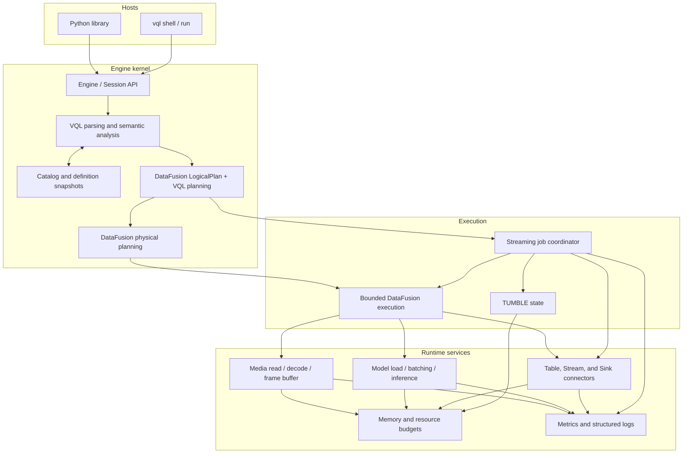
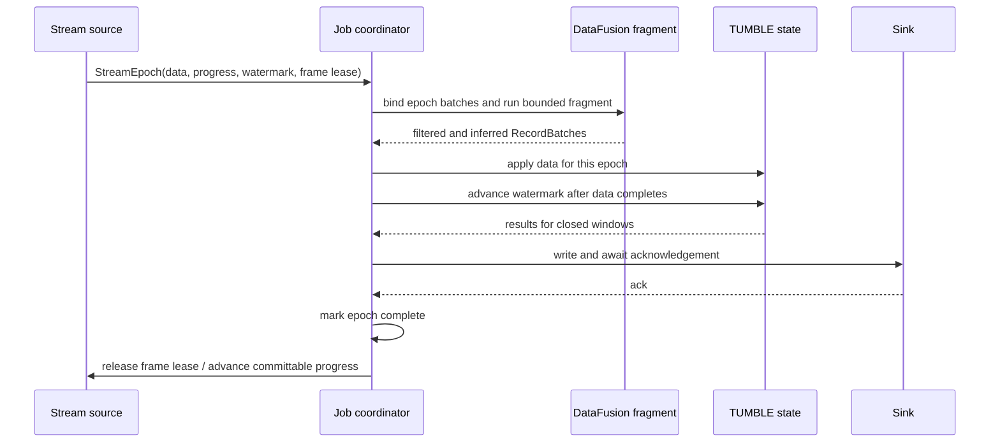

# VisionQL v0.1 System Design

> This document turns the [VisionQL PRD](./prd.md) v0.1 scope into an implementable system architecture. It covers planning and execution, multimodal types, data ingress and egress, model serving, resource management, and security constraints.
>
> **Document map:** [prd.md](./prd.md) (product scope and requirements) → this document (current system design) → [proposals/](./proposals/README.md) (designs for later capabilities).

---

## 1. Scope

### 1.1 Design Goals

The architecture must satisfy five goals:

1. Bounded and unbounded inputs share SQL, Catalog, type, and DataFusion logical-plan semantics.
2. `IMAGE` can move through a columnar plan without repeatedly copying decoded pixels.
3. A model call is an optimizer-visible and schedulable plan node.
4. Filtering, asynchronous inference, and row-level failure cannot lose event-time progress, window state, or source progress.
5. The kernel makes no assumptions about its host process and can be embedded by both CLI and Python.

### 1.2 Covered Capabilities

This document is the v0.1 design baseline. It covers local image and video directory tables, SQL model inference, RTSP with `TUMBLE`, Console and Kafka Sinks, and CLI and Python hosts. The [PRD](./prd.md) and [Roadmap](../ROADMAP.md) define complete scope and delivery order. Capabilities for v0.2 and later that have a concrete design live under [proposals/](./proposals/README.md); unscheduled ideas are deliberately left undesigned.

Syntax that belongs to a later release may parse, but it must fail with `FEATURE_NOT_AVAILABLE`, name the target release or state that it is unscheduled, and avoid creating an unusable Catalog object. Section 7.1 defines statement-level behavior.

### 1.3 Technical Non-Goals

The product non-goals are in PRD Section 4. This design also excludes the following:

- modifying or forking the DataFusion kernel;
- building a general SQL engine, video storage format, or model-serving platform;
- forcing batch and streaming to share physical operators—they share language, types, Catalog, and logical plans instead;
- cross-query decode sharing, model-result caching, state checkpoints, durable job recovery, and multi-user security boundaries within the scope implemented here.

### 1.4 Terminology

| Term | Definition |
|---|---|
| Bounded query | A query whose input eventually ends and can be evaluated fully by an ordinary DataFusion physical plan |
| Continuous query | A long-running query with at least one unbounded source |
| Epoch | A short interval of source output represented by RecordBatches plus the matching watermark, source progress, and resource lease |
| Data fragment | A bounded DataFusion plan executed for one epoch; it contains no watermark or progress messages |
| Job coordinator | The streaming runtime component that sequences epochs, window state, and Sink acknowledgements |
| Media reference | Logical coordinates for an image or video frame; it contains no decoded pixels |
| Frame buffer | A buffer of decoded frames valid only within one process and one epoch |
| Query definition snapshot | The immutable Catalog definitions and resolved execution specifications captured while a query is planned; it is process-local in v0.1 |

---

## 2. Requirements Derived from the PRD

| ID | Product promise | Architectural consequence |
|---|---|---|
| G1 | Batch and streaming share SQL semantics | Build one DataFusion `LogicalPlan`; keep stream and window metadata beside it, then choose ordinary bounded execution or attached epoch orchestration after streamability analysis. |
| G2 | The product works after `pip install`, with no service | The kernel cannot listen on a port or require an external metadata service. Local state uses SQLite, and CLI and Python embed the same kernel. |
| G3 | Model calls are optimizable | A type-owned built-in inference call is resolved against a constant Model name and extracted into an explicit `Inference` node; it never runs as an opaque row-at-a-time UDF. |
| G4 | Large images do not bounce between operators as pixel copies | `IMAGE` carries a reference by default. Pixels exist only in a bounded frame buffer, tensor buffer, or explicit IPC/persistence boundary. |
| G5 | Streaming has event time and honest delivery semantics | Watermarks, source offsets, and frame leases live in the epoch control plane, not in rows that a Filter could discard. |
| G6 | One bad row does not stop a query by default | Decode or inference failure keeps the input row, writes NULL to the affected result, and records a structured error metric. Strict mode fails the query. |
| G7 | Results remain consumable by the Arrow ecosystem | Multimodal values use standard Arrow storage types with extension metadata. Process-local memory never crosses a process boundary, and clients that do not recognize the extension can still read its storage type. |
| G8 | Future features do not distort the mainline | Model types, PreProcessors, Runtimes, PostProcessors, sources, Sinks, and logical nodes extend through narrow traits or registries. Unsupported features fail explicitly. |

Three implementation rules follow:

1. Reduce work before optimizing individual operations: column pruning, time pruning, explicit sampling, inference deduplication, batch inference, then hardware specialization.
2. Media, inference, window, and Sink buffers are bounded and charged to the query budget. An unbounded queue is a correctness defect.
3. Reject parameters the implementation does not consume; never preserve them silently.

---

## 3. Architecture

### 3.1 Layers



### 3.2 Component Boundaries

| Component | Owns | Does not own |
|---|---|---|
| `Engine` / `Session` | Assembly of Catalog, planner, runtimes, and configuration; SQL entry point and result handles | Signals, ports, user authentication |
| VQL front end | Script splitting, VQL DDL parsing, syntax normalization, unified logical-plan construction | I/O other than executing DDL |
| Catalog | Transactional persistence of current definitions, internal generations, schemas, and resolved Model specifications | Video bytes, model weights, plaintext credentials, or durable jobs |
| Planner | Definition snapshots, type checks, DataFusion logical planning, typed inference extraction, streamability checks, and `TumblePlan` extraction | GPU placement or model loading |
| DataFusion physical planner | Lowering a bounded logical plan, including VisionQL extension nodes, to an `ExecutionPlan` | Watermarks, source progress, or restart recovery |
| Job coordinator | Driving epochs in order; advancing control state; cancellation; Sink acknowledgement | Interpreting SQL expressions |
| Media runtime | Probe, read, decode, sample, frame buffer, and encode | Model preprocessing or post-processing |
| Model runtime | Artifact resolution, PreProcessor/Runtime/PostProcessor registries, sessions, bounded scheduling, and inference | SQL semantics or Catalog authorization |
| Connectors | Reading images, video, and RTSP; writing Console and Kafka | Rewriting query plans |

### 3.3 Batch and Streaming Paths

| Stage | Bounded query | Continuous query |
|---|---|---|
| Parse and analyze | VQL AST, definition snapshot, and DataFusion `LogicalPlan` | Same |
| Optimize | Column pruning, predicate pushdown, inference extraction, and explicit sampling pushdown | Same, plus streamability validation |
| Compile | One complete DataFusion physical plan | Retain the logical template and stream metadata; for each epoch, rebind the stream scan to a bounded `MemTable` and build a fresh physical plan |
| Control data | No watermark; completion follows end of input | Coordinator carries control data across epoch boundaries, outside RecordBatch |
| Termination | All partitions are exhausted | User cancellation or an unrecoverable error |

`ExecutionPlan::execute` yields only `RecordBatch`; native DataFusion operators have no channel for a watermark or source progress. VisionQL therefore reuses DataFusion's SQL, optimizer, and bounded executor while keeping the streaming control plane in its own coordinator.

---

## 4. Logical Planning and Physical Compilation

### 4.1 DataFusion Logical Plan and VQL Metadata

Standard relational work uses DataFusion `LogicalPlan` nodes. VisionQL adds an extension node only when model or Sink semantics cannot be represented faithfully by a standard node.

| Extension node | Logical behavior | Physical implementation |
|---|---|---|
| `Inference` | Append a model result column to an input relation | `InferenceExec` (Section 10) |
| `SinkWrite` | Write a relation to a Catalog Sink | `SinkExec` or streaming Sink driver |

A video table expands into frames inside the `USING VIDEOS` scan at the fps declared by the table. It is not a separate logical node or table-valued function.

`TUMBLE` remains an ordinary DataFusion time-bucket expression plus `Aggregate`. For a continuous query, planning extracts the aggregate's inputs and output template into a side `TumblePlan`; it does not add a `TumbleAggregate` extension node.

The planned statement keeps the DataFusion plan together with only the metadata required by attached execution:

```text
PlannedStatement {
  dataframe: DataFrame,
  stream: Option<{ name, skip, fetch }>,
  tumble: Option<TumblePlan>,
}
```

### 4.2 Planning Pipeline

```text
SQL
  → syntax normalization
  → one Catalog definition snapshot
  → name, type, Function, and Model resolution
  → DataFusion LogicalPlan
  → inference extraction and common-expression elimination
  → column, predicate, and explicit-sampling pushdown
  → streamability validation
  → optional Stream and TumblePlan metadata
  → bounded execution or attached epoch execution
```

Planning reads only the Catalog and lightweight metadata. Object listing, model download, service metadata validation, video probing, and network connection never happen implicitly during planning: model materialization belongs exclusively to `RESOLVE MODEL`, while ordinary execution opens only the already-resolved binding. `EXPLAIN` and completion cannot trigger expensive I/O.

### 4.3 Immutable Query Definition Snapshot

Planning opens one Catalog transaction and constructs a `DefinitionSnapshot` containing the current Tables, Streams, Models, Functions, and Sinks. A query-specific DataFusion session is then populated from that snapshot. Resolved Model specifications are copied into `Inference` nodes, while the selected Stream and Sink specifications are copied into the attached result handle or Sink target.

The planned `DataFrame` and those copied specifications are the v0.1 execution source of truth. Replacing or dropping a Catalog definition affects newly planned queries but does not replan a running query. Internal table generations remain available for media locators, but v0.1 has no public revision lifecycle, durable query identity, Manifest store, lease manager, or Manifest garbage collector.

The durable, serializable Query Manifest required by submitted jobs and restart recovery belongs to the [v0.2 `vqld` proposal](./proposals/2026-08-06-vqld-service.md). It is not a prerequisite for foreground embedded execution.

### 4.4 Allowlist for Unbounded Plans

VisionQL validates unbounded plans against an allowlist instead of assuming an arbitrary DataFusion plan can run forever.

Allowed shapes:

- one RTSP source;
- Projection, Filter, `UNNEST`, built-in scalar functions, and `Inference`;
- at most one `TUMBLE` aggregate;
- a stateless SELECT preview or one Sink;
- Projection, Filter, and Sink after the window.

Rejected shapes:

| Plan shape | Why it is unsafe | Suggested rewrite |
|---|---|---|
| Global or grouped aggregate without a window | Input never ends | Add `TUMBLE` |
| Unbounded `ORDER BY` / TopK | Requires unbounded state or end-of-input | Bound it by a window or use a batch query |
| Unbounded `DISTINCT` | State cannot be reclaimed | Use an allowlisted aggregate or a batch query |
| JOIN or multi-source UNION | Multi-source watermark and consistency are undefined here | Split into independent queries |
| `OVER` analytic window | No bounded-state rule exists | Use a time-window aggregate |
| Aggregate or UDAF outside the streaming allowlist | Bounded memory and media lifetime cannot be guaranteed | Choose a supported aggregate or batch execution |

Section 5.4 defines the aggregate and type allowlist. A validation error must identify the first unsupported node or aggregate, point to its SQL fragment, and offer a viable rewrite; a raw DataFusion error is not sufficient.

---

## 5. Epoch-Based Streaming

### 5.1 Why Epochs

Streaming input enters the engine as short micro-batches. The default epoch duration is 100–250 ms and can adapt to the input rate. An epoch carries data and control state separately:

```rust
struct StreamEpoch {
    epoch_id: u64,
    batches: Vec<RecordBatch>,
    source_progress: SourceProgress,
    watermark: Option<Timestamp>,
    frame_lease: Option<FrameBufferLease>,
}
```

`batches` may be empty. None of the other fields is encoded as a hidden row, so a Filter that removes every row still cannot stall source progress, watermarks, or frame-buffer reclamation.

### 5.2 Epoch Execution Order



The sequence is strict:

1. Epochs from one source are applied serially by `epoch_id`; decode, preprocessing, and inference may still run in parallel within the data fragment.
2. The coordinator passes a watermark to stateful operators only after every output for that epoch has completed.
3. An epoch completes only after state updates and all newly closed-window writes have been acknowledged by the Sink.
4. Cancellation stops the active DataFusion stream, model requests, and Sink requests before releasing the frame lease.
5. This design has one source and one partition, so it does not merge watermark frontiers.

The coordinator retains the planned DataFusion logical template, not a compiled `ExecutionPlan` or a separate epoch-plan abstraction. For each epoch it:

1. replaces the stream `TableScan` with a single-partition `MemTable` containing that epoch's batches;
2. calls DataFusion execution on the rebound `DataFrame`, which builds a fresh physical tree;
3. drains the bounded fragment before advancing the watermark;
4. for `TUMBLE`, applies projected aggregate inputs to process-local `TumbleState`, then binds closed-window rows into the planned output template;
5. waits for output or Sink acknowledgement before releasing the frame lease.

Stateful window data and the epoch control plane remain outside DataFusion. No `EpochPlanTemplate`, `EpochInputExec`, `reset_state`, or physical-plan reuse API is required in v0.1.

### 5.3 Backpressure and Frame Loss

Backpressure travels upstream from `Sink → state → data fragment → source buffer`. Every buffer has a hard capacity.

- Replayable sources wait when capacity is unavailable.
- When the RTSP source-to-coordinator queue is full, sampled frames that have not entered an epoch may be dropped and recorded as `source_overrun` with their count and range.
- Once a row enters an epoch, overload cannot discard it silently. Exhausting the budget fails the query.
- Downstream bounded queues propagate backpressure rather than inventing additional drop policies.

### 5.4 `TUMBLE` State

In streaming mode, `TumbleState` stores process-local scalar and Arrow-compatible state rather than retaining DataFusion `Accumulator` instances:

```text
key = (window_start, group_key)
value = aggregate_states
```

- Windows are `[start, end)`. Time is UTC nanoseconds anchored at the Unix epoch.
- The interval is a positive fixed duration; calendar intervals are unsupported. Event time on an unbounded query must be a non-null TIMESTAMP. A nullable column must be filtered first.
- The extracted `TumblePlan` defines aggregate inputs and output expressions. An accumulator is temporary: merge the previous process-local state, process one epoch, call `state()`, and discard it.
- Advance the watermark after data processing. Emit and delete a window when `window_end <= watermark`.
- Rows where `event_time < current_watermark` are dropped and increment `late_rows_total`. `allowed_lateness` is not supported.
- Stopping a query does not emit windows that have not closed.
- State and group keys cannot contain `buffer_id` or `buffer_slot`. Convert media to a persistent locator or encoded value first. `IMAGE` and `VIDEO` are rejected by default in window state.
- Batch mode lowers `TUMBLE` to time bucketing and ordinary aggregation. Differential batch/stream tests cover NULL, grouping, overflow, and final values for each allowlisted aggregate.

v0.1 state lives only for the attached process lifetime and is not serialized or restored after restart. A versioned checkpoint/recovery ABI is defined by the [v0.2 `vqld` proposal](./proposals/2026-08-06-vqld-service.md), where durable jobs first require it.

The streaming aggregate allowlist is:

- `COUNT`, `SUM`, `AVG`, `MIN`, and `MAX` over persistable scalar Arrow inputs and group keys;
- no `DISTINCT`, `ARRAY_AGG`, `STRING_AGG`, approximate aggregates, ordered aggregates, UDAFs, or aggregation over `IMAGE`, `VIDEO`, Binary, or complex values containing process-local media slots.

---

## 6. Multimodal Types and Media Lifetime

### 6.1 Arrow Representation

VQL logical types use standard Arrow storage and field metadata.

| VQL type | Arrow storage type | Contract |
|---|---|---|
| `IMAGE` | `Struct`, defined in Section 6.2 | `ARROW:extension:name=visionql.image` |
| `VIDEO` | `Struct<uri, locator, duration_ns, fps, width, height, codec>` | `uri` is display-only; `locator` is used for reauthorized reads; a full video is never inlined |
| `BOX2D` | `Struct<x: Float32, y: Float32, w: Float32, h: Float32>` | Top-left origin and normalized `[0,1]` coordinates |
| `POINT2D` | `Struct<x: Float32, y: Float32>` | Internal logical type for spatial functions |
| `POLYGON` | `List<POINT2D>` | Normalized two-dimensional polygons only |
| Detection result | `List<Struct<label: Utf8, confidence: Float32, box: BOX2D>>` | One list per frame; `UNNEST` produces rows |
| `AUDIO` / `MASK` | Reserved logical types | Registration and execution return an unsupported-feature error |

Every `IMAGE` field carries `ARROW:extension:name=visionql.image` and `ARROW:extension:metadata={"version":1}`. An unaware client still sees a standard Arrow Struct.

### 6.2 Three `IMAGE` Payload Forms

```text
IMAGE storage := Struct {
  uri: Utf8?,                 # sanitized, display-only; never used to read or authorize
  locator: Utf8?,             # versioned vql:// media locator
  pts_ms: Int64?,             # frame time within a video; NULL for an image
  frame_id: UInt64?,          # frame identity in a live ring buffer
  encoded: Binary?,           # JPEG/PNG or thumbnail bytes
  encoding: Utf8?,
  width: Int32?,
  height: Int32?,
  buffer_id: UInt64?,         # process-local only
  buffer_slot: UInt32?        # process-local only
}
```

| Form | Valid fields | Where it is used |
|---|---|---|
| Reference | `uri`, `locator`, `pts_ms`, metadata; `locator` is non-null | Table scans, video expansion, and most operator boundaries |
| Frame buffer | `buffer_id`, `buffer_slot`, metadata | Within one epoch, between decoding and pixel consumers |
| Encoded | `encoded`, `encoding`, metadata | Python and other process boundaries, including explicit Kafka output |

Invariants:

1. `buffer_id` and `buffer_slot` never cross a process boundary, reach persistent storage, or enter the Catalog.
2. `uri` is sanitized and display-only. It may be logged or exported but is never used by the runtime to read media.
3. `locator` is an opaque `vql://media/v1/...` value bound to a source revision and frame coordinates. Resolution accepts only registered sources and reauthorizes as the current caller.
4. A live RTSP frame is not replayable and has no durable `locator`. Encode or persist it before later retrieval.
5. Field metadata distinguishes original encoded bytes from thumbnail bytes.

### 6.3 Epoch Frame Buffer

Sampled RTSP frames enter the current epoch's `FrameBuffer`; the RecordBatch carries only the slot. The coordinator releases `FrameBufferLease` only after the data fragment, state handling, and egress encoding have all completed.

The lease is independent of row survival:

- filtering one row or the whole batch does not leak a frame;
- asynchronous inference retains the lease until it completes;
- cancellation stops consumers before releasing the epoch;
- frame-buffer references never survive into another epoch or a window state.

Batch video normally fuses read, decode, and preprocessing inside `InferenceExec`. A short-lived frame buffer is needed only when several pixel consumers share one frame.

### 6.4 NULL and Row-Level Failure

- Decode failure leaves the media reference and metadata intact, but any pixel-dependent result is NULL.
- Inference failure makes the model result NULL while preserving input columns.
- `SET vql.on_error = 'fail'` terminates on the first row-level failure.

---

## 7. SQL, Catalog, Models, and Functions

### 7.1 Parser Boundary

VQL reuses the sqlparser-rs tokenizer and DataFusion SQL AST, with a dedicated parser only for VisionQL extensions:

1. Split a complete script while respecting strings, comments, and quoted identifiers.
2. Send `CREATE STREAM/MODEL/SINK` and VisionQL operational statements to the VQL DDL parser.
3. Send SELECT, INSERT, standard DDL, and `CREATE FUNCTION` through the DataFusion-supported grammar. A VisionQL `FunctionFactory` validates and persists supported Function definitions.
4. Normalize constructs such as `.center`, `TUMBLE`, and typed inference markers at the AST or logical-plan layer.
5. Pass normalized relational expressions to the DataFusion planner interface.

Extension statements cannot rely only on a `Dialect` hook; the VQL parser needs golden tests. Unquoted identifiers fold to lowercase, double-quoted identifiers preserve case, and string literals use single quotes.

| Statement | Behavior |
|---|---|
| `CREATE TABLE ... USING IMAGES/VIDEOS` | Create an external image or video table (Section 8.2) |
| `CREATE STREAM ... FROM 'rtsp://...'` | Create one RTSP stream (Section 8.3) |
| `CREATE MODEL ... TYPE ... FROM ... USING ... WITH (...)` | Store one unresolved typed Model declaration without network I/O |
| `RESOLVE MODEL <name>` | Download/cache an artifact or validate a service and persist its resolved execution contract |
| `CREATE FUNCTION ... RETURN <expression>` | Create a DataFusion-backed SQL expression function |
| `CREATE FUNCTION ... LANGUAGE PYTHON AS 'module:function'` | Create a batched Python function; executable only from a Python host |
| `CREATE SINK ...` | Create a Console or Kafka Sink |

`DROP`, `SHOW`, `DESCRIBE`, and `SHOW CREATE` use the same VQL DDL path. `SHOW CREATE` must be sanitized and parseable. Statements outside Section 1.2 fail without registering placeholders.

### 7.2 Catalog Objects and Local State

`VQL_HOME` is the only default local root for embedded and CLI operation. Resolution order is: an explicit host-supplied `EngineConfig`, a non-empty `VQL_HOME`, then `$HOME/.vql`. Only when `HOME` is unavailable does it fall back to `.vql` in the current directory. Repository development uses `VQL_HOME=./data/.vql` so tests and examples cannot pollute user state.

```text
$VQL_HOME/
├── catalog/
│   └── vql.db
├── history
└── cache/
    └── models/
```

`--catalog`, `VQL_CATALOG`, and Python `connect(catalog=...)` override only the SQLite file. History and cache remain under `VQL_HOME`. Datasets are not runtime state: repository examples use `./data/datasets/`, while every real table points to an arbitrary user-selected `LOCATION`.

SQLite is the default Catalog, at exactly `$VQL_HOME/catalog/vql.db`.

| Object | Stored definition |
|---|---|
| Table | Provider, location, options, Arrow schema, internal generation, credential reference |
| Stream | Connector, sanitized endpoint, fps, event-time policy, watermark, internal generation |
| Model | Type, raw `FROM` location, selected Runtime and Runtime-scoped `WITH` options; optional resolved source/hash, execution mode, canonical schemas, and determinism |
| Function | DataFusion signature, normalized SQL expression or Python entry point, volatility, implementation digest |
| Sink | Connector, format, options, credential reference |

Catalog constraints:

- Every DDL statement commits in one SQLite transaction. Model and Function definitions are independent Catalog objects.
- Internal foreign keys and generations support consistent snapshot reads but are never exposed as a public revision API.
- A typed inference call is query syntax, not a Function object. Its constant Model name is resolved from the query definition snapshot.
- Table, Stream, and View share the relation namespace. Model, Function, and Sink each have their own namespace. Section 7.1 defines unquoted-name identity.
- Schemas use Arrow IPC. The Catalog stores its format version and migration history.
- Passwords, tokens, S3 secrets, and signed URLs are never stored; only secret references are allowed.
- `DROP` prevents new planning. Table generations referenced by media locators are retained; a newly attempted media read still reauthorizes against the current Catalog state.

### 7.3 Typed Model Contract

A MODEL is one typed inference capability backed by an artifact bundle or endpoint. `TYPE` is the sole authority for its built-in SQL function, domain input, semantic arguments, and canonical Arrow result. There is no generic CV or LLM type.

| Model `TYPE` | Built-in function | Domain input | Canonical result | Availability |
|---|---|---|---|---|
| `OBJECT_DETECTION` | `IMAGE_DETECTION` | `IMAGE` | `ARRAY<STRUCT<label STRING, confidence FLOAT, box BOX2D>>` | v0.1 |
| `IMAGE_CLASSIFICATION` | `IMAGE_CLASSIFICATION` | `IMAGE` | `ARRAY<STRUCT<label STRING, score FLOAT>>` | Roadmap-gated |
| `IMAGE_EMBEDDING(n)` | `IMAGE_EMBEDDING` | `IMAGE` | `VECTOR(n)` | v0.3 |
| `TEXT_EMBEDDING(n)` | `TEXT_EMBEDDING` | `STRING` | `VECTOR(n)` | v0.3 |
| `TEXT_GENERATION` | `TEXT_GENERATION` | `STRING` | `STRING` | Roadmap-gated |

One source bundle may be registered under multiple compatible capability types. For example, CLIP image and text embedding are two Models with different fixed interfaces; artifact-cache or Runtime-session reuse is an internal optimization.

Required inference arguments are positional: the Model name comes first, followed by the Model type's domain inputs. Optional semantic arguments use DataFusion's `=>` named-argument notation and must follow every positional argument:

```sql
SELECT IMAGE_DETECTION(
  'yolo',
  image,
  classes => ['person'],
  min_confidence => 0.5
)
FROM photos;
```

Planning enforces these rules:

- The first positional argument is a non-NULL Model-name string literal resolved in the current Catalog transaction. Its resolved specification is copied into the `Inference` node and never enters an Arrow batch or Runtime request. Prepared parameters, expressions, column references, and per-row Model selection are rejected in v0.1.
- Remaining required positional arguments are type-owned domain inputs such as `image` or `prompt` and may be arbitrary row expressions.
- Optional type-owned semantic arguments such as `classes`, thresholds, and generation controls use `name => constant` notation after all positional arguments. The VQL normalizer binds them against the type-owned schema, fills omitted defaults, and emits a fully ordered marker before DataFusion type planning.
- The built-in function, Model type, domain argument types, and canonical output must match exactly. Unknown or duplicate arguments fail planning.
- Built-in inference functions are typed planner markers. Planning must extract them into `Inference`; their scalar execution method fails defensively if an unextracted call reaches execution.

Model declarations use one Runtime-owned option schema:

```text
CREATE MODEL identifier
  TYPE model_type
  FROM string_literal
  USING runtime_identifier
  [WITH (runtime_option ('=' constant_value) [, ...])]
```

`USING` is the only public Runtime selector. SQL identifiers such as `ONNX_RUNTIME` and `TRITON_INFERENCE_SERVER` normalize to internal registry IDs `onnx-runtime` and `triton-inference-server`. `WITH` is not a global Model schema: the selected Runtime deserializes the complete map with unknown fields denied. `ONNX_RUNTIME` owns `sha256`, `input={...}`, and `output={...}`. `TRITON_INFERENCE_SERVER` owns `model` and optional immutable `version`. No public `runtime.*`, `pre_processor.*`, `post_processor.*`, Profile, or Adapter layer exists.

`CREATE MODEL` is deliberately fast. It validates only facts available locally—the `TYPE`/Runtime pairing, source shape, option schema, and embedded processor options—and commits an unresolved definition without downloading or contacting a service. `RESOLVE MODEL` is the explicit potentially slow operation. For an embedded artifact it resolves the source, streams remote bytes to a temporary file, checks cancellation and checksum while downloading, atomically installs a content-addressed cache entry, and persists the resolved path/hash. For a service it contacts the endpoint, validates the typed service contract, and persists the binding. A query cannot plan against an unresolved Model.

Re-running `RESOLVE MODEL` refreshes the resolved revision. Pinned artifacts and versioned services have stable semantic fingerprints. An unversioned service is `volatile`; it cannot be constant-lifted, deduplicated, or cached as if immutable.

Device selection, queue capacity, batch size, maximum wait, request concurrency, timeouts, and credentials are not Model semantics. They remain scheduler configuration or secret-provider state. Public Profiles, Adapters, Model revisions, and Deployment objects are deliberately absent.

The declaration fingerprint includes Model type, raw source, selected Runtime, and Runtime-owned options. The resolved semantic fingerprint additionally includes resolved source/hash, execution mode, internal embedded processor specifications or service protocol binding, and determinism. Scheduler configuration does not enter semantic identity.

### 7.4 User-defined Functions and DataFusion Reuse

`CREATE FUNCTION` supports only genuine user-defined computation:

| Syntax | Planning and execution |
|---|---|
| `CREATE FUNCTION ... RETURN <expression>` | Persist a normalized SQL expression function and expand it hygienically during planning with a recursion-depth check |
| `CREATE FUNCTION ... LANGUAGE PYTHON AS 'module:function'` | Persist a batched Arrow ABI; executable only from a Python host |

The statement router uses DataFusion's PostgreSQL-style function grammar, `CreateFunction` representation, named-argument support, and UDF registry. A VisionQL `FunctionFactory` validates the supported language or body, constructs the UDF, and persists the normalized definition. Planning recreates equivalent DataFusion UDFs from the definition snapshot, so session-local registration is never durable state.

Python functions require an explicit `RETURNS` type. SQL expression functions may omit it when DataFusion can derive the body type from positional parameter types and registered built-ins. This permits a compact inference preset such as `CREATE FUNCTION detect_people(IMAGE) RETURN IMAGE_DETECTION('yolo', $1, classes => ['person'])`; macro expansion still exposes the typed inference marker to the planner.

A Python UDF receives one `pyarrow.Array` per argument and returns an equal-length, type-compatible `pyarrow.Array`. `IMAGE` crosses the language boundary in encoded form; the SDK supplies batch decode helpers. Row-at-a-time callbacks are not supported.

Model inference does not use `FunctionFactory`, `ScalarUDF`, or `AsyncUDF`. A SQL expression function may wrap a typed inference call to provide a reusable name or constant-argument preset; after expansion, the call still becomes an explicit `Inference` node.

### 7.5 Syntax Normalization

| VQL form | Normalized plan form |
|---|---|
| `box.center` | `BOX_CENTER(box)` |
| `TUMBLE(ts, interval)` | Ordinary time-bucket expression and DataFusion Aggregate; continuous planning also extracts a side `TumblePlan` |
| `FROM t, UNNEST(expr)` | Native DataFusion unnest node; the only row-expansion mechanism |
| `CREATE ...` | Catalog or runtime operation, absent from the relational plan |

Inference-call parameters such as `classes` and `min_confidence` are owned by the Model type and filter elements within one detection result. They are not processor DDL options and are not converted into a row-level Filter that could discard the frame.

### 7.6 Built-in Functions

Typed-inference function names are reserved case-insensitively from v0.1, including Roadmap-gated markers; `CREATE FUNCTION` cannot redefine them.

| Function | Signature | Contract |
|---|---|---|
| `IMAGE_DETECTION` | `(model STRING, image IMAGE [, named options])` → canonical detection array | v0.1 typed planner marker; the first argument resolves to an `OBJECT_DETECTION` Model and the call must become `Inference` |
| `IMAGE_CLASSIFICATION` | `(model STRING, image IMAGE [, named options])` → canonical classification array | Roadmap-gated typed planner marker |
| `IMAGE_EMBEDDING` / `TEXT_EMBEDDING` | `(model STRING, IMAGE)` / `(model STRING, STRING)` → `VECTOR(n)` | v0.3 typed planner markers; dimension comes from Model `TYPE` |
| `TEXT_GENERATION` | `(model STRING, prompt STRING [, named options])` → `STRING` | Roadmap-gated bounded final-text marker |
| `BOX_CENTER` | `(BOX2D) -> POINT2D` | Function form of `box.center` |
| `POLYGON` / `ST_POLYGON` | `(STRING) -> POLYGON` | Parse constants during planning; require closure, finite values, and `[0,1]` coordinates |
| `ST_CONTAINS` | `(POLYGON, POINT2D) -> BOOLEAN` | Boundary points count as contained |

VisionQL built-ins use SQL NULL propagation.

---

## 8. Sources and Sinks

Data ingress and egress use narrow connector traits: providers read Tables and Streams; Sinks write rows.

### 8.1 Minimum Schemas

| Source | Minimum columns |
|---|---|
| IMAGES | `uri STRING, image IMAGE, width INT, height INT, captured_at TIMESTAMP` |
| VIDEOS frame table | `uri STRING, ts TIMESTAMP, pts_ms BIGINT, frame_id BIGINT, frame IMAGE, duration DOUBLE, fps DOUBLE, width INT, height INT, codec STRING` |
| RTSP Stream | `ts TIMESTAMP NOT NULL, frame IMAGE, frame_id BIGINT, source STRING` |

Unreadable optional metadata becomes NULL. `uri`, media values, and RTSP `ts/frame_id/source` are non-null. Provider options may append partition columns but cannot change the meaning of base columns.

### 8.2 Image and Video Directory Tables

`CREATE TABLE ... USING IMAGES/VIDEOS` registers a local directory as an external table. An image contributes one row; a video is expanded into frame rows inside the scan at the table's fps.

Provider behavior:

- Both providers implement `TableProvider`. Planning returns schema and statistics; listing and reading begin in `execute()`.
- Canonicalize and validate the local directory and `recursive` option at DDL time. Listing and reading occur during execution through the local `object_store` provider.
- `uri`, size, and modification time come from local listing. Probe dimensions, duration, and codec only when projected.
- `IMAGE` and `frame` leave the scan as references; scanning never decodes pixels.

Video expansion rules:

- The scan emits `uri`, `ts`, `pts_ms`, `frame_id`, reference-form `frame`, and file constants such as `duration`.
- A different sample rate requires another logical table over the same directory; no media is copied.
- `fps` is an explicit semantic target. Sampling uses PTS, not frame ordinal, and therefore supports variable frame rate.
- `pts_ms` is relative media time; `ts` is event time. Prefer trusted `start_time + pts`, then a table-level `start_time`. If neither exists, synthesize from the Unix epoch and mark `synthetic_event_time`.
- Push a time predicate into `time_range` and seek near that range when the container supports it.
- The media runtime chooses sequential decode or sparse seek from sample ratio, GOP, and storage capability. Sparse-seek throughput is not a promise until validated by a PoC.
- A metadata-only query creates frame coordinates but does not read pixels.

### 8.3 RTSP Source

`CREATE STREAM ... FROM 'rtsp://...'` creates one RTSP stream. RTSP is non-replayable, so delivery is best-effort; frames lost to a crash, drop, or pause cannot be recovered.

Ingestion:

- FFmpeg demux and decode run on controlled worker threads, away from the async executor.
- Prefer TCP interleaved transport; allow UDP by configuration.
- Inter-frame codecs normally require decode at the source frame rate before sampling. `fps=5` reduces frame-buffer, preprocessing, and inference work, not necessarily decode work.
- Sampled frames enter the current epoch frame buffer. A row or time threshold closes the epoch.

Event time and reconnect behavior:

- At job start, pair UTC time with a monotonic clock in `IngestClock`; derive later ingest time from monotonic elapsed time so reconnects and wall-clock rollback cannot move it backward.
- Every initial connection or reconnect starts a new `source_generation`. `ingest_time` uses the process-wide `IngestClock`. For `capture_time`, the first decoded PTS in a generation is anchored to that frame's ingest instant and later timestamps advance by relative PTS; v0.1 does not claim absolute camera or RTCP wall-clock time.
- Missing or backward PTS, excessive drift from the ingest clock, or a mapped timestamp behind the current watermark falls back to ingest time and increments `event_time_fallback_total` with the reason.
- Watermark is `max_seen_event_time - watermark_delay`, never decreases, and considers every source frame with a valid timestamp—not only sampled rows. Apply an epoch's watermark only after its data completes.
- Reconnect with exponential backoff from 1s to 30s. Freeze the watermark during the outage; never invent progress from local wall time.
- Reconnected ingest time preserves the real outage gap and may close windows without fabricating rows. The attached query keeps retrying until cancellation or an unrecoverable error; an outage alone does not emit the final open window.

### 8.4 Common Sink Contract

| Sink | Behavior |
|---|---|
| Console | Available only to `vql shell` and foreground `vql run`; prints an `IMAGE` summary, never pixels |
| Kafka | JSON contract in Section 8.5 |

`CREATE SINK` stores connection metadata. The first `INSERT INTO` plan validates output schema and format. Every Sink supports cancellation, timeout, and a bounded buffer; the coordinator owns retry policy.

### 8.5 Kafka Sink

Declare the destination independently from the query:

```sql
CREATE SINK people_per_minute TYPE KAFKA
WITH (
  bootstrap_servers='127.0.0.1:9092',
  topic='people-per-minute',
  format='json',
  credential_ref='secret://kafka/producer',
  delivery_timeout_ms=30000,
  buffer_capacity=1024
);

INSERT INTO people_per_minute
SELECT window_start, COUNT(*) AS people
FROM detections
GROUP BY TUMBLE(ts, INTERVAL '1' MINUTE);
```

| Option | Contract |
|---|---|
| `bootstrap_servers` | Required comma-separated `host:port` endpoints (bracket IPv6 literals). URI schemes and credentials are rejected. |
| `topic` | Required existing Kafka topic; 1–249 ASCII letters, digits, `.`, `_`, or `-`, excluding `.` and `..`. VisionQL never creates or alters it. |
| `format` | Optional, defaults to `json`; v0.1 rejects every other format. |
| `credential_ref` | Optional opaque reference resolved by the host-supplied `SecretProvider` on the first write. The Catalog never stores the resolved authentication material. SASL/TLS details are supplied by the provider, not as DDL options. |
| `delivery_timeout_ms` | Optional broker connection/request/delivery deadline; defaults to 30,000 and accepts 1–3,600,000. |
| `buffer_capacity` | Optional global maximum number of in-flight row deliveries for one Sink query execution, across every DataFusion partition; defaults to 1,024 and accepts 1–100,000. Reaching it stops pulling upstream until a delivery completes. |

`CREATE SINK` only validates and stores metadata; it performs no network I/O. Planning the first `INSERT INTO` validates the query output schema. Execution resolves `credential_ref` through `EngineConfig::with_secret_provider`, connects lazily, emits one Kafka record per output row with no key, uses `acks=all`, and waits for every record in a batch to be acknowledged before that batch completes. A referenced Sink fails before connecting when the host did not install a provider or resolution fails. The producer is closed with the configured timeout when the foreground query finishes, fails, is cancelled, or its result stream is dropped. The v0.1 attached coordinator disables producer retries and fails the query on delivery failure or timeout. A batch can therefore be partially visible after an error or cancellation, and replay can duplicate rows; transactions and exactly-once delivery are outside this contract.

The transport uses `rust-rdkafka` with a statically built `librdkafka` and vendored OpenSSL. Public host integration remains client-neutral: `SecretProvider` returns VisionQL-owned `KafkaAuthentication` and `KafkaTlsConfig` values, which the connector translates into TLS/mTLS, SASL/PLAIN, SCRAM-SHA-256/512, or static OAUTHBEARER client configuration. The producer disables automatic topic creation, idempotence, and client retries to preserve the v0.1 contract; future transactional delivery can use librdkafka without changing the public authentication boundary.

The JSON value contract is:

- Preserve query output names and order as JSON object fields; duplicate names are rejected during planning and nulls are explicit.
- Encode booleans and finite numbers as JSON scalars; encode non-finite floats as `null`. Encode temporal values as ISO-8601 strings at their Arrow precision. Lists, maps, and ordinary structs retain their JSON shape.
- Project a top-level `IMAGE` to `uri`, `locator`, `pts_ms`, `frame_id`, `encoding`, `width`, and `height`. Strip URI user information, query, and fragment. Never emit `encoded`, `buffer_id`, or `buffer_slot`.
- Reject raw binary output and nested `IMAGE` values during planning; callers must make any intended binary representation explicit as text.

These rules are fixed by exact wire-format tests. The globally bounded in-flight set propagates Kafka backpressure upstream, while cancellation interrupts connection and delivery waits. For an RTSP query, `OFFSET` and `LIMIT` are applied before the acknowledged Sink write, including closed `TUMBLE` output, so rows outside the visible query result are never published.

---

## 9. Optimizer and `EXPLAIN`

### 9.1 Rule Order

| Order | Rule | Purpose |
|---|---|---|
| R1 | SQL expression-function expansion and type checking | Establish valid semantics before inference extraction |
| R2 | Resolve and extract typed inference calls; deduplicate and constant-lift only deterministic or stable-within-query calls | Make inference schedulable without changing volatile call count or order |
| R3 | Column pruning and `image_access` analysis | Avoid media reads and decode when pixels are unused |
| R4 | Time-predicate pushdown | Read only requested video intervals |
| R5 | Explicit sampling pushdown | Move Table and Stream `fps` into the media layer |
| R6 | Native DataFusion rules | Ordinary predicate, projection, constant, and relational optimization |

Window size never implies a sample rate. User-declared fps is part of result semantics.

### 9.2 Extracting Inference

After expanding SQL expression functions, the planner scans Projection, Filter, and aggregate inputs for type-owned inference markers:

1. Require constant Model and semantic arguments, require a previously resolved Model, validate its typed embedded-pipeline or service contract, and copy the resolved specification into the `Inference` node.
2. Replace each marker with an internal column reference and insert `Inference` at the earliest point where every domain input exists and semantics remain unchanged.
3. Deduplicate only when the built-in operation, Model semantic fingerprint, all domain input expressions, and semantic arguments match exactly and determinism is `deterministic` or `stable_within_query`. Preserve every `volatile` call and its order.
4. Evaluate a constant-domain-input inference call, such as a text query embedding, once as a query-init expression only under the same determinism rule.
5. Never share raw Runtime output across different resolved processor contracts; only canonical, semantically identical inference results are shareable.

### 9.3 `EXPLAIN`

`EXPLAIN` shows at least:

- query mode and the resolved definitions embedded in the plan;
- logical plan plus batch plan or streaming job graph;
- video time range, source fps, and expected sampled fps;
- Model type and resolved source identity, Runtime kind/execution mode, embedded processor kinds when applicable, batching owner, input volume, volatility, and deduplication at each inference node;
- whether decode is required and which `IMAGE` form is used;
- stateful operators, watermark delay, delivery semantics, and unsupported items for streaming.

It describes work; it does not invent uncalibrated GPU-time or cost estimates.

---

## 10. Model Runtime and Inference

### 10.1 Compiled Pipeline and Interfaces

Every resolved typed call selects one of two execution modes. Embedded Runtimes use the VisionQL-owned tensor pipeline:

```text
TYPE canonical input RecordBatch
  → PreProcessor
  → RuntimeRequestBatch
  → RuntimeSession
  → RuntimeResponseBatch
  → PostProcessor
  → TYPE canonical Arrow result
```

Service Runtimes own the full model-facing pipeline:

```text
TYPE canonical input
  → VisionQL transport codec
  → typed service request
  → service-owned preprocessing → inference → postprocessing
  → typed service response
  → VisionQL canonical Arrow conversion
```

The Runtime factory owns declaration validation, the explicit resolve operation, and construction for its execution mode:

```rust
trait RuntimeFactory {
    fn validate_declaration(&self, model: &ModelDef) -> Result<()>;
    async fn resolve(
        &self,
        model: &ModelDef,
        cache_dir: &Path,
        cancel: CancellationToken,
    ) -> Result<RuntimeResolution>;
    fn build_embedded(...) -> Result<Arc<dyn RuntimeSession>>;
    fn build_service(...) -> Result<Arc<dyn ModelBackend>>;
}
```

`Engine` owns one crate-private `PipelineRegistry`. Runtime selection, DDL validation, resolution, and backend compilation all use the same Runtime factory. Embedded execution additionally uses internal processor factories:

```rust
trait PreProcessorFactory: Send + Sync {
    fn kind(&self) -> &str;
    fn supported_types(&self) -> &[ModelType];
    fn validate(&self, options: &BTreeMap<String, Value>) -> Result<()>;
    fn build(&self, spec: &ProcessorSpec) -> Result<Arc<dyn PreProcessor>>;
}

```

`PostProcessorFactory` follows the PreProcessor factory shape. v0.1 internally registers `vision.image_tensor@1`, `vision.yolo_e2e@1`, `vision.yolo_raw@1`, and `vision.xywh_normalized@1` for embedded ONNX execution, plus the public Runtime IDs `onnx-runtime` and `triton-inference-server`. Known roadmap-gated Runtime IDs are registered as rejecting factories so their stable `FEATURE_NOT_AVAILABLE` responses do not depend on an unrelated fallback branch. Processor IDs remain internal implementation details; no public registration API ships until an independent embedded Runtime requires one.

Each factory owns a serde option type with unknown fields denied. A PreProcessor receives only its input options; a PostProcessor receives only decoding and result-construction options; a Runtime receives only source, protocol, and binding options. Deserialization failures are rendered through the existing `INVALID_OPTION` contract with the complete option path. Options are deserialized once while compiling a pipeline, not once per input batch.

For embedded execution, resolution and compilation validate every adjacent contract: Model-type input against PreProcessor input, PreProcessor output against Runtime input, Runtime output against PostProcessor input, and PostProcessor output against the canonical Model-type result. For service execution, `RESOLVE MODEL` validates the service's typed request and response contract. No component may rely on an unchecked tensor name, dtype, shape, or response field.

Runtime tensors use Arrow's canonical `arrow.fixed_shape_tensor` extension type instead of a private dtype-and-buffer enum. The outer Arrow array length is the batch dimension; each slot is one equal-shape tensor backed by a non-nullable `FixedSizeList`, while the extension `Field` records element dtype, per-row shape, optional dimension names, and layout permutation. `TensorBatch` therefore carries the `FieldRef` together with its array so extension metadata cannot be separated from the buffer. Concrete batches contain only positive fixed dimensions after the batch axis; wildcard dimensions remain a contract-only concept.

The image PreProcessor emits `Float32` tensors with `C`, `H`, and `W` dimension names. ONNX Runtime borrows the contiguous Arrow values buffer for input execution; runtime output is wrapped back into a fixed-shape tensor before contract validation and PostProcessor execution. This raw tensor path is embedded-only. A Triton service receives encoded image bytes and returns canonical detections; a raw FP32 Triton model is rejected because it would move service-owned pre/post-processing back into VQL.

A CV PreProcessor resolves and decodes `IMAGE`, converts color and dtype, resizes/crops/pads, normalizes, changes layout, and constructs named tensor batches. It returns row-aligned context such as original dimensions and letterbox transforms.

A PostProcessor converts Runtime output to the canonical Arrow result. Detection implementations decode tensors, apply activation or NMS only when required, resolve labels, and restore coordinates. Inference-call parameters are defined by Model `TYPE`; processors may consume only that allowlist.

The compiled embedded pipeline or service backend plus scheduler forms one cache entry keyed by the resolved Model semantic fingerprint. `ModelRuntime` removes entries whose fingerprints are no longer present in the Catalog head; in-flight queries retain their snapshot-owned `Arc`, while removing the cache owner closes the scheduler queue and releases the Runtime session after the last query finishes. Dropping, re-resolving, and recreating a Model therefore cannot reuse an obsolete session.

The v0.1 implementation keeps embedded processor semantics separate while allowing a service Runtime to own its complete typed protocol:

```text
models/
  registry.rs                 # factory traits and PipelineRegistry
  preprocess/image_tensor.rs  # vision.image_tensor@1
  postprocess/yolo.rs         # YOLO decoding, NMS, coordinate restore, Arrow output
  ort_backend.rs              # ONNX Runtime session and graph-contract validation
  triton_backend.rs           # typed KServe V2 service codec and metadata validation
```

### 10.2 Runtime Registry and Batching Ownership

A Runtime loads an artifact or binds a service endpoint. The Model `TYPE` fixes the semantic capability; the Runtime owns how that capability is executed.

| `USING` Runtime | Source | Execution ownership | Batching owner | Delivery |
|---|---|---|---|---|
| `ONNX_RUNTIME` | Local, cached HTTP(S), or pinned Hugging Face ONNX artifact | VisionQL PreProcessor → ONNX Runtime → VisionQL PostProcessor | VisionQL queues requests; ONNX Runtime executes tensor batches | v0.1 |
| `TRITON_INFERENCE_SERVER` | Plain absolute HTTP(S) service URL plus `WITH.model/version` | Triton owns preprocessing, inference, and postprocessing; VisionQL owns the typed KServe V2 codec | Triton owns model instances and dynamic batching; VisionQL owns bounded concurrency and backpressure | v0.1 HTTP |

ONNX Runtime validates graph input/output names, dtypes, and static dimensions against the compiled processor contracts when the session is built. Its blocking `run` executes through Tokio's blocking pool and retains one session mutex because VisionQL-owned batching already serializes calls per session.

`RESOLVE MODEL` validates that Triton exposes a canonical `image` BYTES input and `detections` BYTES output, each with one dynamic batch dimension. Inference sends encoded images and receives one JSON detection list per row; VisionQL validates normalized confidence and box values and converts them to the canonical Arrow result. Raw tensor models are rejected. Cancellation drops the in-flight HTTP future. VisionQL does not manage Triton repositories or deployments.

Each Runtime reports whether batching is VisionQL-owned or service-owned. VisionQL does not place a second dynamic-batching queue in front of Triton; it applies bounded concurrency, cancellation, and backpressure around service calls. Additional Runtime families require their own versioned proposal and are not part of this v0.1 design.

### 10.3 ONNX Artifacts and Open-source Models

`FROM` preserves the Runtime's raw location. `ONNX_RUNTIME` accepts a local path, `file://` path, pinned `hf://owner/repository@revision[/artifact.onnx]`, or an HTTP(S) `.onnx` URL accompanied by `WITH.sha256`. `TRITON_INFERENCE_SERVER` accepts a plain absolute HTTP(S) service URL; there is no `endpoint://` wrapper. A resolver never guesses task or tensor semantics.

The embedded v0.1 artifact is an ONNX graph plus explicit input, output, label, and processor options. Other weight formats and arbitrary repository code are outside this design; they require a future Runtime proposal or an external inference service.

Remote ONNX files are downloaded to a temporary path and atomically installed under `$VQL_HOME/cache/models/<sha256>/<filename>`, with a source index mapping the declared location to the verified digest. Local files remain in place and endpoints create no cache entry. The Catalog stores source identity and the resolved digest rather than model bytes. Offline execution uses local files or a prewarmed cache. `HF_TOKEN` is read only while resolving private Hugging Face artifacts and is never persisted.

Integrating an embedded open-source model follows five steps:

1. Pin its source revision or SHA-256 digest.
2. Export or select an ONNX graph compatible with `ONNX_RUNTIME`.
3. Declare the Runtime-owned input and output options.
4. Run `RESOLVE MODEL` to materialize and validate it.
5. Pass processor contract tests and one real-model conformance fixture.

A familiar ONNX model family should need only Model DDL. A new reusable embedded tensor layout adds one narrow internal processor implementation and focused fixtures. A service Runtime instead owns all model-specific preprocessing and postprocessing and exposes the typed capability contract.

### 10.4 `InferenceExec`, Scheduling, and Failure

The physical operator evaluates only domain arguments into a temporary Arrow `RecordBatch`; the resolved Model and constant semantic arguments remain in its immutable spec:

```text
domain Arrow values
  → materialize/decode as required
  → embedded pipeline or typed service codec
  → local scheduler or bounded remote submission
  → embedded RuntimeSession or service-owned pipeline
  → canonical Arrow conversion
  → nullable canonical Arrow result column
```

The compiled pipeline carries a stable row identifier. It must produce exactly one value, NULL, or row error for every input row and restore input order even when a remote service completes requests out of order. Batch video usually needs no frame buffer because read, decode, and preprocessing can be fused inside `InferenceExec`.

For VisionQL-owned batching, each compiled pipeline owns one bounded Tokio mpsc queue with per-request oneshot responses. Requests are handled FIFO and dispatch when the batch reaches 16 rows or the oldest request has waited 5 ms. The queue holds at most 64 requests; a full queue awaits capacity and propagates backpressure. Queue submission and response waits are cancellation-aware.

Service-owned batching bypasses the VisionQL batching queue. Each session instead owns a semaphore for bounded concurrent in-flight requests so the service can observe overlapping submissions and apply its own dynamic batching; awaiting a permit is VisionQL's backpressure boundary. v0.1 centralizes the current limits—16 rows per VisionQL batch, 5 ms maximum wait, 64 queued requests, and 4 service requests—in the scheduler module rather than scattering literals across Runtime construction.

NULL domain inputs produce NULL results. A row-level preprocessing or post-processing error follows `vql.on_error`: NULL by default or query failure in strict mode. A Runtime failure affecting a whole batch is attributed to every affected row before the same policy is applied. Cancelled queued requests are skipped, submission and response waits stop promptly, and late results are ignored. Service-owned calls receive the caller's cancellation token; the current batched embedded backend call is allowed to finish before its buffers are released.

All preprocessing tensors, encoded request payloads, Runtime queues, and post-processing buffers reserve memory through the engine pool. Prompt and payload size limits are checked before allocation. Metrics record batching owner, actual batch distribution, queue or service wait, preprocessing, inference, post-processing, cancellation, failures, and device utilization where available.

---

## 11. Hosts and Public Interfaces

### 11.1 A Host-Agnostic Kernel

`vql-kernel` handles no process signals, port listeners, or global singleton state. The host supplies `EngineConfig`, a secret provider, and an optional Python UDF host, then owns lifecycle.

| Host | Responsibilities |
|---|---|
| Python library | PyO3 bindings, `sess.sql()`, Arrow result exchange, in-process Python UDFs, rich notebook display |
| CLI | Shell, script execution, and signal handling |

### 11.2 Python Results

`sess.sql()` returns a lazy result; `collect()` or `show()` starts execution. Results are converted through Arrow/PyArrow. `QueryHandle.metrics()` exposes the same query-local counters, latency distributions, structured drop ranges, and current/peak resource values as the kernel. `show()` renders only an `IMAGE` summary; notebook thumbnails require explicit encoding.

The chainable DataFrame API is a v0.2 feature. It must lower to the same DataFusion logical-plan contracts and is specified outside this v0.1 implementation design.

### 11.3 CLI

| Command | Contract |
|---|---|
| `vql shell` | Multiline SQL, history, and Catalog browsing; `\q` or Ctrl-D exits; an unbounded SELECT prints continuously; first Ctrl-C requests graceful stop and the second cancels immediately |
| `vql run job.sql` | Run statements in order; an unbounded statement must be last and remains attached; first Ctrl-C requests graceful stop and the second cancels immediately |

The executable is `vql`. SQL `EXPLAIN` is executed through the shell or a script rather than a dedicated CLI subcommand. `--query-memory-limit-bytes` (or `VQL_QUERY_MEMORY_LIMIT_BYTES`) sets the per-query budget. The pip package and Python import remain `visionql`. If the CLI encounters a Python UDF, it directs the user to a Python host instead of embedding an interpreter.

---

## 12. Resources, Performance, and Observability

### 12.1 Unified Resource Budget

Each query receives one memory budget. DataFusion `MemoryPool` reservations or equivalent VisionQL reservations account for all of these resources:

| Resource | Behavior at the limit |
|---|---|
| Arrow batches and operator state | Use DataFusion memory management; custom state without spill support fails explicitly |
| Local-file prefetch and compressed bytes | Reduce concurrency and read-ahead |
| Decoded frame buffer | Backpressure batch sources; for RTSP, drop only the oldest sampled frame before epoch admission |
| Tensor buffers and inference queues | Bounded queues; submitters await capacity |
| `TUMBLE` state | No spill; fail with guidance to reduce group-key cardinality or shorten the window |
| Sink buffers | Apply backpressure; fail after timeout according to query policy |

Device memory is tracked separately when a Runtime can report it. Hosts expose an explicit unavailable state for Runtimes that provide no device allocator telemetry; they must not present an estimated zero as a measured value.

### 12.2 Performance Measurement

The PRD does not set hardware-specific throughput or latency targets. Capacity depends on the Model, Runtime, accelerator, codec, GOP, source transport, sampling policy, and query shape. Engineering benchmarks therefore report four rates separately:

| Measure | What it tests |
|---|---|
| Input bitrate | Network and demux capacity |
| Decode rate | Full decode work required by the source codec |
| Sampled output rate | Frame buffer, preprocessing, and query input after sampling |
| Inference rate | Model work remaining after sampling and query filtering |

A benchmark records the measured rates, window latency, and frame-drop rate together with its complete workload and hardware configuration. Thresholds belong to benchmark plans and release evidence, not to the product requirements contract.

### 12.3 Metrics

At minimum, expose:

- query: input/output rows, epoch latency, end-to-end latency, error rows, late rows, state memory, and Sink retries;
- media: input bitrate, decode fps, sampled fps, dropped frames by reason, disconnect count, and gap duration;
- model: Runtime kind/protocol, batching owner, queue depth or remote concurrency, wait time, batch distribution, inference count, stage P50/P95, and device memory where available;
- resources: current and peak value for every reservation.

Embedded mode exposes metrics through query results and tracing logs. v0.1 correlation uses source names, epoch IDs, resolved Model specifications, and stable error codes; it does not define a durable query identity. The v0.2 service adds `query_id` and Manifest-backed job identity.

### 12.4 Error Classes

| Class | Example | Default behavior |
|---|---|---|
| Row data error | Corrupt frame, one failed inference | Write NULL, increment metrics, continue |
| Query semantic error | Type mismatch, unbounded sort, unavailable feature | Fail planning before starting runtime work |
| Resource error | Memory/device exhaustion, excessive state | Fail query and release every lease |
| External-system error | RTSP disconnect, Kafka unavailable | Retry by connector policy; eventually fail or remain Disconnected |
| Engine defect | Broken invariant, frame-buffer bounds violation | Fail immediately with diagnostics; never downgrade to NULL |

Stable codes are separate from prose messages. Clients react to codes, never error-string matching.

---

## 13. Security and Privacy

- `vql-kernel` listens on no network port by default.
- Outbound connections occur only for user-declared endpoint Models, Kafka, RTSP, and model download.
- Model bundles are pinned by immutable revision and complete digest where the source permits it and are verified at load time.
- Catalog output, logs, and `SHOW CREATE` sanitize URIs and secret references.
- Execution uses the immutable definition snapshot and resolved specifications captured during planning; v0.1 does not persist an execution identity.

---

## 14. Code Organization

```text
visionql/
├── Cargo.toml                    # root workspace
├── vql-kernel/
│   └── src/
│       ├── catalog/              # definitions, snapshots, internal generations, SQLite
│       ├── connectors/           # Tables, Streams, and Sinks
│       ├── functions/            # built-ins and typed inference markers
│       ├── media/                # FFmpeg, image codecs, FrameBuffer
│       ├── models/               # processors, runtimes, scheduler
│       ├── planner/              # logical extensions, inference extraction, physical planning
│       ├── sql/                  # VQL parser and normalization
│       ├── stream/               # StreamEpoch and process-local TUMBLE state
│       ├── types/                # Arrow multimodal types
│       ├── engine.rs             # shared engine services
│       └── session.rs            # SQL routing and attached epoch orchestration
├── vql-cli/                      # shell / run
├── vql-python/                   # PyO3 and Python UDF host
├── vql-testing/                  # shared SQL conformance and external-service tests
└── docs/
```

The current root workspace contains exactly these four crates. `vql-server` and Workbench are future v0.2 components described by proposals, not directories in the v0.1 tree.

```text
vql-cli ─────┐
vql-python ──┼──→ vql-kernel
vql-testing ─┘
```

In v0.1, these remain internal `vql-kernel` modules, `pub(crate)` by default. Public API exposes only what a host needs: `Engine`, `Session`, configuration, results, and injection traits. Extract a crate only when an independent consumer or release cadence appears, a native dependency conflict cannot be handled through features, or measured compile-time improvements justify an ADR.

Boundary rules:

- `vql-kernel` cannot depend on PyO3, clap, or Flight.
- `vql-cli` owns clap, terminal behavior, and signals. `vql-python` owns PyO3 and the Python UDF host. `vql-testing` owns shared SQL conformance and external-service fixtures.
- `planner` currently co-locates logical extension nodes, their physical planners, and their executors. `stream` owns `StreamEpoch` and `TumbleState`; `session` owns attached epoch orchestration.
- Media, models, and connectors are assembled behind crate-private boundaries and cannot depend on CLI or Python hosts.
- Breaking DataFusion changes stay behind kernel planning and session boundaries. DataFusion types cannot leak into public Python or CLI APIs.
- The workspace pins tested DataFusion and Arrow versions. An upgrade must pass epoch scan rebinding, TUMBLE state, and Arrow wire-schema regression tests before changing the lockfile.

---

## 15. Architecture Decisions

| ADR | Decision | Rationale |
|---|---|---|
| ADR-001 | Rust + Arrow + DataFusion | Supports embedding, columnar execution, Python interoperability, and public extension points |
| ADR-002 | One DataFusion logical plan, with ordinary bounded execution or attached epoch orchestration | Preserves user-facing batch/stream semantics without creating a parallel logical-plan type or forcing control data through RecordBatch-only operators |
| ADR-003 | Epoch streaming with bounded DataFusion fragments | Filter cannot swallow watermark or source progress; asynchronous inference and release have a clear barrier |
| ADR-004 | Standard Arrow storage for `IMAGE`, with reference, buffered, and encoded forms | Avoids pixel copies while preserving IPC and fallback readability |
| ADR-005 | Release FrameBuffer as one epoch lease | Lifetime does not depend on surviving rows, so Filter cannot leak references |
| ADR-006 | Extract type-owned inference calls into explicit `Inference` nodes | Enables asynchronous batching, deduplication, later cascades/caches, and cost measurement |
| ADR-007 | Build one immutable definition snapshot per planned query | Prevents DDL from silently changing a running result without adding a durable Manifest subsystem to embedded v0.1 |
| ADR-008 | Delivery follows source replayability; RTSP is best-effort | Makes no guarantee that the physical source cannot satisfy |
| ADR-009 | SQLite Catalog; runtime bytes stay outside it | Preserves zero-dependency startup with transactions and migration support |
| ADR-011 | Rebind each epoch into the DataFusion logical template and build a fresh physical tree | Reuses DataFusion planning while preventing channel, state, and cancellation leakage without a custom plan-template API |
| ADR-012 | Keep allowlisted normalized TUMBLE state in memory | Attached v0.1 needs bounded state but not a checkpoint format or restart-recovery ABI |
| ADR-013 | Model `TYPE` owns the inference interface; user Functions reuse DataFusion's SQL/Python extension path | Keeps inference optimizer-visible and avoids duplicate ownership of model signatures and parameters |

ADR-010 and ADR-014 are reserved for public-protocol decisions in [proposals/](./proposals/README.md) and are not reused.

---

## References

- [Apache DataFusion: Custom Table Providers](https://datafusion.apache.org/library-user-guide/custom-table-providers.html)
- [Apache DataFusion: ExecutionPlan API](https://docs.rs/datafusion/latest/datafusion/physical_plan/trait.ExecutionPlan.html)
- [Apache DataFusion: Unbounded Data Sources](https://datafusion.apache.org/user-guide/sql/ddl.html#example-unbounded-data-sources)
- [Apache DataFusion: Adding User-defined Functions](https://datafusion.apache.org/library-user-guide/functions/adding-udfs.html)
- [Apache Arrow: Extension Types and Columnar Format](https://arrow.apache.org/docs/format/Columnar.html#extension-types)

---

## Changelog

| Date | Change |
|---|---|
| 2026-08-16 | Aligned v0.1 with the implemented DataFusion logical-plan and per-epoch rebinding path; made TUMBLE state process-local; moved durable Query Manifests and recovery ABI to the v0.2 service proposal; corrected capture-time, scheduler, local-provider, Python API, and workspace boundaries; removed the fixed PRD performance baseline and destination-policy requirement |
| 2026-08-15 | Aligned the design baseline with the merged v0.1 batch-and-streaming scope |
| 2026-08-10 | Specified the inference pipeline factory registry, typed per-kind options, Arrow fixed-shape runtime tensors, compiled-pipeline lifecycle, and async batching paths |
| 2026-08-10 | Defined type-owned inference calls, immutable query definition snapshots, DataFusion-backed user Functions, and the PreProcessor/Runtime/PostProcessor pipeline |
| 2026-08-08 | Defined `VQL_HOME`, downloaded-model caching, the separate dataset directory, and scenario-oriented examples; performance testing remains separate |
| 2026-08-07 | Initial system design |
