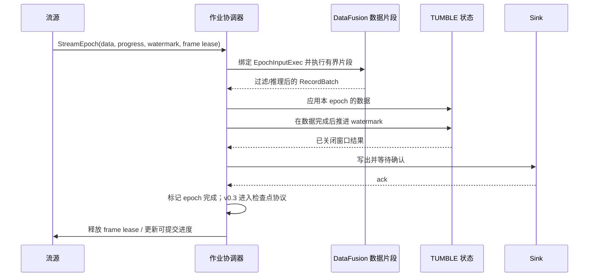

# VisionQL 系统设计

> 本文根据 [VisionQL PRD](./prd.md) 设计系统，是了解 VisionQL 技术架构的第一入口，只保留贯穿全系统的核心设计：架构分层、统一逻辑计划、流执行模型、多模态类型、SQL 与目录、公开接口边界，以及横切的资源、安全与测试约束。可独立开发交付的子功能设计见 [proposals/](./proposals/README.md)。
>
> **文档地图**：[prd.md](./prd.md)（产品真相源）→ 本文（系统设计第一入口）→ [proposals/](./proposals/README.md)（子功能设计）。

- **设计版本**：v1.0.0（Draft）
- **日期**：2026-08-06
- **对应 PRD**：v0.1.6
- **状态**：评审中

---

## 1. 设计范围

### 1.1 本文要解决的问题

本文需要把 PRD 中的产品承诺落实为可以编码和验收的系统边界：

1. 同一套 SQL 和 DataFrame 逻辑如何同时用于有界数据与无界数据；
2. `IMAGE` 如何在不复制大量像素的前提下穿过列式计划；
3. 模型调用如何成为优化器可见、运行时可调度的计划节点；
4. 事件时间、水位线、窗口状态和源进度如何在过滤、异步推理与失败恢复后仍然正确；
5. 库态（v0.1）与服务态（v0.3）如何复用同一内核；
6. Workbench 如何只通过公开 SQL 与 Arrow Flight SQL 使用引擎。

### 1.2 版本边界

各版本的功能范围以 [PRD](./prd.md) 第 4～5 节和 [Roadmap](../ROADMAP.md) 为准，本文不重复罗列。本文固定贯穿各版本的核心设计与公开契约；各子功能的详细设计按 feature 拆分在 [proposals/](./proposals/README.md)；未排期方向不设计。

超出当前版本的语法即使可以被解析，也必须返回明确的 `FEATURE_NOT_AVAILABLE`（携带目标版本或“未排期”），不能只写入目录后假装可用；逐语句的版本行为见 §7.1。

### 1.3 技术非目标

产品级非目标见 PRD 第 4 节。本设计额外约束：

- 不修改或 fork DataFusion 内核；
- 不自研通用 SQL 执行引擎、视频存储格式或模型服务平台；
- 不把批处理和流处理强行塞进同一套物理算子。批流一体指语言、类型、目录和逻辑计划一致，物理运行时可以根据边界性采用不同实现；
- 不在 v0.1 实现跨查询共享解码、模型结果缓存、状态检查点、持久作业恢复或多用户安全边界。

### 1.4 关键术语

| 术语 | 含义 |
|---|---|
| 有界查询 | 输入最终结束，可以由普通 DataFusion 物理计划完整求值的查询 |
| 持续查询 | 至少包含一个无界源，需要长期运行的查询 |
| 执行周期（epoch） | 流源在一个短时间段内产生的一组 RecordBatch，以及与这组数据对应的水位线、源进度和资源租约 |
| 数据片段 | 在一个 epoch 内执行的有界 DataFusion 计划，不携带水位线等控制消息 |
| 作业协调器 | 顺序驱动 epoch、窗口状态、Sink 确认和检查点的流运行时组件 |
| 媒体引用 | 指向图片或视频帧的逻辑定位信息，不包含解码后的像素 |
| 帧仓 | 只在当前进程、当前 epoch 内有效的解码帧 arena |
| 定义快照 | 查询规划时解析并固定的表、模型、函数和 Sink 修订版本 |

---

## 2. 从 PRD 派生的设计约束

| 编号 | PRD 承诺 | 设计约束 |
|---|---|---|
| G1 | 批流共享 SQL / DataFrame 语义 | 只维护一套 `VqlLogicalPlan`；边界性在分析阶段推导，物理编译阶段再分为批计划和流作业图 |
| G2 | `pip install` 后无需服务即可使用 | 内核不得监听端口或依赖外部元数据服务；本地目录使用 SQLite；CLI 和 Python 都嵌入同一内核 |
| G3 | 模型调用可优化 | `USING MODEL` 函数必须在规划期提取为显式 `Inference` 节点，不能作为普通逐行 UDF 执行 |
| G4 | 大图像不能在算子间反复复制 | `IMAGE` 默认保存引用；像素只存在于有界帧仓、张量缓冲或明确的 IPC/落盘边界 |
| G5 | 流处理有事件时间与明确投递语义 | 水位线、源 offset 和帧租约属于 epoch 控制面，不编码成可能被 Filter 丢弃的普通行 |
| G6 | 错误行默认不终止整个查询 | 解码或推理失败时保留输入行，把对应结果列置为 NULL，并记录结构化错误指标；严格模式才失败 |
| G7 | 服务态和客户端使用公开协议 | `vql-server` 构建的 `vqld`（v0.3）只暴露 Flight SQL、SQL 系统语句、健康检查和 Prometheus 指标端点；Workbench 不依赖根目录引擎 crate 或私有管理 API |
| G8 | 后续扩展不能破坏 MVP 主线 | 模型类型、processor、推理后端、源、Sink 和逻辑节点都通过窄 trait 或注册表扩展；未实现功能直接拒绝 |

所有实现还必须遵守五条原则：

1. **先保证语义，再追求复用。** 原生算子无法传递控制信息时，不把水位线伪装成数据列，也不假设过滤后的行仍能代表源进度。
2. **先减少工作量，再加速单次操作。** 优化顺序是列裁剪、时间裁剪、显式采样、推理去重、批量推理，最后才是硬件特化。
3. **所有队列都有上限。** 媒体、推理、窗口和 Sink 缓冲都必须纳入查询资源预算；无界队列视为实现错误。
4. **查询固定定义，DDL 创建新修订。** 正在运行的查询不因 `ALTER MODEL` 或 `ALTER FUNCTION` 在中途悄悄改变结果。
5. **版本范围按能力生效。** 暂未消费的参数不允许静默保存。

---

## 3. 总体架构

### 3.1 分层结构

```mermaid
flowchart TB
    subgraph HOSTS[宿主]
        PY[Python 库]
        CLI[vql shell / run]
        DAEMON[vqld v0.3]
    end

    subgraph CORE[引擎内核]
        ENTRY[Engine / Session API]
        SQL[VQL 解析与语义分析]
        CAT[Catalog 与定义快照]
        PLAN[VqlLogicalPlan 与优化器]
        BCOMP[批计划编译器]
        SCOMP[流作业编译器]
    end

    subgraph EXECUTION[执行]
        DF[DataFusion 有界执行]
        COORD[流作业协调器]
        STATE[TUMBLE 状态]
        CHECKPOINT[检查点 v0.3]
    end

    subgraph RUNTIME[运行时服务]
        MEDIA[媒体读取 / 解码 / 帧仓]
        MODELS[模型加载 / batching / 推理]
        CONNECTORS[表、流与 Sink 连接器]
        BUDGET[内存与资源预算]
        METRICS[指标与结构化日志]
    end

    PY --> ENTRY
    CLI --> ENTRY
    DAEMON --> ENTRY
    ENTRY --> SQL
    SQL <--> CAT
    SQL --> PLAN
    PLAN --> BCOMP --> DF
    PLAN --> SCOMP --> COORD
    COORD --> DF
    COORD --> STATE
    COORD -. v0.3 .-> CHECKPOINT
    DF --> MEDIA & MODELS & CONNECTORS
    COORD --> CONNECTORS
    MEDIA & MODELS & CONNECTORS & STATE --> BUDGET
    MEDIA & MODELS & CONNECTORS & COORD --> METRICS
```

### 3.2 组件职责

| 组件 | 职责 | 不负责 |
|---|---|---|
| `Engine` / `Session` | 组装目录、规划器、运行时和配置；提供 SQL/DataFrame 执行入口 | 进程信号、端口、用户认证 |
| VQL 前端 | 切分语句、解析 VQL DDL、规范化语法糖、生成统一逻辑计划 | 执行 DDL 之外的 I/O |
| Catalog | 对象修订、依赖、schema、模型哈希和作业定义的事务持久化 | 保存视频、权重字节或用户明文凭证 |
| 规划器 | 类型检查、边界性和可重放性推导、函数解析、推理提取、streamability 校验 | GPU 放置、模型加载 |
| 批计划编译器 | 将有界逻辑计划降为 DataFusion `ExecutionPlan` | 水位线与恢复 |
| 流作业编译器 | 将持续查询切成源、一个或多个有界数据片段、状态算子和 Sink | 自己实现表达式计算 |
| 作业协调器 | 驱动 epoch，按序推进控制面，管理状态、取消、Sink 确认和恢复 | 解释 SQL 表达式 |
| 媒体运行时 | 探测、读取、解码、采样、帧仓和编码 | 模型前后处理 |
| 模型运行时 | 权重解析、processor、设备会话、批量调度和推理 | SQL 语义与目录权限 |
| 连接器 | 读取图片、视频与 RTSP，以及写入 Kafka/Console（Parquet 与 Lance 随 v0.4） | 改写查询计划 |

### 3.3 两条执行路径

| 阶段 | 有界查询 | 持续查询 |
|---|---|---|
| 解析与分析 | 同一套 VQL AST、Catalog 和 `VqlLogicalPlan` | 同左 |
| 优化 | 同一套列裁剪、谓词下推、推理提取和显式采样下推 | 同左，另外执行 streamability 校验 |
| 物理编译 | 完整降为一个 DataFusion 计划 | 切成 `Source → EpochTransform → StatefulOp → Sink` 作业图；每个 `EpochTransform` 是有界 DataFusion 片段 |
| 控制信息 | 不需要水位线；输入结束即完成 | 由协调器在 epoch 边界传递，不进入 RecordBatch |
| 结束条件 | 所有分区耗尽 | 用户停止、不可恢复错误或服务管理操作 |

这一区分是本设计最重要的选择。DataFusion 的 `ExecutionPlan::execute` 输出 `RecordBatch` 流，适合增量计算数据，但原生 Filter、Projection 等算子没有水位线或源进度通道。VisionQL 因此复用它的 SQL、表达式、优化器与有界执行能力，不要求原生算子承担它们没有声明过的控制语义。

---

## 4. 统一逻辑计划与物理编译

### 4.1 `VqlLogicalPlan`

标准关系节点尽量复用 DataFusion `LogicalPlan`。视觉或流语义无法由标准节点完整表达时，使用扩展节点：

| 扩展节点 | 输入与输出 | v0.1 物理实现 |
|---|---|---|
| `Inference` | 输入关系 → 追加模型结果列 | `InferenceExec` |
| `TumbleAggregate` | 带事件时间的关系 → 窗口聚合结果 | 有界：`date_bin + AggregateExec`；无界：`TumbleState` |
| `SinkWrite` | 输入关系 → 写入目录中的 Sink | `SinkExec` / 流 Sink 驱动器 |
| `Track` | 帧关系 → 带 `track_id` 的关系 | 未排期，解析后拒绝 |

视频表的帧展开不是独立逻辑节点：它按建表声明的 fps 发生在 `USING VIDEOS` 扫描算子内部（见 [proposal 0001](./proposals/0001-media-table-providers.md)），与 PRD 3.3.7 保持一致。

每个计划节点都携带或推导以下属性：

```text
PlanProperties {
  boundedness: Bounded | Unbounded,
  replayability: Replayable | Live,
  event_time: None | { column, watermark_delay },
  ordering: ...,
  image_access: MetadataOnly | Encoded | Pixels,
  definition_snapshot: CatalogGeneration,
}
```

### 4.2 规划流水线

```text
SQL / DataFrame
  → 语法归一化
  → 名称、类型与目录修订解析
  → VqlLogicalPlan
  → 边界性、事件时间、可重放性分析
  → 推理调用提取与公共表达式消除
  → 列裁剪、谓词和显式采样下推
  → streamability 校验
  → 批计划或流作业图
  → 物理计划校验
  → 执行
```

规划阶段只读取目录和轻量元数据。对象存储扫描、模型下载、视频探测和网络连接都发生在执行阶段，避免 `EXPLAIN` 或补全触发昂贵 I/O。

### 4.3 定义快照

目录对象采用稳定 ID、不可变修订和可变 head：

- `CREATE` 生成第一版；`ALTER` 或 `CREATE OR REPLACE` 生成新修订；
- Function 的 `USING MODEL` 绑定稳定 `model_id`，不直接保存某个 Model revision。规划器在同一个 Catalog 读事务中先解析 Function revision，再解析该 `model_id` 当时的 head revision；
- 规划时把表、函数、解析后的模型和 Sink revision ID，以及模型语义指纹和绑定参数写进计划；模型语义指纹至少包含 artifact hash 或声明的 immutable endpoint revision/config hash、processor ID/版本、precision、backend kind/版本和模型声明的输出 schema；
- 批查询在执行期间固定该快照；持续查询在整个运行周期固定该快照；
- `ALTER MODEL` 生成新的 Model revision 并推进该 `model_id` 的 head，只影响之后新规划的查询；`ALTER FUNCTION ... SET MODEL` 生成新的 Function revision 并改绑另一个 `model_id`，同样只影响之后新规划的查询；
- 已 prepare 的 statement、正在运行的批查询和持续查询都不自动 replan。普通 prepared statement 需要关闭后重新 prepare；附着式持续查询需要取消后重新执行，持久作业需要停止旧作业并显式提交新作业；
- 删除对象只把名称 head 标记为 tombstone。活动查询、检查点或未过期媒体定位符持有 revision lease 时不得物理回收；权限撤销立即生效，不因 lease 继续授权；
- `EXPLAIN`、`SHOW QUERIES` 和错误日志都显示所使用的修订，保证结果可追溯。

### 4.4 无界查询白名单

v0.2 对无界计划采用白名单，而不是猜测任意 DataFusion 计划能否持续运行。

允许：

- 单个 RTSP 源；
- Projection、Filter、`UNNEST`、内置标量函数与 `Inference`；
- 一个 `TUMBLE` 聚合；
- 无状态 SELECT 预览或一个 Sink；
- 窗口后的 Projection、Filter 和 Sink。

拒绝：

| 计划形状 | 原因 | 提示 |
|---|---|---|
| 无窗口全局或分组聚合 | 输入永不结束 | 增加 `TUMBLE` |
| 无界 `ORDER BY` / TopK | 需要无限状态或等待结束 | 先限定窗口或改为批查询 |
| 无界 `DISTINCT` | 状态无法回收 | 改用 v0.2 白名单聚合，或改为批查询 |
| JOIN、UNION 多源 | v0.2 尚未定义多源水位线与一致性 | 拆为独立查询 |
| `OVER` 分析窗口 | v0.2 没有有界状态规则 | 改为时间窗口聚合 |
| `TRACK`、`HOP`、`SESSION` | 未排期 | 返回明确的未支持错误 |
| 不在窗口聚合白名单中的 aggregate / UDAF | 无法保证内存、帧生命周期或检查点状态可恢复 | 改用受支持聚合或批查询 |

流式 `TUMBLE` 的聚合白名单细则（允许的聚合函数与类型约束）见 [proposal 0002](./proposals/0002-video-stream-processing.md)。

校验错误必须指出第一个不支持的节点或聚合、所在 SQL 片段和可行改写，不能只返回 DataFusion 内部错误。

---

## 5. epoch 流执行模型

### 5.1 为什么采用 epoch

流数据以短周期微批进入引擎，默认周期为 100～250ms，可由运行时根据输入率调整。每个 epoch 同时携带数据和独立控制信息：

```rust
struct StreamEpoch {
    epoch_id: u64,
    batches: Vec<RecordBatch>,
    source_progress: SourceProgress,
    watermark: Option<Timestamp>,
    frame_lease: Option<FrameArenaLease>,
}
```

`batches` 可以为空。`source_progress`、`watermark` 和 `frame_lease` 不会变成 RecordBatch 中的隐藏列。Filter 即使把整个 epoch 的行全部过滤掉，协调器仍然能够推进源进度、释放帧仓并处理水位线。

### 5.2 一个 epoch 的执行顺序



严格顺序如下：

1. 同一源的 epoch 按 `epoch_id` 串行应用；数据片段内部仍可并行解码、前处理和推理；
2. 只有当前 epoch 的所有数据输出完成后，协调器才把它的水位线交给状态算子；
3. 只有状态更新和所有新关闭窗口的 Sink 写入完成后，epoch 才算完成；
4. 取消查询会取消当前 DataFusion stream、模型请求和 Sink 请求，再释放帧租约；
5. 当前所有版本都只有单源单分区，不需要合并水位线；多分区可重放源（如 Kafka 帧源）未排期。

数据片段的**计划模板**在作业启动时只编译一次，但同一棵 `ExecutionPlan` 实例绝不能跨 epoch 直接重复 `execute()`。模板只保存 schema、表达式、operator ID、分区要求和扩展算子 factory，不保存 channel、动态过滤器、metrics recorder、输入槽或其他运行态：

```rust
trait EpochPlanTemplate {
    fn instantiate(
        &self,
        binding: EpochBinding,
        task_ctx: Arc<TaskContext>,
    ) -> Result<Arc<dyn ExecutionPlan>>;
}

struct EpochBinding {
    job_id: QueryId,
    epoch_id: u64,
    batches: Vec<RecordBatch>,
    frame_lease: Option<FrameArenaLease>,
    cancel: CancellationToken,
}
```

每个 epoch 都从模板实例化一棵新的执行树和新的 `EpochInputExec`，并创建新的子 `TaskContext`；它们共享作业级 RuntimeEnv、MemoryPool、模型运行时和指标汇聚器，但不共享算子运行态。DataFusion 适配层可以用当前锁定版本提供的递归 `reset_state` / `with_new_state` 实现 factory，外部不变量始终是“执行实例不复用”。当前实例的所有输出分区必须全部结束或完成取消、后台任务全部 join、资源 reservation 全部释放后，协调器才能实例化下一个 epoch。状态算子位于片段之外，不能被误放进每次都会重建的 DataFusion 执行状态。

### 5.3 背压与丢帧

背压沿 `Sink → 状态 → 数据片段 → 源缓冲` 反向传递。所有缓冲都有容量：

- 批输入等可重放输入在容量不足时等待；
- RTSP 无法让摄像头回放历史数据。缓冲达到上限时，只在最靠近源的位置丢弃尚未进入 epoch 的最旧采样帧；
- 已经进入 epoch 的行不会因为超载被静默丢弃；如果无法在预算内执行，查询失败；
- 每次丢弃记录源、原因、帧数和事件时间范围。丢帧指标至少区分 `source_overrun`、`decode_slow`、`inference_backlog` 与 `sink_backlog`；
- `on_overload = 'fail'` 可将 live 丢帧改为失败，便于对完整性要求更高的测试环境使用。

流处理的子功能设计：`TUMBLE` 窗口状态与 RTSP 接入见 [proposal 0002](./proposals/0002-video-stream-processing.md)；v0.3 持久作业的检查点、恢复与状态机见 [proposal 0005](./proposals/0005-vqld-service.md)。

---

## 6. 多模态类型与媒体生命周期

### 6.1 Arrow 物理表示

VQL 类型名是逻辑类型。底层全部使用标准 Arrow storage type，并用字段元数据标注扩展语义。

| VQL 类型 | Arrow storage type | 约定 |
|---|---|---|
| `IMAGE` | `Struct`，见 §6.2 | `ARROW:extension:name=visionql.image` |
| `VIDEO` | `Struct<uri, locator, duration_ns, fps, width, height, codec>` | `uri` 只展示，`locator` 用于重新授权后的读取；永远不内联完整视频 |
| `BOX2D` | `Struct<x: Float32, y: Float32, w: Float32, h: Float32>` | 左上原点，归一化坐标 `[0,1]` |
| `VECTOR(n)` | `FixedSizeList<Float32, n>` | 维度属于类型，规划期检查；随 v0.4 启用（[proposal 0008](./proposals/0008-cross-modal-retrieval.md)） |
| `POINT2D` | `Struct<x: Float32, y: Float32>` | 空间函数的内部逻辑类型 |
| `POLYGON` | `List<POINT2D>` | v0.1 只支持归一化二维多边形 |
| 检测结果 | `List<Struct<label: Utf8, confidence: Float32, box: BOX2D>>` | 一帧对应一个数组；`UNNEST` 负责展开 |
| `AUDIO` / `MASK` | 保留逻辑类型 | v0.1 注册和执行都返回未支持错误 |

字段 metadata 固定包含 `ARROW:extension:name=visionql.image` 和 `ARROW:extension:metadata={"version":1}`；SqlInfo `visionql_image_version` 对应返回字符串 `1`。未知扩展类型的 Arrow 客户端仍能按其标准 storage type 读取，避免把协议绑定在 VisionQL 私有内存结构上。

### 6.2 `IMAGE` 的三种载荷

```text
IMAGE storage := Struct {
  uri: Utf8?,                 # 只用于展示的脱敏 URI，不参与读取或授权
  locator: Utf8?,             # 版本化 vql:// 媒体定位符
  pts_ms: Int64?,             # 视频帧时间；图片为 NULL
  frame_id: UInt64?,          # live 环形缓存中的帧标识
  encoded: Binary?,           # JPEG/PNG 或缩略图字节
  encoding: Utf8?,
  width: Int32?,
  height: Int32?,
  arena_id: UInt64?,          # 仅进程内
  arena_slot: UInt32?         # 仅进程内
}
```

同一值可以处于三种载荷形态：

| 形态 | 有效字段 | 使用位置 |
|---|---|---|
| 引用态 | `uri`、`locator`、`pts_ms`、元数据；`locator` 必须非 NULL | 表扫描、视频帧展开和绝大多数算子间传递 |
| 帧仓态 | `arena_id`、`arena_slot`、元数据 | 当前 epoch 内，解码点到像素消费者之间 |
| 编码态 | `encoded`、`encoding`、元数据 | Python 边界、Flight SQL、Kafka 显式输出、Lance/Parquet 落盘 |

不变量：

1. `arena_id` 和 `arena_slot` 绝不能跨进程、落盘或进入 Catalog；
2. `uri` 必须去掉账号、签名查询串和其他秘密，只用于 SQL 展示、日志和导出；运行时绝不能用它反查 Catalog 或直接发起 I/O；
3. `locator` 是 `vql://media/v1/...` 版本化不透明值，载荷至少绑定 `source_id`、`source_revision_id`、规范化 object key 或 stream generation、media version，以及适用时的 PTS/frame ID。它可以带完整性校验，但安全边界仍是服务端重新授权和路径范围校验；
4. 服务端只解析 `locator` 指向的已注册来源。解析时按当前 principal 重新检查对象权限，从对应 source revision 取得凭证引用，并验证 object key 仍在登记前缀内；协议错误码固定为 `INVALID_MEDIA_LOCATOR`、`MEDIA_LOCATOR_EXPIRED`、`PERMISSION_DENIED`、`SOURCE_REVISION_UNAVAILABLE` 和 `FRAME_NOT_AVAILABLE`，客户端不得解析错误文本；
5. live RTSP 帧没有可重放的长期引用。它的 `locator` 包含 stream generation 与 frame ID；服务态只在有界环形缓存中按该定位符提供短期点查，过期后返回 `FRAME_NOT_AVAILABLE`；
6. `encoded` 表示原图还是缩略图由字段元数据和会话 `image_mode` 明确标记，客户端不能靠尺寸猜测。

v0.3 的 live 点查不长期保留 6MB 级原始像素。RTSP connector 在启用媒体预览时保存一个受总字节数和 TTL 限制的压缩 packet/GOP ring；`FRAME_AT`（[proposal 0005](./proposals/0005-vqld-service.md)）从目标帧之前最近的关键帧开始解码。缓存按最旧 GOP 淘汰，查询取消不会延长 TTL，缓存未命中时不尝试向 live 摄像头“回放”历史。

### 6.3 epoch 帧仓

RTSP 解码后把采样帧放入当前 epoch 的 `FrameArena`，RecordBatch 只保存槽位。协调器持有 `FrameArenaLease`，直到该 epoch 的数据片段、状态处理，以及 Sink/Flight 等出口所需的编码全部结束才整体释放 arena。

这种生命周期不依赖每一行都到达下游：

- Filter 丢弃单行或整批不会泄漏帧；
- 异步推理结束前 lease 不会释放；
- 查询取消会先取消使用者，再释放整个 epoch；
- 一个查询不跨 epoch 保存帧仓引用。窗口状态只能保存白名单标量；后续版本若允许保存媒体，只能保存可重新授权的 `locator` 或编码态值，不能保存 `arena_slot`。

批视频通常不需要帧仓。`InferenceExec` 可以把“读取 → 解码 → 前处理”融合在一个算子内；只有同一帧在一个计划中被多个像素消费者使用时，才为当前批建立短生命周期 arena。

### 6.4 NULL 与单行错误

- 解码失败：`IMAGE` 像素不可用，依赖像素的结果列为 NULL；引用和其他元数据仍保留；
- 推理失败：模型结果列为 NULL，输入列照常输出；
- `COUNT_OBJECTS(NULL, ...)` 返回 NULL，不把错误误算为 0；用户需要 0 时显式 `COALESCE`；
- 默认连续 5 分钟失败率超过配置阈值时告警，但不改变结果；
- `SET vql.on_error = 'fail'` 使第一次行级错误终止查询。

---

## 7. SQL、目录与函数

### 7.1 解析边界

VQL 使用 sqlparser-rs 的 tokenizer 和标准 SQL AST，但由自己的语句入口处理新增 DDL 与表值语法：

1. 先按字符串、注释和引用规则切分完整脚本；
2. `CREATE STREAM/MODEL/FUNCTION/SINK`、`ALTER`、`SHOW`、`SUBMIT QUERY`、`PAUSE/RESUME/STOP` 进入 VQL DDL parser；
3. SELECT、INSERT 和标准 DDL 进入标准 SQL parser；
4. `<->`（v0.4）、`.center`、`TUMBLE` 等在 AST/逻辑计划层规范化；
5. 规范化后的关系表达式交给 DataFusion 规划接口。

不能只通过 `Dialect` 钩子假设 sqlparser-rs 会自动支持所有新增 Statement；VQL parser 必须有自己的金样测试。

v0.1 未加引号的标识符按小写解析，双引号标识符保留原样；字符串只使用单引号。新增 DDL 的状态如下：

| 语句 | v0.1 行为 |
|---|---|
| `CREATE TABLE ... USING IMAGES/VIDEOS` | 创建外部图片或视频表 |
| `CREATE TABLE ... AS SELECT` | v0.4 起支持（Parquet 见 [proposal 0007](./proposals/0007-parquet-sink.md)，Lance 见 [proposal 0008](./proposals/0008-cross-modal-retrieval.md)）；此前返回版本明确的未支持错误 |
| `CREATE STREAM ... FROM 'rtsp://...'` | 创建单路 RTSP 流 |
| `CREATE STREAM ... FROM 'kafka://...'` | 解析后返回明确的未支持错误（未排期） |
| `CREATE MODEL ... [FUNCTION f]` | 创建模型；可在同一事务中派生一个函数 |
| `ALTER MODEL ...` | 创建新 Model 修订并推进稳定 `model_id` 的 head，不修改已规划查询 |
| `CREATE FUNCTION ...` | 支持 Model、Python 与 SQL 宏三种实现 |
| `ALTER FUNCTION ... SET MODEL` | 创建新 Function 修订，不修改运行中查询 |
| `CREATE SINK ...` | 创建 Kafka 或 Console Sink（Parquet 与 Lance 随 v0.4） |
| `CREATE MATERIALIZED VIEW ...` | 解析后返回明确的未支持错误（未排期），不登记空对象 |
| `CREATE INDEX ... USING HNSW` | 解析后返回“v0.4 支持”（[proposal 0008](./proposals/0008-cross-modal-retrieval.md)），不登记空对象 |
| `SUBMIT QUERY name AS INSERT INTO ... SELECT ...` | v0.3 持久作业语法（[proposal 0005](./proposals/0005-vqld-service.md)）；v0.1 返回版本明确的未支持错误 |

对应对象的 `DROP`、`SHOW`、`DESCRIBE` 与 `SHOW CREATE` 走相同 VQL DDL 路径；`SHOW CREATE` 必须输出脱敏且可再次解析的定义。

### 7.2 目录对象

SQLite 是 v0.1 的默认目录，默认位置为平台用户数据目录下的 `visionql/catalog.db`。核心对象如下：

| 对象 | 关键内容 |
|---|---|
| Table | provider、location、options、Arrow schema、修订、凭证引用 |
| Stream | connector、endpoint（脱敏）、fps、事件时间、水位线、修订 |
| Model | type、不可变来源 revision、内容哈希、processor、precision、backend、输出 schema、声明式约束 |
| Function | 签名、实现种类、稳定 `model_id` 或代码入口、绑定参数、确定性 |
| Sink | connector、format、options、凭证引用 |
| QueryJob（v0.3） | 名称、SQL、定义快照、状态、检查点位置、owner |

约束：

- 每条 DDL 在一个 SQLite 事务中提交；`CREATE MODEL ... FUNCTION f` 同事务创建两个对象；
- 对象之间使用稳定 ID 和修订 ID，不使用可变名称作为内部外键；
- Function 通过稳定 `model_id` 引用 Model；QueryJob、计划和检查点引用不可变 revision ID。不能在同一字段中混用“跟随 head”和“固定 revision”两种语义；
- Table、Stream 和 View 共享 relation 名称空间；Model、Function 与 Sink 分别使用独立名称空间。未加引号的名称按 §7.1 的小写规则唯一；
- schema 使用 Arrow IPC schema 编码；Catalog 自身保存格式版本和迁移记录；
- 密码、token、S3 secret 和带签名 URL 不写入目录；只保存环境变量、文件或 secret provider 的引用；
- DROP 创建 tombstone 并阻止新规划；运行中查询的 revision lease 保证定义和凭证元数据在查询结束前不会被物理 GC。权限判定不进入 lease，撤权后新的媒体读取和恢复仍会失败；
- `SUBMIT QUERY` 的名称在 owner 范围内对非终态作业唯一且创建后不可变；状态变更只使用服务端 UUID，名称只用于展示和确认。

### 7.3 MODEL 与 FUNCTION

MODEL 是资源实现，FUNCTION 是查询接口。Function revision 保存稳定 `model_id`；规划时在同一 Catalog 快照中把它解析为当时的 Model head revision，并把该 revision 与 Function 语义参数一起固定到计划。

模型类型：

| TYPE | 标准签名 | 状态 |
|---|---|---|
| `OBJECT_DETECTION` | `(IMAGE) -> ARRAY<STRUCT<label, confidence, box>>` | v0.1 支持 |
| `EMBEDDING` | `(IMAGE) -> VECTOR(n)` 或 `(STRING) -> VECTOR(n)`；入口决定输入模态 | v0.4（[proposal 0008](./proposals/0008-cross-modal-retrieval.md)）；此前拒绝注册 |
| `VQA` | `(IMAGE, STRING) -> STRING` | 未排期；拒绝注册 |

`VECTOR(n)` 的维度（v0.4）必须在 Function 创建时确定。显式 `RETURNS VECTOR(n)` 优先；省略时从已解析的模型 manifest 推导；两处冲突或都无法确定时 DDL 失败，不能把未知维度拖到首批数据执行时才报错。

参数归属按“查询接口、模型实现、运行时部署”三层执行。权重、processor 和 precision 虽然属于 Model 管理，但可能改变结果，因此必须进入模型语义指纹和定义快照，不能被当作纯成本参数：

- Function 保存签名、稳定 `model_id`、`classes`、`min_confidence`、NMS 阈值、prompt 模板和 determinism 等查询接口语义；
- Model revision 保存固定 artifact revision/hash、processor ID/版本、label/schema、precision、backend 与 `latency_slo` 等实现定义；`ALTER MODEL` 改变这些内容时创建新 revision；
- device、replica、动态 batch 和队列权重属于运行时部署配置，不进入 Function，也不改变 Model semantic fingerprint；部署配置不能悄悄改变 precision、processor 或 backend kind；
- 未消费的 `resource_group` 返回明确的未支持错误（未排期），不静默保存；
- 参数白名单由 model type / processor schema 提供，未知参数直接报错。

`ALTER MODEL` 只有在新 revision 与所有引用该 `model_id` 的当前 Function head 在任务类型、输入模态、输出 schema/向量维度和绑定参数 schema 上兼容时，才能推进 head；校验与 head 更新在同一个 Catalog 事务中完成。不兼容升级必须创建新的 Model ID，再用 `ALTER FUNCTION ... SET MODEL` 或新 Function revision 显式迁移，不能让已有函数接口在下一次规划时突然失效。

固定 artifact 的本地/ONNX 模型默认可以声明为 `deterministic`。没有不可变 revision 的 endpoint 一律是 `volatile`；volatile 调用不能做公共表达式消除、常量提升或结果缓存。用户只能把经过能力声明和回归测试的固定 endpoint 标记为 `stable_within_query`，此时同一查询内可以去重，但仍不能跨查询缓存。

### 7.4 三类函数实现

| 语法 | 规划与执行 |
|---|---|
| `USING MODEL` | 注册签名与模型绑定；调用在规划期提取为 `Inference` 节点 |
| `LANGUAGE PYTHON AS 'module:function'` | 注册批量 Arrow ABI；只有 Python 宿主在 v0.1 能执行 |
| `AS (<表达式>)` | SQL 宏；规划前进行卫生替换和递归深度检查，不产生运行时函数 |

Python UDF v0.1 ABI：入口每次接收与参数一一对应的 `pyarrow.Array`，返回长度相同、类型匹配的 `pyarrow.Array`。`IMAGE` 参数在跨语言前转换为编码态；SDK 提供批量解码 helper。逐行 Python 回调不在支持范围内，模型推理必须使用 `USING MODEL`。

### 7.5 语法到计划的映射

| VQL 表达 | 规范化结果 |
|---|---|
| `a <-> b`（v0.4） | `L2_DISTANCE(a, b)` |
| `box.center` | `BOX_CENTER(box)` |
| `TUMBLE(ts, interval)` | `TumbleAggregate`；物理编译时按边界性分流 |
| `FROM t, UNNEST(expr)` | DataFusion 原生展开节点；这是 v0.1 唯一行展开方式 |
| `CREATE ...` | Catalog 或运行时操作，不进入关系计划 |

检测函数的 `classes/min_confidence` 由 processor 对数组元素执行，不改写为行级 Filter。行级 Filter 会丢掉整帧，语义不等价。

### 7.6 v0.1 内置函数

| 函数 | 签名 | 实现约束 |
|---|---|---|
| `COUNT_OBJECTS` | `(detections, label STRING, min_confidence FLOAT) -> BIGINT` | 在数组内按标签和阈值计数，不展开或丢弃整帧 |
| `BOX_CENTER` | `(BOX2D) -> POINT2D` | `box.center` 的等价形式 |
| `POLYGON` / `ST_POLYGON` | `(STRING) -> POLYGON` | 常量参数在规划期解析并检查闭合、有限数值和 `[0,1]` 范围 |
| `ST_CONTAINS` | `(POLYGON, POINT2D) -> BOOLEAN` | 采用明确的边界规则：边界点视为包含 |
| `L2_DISTANCE` | `(VECTOR(n), VECTOR(n)) -> FLOAT` | v0.4（[proposal 0008](./proposals/0008-cross-modal-retrieval.md)）；规划期要求维度相同；`<->` 的等价形式 |
| `TO_JPEG` | `(IMAGE [, quality]) -> BINARY` | 显式触发读取/解码/编码；quality 范围在规划期校验 |
| `FRAME_AT` | `(locator STRING [, pts_ms BIGINT]) -> IMAGE` | v0.3（[proposal 0005](./proposals/0005-vqld-service.md)）；含 I/O，规划为 `MediaFetchExec`，并按 locator 中的 source revision 执行权限与范围检查 |

上述函数遵循 SQL NULL 传播；`COUNT_OBJECTS` 的 NULL 输入返回 NULL。`FRAME_AT` 的 locator 已包含当前帧 PTS；显式第二参数只用于在同一已授权视频对象内选择其他时间点。它在 v0.1 返回版本明确的未支持错误，不登记一个无法执行的存根。

---

## 8. 数据源与 Sink 概览

数据的进出口都实现为连接器，通过窄 trait 由内核装配（§2 G8）：表与流 provider 负责读取，Sink 负责写出。各连接器可独立开发交付，详细设计见对应 proposal：图片与视频目录表见 [proposal 0001](./proposals/0001-media-table-providers.md)，RTSP 流源见 [proposal 0002](./proposals/0002-video-stream-processing.md)，Kafka / Parquet Sink 见 [proposal 0004](./proposals/0004-kafka-sink.md) / [proposal 0007](./proposals/0007-parquet-sink.md)，Lance 见 [proposal 0008](./proposals/0008-cross-modal-retrieval.md)。本章只固定跨连接器的公共契约。

### 8.1 内置 provider 的最小 schema

| 来源 | 最小列 |
|---|---|
| IMAGES | `uri STRING, image IMAGE, width INT, height INT, captured_at TIMESTAMP` |
| VIDEOS（帧表） | `uri STRING, ts TIMESTAMP, pts_ms BIGINT, frame_id BIGINT, frame IMAGE, duration DOUBLE, fps DOUBLE, width INT, height INT, codec STRING` |
| RTSP Stream | `ts TIMESTAMP NOT NULL, frame IMAGE, frame_id BIGINT, source STRING` |
| Parquet / Lance Table（v0.4） | 从已保存 Arrow schema 恢复；未知逻辑类型仍按标准 storage type 读取 |

无法读取的可选元数据为 NULL；`uri`、媒体值和 RTSP 的 `ts/frame_id/source` 不为 NULL。用户通过目录选项添加的分区列可以追加，但不能改变上述列的含义。

Parquet 与 Lance 表 provider（均随 v0.4）支持列裁剪、谓词下推和统计信息；VisionQL 自己写出的文件保存逻辑类型 metadata，读回时恢复 `IMAGE/BOX2D/VECTOR`（分别见 proposal 0007 / 0008）。

### 8.2 Sink 公共契约

| Sink | 阶段 | 说明 |
|---|---|---|
| Console | v0.1 | 仅 shell 和 `vql run` 前台可用；`IMAGE` 显示摘要，不输出像素；服务态拒绝常驻 Console Sink |
| Kafka | v0.2 | JSON 编码规则见 [proposal 0004](./proposals/0004-kafka-sink.md) |
| Parquet | v0.4 | 批追加与流式滚动文件，见 [proposal 0007](./proposals/0007-parquet-sink.md) |
| Lance | v0.4 | 面向检索的落盘，见 [proposal 0008](./proposals/0008-cross-modal-retrieval.md) |

`CREATE SINK` 只登记连接信息。第一次 `INSERT INTO` 规划时完成输出 schema 与 format 校验。Sink 写入必须支持取消、超时和有界缓冲；持续查询中的重试策略由作业协调器统一管理。

---

## 9. 优化器与 `EXPLAIN`

### 9.1 v0.1 规则顺序

| 顺序 | 规则 | 正确性或收益 |
|---|---|---|
| R1 | SQL 宏展开与类型检查 | 保证语义 |
| R2 | 模型调用提取；仅对 deterministic / stable-within-query 调用去重和常量提升 | 保证模型调用可调度，同时保留 volatile 调用次数与顺序 |
| R3 | 列裁剪与 `image_access` 分析 | 不消费像素时完全跳过读取和解码 |
| R4 | 时间谓词下推 | 只读取目标视频范围 |
| R5 | 显式采样下推 | 把视频表和 Stream 声明的 `fps` 推到媒体层 |
| R6 | 原生 DataFusion 规则 | 谓词、投影、常量折叠和普通关系优化 |

根据窗口粒度自动猜测 fps 不属于当前任何版本（自动采样在 Roadmap 中未排期）。用户显式指定的 fps 是结果语义的一部分；未来的自动调整必须在 `EXPLAIN` 中可见，并允许关闭。

向量 TopK（v0.4，`<->` 规范化与 HNSW ANN 改写）见 [proposal 0008](./proposals/0008-cross-modal-retrieval.md)。

### 9.2 推理调用提取

规划器扫描 Projection、Filter 和聚合输入中的模型函数调用：

1. 把调用替换为内部列引用；
2. 在最早同时具备所需输入列、且不会改变语义的位置插入 `Inference`；
3. 只有 determinism 为 `deterministic` 或 `stable_within_query` 时，完全相同的 Function revision、Model semantic fingerprint、输入表达式和绑定参数才执行一次；volatile 调用保持原次数和顺序；
4. 常量参数调用（如 v0.4 的 `embed_text('...')`）只有满足同一 determinism 条件时才作为 query init expression 执行一次；
5. v0.1 不跨不同 Function 修订共享原始模型输出。跨绑定参数共享与缓存留到 v0.4，避免后处理语义被错误合并。

`Inference` 节点的物理执行（`InferenceExec` 批路径与调度）见 [proposal 0003](./proposals/0003-model-runtime-and-inference.md)。

### 9.3 `EXPLAIN` 输出

v0.1 的 `EXPLAIN` 至少展示：

- 定义快照和查询模式；
- 逻辑计划与批计划 / 流作业图；
- 视频时间范围、源 fps、采样后预计帧率；
- 每个推理节点的模型修订、输入规模和去重情况；
- 是否需要解码和使用哪种 IMAGE 形态；
- 流查询的状态算子、watermark delay、投递语义和不支持项。

GPU 时长或费用预估属于未排期的“优化器降本”方向。当前只展示工作量，不输出貌似精确但没有校准的数据。

---

## 10. 产品形态与公开接口

### 10.1 无进程假设的内核

`vql-kernel` 不处理信号、不监听端口、不读取全局单例。宿主构造 `EngineConfig`、注入 secret provider 和可选 Python UDF host，再负责生命周期。

| 形态 | 宿主职责 | 阶段 |
|---|---|---|
| Python 库 | PyO3 绑定、`sess.sql()`、Arrow 结果交换、进程内 Python UDF、notebook 富显示 | v0.1（DataFrame 见 §10.2，v0.3） |
| CLI | shell、脚本执行、信号处理 | v0.1（前台持续查询随 v0.2） |
| `vqld`（`vql-server`） | Flight SQL、TLS/认证、服务配置、进程生命周期、持久作业管理、恢复和 Prometheus 指标端点 | v0.3（[proposal 0005](./proposals/0005-vqld-service.md)） |

更远期的集群等形态与 PRD 3.5 一致，暂不定义；内核只保证无进程假设（本节）与可序列化逻辑计划不被破坏。

### 10.2 Python 结果接口与 DataFrame API

v0.1 的 Python 面只有 `sess.sql()` 及其返回的结果对象：`collect/show/write` 触发执行。Arrow C Data Interface 用于结果交换。`IMAGE` 在普通 `show()` 中只显示摘要；notebook 需要缩略图时显式请求编码，避免 collect 隐式搬运原图。

链式 DataFrame API 随 v0.3 交付。它直接构造 `VqlLogicalPlan`，不先生成 SQL 字符串，因此等于把内核的逻辑计划固化为公共契约——推迟到 v0.1 的边界性推导和 definition snapshot 经过真实查询验证之后再发布。届时 `sess.sql()` 和链式 API 返回同一个 DataFrame 类型，`collect/show/write/start` 触发执行。

v0.1 期间的内部约束：`VqlLogicalPlan` 必须保持可被程序化构造，不能出现只有 SQL 解析器才能生成的节点或不变量。这是把 DataFrame 推迟到 v0.3 的前提，也是 G1（批流共享 SQL/DataFrame 语义）在 v0.1 的实际要求。

### 10.3 CLI

| 命令 | 契约 |
|---|---|
| `vql shell` | 多行 SQL、历史、目录查看；无界 SELECT 持续打印；Ctrl-C 取消当前查询 |
| `vql run job.sql [--server endpoint]` | 未指定 server 时顺序执行脚本，持续查询以前台作业运行；指定 server（v0.3）时通过 Flight SQL 执行，普通无界语句仍保持客户端附着。附着执行时 Ctrl-C 先优雅停止，第二次立即取消 |
| `vql submit job.sql [--name <job>]`（v0.3） | 将脚本中的 DDL 逐条执行，并把其中唯一一条无界 Sink 语句包装为 `SUBMIT QUERY` 提交为持久作业；作业名默认取文件名，源文件不改写 |
| `vql explain query.sql` | 输出与 SQL `EXPLAIN` 相同的计划 |

CLI 的可执行文件名是 `vql`，与守护进程 `vqld` 形成命名配对；pip 包名和 Python import 名保持 `visionql`。

v0.1 CLI 遇到 Python UDF 时明确提示改用 Python 宿主。它不能为了看似统一而把 Python 解释器嵌入引擎二进制。

v0.3 服务态的 Flight SQL 契约、系统查询与持久作业见 [proposal 0005](./proposals/0005-vqld-service.md)；Workbench 见 [proposal 0006](./proposals/0006-workbench.md)。

---

## 11. 资源、性能与可观测性

### 11.1 统一资源预算

查询配置一个总内存预算，以下资源都通过 DataFusion `MemoryPool` reservation 或 VisionQL 的等价外部 reservation 记账：

| 资源 | 超限策略 |
|---|---|
| Arrow batch 与算子状态 | 使用 DataFusion 内存管理；不支持 spill 的自定义状态明确失败 |
| 对象存储预取和压缩字节 | 收缩并发与 read-ahead |
| 解码帧仓 | 批处理背压；RTSP 只在入 epoch 前丢最旧采样帧 |
| live 媒体预览 ring（v0.3，[proposal 0005](./proposals/0005-vqld-service.md)） | 按总字节数和 TTL 淘汰最旧 GOP；不影响查询数据语义 |
| 张量缓冲与推理队列 | 有界队列，提交方 await |
| TUMBLE 状态 | v0.2 不 spill；超限失败并提示降低 group key 基数或缩短窗口 |
| Sink 缓冲 | 背压；超时后按查询容错策略失败 |

显存单独计量。模型加载前依据权重、workspace 与 batch 上限做保守预估，加载后用实际值修正指标。

### 11.2 MVP 性能口径

PRD 的 8 路 1080p@5fps 基线要区分四个量：

| 量 | 典型值 | 说明 |
|---|---|---|
| 输入码率 | 8 × 约 4Mbps | 网络与 demux 压力 |
| 解码帧率 | 8 × 25～30fps | 普通 RTSP 帧间编码通常需要完整解码 |
| 采样输出率 | 8 × 5fps = 40fps | 进入帧仓、前处理与查询的数据 |
| 推理率 | 约 40fps，扣除查询过滤 | GPU 主要工作量 |

因此不能用 40fps 代替解码容量。性能验收必须分别报告网络、解码、采样、推理、窗口延迟和丢帧率，并注明模型、硬件、codec、GOP 和 watermark 配置。

### 11.3 指标

至少暴露：

- 查询：输入/输出行、epoch 延迟、端到端延迟、错误行、迟到行、状态内存、Sink 重试；
- 媒体：输入码率、解码 fps、采样 fps、丢帧数及原因、断流次数和缺口时长；
- 模型：队列深度、等待时间、batch 分布、推理次数、P50/P95、显存；
- 恢复（v0.3）：检查点耗时/大小、最后成功 epoch、恢复次数；
- 资源：各 reservation 当前值和峰值。

库态通过执行结果、前台输出和 tracing 日志提供指标；v0.3 服务态增加 Prometheus 指标端点，按 `query_id` 等标签区分查询级指标，供 Workbench 成本面板直接抓取，无需部署 Prometheus server。日志必须包含 `query_id`、`epoch_id`、对象修订与稳定错误码。

### 11.4 错误分类

| 类别 | 示例 | 默认行为 |
|---|---|---|
| 行级数据错误 | 单帧损坏、单次推理失败 | 结果 NULL，计数并继续 |
| 查询语义错误 | 类型不匹配、无界排序、未支持功能 | 规划失败，不启动运行时 |
| 资源错误 | 内存/显存不足、状态超限 | 查询失败，释放全部租约 |
| 外部系统错误 | RTSP 断流、Kafka/Lance 不可达 | 按连接器策略重试；超过上限失败或保持 Disconnected |
| 引擎缺陷 | 不变量破坏、arena 越界 | 立即失败并记录诊断，不降级为 NULL |

稳定错误码与自然语言信息分离。Workbench 根据错误码决定界面状态，不匹配错误文本。

---

## 12. 安全与隐私

### 12.1 v0.1 库态

- `vql-kernel` 默认不监听网络；服务端口只随 v0.3 的 `vqld` 出现；
- 除用户声明的 endpoint 模型、对象存储、Kafka、RTSP 和模型下载外，不产生出站连接；
- 模型权重固定 revision 和哈希，加载时复核；
- 目录、日志和 `SHOW CREATE` 都必须脱敏 URI 与 secret 引用；
- 所有网络读取都经过 URL scheme 与目标策略，普通查询不能临时指定任意 URL。

### 12.2 服务态 v0.3

- Flight SQL 使用 TLS；认证身份映射到 Catalog principal；
- 查询规划和媒体解引用都检查表/流级权限，不能只在目录列表处隐藏对象；
- `FRAME_AT` 只接受指向已登记来源的 `locator`；服务态默认阻止云 metadata、link-local 和配置未授权的目标；
- Workbench 取得的 `IMAGE.uri` 只是脱敏展示值；`IMAGE.locator` 才是可重新授权的媒体定位符，两者都不包含底层凭证；
- Python UDF 运行在进程外 worker，设置超时、内存限制和依赖环境；它不是多租户安全沙箱；
- 审计日志未排期（属于 Roadmap“规模化”方向），但 v0.3 已在执行上下文保留 principal、query_id 和对象修订字段，避免以后无法补齐来源。

服务态协议层的具体机制（session token、locator 解引用流程）见 [proposal 0005](./proposals/0005-vqld-service.md)。

---

## 13. 代码组织

```text
visionql/
├── Cargo.toml                    # 根 workspace，仅显式包含四个引擎 crate
├── vql-kernel/
│   └── src/
│       ├── types/                # Arrow 类型、错误码、公共配置
│       ├── catalog/              # 对象修订、SQLite、依赖
│       ├── sql/                  # VQL parser 与规范化
│       ├── planner/              # 逻辑计划、分析、优化与模式选择
│       ├── execution/
│       │   ├── batch/            # DataFusion 物理计划与扩展算子
│       │   └── stream/           # epoch、协调器、TUMBLE 与检查点接口
│       ├── media/                # FFmpeg、图片编解码、FrameArena
│       ├── models/               # backend、processor、scheduler
│       └── connectors/           # 表、流和 Sink
├── vql-cli/                      # shell / run
├── vql-python/                   # PyO3 与 Python UDF host
├── vql-server/                   # Cargo package（v0.3 交付）
│   └── src/
│       ├── lib.rs                # vql_server crate
│       └── bin/vqld.rs      # 对外守护进程
├── vql-workbench/                # 独立 workspace 和 Web 项目（proposal 0006）
└── docs/
```

根 `Cargo.toml` 显式列出 `vql-kernel`、`vql-cli`、`vql-python` 和 `vql-server`，并通过 `exclude = ["vql-workbench"]` 排除独立子项目，不能使用会把它纳入的宽泛 glob。`vql-workbench` 拥有自己的 workspace、前端工具链和 CI，不参加根 workspace 的默认构建。

crate 依赖只有三条：

```text
vql-cli ─────┐
vql-python ──┼──→ vql-kernel
vql-server ──┘
```

`types`、`catalog`、`sql`、`planner`、`execution`、`media`、`models` 和 `connectors` 在 v0.1 都是 `vql-kernel` 的内部 module，而不是独立 crate。默认使用 `pub(crate)`；只有宿主真正需要的 `Engine`、`Session`、配置、结果和注入 trait 进入公共 API。只有出现独立消费者或发布周期、无法用 feature 解决的原生依赖冲突，或有实测编译隔离收益时，才通过 ADR 将 module 提取为 crate。

边界规则：

- `vql-kernel` 不能依赖 PyO3、clap 或 Flight；
- `vql-cli` 负责 clap、终端和信号；`vql-python` 负责 PyO3 与 Python UDF host；`vql-server`（v0.3）负责 Flight SQL、TLS/认证、配置、进程生命周期和作业恢复；
- `vql-server` 是 Cargo package 名称，library crate 标识符为 `vql_server`，对外 binary target 和守护进程命令保持 `vqld`；
- planner module 不能调用 execution module；batch/stream 物理编译入口属于 execution，media、models 与 connectors 通过窄 trait 由内核装配，禁止形成反向调用；
- `vql-workbench/server` 不能直接依赖 `vql-kernel`、`vql-server` 或其他根 workspace crate，只能作为 Flight SQL 客户端；
- DataFusion 破坏性升级集中在 planner 与 execution module 的适配层，禁止其类型扩散到公开 Python、CLI 或 Flight API。
- 根 workspace 锁定一组经过验证的 DataFusion、Arrow 与 sqlparser 版本；文末 `latest` 文档链接只用于阅读，不是依赖声明。升级必须运行物理计划重新实例化、窗口 state codec、Arrow wire schema 和 Flight 协议回归套件后才能更新 lockfile。

---

## 14. 测试与验收

### 14.1 分层测试

| 层 | 必测内容 |
|---|---|
| Parser / Catalog | 全部新增语法、脚本切分、参数归属、对象修订、事务回滚、未支持功能错误；Function 稳定 model ID 解析、旧计划固定 revision、兼容/不兼容 `ALTER MODEL` |
| 逻辑计划 | 边界性与 definition snapshot 正确；`VqlLogicalPlan` 可绕过 SQL 解析器程序化构造（§10.2 对 v0.3 DataFrame 的前提）|
| streamability | 每个允许节点正例；无界聚合、排序、DISTINCT、JOIN 等逐项负例 |
| epoch 控制 | 整个批次被 Filter 丢弃后仍推进水位线和释放 FrameArena；异步推理完成前不得推进 watermark；连续两个不同 epoch 在含 Repartition 的计划中不串数据/metrics；取消后下一实例无残留任务 |
| TUMBLE（proposal 0002） | 边界、乱序、迟到、NULL、空窗口、批流同语义；聚合白名单逐项差分；拒绝 IMAGE/UDAF；state codec 非破坏性快照、restore round-trip、版本不兼容与内存记账 |
| 媒体（proposal 0001 / 0002） | 固定图片/视频、VFR、不同 GOP、损坏帧、采样 PTS；RTSP source generation、capture/ingest 选择、进程内时钟回拨、恢复后时钟落后 watermark，以及断流后的真实前向 gap |
| 推理（proposal 0003） | 固定小模型数值回归、processor、semantic fingerprint、deterministic/volatile 去重边界、batching 公平性、取消、显存不足 |
| Sink（proposal 0004 / 0007） | schema 校验、取消、背压、Kafka JSON IMAGE 规则；滚动文件原子性随 v0.4 Parquet |
| 协议 v0.3（proposal 0005） | 全部约定 metadata RPC、statement/prepared transport 映射、`statement_info_v1`、FlightInfo query ID、附着式无界状态流、断连取消、逐 RPC session 隔离、Protobuf 错误 envelope、IMAGE storage schema/version、TLS/认证/权限、`SUBMIT QUERY`、查询详情/依赖/控制、IMAGE 三种模式、locator 篡改/撤权/过期、`FRAME_AT`、能力协商 |
| 恢复 v0.3（proposal 0005） | 在 Sink ack 与检查点持久化前后逐点 kill；验证规范化窗口状态不丢、已确认输出只可能重复，并覆盖 codec/version 不兼容 |

### 14.2 PRD 验收场景

**场景 A：首次使用无需外部服务（v0.1）。**

1. 本地图片目录建表；
2. Python 批量 UDF 过滤模糊图片；
3. 用 `detect` 筛选出包含指定目标的图片，结果直接显示在 Python 会话中（进程内 UDF 要求引擎与用户代码同进程，见 §10.3）；
4. 从 `pip install` 到第一个结果不超过 5 分钟，全程不启动任何外部服务。

**场景 B：批流一体（v0.2）。**

1. 本地视频目录建表（`fps = 5`），用库态 shell 执行 PRD 3.2 的“每分钟人数”批量回算；
2. 用固定视频通过本地 RTSP mock 提供流源，同一条查询逻辑切换到流表，以 `vql run` 前台运行并写入 Kafka；
3. 使用相同模型、时间轴和采样率，对齐窗口边界后逐窗口比较批流结果一致；
4. 调试阶段以 Console Sink 查看 `UNNEST` 展开的检测明细；同时验证断流指标和 Ctrl-C 取消行为；
5. 查询脚本不超过 PRD 的 30 行口径。

### 14.3 性能门槛

- 固定硬件、codec、模型和数据集运行 8 路基准至少 30 分钟；
- 报告源解码 fps、采样 fps、推理 fps、GPU 利用率、P95 窗口输出延迟、丢帧和内存峰值；
- 批基准分别覆盖元数据扫描、全帧推理和稀疏采样；
- 元数据和已物化结果的交互查询在约定的本地基准数据集与缓存口径下达到 P95 < 1s，并同时报告冷缓存结果；
- 批扫描应让实际瓶颈资源达到稳定高利用率；如果瓶颈是 GPU 而不是解码器，报告必须如实区分，不能为了满足措辞而宣称“解码打满”；
- CI 跟踪 micro-benchmark；端到端 GPU 基准在固定 runner 上运行，回归阈值单独配置。

---

## 15. 演进接口

已排期能力的设计见对应 proposal（索引见 [proposals/README.md](./proposals/README.md)）；未排期方向只固定扩展点，不提前实现：

| 后续能力 | 已固定的扩展点 | 不提前实现的内容 |
|---|---|---|
| 服务态 v0.3（[proposal 0005](./proposals/0005-vqld-service.md)） | 无进程假设的内核、定义快照、取消 token、检查点接口 | v0.1 不实现 Flight SQL、持久 QueryJob、恢复、TLS、认证或权限 |
| 进程外 Python UDF worker v0.3 | Arrow 批 ABI 与可取消 UDF host | v0.1 只有 Python 宿主进程内执行 |
| Workbench v0.3（[proposal 0006](./proposals/0006-workbench.md)） | Flight SQL、IMAGE wire schema、`FRAME_AT`、系统查询 schema、Prometheus 指标端点 | 引擎不提供私有 Workbench API |
| 跨模态检索 v0.4（[proposal 0008](./proposals/0008-cross-modal-retrieval.md)） | `Inference` 节点、`VECTOR` 类型槽位、`L2_DISTANCE + LIMIT` 规范形式、Catalog index 对象接口 | v0.4 前拒绝注册 EMBEDDING 模型与向量索引 |
| Kafka 帧源 / 至少一次（未排期） | `SourceProgress`、epoch、检查点协议 | 不为不可重放源冒充可重放恢复 |
| `TRACK` / `HOP` / `SESSION`（未排期） | 新 StatefulOp 与 streamability 能力位 | parser 后直接拒绝 |
| 物化与跨查询复用（未排期） | `Inference` 节点、模型内容哈希、媒体引用 | 不做共享缓存 |
| 模型级联 / 自动采样 / ROI（未排期） | model type、成本画像、扫描采样与 time range、`image_access` | 只执行用户显式采样，不自动替换用户模型 |
| MCP 服务器 / 场景包（未排期） | 作为受权限约束的独立 Flight SQL 客户端适配器 | 不把 Agent 协议放入引擎内核 |
| 精确一次（未排期） | checkpoint 与 sink delivery sequence | 没有事务 Sink 前不声明精确一次 |
| 多租户、资源组、审计与 WASM UDF（未排期） | definition snapshot、principal、query/resource 指标、Arrow 批 ABI | 不接受 `resource_group`，不声称有审计能力 |
| 集群 / 边缘（未排期） | 可序列化逻辑计划和标准 Arrow 数据 | 不预埋分布式调度代码 |

新增实现必须能回答“只增加哪个 trait、注册项或逻辑节点”。如果为了一个新模型需要改 parser、stream coordinator 和多个无关 connector，说明边界设计失效。

---

## 16. 设计决策摘要

| ADR | 决策 | 主要理由 |
|---|---|---|
| ADR-001 | Rust + Arrow + DataFusion | 满足嵌入、列式执行、Python/Flight 互操作与公开扩展点要求 |
| ADR-002 | 统一逻辑计划，批与流分别物理编译 | “批流一体”保持用户语义，同时不把流控制面强塞给只处理 RecordBatch 的原生算子 |
| ADR-003 | 流运行时使用 epoch + 有界 DataFusion 片段 | Filter 不会吞掉水位线和源进度；异步推理与资源释放有明确 barrier |
| ADR-004 | `IMAGE` 使用标准 Arrow storage + 引用/帧仓/编码三态 | 减少像素复制，并保持 IPC 和未知客户端可读 |
| ADR-005 | FrameArena 按 epoch 整体租约释放 | 生命周期独立于存活行，避免 Filter 导致引用泄漏 |
| ADR-006 | 模型函数提取为显式 `Inference` 节点 | 支持异步 batching、去重、未来级联/缓存和成本观测 |
| ADR-007 | 查询固定目录定义修订 | 防止运行中 DDL 静默改变结果，支持审计和恢复 |
| ADR-008 | 投递语义服从源可重放性：RTSP 尽力而为，v0.3 检查点只保证窗口状态不丢、已确认输出可能重复 | 不作超出源物理能力的承诺；可重放源的重放式恢复留待排期 |
| ADR-009 | SQLite 目录，运行时字节不入目录 | 零外部依赖，同时保留事务与迁移能力 |
| ADR-010 | Workbench 只使用 Flight SQL 和公开 SQL（[proposal 0006](./proposals/0006-workbench.md)） | 客户端解耦，并持续验证公开协议完整性 |
| ADR-011 | epoch 复用计划模板，但每次实例化新的物理执行树 | 新 TaskContext 不能替代算子 reset；避免 channel、动态状态和取消任务跨 epoch 泄漏 |
| ADR-012 | TUMBLE 使用白名单 `WindowStateCodec` 和规范化 Arrow 状态 | DataFusion accumulator 快照可能消耗内部状态，恢复 ABI 必须由 VisionQL 版本化 |
| ADR-013 | Function 绑定稳定 model ID；计划固定解析后的 Model revision；媒体使用带 source revision 的 locator | 同时满足新查询跟随升级、运行中可复现，以及媒体重新授权 |
| ADR-014 | Workbench 依赖版本化的 Flight/SQL 公共契约（[proposal 0005](./proposals/0005-vqld-service.md)） | metadata、statement 分类、错误、作业详情和媒体点查都必须可由独立客户端实现 |

---

## 17. 开放技术问题与决策门槛

| 问题 | 决策前需要的证据 | 最迟时间 |
|---|---|---|
| FFmpeg wheel/二进制的 LGPL 分发方式 | 动态/静态构建 PoC、产物大小和法务意见 | v0.1 发布前 |
| DataFusion 升级成本 | 第一次升级的适配 diff 和测试结果 | v0.1 beta 前 |
| epoch 周期默认值 | 8 路流下吞吐、P95 延迟、batch 分布与取消时延 | v0.2 性能调优阶段 |

子功能相关的开放问题随对应 proposal 维护：稀疏采样成本（proposal 0001）、RTCP capture time 可靠性（proposal 0002）、thumbnail/inline 上限与 locator TTL（proposal 0005）、Lance 流式追加与压实（proposal 0008）。

---

## 附录 A：PRD 追踪矩阵

### A.1 v0.1 能力（批）

| PRD 能力 | 设计位置 |
|---|---|
| IMAGE / VIDEO / BOX2D | §6 |
| 图片/视频目录表（建表 fps 帧展开）、`UNNEST` | §7.5、§8.1、proposal 0001 |
| MODEL / FUNCTION（OBJECT_DETECTION）、库态 Python UDF | §7.3～§7.4、proposal 0003 |
| Console Sink | §8.2 |
| 库态、shell、Python 结果接口、`vql run` 脚本执行 | §10 |
| 推理提取、列裁剪、时间谓词下推、帧采样下推 | §9 |
| 验收场景 A | §14.2 |

### A.2 v0.2 能力（流）

| PRD 能力 | 设计位置 |
|---|---|
| RTSP、TUMBLE、尽力而为 | §5、proposal 0002 |
| 无界查询白名单 | §4.4 |
| Kafka Sink | §8.2、proposal 0004 |
| 持续查询前台附着运行 | §10.3 |
| 验收场景 B | §14.2 |

### A.3 v0.3 / v0.4 接口

| PRD 能力 | 设计位置 |
|---|---|
| v0.3：`vqld`、Flight SQL、TLS/认证/权限 | §10.1、§12.2、proposal 0005 |
| v0.3：`SUBMIT QUERY` 持久作业、检查点与恢复 | proposal 0005 |
| v0.3：进程外 Python UDF worker、Prometheus 指标端点 | §7.4、§11.3 |
| v0.3：Workbench 媒体协议（thumbnail / `FRAME_AT`） | §6.2、proposal 0005 |
| v0.4：EMBEDDING、`VECTOR`、`<->` TopK、Lance、HNSW | §6.1、§7.3、proposal 0008 |

### A.4 NFR

| PRD NFR | 设计位置 |
|---|---|
| 8 路性能基线 | §11.2、§14.3 |
| RTSP 尽力而为、v0.3 持久作业恢复 | §5、proposal 0002、proposal 0005 |
| 行级 NULL 与严格模式 | §6.4、§11.4 |
| TLS、权限、模型防篡改、数据不出域 | §12、proposal 0003 |
| v1.0 前不作兼容性承诺 | §4.3、§7.2、proposal 0005 |

### A.5 Workbench 引擎依赖

| Workbench 能力 | 引擎契约 |
|---|---|
| SQL 与脚本 | Flight SQL statement/prepared statement，proposal 0005 |
| 多模态结果 | `visionql.image`、`image_mode`，§6.2、proposal 0005 |
| 原图点查 | locator 重新授权后的 `FRAME_AT`，§6.2、proposal 0005 |
| 实时预览与取消 | 无界 `DoGet` 与 cancellation，proposal 0005 |
| 目录与补全 | Flight SQL metadata + `SHOW` / `DESCRIBE`，proposal 0005 |
| 运维 | `SUBMIT QUERY`、`SHOW/DESCRIBE QUERY`、`SHOW QUERY DEPENDENCIES` 与作业控制，proposal 0005 |
| 成本实测 | Prometheus 指标端点（按 `query_id` 标签），§11.3 |

---

## 参考资料

- [Apache DataFusion：自定义 TableProvider](https://datafusion.apache.org/library-user-guide/custom-table-providers.html)
- [Apache DataFusion：ExecutionPlan API](https://docs.rs/datafusion/latest/datafusion/physical_plan/trait.ExecutionPlan.html)
- [Apache DataFusion：无界数据源](https://datafusion.apache.org/user-guide/sql/ddl.html#example-unbounded-data-sources)
- [Apache Arrow：扩展类型与列式格式](https://arrow.apache.org/docs/format/Columnar.html#extension-types)
- [Apache Arrow Flight SQL 规范](https://arrow.apache.org/docs/format/FlightSql.html)

---

## 变更记录

| 日期 | 变更 |
|---|---|
| 2026-08-06 | v1.0.0：由引擎设计 engine.md v0.5.0 与 workbench.md v0.3.0 重组而来；子功能设计拆分至 [proposals/](./proposals/README.md) |
