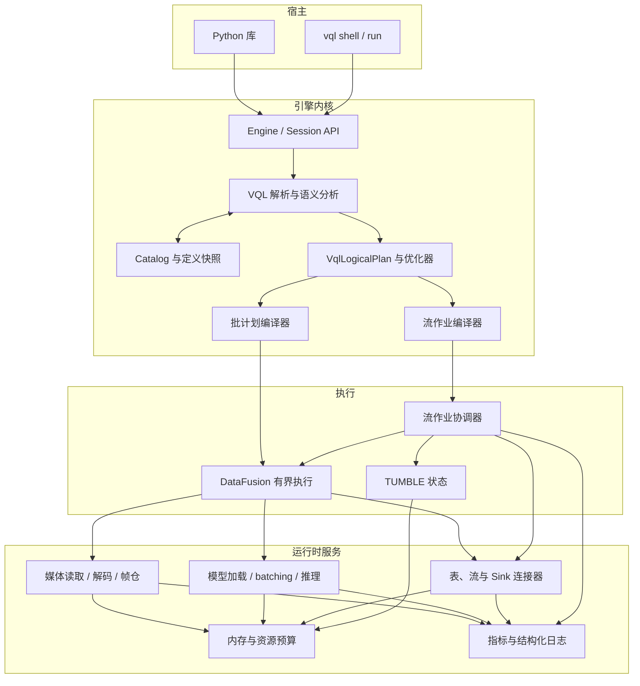
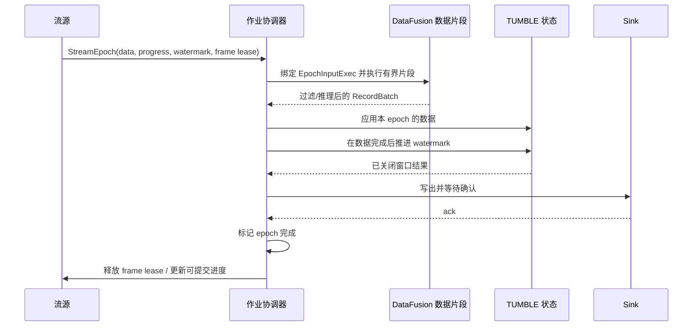

# VisionQL 系统设计

> 本文把 [VisionQL PRD](./prd.md) 落实为当前在建能力的系统设计，覆盖架构、计划与执行、多模态类型、数据进出口、模型运行时、资源和安全约束。
>
> **文档地图**：[prd.md](./prd.md)（范围与需求）→ 本文（系统设计）→ [proposals/](./proposals/README.md)（后续能力设计）。

- **设计版本**：v1.1.0（Draft）
- **日期**：2026-08-07
- **对应 PRD**：v0.1.6
- **状态**：评审中

---

## 1. 设计范围

### 1.1 设计目标

本文有五项目标：

1. 有界与无界数据共享 SQL、DataFrame 和逻辑计划；
2. `IMAGE` 穿过列式计划时不复制大量像素；
3. 模型调用成为可优化、可调度的计划节点；
4. 过滤、异步推理和失败不破坏事件时间、窗口状态与源进度；
5. 内核不假设进程形态，可嵌入 CLI 和 Python。

### 1.2 能力范围

本文覆盖本地图片和视频目录表、SQL 模型推理、RTSP 与 `TUMBLE`、Console 和 Kafka Sink，以及 CLI 和 Python 宿主。完整范围和交付顺序见 [PRD](./prd.md) 与 [Roadmap](../ROADMAP.md)；尚未纳入本文的子功能见 [proposals/](./proposals/README.md)。未排期方向不做设计。

未交付的语法即使能解析，也必须返回 `FEATURE_NOT_AVAILABLE`，并注明目标版本或“未排期”；不得登记不可执行的目录对象。逐语句行为见 §7.1。

### 1.3 技术非目标

产品级非目标见 PRD 第 4 节。本设计额外约束：

- 不修改或 fork DataFusion 内核；
- 不自研通用 SQL 执行引擎、视频存储格式或模型服务平台；
- 不强求批流共用物理算子；批流只共享语言、类型、目录和逻辑计划；
- 本文范围内不实现跨查询共享解码、模型结果缓存、状态检查点、持久作业恢复或多用户安全边界。

### 1.4 关键术语

| 术语 | 含义 |
|---|---|
| 有界查询 | 输入最终结束，可以由普通 DataFusion 物理计划完整求值的查询 |
| 持续查询 | 至少包含一个无界源，需要长期运行的查询 |
| 执行周期（epoch） | 流源在一个短时间段内产生的一组 RecordBatch，以及与这组数据对应的水位线、源进度和资源租约 |
| 数据片段 | 在一个 epoch 内执行的有界 DataFusion 计划，不携带水位线等控制消息 |
| 作业协调器 | 顺序驱动 epoch、窗口状态和 Sink 确认的流运行时组件 |
| 媒体引用 | 指向图片或视频帧的逻辑定位信息，不包含解码后的像素 |
| 帧仓 | 只在当前进程、当前 epoch 内有效的解码帧 arena |
| 定义快照 | 查询规划时解析并固定的表、模型、函数和 Sink 修订版本 |

---

## 2. 从 PRD 派生的设计约束

| 编号 | PRD 承诺 | 设计约束 |
|---|---|---|
| G1 | 批流共享 SQL 与 DataFrame 语义 | 只维护一套 `VqlLogicalPlan`；边界性在分析阶段推导，物理编译阶段再分为批计划和流作业图 |
| G2 | `pip install` 后无需服务即可使用 | 内核不得监听端口或依赖外部元数据服务；本地目录使用 SQLite；CLI 和 Python 都嵌入同一内核 |
| G3 | 模型调用可优化 | `USING MODEL` 函数必须在规划期提取为显式 `Inference` 节点，不能作为普通逐行 UDF 执行 |
| G4 | 大图像不能在算子间反复复制 | `IMAGE` 默认保存引用；像素只存在于有界帧仓、张量缓冲或明确的 IPC 或落盘边界 |
| G5 | 流处理有事件时间与明确投递语义 | 水位线、源 offset 和帧租约属于 epoch 控制面，不编码成可能被 Filter 丢弃的普通行 |
| G6 | 错误行默认不终止整个查询 | 解码或推理失败时保留输入行，把对应结果列置为 NULL，并记录结构化错误指标；严格模式才失败 |
| G7 | 结果可被标准 Arrow 生态直接消费 | 多模态类型使用标准 Arrow storage type 加扩展元数据；不把进程内内存结构暴露到进程外，不认识扩展类型的客户端仍可按 storage type 读取 |
| G8 | 后续扩展不能破坏主线 | 模型类型、processor、推理后端、源、Sink 和逻辑节点都通过窄 trait 或注册表扩展；未实现功能直接拒绝 |

补充三条实施规则：

1. 优化先减少工作量，再加速单次操作：依次考虑列裁剪、时间裁剪、显式采样、推理去重、批量推理和硬件特化。
2. 媒体、推理、窗口和 Sink 缓冲都必须有上限并纳入查询预算；无界队列视为实现错误。
3. 尚未消费的参数直接拒绝，不静默保存。

---

## 3. 总体架构

### 3.1 分层结构



### 3.2 组件职责

| 组件 | 职责 | 不负责 |
|---|---|---|
| `Engine` / `Session` | 组装目录、规划器、运行时和配置；提供 SQL 与 DataFrame 执行入口 | 进程信号、端口、用户认证 |
| VQL 前端 | 切分语句、解析 VQL DDL、规范化语法糖、生成统一逻辑计划 | 执行 DDL 之外的 I/O |
| Catalog | 对象修订、依赖、schema、模型哈希和作业定义的事务持久化 | 保存视频、权重字节或用户明文凭证 |
| 规划器 | 类型检查、边界性和可重放性推导、函数解析、推理提取、streamability 校验 | GPU 放置、模型加载 |
| 批计划编译器 | 将有界逻辑计划降为 DataFusion `ExecutionPlan` | 水位线与恢复 |
| 流作业编译器 | 将持续查询切成源、一个或多个有界数据片段、状态算子和 Sink | 自己实现表达式计算 |
| 作业协调器 | 驱动 epoch，按序推进控制面，管理状态、取消和 Sink 确认 | 解释 SQL 表达式 |
| 媒体运行时 | 探测、读取、解码、采样、帧仓和编码 | 模型前后处理 |
| 模型运行时 | 权重解析、processor、设备会话、批量调度和推理 | SQL 语义与目录权限 |
| 连接器 | 读取图片、视频与 RTSP，以及写入 Console 与 Kafka | 改写查询计划 |

### 3.3 两条执行路径

| 阶段 | 有界查询 | 持续查询 |
|---|---|---|
| 解析与分析 | 同一套 VQL AST、Catalog 和 `VqlLogicalPlan` | 同左 |
| 优化 | 同一套列裁剪、谓词下推、推理提取和显式采样下推 | 同左，另外执行 streamability 校验 |
| 物理编译 | 完整降为一个 DataFusion 计划 | 切成 `Source → EpochTransform → StatefulOp → Sink` 作业图；每个 `EpochTransform` 是有界 DataFusion 片段 |
| 控制信息 | 不需要水位线；输入结束即完成 | 由协调器在 epoch 边界传递，不进入 RecordBatch |
| 结束条件 | 所有分区耗尽 | 用户停止或不可恢复错误 |

DataFusion 的 `ExecutionPlan::execute` 只输出 `RecordBatch`，原生算子没有水位线或源进度通道。因此 VisionQL 复用其 SQL、优化器和有界执行能力，流控制面由协调器处理。

---

## 4. 统一逻辑计划与物理编译

### 4.1 `VqlLogicalPlan`

标准关系节点尽量复用 DataFusion `LogicalPlan`。视觉或流语义无法由标准节点完整表达时，使用扩展节点：

| 扩展节点 | 输入与输出 | 物理实现 |
|---|---|---|
| `Inference` | 输入关系 → 追加模型结果列 | `InferenceExec`（§10） |
| `TumbleAggregate` | 带事件时间的关系 → 窗口聚合结果 | 有界：`date_bin + AggregateExec`；无界：`TumbleState`（§5.4） |
| `SinkWrite` | 输入关系 → 写入目录中的 Sink | `SinkExec` / 流 Sink 驱动器 |

视频表的帧展开不是独立逻辑节点：它按建表声明的 fps 发生在 `USING VIDEOS` 扫描算子内部（§8.2），与 PRD 3.3.7 保持一致。

每个计划节点都携带或推导以下属性：

```text
PlanProperties {
  boundedness: Bounded | Unbounded,
  replayability: Replayable | Live,
  event_time: None | { column, watermark_delay },
  ordering: ...,
  image_access: MetadataOnly | Encoded | Pixels,
  definition_snapshot: CatalogGeneration,
}
```

### 4.2 规划流水线

```text
SQL / DataFrame
  → 语法归一化
  → 名称、类型与目录修订解析
  → VqlLogicalPlan
  → 边界性、事件时间、可重放性分析
  → 推理调用提取与公共表达式消除
  → 列裁剪、谓词和显式采样下推
  → streamability 校验
  → 批计划或流作业图
  → 物理计划校验
  → 执行
```

规划只读取目录和轻量元数据；对象扫描、模型下载、视频探测与网络连接推迟到执行阶段，避免 `EXPLAIN` 或补全触发昂贵 I/O。

### 4.3 定义快照

目录对象使用稳定 ID、不可变 revision 和可变 head：

- `CREATE` 生成首个 revision；`ALTER` 或 `CREATE OR REPLACE` 生成新 revision 并推进 head，只影响后续规划；
- `USING MODEL` 绑定稳定 `model_id`。规划器在同一 Catalog 读事务中解析 Function revision 和该模型当时的 head revision；
- 计划记录表、Function、Model、Sink revision ID，以及绑定参数和模型语义指纹。指纹至少包含 artifact hash 或 immutable endpoint revision/config hash、processor ID/版本、precision、backend kind/版本和输出 schema；
- 批查询在执行期间固定快照，持续查询在整个运行期间固定快照；
- `ALTER FUNCTION ... SET MODEL` 创建 Function revision 并绑定另一个 `model_id`，也只影响后续规划；
- prepared statement 和运行中查询均不自动 replan；前者需重新 prepare，持续查询需取消后重启；
- `DROP` 将名称 head 标记为 tombstone。存在查询或未过期 locator 的 revision lease 时不得物理回收；撤权立即生效，不受 lease 影响；
- `EXPLAIN`、`SHOW QUERIES` 和错误日志显示实际 revision。

### 4.4 无界查询白名单

无界计划采用白名单，而不是猜测任意 DataFusion 计划能否持续运行。

允许：

- 单个 RTSP 源；
- Projection、Filter、`UNNEST`、内置标量函数与 `Inference`；
- 一个 `TUMBLE` 聚合；
- 无状态 SELECT 预览或一个 Sink；
- 窗口后的 Projection、Filter 和 Sink。

拒绝：

| 计划形状 | 原因 | 提示 |
|---|---|---|
| 无窗口全局或分组聚合 | 输入永不结束 | 增加 `TUMBLE` |
| 无界 `ORDER BY` / TopK | 需要无限状态或等待结束 | 先限定窗口或改为批查询 |
| 无界 `DISTINCT` | 状态无法回收 | 改用白名单聚合，或改为批查询 |
| JOIN、UNION 多源 | 本设计未定义多源水位线与一致性 | 拆为独立查询 |
| `OVER` 分析窗口 | 没有有界状态规则 | 改为时间窗口聚合 |
| 不在窗口聚合白名单中的 aggregate / UDAF | 无法保证内存、帧生命周期或状态可恢复 | 改用受支持聚合或批查询 |

流式 `TUMBLE` 的聚合白名单细则（允许的聚合函数与类型约束）见 §5.4。

校验错误必须指出第一个不支持的节点或聚合、所在 SQL 片段和可行改写，不能只返回 DataFusion 内部错误。

---

## 5. epoch 流执行模型

### 5.1 为什么采用 epoch

流数据以短周期微批进入引擎，默认周期为 100～250ms，可由运行时根据输入率调整。每个 epoch 同时携带数据和独立控制信息：

```rust
struct StreamEpoch {
    epoch_id: u64,
    batches: Vec<RecordBatch>,
    source_progress: SourceProgress,
    watermark: Option<Timestamp>,
    frame_lease: Option<FrameArenaLease>,
}
```

`batches` 可以为空；其余控制信息不编码为隐藏列，因此 Filter 清空数据后仍可推进进度、水位线并释放帧仓。

### 5.2 一个 epoch 的执行顺序



严格顺序如下：

1. 同一源的 epoch 按 `epoch_id` 串行应用；数据片段内部仍可并行解码、前处理和推理；
2. 只有当前 epoch 的所有数据输出完成后，协调器才把它的水位线交给状态算子；
3. 只有状态更新和所有新关闭窗口的 Sink 写入完成后，epoch 才算完成；
4. 取消查询会取消当前 DataFusion stream、模型请求和 Sink 请求，再释放帧租约；
5. 本设计只有单源单分区，不需要合并水位线。

数据片段的计划模板只编译一次，但 `ExecutionPlan` 实例不得跨 epoch 重用。模板保存 schema、表达式、operator ID、分区要求和扩展算子 factory，不保存 channel、动态过滤器、metrics recorder、输入槽等运行态：

```rust
trait EpochPlanTemplate {
    fn instantiate(
        &self,
        binding: EpochBinding,
        task_ctx: Arc<TaskContext>,
    ) -> Result<Arc<dyn ExecutionPlan>>;
}

struct EpochBinding {
    job_id: QueryId,
    epoch_id: u64,
    batches: Vec<RecordBatch>,
    frame_lease: Option<FrameArenaLease>,
    cancel: CancellationToken,
}
```

每个 epoch 必须：

- 创建新的执行树、`EpochInputExec` 和子 `TaskContext`；
- 只共享作业级 RuntimeEnv、MemoryPool、模型运行时和指标汇聚器；
- 等所有分区结束或取消、后台任务 join、reservation 释放后，再实例化下一棵树；
- 将状态算子保留在数据片段之外。

适配层可用锁定版本的 `reset_state` / `with_new_state` 实现 factory，但执行实例不得复用。

### 5.3 背压与丢帧

背压沿 `Sink → 状态 → 数据片段 → 源缓冲` 反向传递。所有缓冲都有容量：

- 批输入等可重放输入在容量不足时等待；
- RTSP 缓冲满时，只在源端丢弃尚未进入 epoch 的最旧采样帧；
- 已进入 epoch 的行不得因超载静默丢弃；预算不足时查询失败；
- 每次丢弃记录源、原因、帧数和事件时间范围；原因至少区分 `source_overrun`、`decode_slow`、`inference_backlog` 和 `sink_backlog`；
- `on_overload = 'fail'` 将 live 丢帧改为查询失败。

### 5.4 `TUMBLE` 窗口状态

流模式下，`TumbleState` 保存规范化 Arrow 状态，不长期持有 DataFusion `Accumulator`：

```text
key = (window_start, group_key)
value = versioned_arrow_states + source_progress_span
```

- 窗口为 `[start, end)`；时间统一为 UTC 纳秒，固定原点为 Unix epoch；
- interval 必须是正的固定时长，不支持日历间隔；无界查询的事件时间必须是非空 TIMESTAMP，nullable 列需先过滤 NULL；
- 每个白名单聚合由 `WindowStateCodec` 定义输入、state schema、更新、求值、大小和恢复；
- accumulator 仅用于单次转换：用 `merge_batch` 恢复 state，处理本 epoch 后调用一次 `state()`，随即丢弃。快照只复制规范化 state；
- 数据处理完成后再推进 watermark；`window_end <= watermark` 时输出并删除窗口；
- `event_time < current_watermark` 的行默认丢弃并增加 `late_rows_total`；不支持 `allowed_lateness`；
- 停止查询时不输出未关闭窗口；
- state schema 由 `(aggregate_kind, input_types, state_codec_version)` 决定并纳入 fingerprint。每次更新按 `size()` 调整 reservation；无法记账的 codec 不得注册；
- state 和 group key 不得包含 `arena_id/arena_slot`。画面需先转为持久 locator 或编码态；窗口状态默认拒绝 `IMAGE/VIDEO`；
- 批模式将 `TUMBLE` 降为时间分桶和聚合。白名单聚合必须通过批/流差分测试，覆盖 NULL、分组、溢出和最终值。

`WindowStateCodec` 是 VisionQL 的恢复 ABI。修改已发布 codec 必须提供迁移或重放方案；新增 codec 必须通过确定性 schema、非破坏性快照、restore round-trip 和资源记账测试。

流式 `TUMBLE` 的聚合范围：

- 允许 `COUNT`、`SUM`、`AVG`、`MIN` 和 `MAX`；参数与 group key 必须是可持久化的标量 Arrow 类型；
- `COUNT(DISTINCT primitive)` 通过状态恢复和内存上限测试后才能单独启用；
- 拒绝 `ARRAY_AGG`、`STRING_AGG`、近似聚合、ordered aggregate、UDAF，以及对 `IMAGE`、`VIDEO`、Binary 或含进程内媒体槽位的复杂类型做聚合。

计划形状白名单见 §4.4。

---

## 6. 多模态类型与媒体生命周期

### 6.1 Arrow 物理表示

VQL 类型使用标准 Arrow storage type，并以字段 metadata 标注逻辑语义。

| VQL 类型 | Arrow storage type | 约定 |
|---|---|---|
| `IMAGE` | `Struct`，见 §6.2 | `ARROW:extension:name=visionql.image` |
| `VIDEO` | `Struct<uri, locator, duration_ns, fps, width, height, codec>` | `uri` 只展示，`locator` 用于重新授权后的读取；永远不内联完整视频 |
| `BOX2D` | `Struct<x: Float32, y: Float32, w: Float32, h: Float32>` | 左上原点，归一化坐标 `[0,1]` |
| `POINT2D` | `Struct<x: Float32, y: Float32>` | 空间函数的内部逻辑类型 |
| `POLYGON` | `List<POINT2D>` | 只支持归一化二维多边形 |
| 检测结果 | `List<Struct<label: Utf8, confidence: Float32, box: BOX2D>>` | 一帧对应一个数组；`UNNEST` 负责展开 |
| `AUDIO` / `MASK` | 保留逻辑类型 | 注册和执行都返回未支持错误 |

`IMAGE` 字段固定携带 `ARROW:extension:name=visionql.image` 和 `ARROW:extension:metadata={"version":1}`；未知该扩展的客户端仍可读取标准 storage type。

### 6.2 `IMAGE` 的三种载荷

```text
IMAGE storage := Struct {
  uri: Utf8?,                 # 只用于展示的脱敏 URI，不参与读取或授权
  locator: Utf8?,             # 版本化 vql:// 媒体定位符
  pts_ms: Int64?,             # 视频帧时间；图片为 NULL
  frame_id: UInt64?,          # live 环形缓存中的帧标识
  encoded: Binary?,           # JPEG/PNG 或缩略图字节
  encoding: Utf8?,
  width: Int32?,
  height: Int32?,
  arena_id: UInt64?,          # 仅进程内
  arena_slot: UInt32?         # 仅进程内
}
```

`IMAGE` 有三种载荷形态：

| 形态 | 有效字段 | 使用位置 |
|---|---|---|
| 引用态 | `uri`、`locator`、`pts_ms`、元数据；`locator` 必须非 NULL | 表扫描、视频帧展开和绝大多数算子间传递 |
| 帧仓态 | `arena_id`、`arena_slot`、元数据 | 当前 epoch 内，解码点到像素消费者之间 |
| 编码态 | `encoded`、`encoding`、元数据 | Python 边界、Kafka 显式输出等进程外出口 |

不变量：

1. `arena_id` 和 `arena_slot` 不得跨进程、落盘或进入 Catalog；
2. `uri` 必须脱敏且仅供展示、日志和导出；运行时不得用它读取媒体；
3. `locator` 是绑定来源 revision 和帧信息的 `vql://media/v1/...` 不透明值。解析时只接受已登记来源，并按当前调用者重新授权；
4. live RTSP 帧不可重放，没有持久 `locator`；需要回查时先编码或落盘；
5. 字段 metadata 必须说明 `encoded` 是原图还是缩略图。

### 6.3 epoch 帧仓

RTSP 采样帧存入当前 epoch 的 `FrameArena`，RecordBatch 只保存槽位。数据片段、状态处理和出口编码全部结束后，协调器才释放 `FrameArenaLease`。

这种生命周期不依赖每一行都到达下游：

- Filter 丢弃单行或整批不会泄漏帧；
- 异步推理结束前 lease 不会释放；
- 查询取消会先取消使用者，再释放整个 epoch；
- 不跨 epoch 保存帧仓引用；窗口状态不得保存 `arena_slot`。

批视频通常由 `InferenceExec` 融合读取、解码和前处理。只有多个像素消费者共享同一帧时，才为当前批建立短生命周期 arena。

### 6.4 NULL 与单行错误

- 解码失败：`IMAGE` 像素不可用，依赖像素的结果列为 NULL；引用和其他元数据仍保留；
- 推理失败：模型结果列为 NULL，输入列照常输出；
- `COUNT_OBJECTS(NULL, ...)` 返回 NULL，不把错误误算为 0；用户需要 0 时显式 `COALESCE`；
- 默认连续 5 分钟失败率超过配置阈值时告警，但不改变结果；
- `SET vql.on_error = 'fail'` 使第一次行级错误终止查询。

---

## 7. SQL、目录与函数

### 7.1 解析边界

VQL 复用 sqlparser-rs 的 tokenizer 和标准 SQL AST，并用独立入口处理扩展语法：

1. 先按字符串、注释和引用规则切分完整脚本；
2. `CREATE STREAM/MODEL/FUNCTION/SINK`、`ALTER`、`SHOW` 进入 VQL DDL parser；
3. SELECT、INSERT 和标准 DDL 进入标准 SQL parser；
4. `.center`、`TUMBLE` 等在 AST/逻辑计划层规范化；
5. 规范化后的关系表达式交给 DataFusion 规划接口。

扩展 Statement 不能只依赖 `Dialect` 钩子，必须有 VQL parser 金样测试。

未加引号的标识符按小写解析，双引号标识符保留原样；字符串只使用单引号。新增 DDL 的行为如下：

| 语句 | 行为 |
|---|---|
| `CREATE TABLE ... USING IMAGES/VIDEOS` | 创建外部图片或视频表（§8.2） |
| `CREATE STREAM ... FROM 'rtsp://...'` | 创建单路 RTSP 流（§8.3） |
| `CREATE MODEL ... [FUNCTION f]` | 创建模型；可在同一事务中派生一个函数 |
| `ALTER MODEL ...` | 创建新 Model 修订并推进稳定 `model_id` 的 head，不修改已规划查询 |
| `CREATE FUNCTION ...` | 支持 Model、Python 与 SQL 宏三种实现 |
| `ALTER FUNCTION ... SET MODEL` | 创建新 Function 修订，不修改运行中查询 |
| `CREATE SINK ...` | 创建 Kafka 或 Console Sink |

`DROP`、`SHOW`、`DESCRIBE` 和 `SHOW CREATE` 走同一 VQL DDL 路径；`SHOW CREATE` 输出脱敏且可解析的定义。其余语句按 §1.2 拒绝，不登记存根。

### 7.2 目录对象

SQLite 是默认目录，默认位置为平台用户数据目录下的 `visionql/catalog.db`。核心对象如下：

| 对象 | 关键内容 |
|---|---|
| Table | provider、location、options、Arrow schema、修订、凭证引用 |
| Stream | connector、endpoint（脱敏）、fps、事件时间、水位线、修订 |
| Model | type、不可变来源 revision、内容哈希、processor、precision、backend、输出 schema、声明式约束 |
| Function | 签名、实现种类、稳定 `model_id` 或代码入口、绑定参数、确定性 |
| Sink | connector、format、options、凭证引用 |

约束：

- 每条 DDL 在一个 SQLite 事务中提交；`CREATE MODEL ... FUNCTION f` 原子创建两个对象；
- 内部外键使用稳定 ID 和 revision ID，不使用可变名称；
- Function 引用稳定 `model_id`，计划引用不可变 revision ID；单个字段不得混用 head 与固定 revision 语义；
- Table、Stream、View 共享 relation 名称空间；Model、Function、Sink 各自独立。未加引号的名称按 §7.1 规则唯一；
- schema 使用 Arrow IPC 编码；Catalog 保存格式版本和迁移记录；
- 目录不保存密码、token、S3 secret 或签名 URL，只保存 secret 引用；
- `DROP` 创建 tombstone 并阻止新规划。revision lease 在查询结束前阻止物理 GC，但不延续权限；撤权后新的媒体读取失败。

### 7.3 MODEL 与 FUNCTION

MODEL 描述资源实现，FUNCTION 定义查询接口。Function revision 保存稳定 `model_id`；规划时将当时的 Model head revision 和 Function 参数固定到计划。

模型类型：

| TYPE | 标准签名 |
|---|---|
| `OBJECT_DETECTION` | `(IMAGE) -> ARRAY<STRUCT<label, confidence, box>>` |

参数分属查询接口、模型实现和运行时部署。会改变结果的权重、processor 和 precision 必须进入模型语义指纹与定义快照：

- Function 保存签名、稳定 `model_id`、`classes`、`min_confidence`、NMS 阈值和 determinism；
- Model revision 保存 artifact revision/hash、processor ID/版本、label/schema、precision、backend 和 `latency_slo`；修改时创建新 revision；
- device、replica、动态 batch 和队列权重属于部署配置，不进入 Function 或 Model semantic fingerprint，也不得改变 precision、processor 或 backend kind；
- 参数白名单由 model type 和 processor schema 提供，未知参数直接报错。

`ALTER MODEL` 仅在新 revision 与所有相关 Function head 的任务类型、输入模态、输出 schema 和参数 schema 兼容时推进 head；校验与更新在同一事务中完成。不兼容升级需创建新 Model ID，并通过 `ALTER FUNCTION ... SET MODEL` 或新 Function revision 显式迁移。

固定 artifact 的本地/ONNX 模型可声明为 `deterministic`。没有不可变 revision 的 endpoint 一律为 `volatile`，不得去重、常量提升或缓存。通过能力声明和回归测试的固定 endpoint 可标记为 `stable_within_query`，只允许查询内去重。

### 7.4 三类函数实现

| 语法 | 规划与执行 |
|---|---|
| `USING MODEL` | 注册签名与模型绑定；调用在规划期提取为 `Inference` 节点 |
| `LANGUAGE PYTHON AS 'module:function'` | 注册批量 Arrow ABI；只有 Python 宿主能执行 |
| `AS (<表达式>)` | SQL 宏；规划前进行卫生替换和递归深度检查，不产生运行时函数 |

Python UDF 每次接收与参数对应的 `pyarrow.Array`，并返回等长、类型匹配的 `pyarrow.Array`。`IMAGE` 跨语言前转为编码态，SDK 提供批量解码 helper。不支持逐行 Python 回调；模型推理使用 `USING MODEL`。

### 7.5 语法到计划的映射

| VQL 表达 | 规范化结果 |
|---|---|
| `box.center` | `BOX_CENTER(box)` |
| `TUMBLE(ts, interval)` | `TumbleAggregate`；物理编译时按边界性分流 |
| `FROM t, UNNEST(expr)` | DataFusion 原生展开节点；这是唯一的行展开方式 |
| `CREATE ...` | Catalog 或运行时操作，不进入关系计划 |

`classes/min_confidence` 由 processor 过滤数组元素，不改写为会丢弃整帧的行级 Filter。

### 7.6 内置函数

| 函数 | 签名 | 实现约束 |
|---|---|---|
| `COUNT_OBJECTS` | `(detections, label STRING, min_confidence FLOAT) -> BIGINT` | 在数组内按标签和阈值计数，不展开或丢弃整帧 |
| `BOX_CENTER` | `(BOX2D) -> POINT2D` | `box.center` 的等价形式 |
| `POLYGON` / `ST_POLYGON` | `(STRING) -> POLYGON` | 常量参数在规划期解析并检查闭合、有限数值和 `[0,1]` 范围 |
| `ST_CONTAINS` | `(POLYGON, POINT2D) -> BOOLEAN` | 采用明确的边界规则：边界点视为包含 |
| `TO_JPEG` | `(IMAGE [, quality]) -> BINARY` | 显式触发读取/解码/编码；quality 范围在规划期校验 |

上述函数遵循 SQL NULL 传播；`COUNT_OBJECTS` 的 NULL 输入返回 NULL。

---

## 8. 数据源与 Sink

数据进出口均为窄 trait 连接器：表和流 provider 读取，Sink 写出。

### 8.1 内置 provider 的最小 schema

| 来源 | 最小列 |
|---|---|
| IMAGES | `uri STRING, image IMAGE, width INT, height INT, captured_at TIMESTAMP` |
| VIDEOS（帧表） | `uri STRING, ts TIMESTAMP, pts_ms BIGINT, frame_id BIGINT, frame IMAGE, duration DOUBLE, fps DOUBLE, width INT, height INT, codec STRING` |
| RTSP Stream | `ts TIMESTAMP NOT NULL, frame IMAGE, frame_id BIGINT, source STRING` |

无法读取的可选元数据为 NULL；`uri`、媒体值和 RTSP 的 `ts/frame_id/source` 非 NULL。目录选项可追加分区列，但不得改变基础列语义。

### 8.2 图片与视频目录表

`CREATE TABLE ... USING IMAGES/VIDEOS` 将本地或对象存储目录注册为外部表。图片逐文件成行；视频按建表 `fps` 在扫描算子内展开为帧行。

provider 行为：

- 两者实现为 `TableProvider`；规划期只返回 schema 和统计信息，列举与读取在 `execute()` 中发生；
- 支持 `file://` 和 object_store 已支持的存储；执行前校验路径、扩展名和 `recursive`；
- `uri`、大小和修改时间来自对象列表；宽高、时长、codec 等仅在投影时探测；
- `IMAGE` 和 `frame` 以引用态输出，扫描不解码像素。

视频帧展开不引入表值函数或独立逻辑节点：

- 扫描按 `WITH (fps = ...)` 展开帧，输出 `uri`、`ts`、`pts_ms`、`frame_id`、引用态 `frame`，并透传 `duration` 等文件属性；
- 不同采样率需为同一目录另建逻辑表，不复制媒体；
- `fps` 是显式采样目标，按 PTS 而不是帧序号采样，支持 VFR；
- `pts_ms` 是媒体内相对时间，`ts` 是事件时间。`ts` 优先使用可信 `start_time + pts`，其次使用表选项 `start_time`；均无时以 Unix epoch 合成，并标记 `synthetic_event_time`；
- 时间谓词下推为 `time_range`，容器支持时先 seek 到范围附近；
- 顺序解码与稀疏 seek 的选择由媒体运行时依据采样比、GOP 和存储能力决定。稀疏 seek 未经 PoC 前不作为吞吐承诺；
- 元数据查询若不读取 `frame` 像素，只生成帧定位信息。

### 8.3 RTSP 流源

`CREATE STREAM ... FROM 'rtsp://...'` 创建单路 RTSP 流。RTSP 不可重放，只承诺尽力而为；崩溃、丢帧或暂停造成的数据无法恢复。

摄入路径：

- FFmpeg demux/decode 在受控工作线程运行，不阻塞 async executor；
- RTSP 优先 TCP interleaved，可配置 UDP；
- 普通帧间编码通常仍需按源帧率解码后采样；`fps=5` 只减少帧仓、前处理和推理量；
- 支持硬解时可以启用 NVDEC、VideoToolbox 等后端，失败回退软件解码并记录指标；
- 采样帧进入当前 epoch arena，达到行数或时间阈值后生成 `StreamEpoch`。

事件时间与断流：

- 作业启动时以一次 UTC 时间和 monotonic clock 建立 `IngestClock`，之后用 monotonic elapsed 生成 ingest time；重连和系统时钟回拨不会使其倒退；
- 初连、重连、codec/timebase 变化或 RTP/RTCP 映射失效都会开启新 `source_generation`。`ingest_time` 无需探测；`capture_time` 必须在 `timestamp_probe_timeout` 内通过单调性、漂移及与 `IngestClock` 偏差检查。每个 generation 只使用一种时钟；
- capture 映射失效、倒退或漂移超限时，结束当前 generation，以 `ingest_time` 开启下一代，并记录 `event_time_fallback_total` 和原因；
- 水位线为 `max_seen_event_time - watermark_delay`，且不回退。max 值取自所有成功取得时间戳的源帧，不限于采样行；本 epoch 数据处理完成后才应用其水位线；
- 断流后按 1s 起、最大 30s 指数退避重连；期间冻结水位线，不用本地时钟伪造进度；
- 新 generation 的 capture time 若早于当前 watermark，或相对 `IngestClock` 偏移异常，则改用 ingest time。重连后的 ingest time 保留真实 gap，可推进水位线并关闭窗口，但不补造缺失行；在容差内的 capture time 仍可使用；
- 若始终未恢复，最后一个未关闭窗口不输出。查询保持 `RUNNING`，并以 `source_health=DISCONNECTED`、缺口时长和最后事件时间表示源状态。

### 8.4 Sink 公共契约

| Sink | 说明 |
|---|---|
| Console | 仅 shell 和 `vql run` 前台可用；`IMAGE` 显示摘要，不输出像素 |
| Kafka | JSON 编码规则见 §8.5 |

`CREATE SINK` 只登记连接信息；首次规划 `INSERT INTO` 时校验输出 schema 和 format。Sink 必须支持取消、超时和有界缓冲，重试由协调器统一管理。

### 8.5 Kafka Sink

Kafka Sink 将查询结果以 JSON 写入 topic：

- JSON 标量按稳定规则编码，字段名与查询输出列名一致；编码规则进入回归测试，不随实现细节漂移；
- `IMAGE` 默认只输出脱敏 URI、locator 和元数据，必须显式 `TO_JPEG` 才输出 base64 字节，避免把原始像素隐式塞进消息流；
- 写入失败的重试策略由作业协调器统一管理；缓冲有界，背压回传至上游。

---

## 9. 优化器与 `EXPLAIN`

### 9.1 规则顺序

| 顺序 | 规则 | 正确性或收益 |
|---|---|---|
| R1 | SQL 宏展开与类型检查 | 保证语义 |
| R2 | 模型调用提取；仅对 deterministic / stable-within-query 调用去重和常量提升 | 保证模型调用可调度，同时保留 volatile 调用次数与顺序 |
| R3 | 列裁剪与 `image_access` 分析 | 不消费像素时完全跳过读取和解码 |
| R4 | 时间谓词下推 | 只读取目标视频范围 |
| R5 | 显式采样下推 | 把视频表和 Stream 声明的 `fps` 推到媒体层 |
| R6 | 原生 DataFusion 规则 | 谓词、投影、常量折叠和普通关系优化 |

不根据窗口粒度自动猜测 fps；用户显式指定的 fps 是结果语义的一部分。

### 9.2 推理调用提取

规划器扫描 Projection、Filter 和聚合输入中的模型函数调用：

1. 把调用替换为内部列引用；
2. 在最早同时具备所需输入列、且不会改变语义的位置插入 `Inference`；
3. `deterministic` 或 `stable_within_query` 调用仅在 Function revision、Model semantic fingerprint、输入表达式和参数完全相同时去重；`volatile` 保持原次数与顺序；
4. 只有满足同一 determinism 条件，常量参数调用才作为 query init expression 执行一次；
5. 不跨不同 Function 修订共享原始模型输出，避免后处理语义被错误合并。

`Inference` 节点的物理执行见 §10。

### 9.3 `EXPLAIN` 输出

`EXPLAIN` 至少展示：

- 定义快照和查询模式；
- 逻辑计划与批计划 / 流作业图；
- 视频时间范围、源 fps、采样后预计帧率；
- 每个推理节点的模型修订、输入规模和去重情况；
- 是否需要解码和使用哪种 IMAGE 形态；
- 流查询的状态算子、watermark delay、投递语义和不支持项。

`EXPLAIN` 只展示工作量，不输出未经校准的 GPU 时长或费用预估。

---

## 10. 模型运行时与推理执行

本章定义 `Inference` 节点的模型加载、processor、异步批推理与跨查询调度。

### 10.1 运行时接口

```rust
trait ModelBackend {
    fn load(&self, spec: &ResolvedModel) -> Result<ModelSession>;
}

trait ModelSession {
    async fn infer(&self, batch: TensorBatch, cancel: CancellationToken)
        -> Result<RawModelOutput>;
}

trait Processor {
    fn preprocess(&self, images: &DecodedBatch, buffers: &mut TensorBuffers)
        -> Result<TensorBatch>;
    fn postprocess(&self, raw: RawModelOutput, params: &BoundParams)
        -> Result<ArrayRef>;
}
```

引擎提供 ONNX Runtime 后端与 HTTP endpoint 后端。processor 负责 resize、归一化、检测框还原、NMS 和绑定参数；后端只负责模型会话和张量 I/O。

### 10.2 模型来源与完整性

- `file://`、`hf://` 和 `endpoint://` 由独立 resolver 处理；
- 浮动的 Hugging Face revision 首次解析时固定为 commit，并记录内容哈希；
- 下载使用临时文件，哈希校验后原子放入内容寻址缓存；
- 离线环境可以只使用本地路径或预热缓存；
- endpoint URL 的鉴权通过 secret 引用注入，不写入模型 DDL 的可见输出。

模型可执行性由 manifest 决定，不根据 `TYPE OBJECT_DETECTION` 猜测张量布局。manifest 至少包含 backend artifact、输入和输出张量、processor ID/版本、图像尺寸与归一化、标签表和入口名称。它可以来自 `visionql-manifest.json`、内置模型清单或显式 processor 配置。

引擎不嵌入 PyTorch，也不执行任意仓库代码。`hf://` 缺少可用 ONNX artifact 或受支持 manifest 时，`CREATE MODEL` 返回所需 artifact/endpoint。远程模型应提供或声明 revision；否则标记为 `mutable_endpoint`，由 `EXPLAIN` 警告，且不得跨查询缓存。

### 10.3 `InferenceExec` 批路径

```text
引用/编码态 IMAGE
  → 异步读取
  → 解码
  → 批量前处理
  → 模型调度队列
  → 异步推理
  → 后处理
  → 追加 nullable Arrow 结果列
```

输出顺序与输入一致。取消 stream 时移除未提交请求，丢弃已提交请求的结果并释放资源。

批视频通常不需要帧仓：`InferenceExec` 可以把“读取 → 解码 → 前处理”融合在一个算子内（§6.3）。

### 10.4 调度与 batching

- 每个 `ModelInstanceKey`（Model semantic fingerprint、设备和运行时配置代次）有一个队列；
- 请求按 `interactive`、`stream`、`batch` 进入加权公平队列；流请求可带 deadline，批任务不得无限挤占流 SLO；
- 达到 `max_batch`、最早 deadline 或 `max_wait` 时发车；batch 大小、等待时间和 GPU 选择属于运行时配置；
- 张量缓冲按最大在途批次预分配并复用；队列满时提交端等待，背压回传；
- 默认单设备；显存不足在加载阶段失败并报告模型、估算需求和可选 endpoint，不做未经验证的运行时 LRU 换出；
- 运行时记录实际 batch 分布、排队时间、推理时间和设备利用率，作为成本观测的数据来源。

---

## 11. 产品形态与公开接口

### 11.1 无进程假设的内核

`vql-kernel` 不处理信号、监听端口或读取全局单例。宿主注入 `EngineConfig`、secret provider 和可选 Python UDF host，并管理生命周期。

| 形态 | 宿主职责 |
|---|---|
| Python 库 | PyO3 绑定、`sess.sql()`、Arrow 结果交换、进程内 Python UDF、notebook 富显示 |
| CLI | shell、脚本执行、信号处理 |

### 11.2 Python 结果接口

`sess.sql()` 返回惰性结果对象，`collect/show/write` 触发执行，结果通过 Arrow C Data Interface 交换。`show()` 只显示 `IMAGE` 摘要；notebook 缩略图需显式编码。

链式 DataFrame API 尚未纳入本文，但未来会直接构造 `VqlLogicalPlan`。因此计划及其不变量不能依赖 SQL parser 才能产生，这是 G1 的当前约束。

### 11.3 CLI

| 命令 | 契约 |
|---|---|
| `vql shell` | 多行 SQL、历史、目录查看；无界 SELECT 持续打印；Ctrl-C 取消当前查询 |
| `vql run job.sql` | 顺序执行脚本，持续查询以前台作业运行；Ctrl-C 先优雅停止，第二次立即取消 |
| `vql explain query.sql` | 输出与 SQL `EXPLAIN` 相同的计划 |

CLI 的可执行文件名是 `vql`；pip 包名和 Python import 名保持 `visionql`。

CLI 遇到 Python UDF 时提示改用 Python 宿主，不嵌入 Python 解释器。

---

## 12. 资源、性能与可观测性

### 12.1 统一资源预算

查询配置一个总内存预算，以下资源都通过 DataFusion `MemoryPool` reservation 或 VisionQL 的等价外部 reservation 记账：

| 资源 | 超限策略 |
|---|---|
| Arrow batch 与算子状态 | 使用 DataFusion 内存管理；不支持 spill 的自定义状态明确失败 |
| 对象存储预取和压缩字节 | 收缩并发与 read-ahead |
| 解码帧仓 | 批处理背压；RTSP 只在入 epoch 前丢最旧采样帧 |
| 张量缓冲与推理队列 | 有界队列，提交方 await |
| TUMBLE 状态 | 不 spill；超限失败并提示降低 group key 基数或缩短窗口 |
| Sink 缓冲 | 背压；超时后按查询容错策略失败 |

显存单独计量。模型加载前依据权重、workspace 与 batch 上限做保守预估，加载后用实际值修正指标。

### 12.2 性能口径

PRD 的 8 路 1080p@5fps 基线要区分四个量：

| 量 | 典型值 | 说明 |
|---|---|---|
| 输入码率 | 8 × 约 4Mbps | 网络与 demux 压力 |
| 解码帧率 | 8 × 25～30fps | 普通 RTSP 帧间编码通常需要完整解码 |
| 采样输出率 | 8 × 5fps = 40fps | 进入帧仓、前处理与查询的数据 |
| 推理率 | 约 40fps，扣除查询过滤 | GPU 主要工作量 |

40fps 不能代表解码容量。验收需分别报告网络、解码、采样、推理、窗口延迟和丢帧率，并注明模型、硬件、codec、GOP 与 watermark 配置。

### 12.3 指标

至少暴露：

- 查询：输入/输出行、epoch 延迟、端到端延迟、错误行、迟到行、状态内存、Sink 重试；
- 媒体：输入码率、解码 fps、采样 fps、丢帧数及原因、断流次数和缺口时长；
- 模型：队列深度、等待时间、batch 分布、推理次数、P50/P95、显存；
- 资源：各 reservation 当前值和峰值。

库态通过执行结果、前台输出和 tracing 日志提供指标；日志包含 `query_id`、`epoch_id`、对象 revision 和稳定错误码。

### 12.4 错误分类

| 类别 | 示例 | 默认行为 |
|---|---|---|
| 行级数据错误 | 单帧损坏、单次推理失败 | 结果 NULL，计数并继续 |
| 查询语义错误 | 类型不匹配、无界排序、未支持功能 | 规划失败，不启动运行时 |
| 资源错误 | 内存/显存不足、状态超限 | 查询失败，释放全部租约 |
| 外部系统错误 | RTSP 断流、Kafka 不可达 | 按连接器策略重试；超过上限失败或保持 Disconnected |
| 引擎缺陷 | 不变量破坏、arena 越界 | 立即失败并记录诊断，不降级为 NULL |

稳定错误码与自然语言信息分离。客户端根据错误码决定界面状态，不匹配错误文本。

---

## 13. 安全与隐私

- `vql-kernel` 默认不监听网络端口；
- 除用户声明的 endpoint 模型、对象存储、Kafka、RTSP 和模型下载外，不产生出站连接；
- 模型权重固定 revision 和哈希，加载时复核；
- 目录、日志和 `SHOW CREATE` 都必须脱敏 URI 与 secret 引用；
- 所有网络读取都经过 URL scheme 与目标策略，普通查询不能临时指定任意 URL；
- 执行上下文保留 query_id 和对象 revision。

---

## 14. 代码组织

```text
visionql/
├── Cargo.toml                    # 根 workspace，仅显式包含四个引擎 crate
├── vql-kernel/
│   └── src/
│       ├── types/                # Arrow 类型、错误码、公共配置
│       ├── catalog/              # 对象修订、SQLite、依赖
│       ├── sql/                  # VQL parser 与规范化
│       ├── planner/              # 逻辑计划、分析、优化与模式选择
│       ├── execution/
│       │   ├── batch/            # DataFusion 物理计划与扩展算子
│       │   └── stream/           # epoch、协调器、TUMBLE 与检查点接口
│       ├── media/                # FFmpeg、图片编解码、FrameArena
│       ├── models/               # backend、processor、scheduler
│       └── connectors/           # 表、流和 Sink
├── vql-cli/                      # shell / run
├── vql-python/                   # PyO3 与 Python UDF host
├── vql-server/                   # Cargo package（v0.3 交付）
│   └── src/
│       ├── lib.rs                # vql_server crate
│       └── bin/vqld.rs           # 对外守护进程
├── vql-workbench/                # 独立 workspace 和 Web 项目（proposal 0002）
└── docs/
```

根 `Cargo.toml` 显式列出四个引擎 crate，并以 `exclude = ["vql-workbench"]` 排除独立子项目，不使用宽泛 glob。`vql-workbench` 有独立 workspace、工具链和 CI。

crate 依赖只有三条：

```text
vql-cli ─────┐
vql-python ──┼──→ vql-kernel
vql-server ──┘
```

v0.1 将 `types`、`catalog`、`sql`、`planner`、`execution`、`media`、`models` 和 `connectors` 保留为 `vql-kernel` 内部 module，默认 `pub(crate)`。公共 API 只暴露宿主所需的 `Engine`、`Session`、配置、结果和注入 trait。仅在出现独立消费者/发布周期、无法由 feature 解决的原生依赖冲突或实测编译收益时，才通过 ADR 提取 crate。

边界规则：

- `vql-kernel` 不能依赖 PyO3、clap 或 Flight；
- `vql-cli` 负责 clap、终端和信号；`vql-python` 负责 PyO3 与 Python UDF host；`vql-server`（v0.3）负责 Flight SQL、TLS/认证、配置、进程生命周期和恢复；
- `vql-server` 是 Cargo package 名称，library crate 标识符为 `vql_server`，对外 binary target 和守护进程命令保持 `vqld`；
- planner 不调用 execution；物理编译入口属于 execution，media、models 和 connectors 通过窄 trait 装配，不反向依赖；
- `vql-workbench/server` 不能直接依赖 `vql-kernel`、`vql-server` 或其他根 workspace crate，只能作为 Flight SQL 客户端；
- DataFusion 破坏性升级集中在 planner 与 execution module 的适配层，禁止其类型扩散到公开 Python、CLI 或 Flight API；
- 根 workspace 锁定经验证的 DataFusion、Arrow 和 sqlparser 版本；文末 `latest` 链接不是依赖声明。升级通过物理计划实例化、窗口 state codec、Arrow wire schema 和 Flight 协议回归后才能更新 lockfile。

---

## 15. 设计决策摘要

| ADR | 决策 | 主要理由 |
|---|---|---|
| ADR-001 | Rust + Arrow + DataFusion | 满足嵌入、列式执行、Python 互操作与公开扩展点要求 |
| ADR-002 | 统一逻辑计划，批与流分别物理编译 | “批流一体”保持用户语义，同时不把流控制面强塞给只处理 RecordBatch 的原生算子 |
| ADR-003 | 流运行时使用 epoch + 有界 DataFusion 片段 | Filter 不会吞掉水位线和源进度；异步推理与资源释放有明确 barrier |
| ADR-004 | `IMAGE` 使用标准 Arrow storage + 引用/帧仓/编码三态 | 减少像素复制，并保持 IPC 和未知客户端可读 |
| ADR-005 | FrameArena 按 epoch 整体租约释放 | 生命周期独立于存活行，避免 Filter 导致引用泄漏 |
| ADR-006 | 模型函数提取为显式 `Inference` 节点 | 支持异步 batching、去重、未来级联/缓存和成本观测 |
| ADR-007 | 查询固定目录定义修订 | 防止运行中 DDL 静默改变结果，支持审计和恢复 |
| ADR-008 | 投递语义服从源可重放性：RTSP 不可重放，只承诺尽力而为 | 不作超出源物理能力的承诺 |
| ADR-009 | SQLite 目录，运行时字节不入目录 | 零外部依赖，同时保留事务与迁移能力 |
| ADR-011 | epoch 复用计划模板，但每次实例化新的物理执行树 | 新 TaskContext 不能替代算子 reset；避免 channel、动态状态和取消任务跨 epoch 泄漏 |
| ADR-012 | TUMBLE 使用白名单 `WindowStateCodec` 和规范化 Arrow 状态 | DataFusion accumulator 快照可能消耗内部状态，恢复 ABI 必须由 VisionQL 版本化 |
| ADR-013 | Function 绑定稳定 model ID；计划固定解析后的 Model revision；媒体使用带 source revision 的 locator | 同时满足新查询跟随升级、运行中可复现，以及媒体重新授权 |

ADR-010 与 ADR-014 的编号已分配给尚未进入本文范围的公开协议决策（见 [proposals/](./proposals/README.md)），编号不复用。

---

## 16. 开放问题

| 问题 | 决策前需要的证据 | 最迟时间 |
|---|---|---|
| 稀疏视频采样是否真的降低解码成本（§8.2） | 不同 GOP、VFR、本地盘与 S3 range-read 基准 | 批处理性能承诺前 |
| RTCP capture time 的可靠性（§8.3） | 设计伙伴摄像头样本、漂移和回退比例 | 流验收前 |

---

## 参考资料

- [Apache DataFusion：自定义 TableProvider](https://datafusion.apache.org/library-user-guide/custom-table-providers.html)
- [Apache DataFusion：ExecutionPlan API](https://docs.rs/datafusion/latest/datafusion/physical_plan/trait.ExecutionPlan.html)
- [Apache DataFusion：无界数据源](https://datafusion.apache.org/user-guide/sql/ddl.html#example-unbounded-data-sources)
- [Apache Arrow：扩展类型与列式格式](https://arrow.apache.org/docs/format/Columnar.html#extension-types)

---

## 变更记录

| 日期 | 变更 |
|---|---|
| 2026-08-07 | 初始系统设计 |
