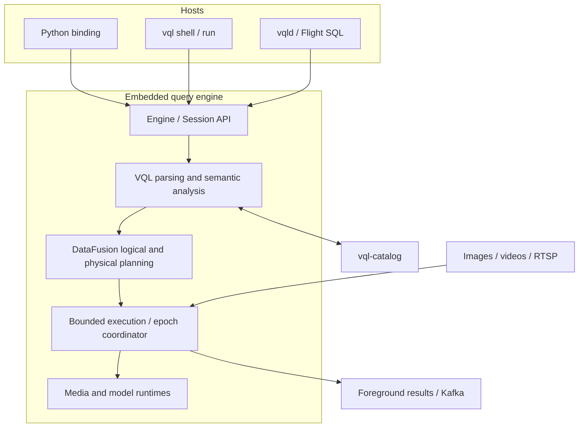

# VisionQL High-Level Design

> This document turns the [VisionQL PRD](./prd.md) into the system boundaries shared by every component. Detailed contracts live in the [Kernel](./design/kernel.md), [Catalog](./design/catalog.md), [`vqld` service](./design/vqld.md), [Workbench](./design/workbench.md), [Error codes](./design/error_codes.md), [CLI](./design/cli.md), [Python binding](./design/python_binding.md), and [Testing](./design/testing.md) designs.

## Scope

VisionQL's v0.1 architecture is an embedded visual-query engine for local image and video directories, live RTSP streams, SQL model inference, event-time `TUMBLE` windows, Kafka output, and CLI and Python hosts. The v0.2 architecture adds the implemented single-node [`vqld` network host](./design/vqld.md), Flight SQL Sessions, and Catalog-backed persistent Queries. The [Roadmap](../ROADMAP.md) is the source of truth for release scope; [proposals](./proposals/README.md) define later capabilities.

The architecture has five goals:

1. Bounded and unbounded inputs share SQL, Catalog, type, and DataFusion logical-plan semantics.
2. `IMAGE` moves through columnar plans without repeated decoded-pixel copies.
3. Model calls remain visible to the optimizer and scheduler.
4. Filtering, asynchronous inference, and row-level failure cannot lose event-time progress, window state, or source progress.
5. The kernel remains independent of its host process and can be embedded by CLI, Python, and `vqld`.

The embedded v0.1 design excludes persistent Query objects, restart recovery, cross-query decode sharing, model-result caching, multi-user security, and a network service. It also does not fork DataFusion, build a general SQL engine or video storage format, or force bounded and continuous statements to share physical operators. Syntax assigned to a later release may parse, but it must fail with `FEATURE_NOT_AVAILABLE`, identify the target release or state that it is unscheduled, and create no Catalog object.

## Naming Convention

`VisionQL` is the product name, while `vql` is the canonical engine namespace. Engine-owned machine identifiers use `vql` or `VQL`, including CLI and daemon names, Rust crates, environment variables, SQL settings and built-ins, Catalog namespaces, Arrow extension names and metadata, Unity Catalog properties, model-artifact metadata, protocol packages, and media locators. Configuration-file sections use domain names without a redundant product prefix.

The Python distribution and import name remain `visionql`, and repository URLs and other product-level identifiers use the full product name. Product prose uses `VisionQL`; it does not introduce lowercase `visionql` as a second engine namespace.

## Terminology

| Term | Definition |
|---|---|
| Bounded statement | A statement whose input ends and can be evaluated by an ordinary DataFusion physical plan |
| Continuous statement | A long-running statement with at least one unbounded source |
| Epoch | A bounded interval of source batches plus its watermark, source progress, and resource lease |
| Data fragment | The bounded DataFusion plan executed for one epoch; it contains no control messages |
| Epoch coordinator | The kernel component that sequences epochs, window state, cancellation, and sink acknowledgements |
| Media reference | Logical coordinates for an image or video frame without decoded pixels |
| Frame buffer | Decoded frames valid only within one process and one epoch |
| Definition snapshot | Immutable Catalog definitions and resolved execution specifications captured during planning |

## System Context



The CLI, Python binding, and `vqld` service are hosts. They load configuration, build an `Engine`, create Sessions, present results, and own process-specific lifecycle. They do not implement SQL semantics.

`vql-kernel` owns planning and execution. `vql-catalog` owns persisted definitions and immutable definition snapshots and, in v0.2, persistent Query objects and mutable Query status. The kernel depends on the Catalog; the Catalog does not depend on execution, media, model, CLI, or Python code.

## Core Invariants

### One logical query model

Both bounded and continuous statements produce one DataFusion `LogicalPlan`. Bounded statements compile once and run to completion. Continuous statements retain the logical template and execute one bounded fragment per source epoch.

DataFusion `ExecutionPlan::execute` yields only `RecordBatch`. Watermarks, source progress, and frame leases therefore stay in the epoch control plane rather than being encoded as rows that relational operators could remove.

### References before pixels

`IMAGE` uses a standard Arrow `Struct` with VisionQL extension metadata. A value is normally a media reference; decoded pixels live only in bounded frame or tensor buffers. Process boundaries receive encoded media, never process-local buffer identifiers.

### Typed, optimizer-visible inference

A Model is a callable Catalog object whose immutable interface comes from a capability preset or an explicit tensor signature. Planning binds the call target and version from one definition snapshot, then extracts the typed marker into an explicit inference extension node. The v0.1 release-managed AI surface is task-shaped: `VQL_CLASSIFY` performs whole-input judgment, `VQL_EXTRACT` derives a typed named-field result from a constant request map, and `VQL_DETECT` discovers localized instances. The executable IMAGE overloads bind kernel-owned YOLO26n ImageNet classification and COCO detection identities through the same inference node; unbacked IMAGE or STRING overloads return `FEATURE_NOT_AVAILABLE`. Runtime-specific introspection, loading, batching, and device behavior remain behind kernel registries.

### Immutable definitions during execution

Planning captures one Catalog definition snapshot. Changing a Table, Model default/version aggregate, or Function affects newly planned statements but does not change a running statement. Model versions are immutable once resolved; publishing is the explicit default-version pointer. For a persistent v0.2 Query, the Catalog stores normalized SQL, semantic settings, and the snapshot's opaque definition generations; `vqld` owns its controller and reconstructs execution from those generations after restart.

### Bounded resources and honest delivery

Every media, inference, window, and table-write buffer is bounded and charged to the Session resource budget. RTSP is non-replayable and best-effort. Replayable-source progress advances only after state updates and sink acknowledgements complete.

### Row isolation and Arrow interoperability

A row-level decode or inference failure preserves the input row and writes NULL to the affected result unless strict mode is enabled. Stable codes expose hard failures without requiring error-string matching.

Multimodal values use standard Arrow storage with extension metadata. An unaware Arrow client can still read the storage type, while process-local frame references never cross a language, process, persistence, or network boundary.

### Extension boundaries

Capability presets, generic inference contracts, PreProcessors, Runtimes, PostProcessors, Table providers, and logical extension nodes are registered behind narrow kernel interfaces. Models and Functions share one callable namespace while retaining distinct lifecycle kinds; Tables remain separate. Unsupported syntax and configuration fail explicitly; parameters the implementation does not consume are rejected rather than stored silently.

Engine construction performs no model I/O. Model declarations retain the explicit `RESOLVE MODEL` boundary before planning can bind them.

Optimization follows the same order across providers: prune columns and time ranges, apply explicit sampling, eliminate identical immutable inference calls, batch remaining inference, then specialize for hardware.

## Component Boundaries

| Component | Owns | Does not own |
|---|---|---|
| CLI | Command parsing, terminal input, script execution, rendering, process signals | SQL semantics, metrics policy, engine settings |
| Python binding | PyO3 API, PyArrow conversion, Python UDF host | Query planning, DataFrame-specific execution semantics |
| `Engine` / `Session` | Assembly, SQL entry point, query handles, cancellation, Session resources | Process signals, ports, user authentication |
| VQL front end | Script splitting, VQL DDL, syntax normalization, logical-plan construction | Model download, video probing, connector I/O during planning |
| Planner | Definition snapshots, type checks, inference extraction, pushdown, streamability validation | Model loading, GPU placement |
| DataFusion executor | Bounded relational fragments | Watermarks, source progress, restart recovery |
| Epoch coordinator | Ordered epochs, watermarks, window state, cancellation, sink acknowledgement | SQL expression semantics |
| Media runtime | Probe, read, decode, sample, frame buffers, encode | Model pre- or post-processing |
| Model runtime | Artifact resolution, compiled pipelines, bounded scheduling, inference | SQL or Catalog authorization semantics |
| Catalog | Definition and persistent Query objects, namespaces, provider capabilities, transactions, snapshots, Query status CAS, persistence, and UC wire translation | Query execution or lifecycle transition policy, media bytes, model weights, credentials |
| `vql-server` / `vqld` (v0.2) | Flight hosting, one-principal service security, logical Sessions, execution registry, persistent Query controller, restart orchestration, health, and aggregate metrics | SQL semantics, direct backend access, copied Catalog definitions, window checkpoints, embedded runtime behavior |
| Testing | Real-fixture scenarios and external-service system tests | Owner-module invariants that can be proved locally |

## Batch and Streaming Paths

| Stage | Bounded statement | Continuous statement |
|---|---|---|
| Parse and analyze | VQL AST, definition snapshot, DataFusion `LogicalPlan` | Same |
| Optimize | Pruning, inference extraction, sampling pushdown | Same, plus unbounded-plan allowlist validation |
| Compile | One complete physical plan | Rebind each epoch to the logical template and build a fresh bounded physical plan |
| Control state | Completion follows end of input | Coordinator carries watermark, progress, and leases outside `RecordBatch` |
| Termination | All partitions end | Graceful stop, immediate cancellation, or unrecoverable failure |

## Workspace and Dependency Direction

```text
visionql/
├── vql-catalog/                  # catalog domain, Query persistence, snapshots, backends, UC API
├── vql-kernel/                   # planning, execution, media, models, connectors
├── vql-cli/                      # shell and script host
├── vql-python/                   # PyO3 and Python UDF host
├── vql-server/                   # Flight SQL, Sessions, persistent Query control, health
├── vql-testing/                  # integration-test targets; no library
└── docs/
```

```text
vql-cli ─────┐
vql-python ──┼──→ vql-kernel ──→ vql-catalog
vql-server ──┤
vql-testing ─┘
```

Boundary rules:

- `vql-kernel` cannot depend on PyO3, clap, or Flight and listens on no port.
- `vql-catalog` cannot depend on DataFusion, media/model runtimes, Kafka, PyO3, Flight, or CLI behavior.
- CLI and Python depend only on public kernel host interfaces; DataFusion types do not leak into their public APIs.
- Breaking DataFusion or Arrow changes remain behind the kernel boundary and require focused planning, epoch, schema, and wire-format regression tests.
- `vql-server` is the v0.2 workspace crate defined by the [`vqld` Service Design](./design/vqld.md). It depends on public kernel and Catalog APIs and owns no SQL or provider semantics. Workbench is a planned v0.3 independent client defined by the [Workbench Design](./design/workbench.md) and uses only public service protocols.

## Architecture Decisions

| Decision | Rationale |
|---|---|
| Rust + Arrow + DataFusion | Supports typed inference, columnar execution, Python interoperability, and extension points. |
| One logical plan with bounded or epoch execution | Preserves shared SQL semantics without forcing control messages through `RecordBatch`. |
| Epoch-scoped frame leases | Frame lifetime does not depend on whether rows survive filtering. |
| Standard Arrow storage for multimodal values | Preserves ecosystem readability while keeping process-local state private. |
| Model names as direct call targets and explicit inference nodes | Keeps identity out of row data while enabling type checking, per-version deduplication, batching, and cancellation. |
| Named immutable Model versions and an explicit default pointer | Makes publishing, rollback, snapshot pinning, and A/B calls visible and atomic. |
| One callable namespace for Models and Functions | Makes collisions deterministic at DDL commit while preserving kind-specific lifecycle. |
| One immutable definition snapshot per planned statement | Prevents concurrent DDL from changing a running result. |
| SQLite behind `CatalogBackend` | Preserves zero-service startup without coupling the domain to one backend. |
| Catalog-backed persistent Query objects | Gives submitted queries one durable identity and atomic definition-generation dependencies while leaving execution and lifecycle policy in `vqld`. |
| In-memory allowlisted `TUMBLE` state | Gives attached execution bounded state without defining a recovery ABI. |
| Delivery follows source replayability | Avoids guarantees that live RTSP input cannot satisfy. |

## Detailed Designs

| Document | Contract |
|---|---|
| [Kernel](./design/kernel.md) | Planning, streaming, types, providers, inference, resources, and security |
| [Catalog](./design/catalog.md) | Namespaces, definition and persistent Query objects, provider capabilities, snapshots, backend, and UC API |
| [`vqld` service](./design/vqld.md) | Flight SQL, Sessions, Catalog-backed persistent Queries, one-principal security, and honest restart-from-live behavior |
| [Workbench](./design/workbench.md) | v0.3 browser client, bounded visual results, public-protocol boundary, and deferred capabilities |
| [Error codes](./design/error_codes.md) | Stable identifiers, symbols, host representation, and extension rules |
| [CLI](./design/cli.md) | `shell` and `run`, terminal behavior, rendering, and signals |
| [Python binding](./design/python_binding.md) | PyO3 API, PyArrow results, and Python UDF execution |
| [Testing](./design/testing.md) | Test ownership, fixtures, and external-service scenarios |

## References

- [Apache DataFusion: Custom Table Providers](https://datafusion.apache.org/library-user-guide/custom-table-providers.html)
- [Apache DataFusion: ExecutionPlan API](https://docs.rs/datafusion/latest/datafusion/physical_plan/trait.ExecutionPlan.html)
- [Apache Arrow: Extension Types and Columnar Format](https://arrow.apache.org/docs/format/Columnar.html#extension-types)
