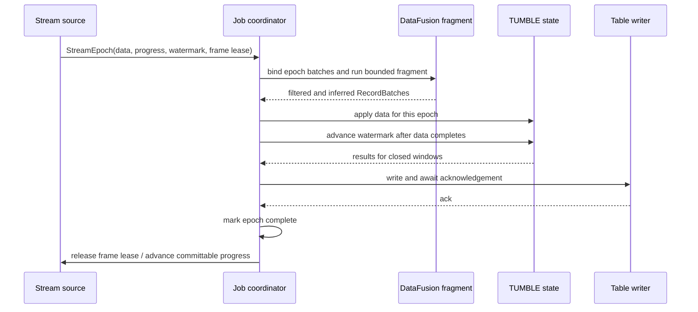

# VisionQL v0.1 Kernel Design

> This document defines the `vql-kernel` planning and execution contracts. System boundaries are defined by the [High-Level Design](./high_level_design.md); Catalog persistence, host behavior, and verification policy are defined by their dedicated design documents.

## Kernel Boundary

`vql-kernel` exposes `Engine`, `Session`, configuration, statements, query results, cancellation, metrics, and host-injection traits. It owns no process signals, terminal behavior, PyO3 objects, network listeners, or global singleton state.

The host supplies `EngineConfig`, a secret provider, and an optional Python UDF host. The kernel owns the SQL entry point and all semantics below it.

## Logical Planning and Physical Compilation

### DataFusion Logical Plan and VQL Metadata

Standard relational work uses DataFusion `LogicalPlan` nodes. VisionQL adds an extension node only when model inference or a provider-specific table write cannot be represented faithfully by a standard node.

| Extension node | Logical behavior | Physical implementation |
|---|---|---|
| `Inference` | Append a model result column to an input relation | [`InferenceExec`](#inferenceexec-scheduling-and-failure) |
| `SinkWrite` | Internal write node for a writable Catalog Table | `SinkExec` or streaming Kafka writer |

A video table expands into frames inside the `USING VIDEOS` scan at the fps declared by the table. It is not a separate logical node or table-valued function.

`TUMBLE` is a VisionQL time-bucket UDF represented as an ordinary scalar expression plus a DataFusion `Aggregate`. For a continuous query, planning extracts the aggregate's inputs and output template into a side `TumblePlan`; it does not add a `TumbleAggregate` extension node.

The planned statement keeps the DataFusion plan together with only the metadata required by attached execution:

```text
PlannedStatement {
  dataframe: DataFrame,
  source_table: Option<{ name, skip, fetch }>,
  tumble: Option<TumblePlan>,
}
```

### Planning Pipeline

```text
SQL
  → syntax normalization
  → one Catalog definition snapshot
  → name, type, Function, and Model resolution
  → DataFusion LogicalPlan
  → inference extraction and common-expression elimination
  → column, predicate, and explicit-sampling pushdown
  → streamability validation
  → optional unbounded-source and TumblePlan metadata
  → bounded execution or attached epoch execution
```

Planning reads only the Catalog and lightweight metadata. Object listing, model download, service metadata validation, video probing, and network connection never happen implicitly during planning: model materialization belongs exclusively to `RESOLVE MODEL`, while ordinary execution opens only the already-resolved binding. `EXPLAIN` and completion cannot trigger expensive I/O.

### Immutable Query Definition Snapshot

Planning opens one Catalog transaction and constructs a `DefinitionSnapshot` containing the current Tables, Models, and Functions in `vql.default`. RTSP and Kafka definitions are Tables with provider capabilities. A query-specific DataFusion session is populated from that snapshot. Resolved Model specifications are copied into `Inference` nodes, while selected provider configurations are copied into the attached result handle or internal write target.

The planned `DataFrame` and those copied specifications are the v0.1 execution source of truth. Replacing or dropping a Catalog definition affects newly planned queries but does not replan a running query. Internal table generations remain available for media locators, but v0.1 has no public revision lifecycle, durable query identity, Manifest store, lease manager, or Manifest garbage collector.

The durable, serializable Query Manifest required by submitted jobs and restart recovery belongs to the [v0.2 `vqld` proposal](./proposals/2026-08-06-vqld-service.md). It is not a prerequisite for foreground embedded execution.

### Allowlist for Unbounded Plans

VisionQL validates unbounded plans against an allowlist instead of assuming an arbitrary DataFusion plan can run forever.

Allowed shapes:

- one RTSP provider table;
- Projection, Filter, `UNNEST`, built-in scalar functions, and `Inference`;
- at most one `TUMBLE` aggregate;
- a stateless SELECT preview or one Kafka table write;
- Projection, Filter, and one table write after the window.

Rejected shapes:

| Plan shape | Why it is unsafe | Suggested rewrite |
|---|---|---|
| Global or grouped aggregate without a window | Input never ends | Add `TUMBLE` |
| Unbounded `ORDER BY` / TopK | Requires unbounded state or end-of-input | Bound it by a window or use a batch query |
| Unbounded `DISTINCT` | State cannot be reclaimed | Use an allowlisted aggregate or a batch query |
| JOIN or multi-source UNION | Multi-source watermark and consistency are undefined here | Split into independent queries |
| `OVER` analytic window | No bounded-state rule exists | Use a time-window aggregate |
| Aggregate or UDAF outside the streaming allowlist | Bounded memory and media lifetime cannot be guaranteed | Choose a supported aggregate or batch execution |

[`TUMBLE` State](#tumble-state) defines the aggregate and type allowlist. A validation error must identify the first unsupported node or aggregate, point to its SQL fragment, and offer a viable rewrite; a raw DataFusion error is not sufficient.

---

## Epoch-Based Streaming

### Why Epochs

Streaming input enters the engine as short micro-batches. The v0.1 RTSP source closes an epoch when its event-time span reaches 200 ms or it contains 64 sampled rows, whichever happens first. An epoch carries data and control state separately:

```rust
struct StreamEpoch {
    epoch_id: u64,
    batches: Vec<RecordBatch>,
    source_progress: SourceProgress,
    watermark: Option<Timestamp>,
    frame_lease: Option<FrameBufferLease>,
}
```

`batches` may be empty. None of the other fields is encoded as a hidden row, so a Filter that removes every row still cannot stall source progress, watermarks, or frame-buffer reclamation.

### Epoch Execution Order



The sequence is strict:

1. Epochs from one source are applied serially by `epoch_id`; decode, preprocessing, and inference may still run in parallel within the data fragment.
2. The coordinator passes a watermark to stateful operators only after every output for that epoch has completed.
3. An epoch completes only after state updates and all newly closed-window writes have been acknowledged by the Table writer.
4. Cancellation stops the active DataFusion stream, model requests, and Table writes before releasing the frame lease.
5. This design has one source and one partition, so it does not merge watermark frontiers.

The coordinator retains the planned DataFusion logical template, not a compiled `ExecutionPlan` or a separate epoch-plan abstraction. For each epoch it:

1. replaces the stream `TableScan` with a single-partition `MemTable` containing that epoch's batches;
2. calls DataFusion execution on the rebound `DataFrame`, which builds a fresh physical tree;
3. drains the bounded fragment before advancing the watermark;
4. for `TUMBLE`, applies projected aggregate inputs to process-local `TumbleState`, then binds closed-window rows into the planned output template;
5. waits for output or writable-table acknowledgement before releasing the frame lease.

Stateful window data and the epoch control plane remain outside DataFusion. No `EpochPlanTemplate`, `EpochInputExec`, `reset_state`, or physical-plan reuse API is required in v0.1.

### Backpressure and Frame Loss

Backpressure travels upstream from `Table writer → state → data fragment → source buffer`. Every buffer has a hard capacity.

- Replayable sources wait when capacity is unavailable.
- When the RTSP source-to-coordinator queue is full, sampled frames that have not entered an epoch may be dropped and recorded as `source_overrun` with their count and range.
- Once a row enters an epoch, overload cannot discard it silently. Exhausting the budget fails the query.
- Downstream bounded queues propagate backpressure rather than inventing additional drop policies.

### `TUMBLE` State

In streaming mode, `TumbleState` stores process-local scalar and Arrow-compatible state rather than retaining DataFusion `Accumulator` instances:

```text
key = (window_start, group_key)
value = aggregate_states
```

- Windows are `[start, end)`. Time is UTC milliseconds anchored at the Unix epoch.
- The interval is a positive fixed duration; calendar intervals are unsupported. Event time on an unbounded query must be a non-null TIMESTAMP. A nullable column must be filtered first.
- The extracted `TumblePlan` defines aggregate inputs and output expressions. An accumulator is temporary: merge the previous process-local state, process one epoch, call `state()`, and discard it.
- Advance the watermark after data processing. Emit and delete a window when `window_end <= watermark`.
- Rows where `event_time < current_watermark` are dropped and increment the query's `late_rows` counter. `allowed_lateness` is not supported.
- Stopping a query does not emit windows that have not closed.
- State and group keys cannot contain `buffer_id` or `buffer_slot`. Convert media to a persistent locator or encoded value first. `IMAGE` and `VIDEO` are rejected by default in window state.
- Batch mode lowers `TUMBLE` to time bucketing and ordinary aggregation. Differential batch/stream tests cover NULL, grouping, overflow, and final values for each allowlisted aggregate.

v0.1 state lives only for the attached process lifetime and is not serialized or restored after restart. A versioned checkpoint/recovery ABI is defined by the [v0.2 `vqld` proposal](./proposals/2026-08-06-vqld-service.md), where durable jobs first require it.

The streaming aggregate allowlist is:

- `COUNT`, `SUM`, `AVG`, `MIN`, and `MAX` over persistable scalar Arrow inputs and group keys;
- no `DISTINCT`, `ARRAY_AGG`, `STRING_AGG`, approximate aggregates, ordered aggregates, UDAFs, or aggregation over `IMAGE`, `VIDEO`, Binary, or complex values containing process-local media slots.

---

## Multimodal Types and Media Lifetime

### Arrow Representation

VQL logical types use standard Arrow storage and field metadata.

| VQL type | Arrow storage type | Contract |
|---|---|---|
| `IMAGE` | `Struct`, defined in [Three `IMAGE` Payload Forms](#three-image-payload-forms) | `ARROW:extension:name=visionql.image` |
| `VIDEO` | `Struct<uri, locator, duration_ns, fps, width, height, codec>` | `uri` is display-only; `locator` is used for reauthorized reads; a full video is never inlined |
| `BOX2D` | `Struct<x: Float32, y: Float32, w: Float32, h: Float32>` | Top-left origin and normalized `[0,1]` coordinates |
| `POINT2D` | `Struct<x: Float32, y: Float32>` | Internal logical type for spatial functions |
| `POLYGON` | `List<POINT2D>` | Normalized two-dimensional polygons only |
| Detection result | `List<Struct<label: Utf8, confidence: Float32, box: BOX2D>>` | One list per frame; `UNNEST` produces rows |
| `AUDIO` / `MASK` | Reserved logical types | Registration and execution return an unsupported-feature error |

Every `IMAGE` field carries `ARROW:extension:name=visionql.image` and `ARROW:extension:metadata={"version":1}`. An unaware client still sees a standard Arrow Struct.

### Three `IMAGE` Payload Forms

```text
IMAGE storage := Struct {
  uri: Utf8?,                 # sanitized, display-only; never used to read or authorize
  locator: Utf8?,             # versioned vql:// media locator
  pts_ms: Int64?,             # frame time within a video; NULL for an image
  frame_id: UInt64?,          # frame identity in a live ring buffer
  encoded: Binary?,           # JPEG/PNG or thumbnail bytes
  encoding: Utf8?,
  width: Int32?,
  height: Int32?,
  buffer_id: UInt64?,         # process-local only
  buffer_slot: UInt32?        # process-local only
}
```

| Form | Valid fields | Where it is used |
|---|---|---|
| Reference | `uri`, `locator`, `pts_ms`, metadata; `locator` is non-null | Table scans, video expansion, and most operator boundaries |
| Frame buffer | `buffer_id`, `buffer_slot`, metadata | Within one epoch, between decoding and pixel consumers |
| Encoded | `encoded`, `encoding`, metadata | Python and other process boundaries, including explicit Kafka output |

Invariants:

1. `buffer_id` and `buffer_slot` never cross a process boundary, reach persistent storage, or enter the Catalog.
2. `uri` is sanitized and display-only. It may be logged or exported but is never used by the runtime to read media.
3. `locator` is an opaque `vql://media/v1/...` value bound to a source revision and frame coordinates. Resolution accepts only registered sources and reauthorizes as the current caller.
4. A live RTSP frame is not replayable and has no durable `locator`. Encode or persist it before later retrieval.
5. Field metadata distinguishes original encoded bytes from thumbnail bytes.

### Epoch Frame Buffer

Sampled RTSP frames enter the current epoch's `FrameBuffer`; the RecordBatch carries only the slot. The coordinator releases `FrameBufferLease` only after the data fragment, state handling, and egress encoding have all completed.

The lease is independent of row survival:

- filtering one row or the whole batch does not leak a frame;
- asynchronous inference retains the lease until it completes;
- cancellation stops consumers before releasing the epoch;
- frame-buffer references never survive into another epoch or a window state.

Batch video normally fuses read, decode, and preprocessing inside `InferenceExec`. A short-lived frame buffer is needed only when several pixel consumers share one frame.

### NULL and Row-Level Failure

- Decode failure leaves the media reference and metadata intact, but any pixel-dependent result is NULL.
- Inference failure makes the model result NULL while preserving input columns.
- `SET vql.on_error = 'fail'` terminates on the first row-level failure.

---

## SQL, Models, and Functions

### Parser Boundary

VQL reuses the sqlparser-rs tokenizer and DataFusion SQL AST, with a dedicated parser only for VisionQL extensions:

1. Split a complete script while respecting strings, comments, and quoted identifiers.
2. Send provider-table DDL, `CREATE MODEL`, `RESOLVE MODEL`, and VisionQL operational statements to the VQL DDL parser.
3. Send SELECT, INSERT, standard DDL, and `CREATE FUNCTION` through the DataFusion-supported grammar. A VisionQL `FunctionFactory` validates and persists supported Function definitions.
4. Normalize constructs such as `.center`, `TUMBLE`, and typed inference markers at the AST or logical-plan layer.
5. Pass normalized relational expressions to the DataFusion planner interface.

Extension statements cannot rely only on a `Dialect` hook; the VQL parser needs golden tests. Catalog object names in VQL extension statements are case-insensitive and normalize to lowercase even when quoted. Other relational identifiers follow DataFusion SQL rules: unquoted identifiers fold to lowercase, double-quoted identifiers preserve case, and string literals use single quotes.

| Statement | Behavior |
|---|---|
| `CREATE TABLE ... USING IMAGES/VIDEOS/RTSP` | Create a readable provider table as defined by [Table Providers](#table-providers) |
| `CREATE TABLE ... USING KAFKA` | Create a writable Kafka table as defined by [Kafka Table](#kafka-table) |
| `CREATE MODEL ... TYPE ... FROM ... USING ... WITH (...)` | Store one unresolved typed Model declaration without network I/O |
| `RESOLVE MODEL <name>` | Download/cache an artifact or validate a service and persist its resolved execution contract |
| `CREATE FUNCTION ... RETURN <expression>` | Create a DataFusion-backed SQL expression function |
| `CREATE FUNCTION ... LANGUAGE PYTHON AS 'module:function'` | Create a batched Python function; executable only from a Python host |

`DROP`, `SHOW`, `DESCRIBE`, and `SHOW CREATE` use the same VQL DDL path. `SHOW CREATE` must be sanitized and parseable. Statements outside the [v0.1 scope](./high_level_design.md#scope) fail without registering placeholders.


### Typed Model Contract

A MODEL is one typed inference capability backed by an artifact bundle or endpoint. `TYPE` is the sole authority for its built-in SQL function, domain input, semantic arguments, and canonical Arrow result. There is no generic CV or LLM type.

| Model `TYPE` | Built-in function | Domain input | Canonical result | Availability |
|---|---|---|---|---|
| `OBJECT_DETECTION` | `IMAGE_DETECTION` | `IMAGE` | `ARRAY<STRUCT<label STRING, confidence FLOAT, box BOX2D>>` | v0.1 |
| `IMAGE_CLASSIFICATION` | `IMAGE_CLASSIFICATION` | `IMAGE` | `ARRAY<STRUCT<label STRING, score FLOAT>>` | Roadmap-gated |
| `IMAGE_EMBEDDING(n)` | `IMAGE_EMBEDDING` | `IMAGE` | `VECTOR(n)` | v0.3 |
| `TEXT_EMBEDDING(n)` | `TEXT_EMBEDDING` | `STRING` | `VECTOR(n)` | v0.3 |
| `TEXT_GENERATION` | `TEXT_GENERATION` | `STRING` | `STRING` | Roadmap-gated |

One source bundle may be registered under multiple compatible capability types. For example, CLIP image and text embedding are two Models with different fixed interfaces; artifact-cache or Runtime-session reuse is an internal optimization.

Required inference arguments are positional: the Model name comes first, followed by the Model type's domain inputs. Optional semantic arguments use DataFusion's `=>` named-argument notation and must follow every positional argument:

```sql
SELECT IMAGE_DETECTION(
  'yolo',
  image,
  classes => ['person'],
  min_confidence => 0.5
)
FROM photos;
```

Planning enforces these rules:

- The first positional argument is a non-NULL Model-name string literal resolved in the current Catalog transaction. Its resolved specification is copied into the `Inference` node and never enters an Arrow batch or Runtime request. Prepared parameters, expressions, column references, and per-row Model selection are rejected in v0.1.
- Remaining required positional arguments are type-owned domain inputs such as `image` or `prompt` and may be arbitrary row expressions.
- Optional type-owned semantic arguments such as `classes`, thresholds, and generation controls use `name => constant` notation after all positional arguments. The VQL normalizer binds them against the type-owned schema, fills omitted defaults, and emits a fully ordered marker before DataFusion type planning.
- The built-in function, Model type, domain argument types, and canonical output must match exactly. Unknown or duplicate arguments fail planning.
- Built-in inference functions are typed planner markers. Planning must extract them into `Inference`; their scalar execution method fails defensively if an unextracted call reaches execution.

Model declarations use one Runtime-owned option schema:

```text
CREATE MODEL identifier
  TYPE model_type
  FROM string_literal
  USING runtime_identifier
  [WITH (runtime_option ('=' constant_value) [, ...])]
```

`USING` is the only public Runtime selector. SQL identifiers such as `ONNX_RUNTIME` and `TRITON_INFERENCE_SERVER` normalize to internal registry IDs `onnx-runtime` and `triton-inference-server`. `WITH` is not a global Model schema: the selected Runtime deserializes the complete map with unknown fields denied. `ONNX_RUNTIME` owns `sha256`, `input={...}`, and `output={...}`. `TRITON_INFERENCE_SERVER` owns `model` and optional immutable `version`. No public `runtime.*`, `pre_processor.*`, `post_processor.*`, Profile, or Adapter layer exists.

`CREATE MODEL` is deliberately fast. It validates only facts available locally—the `TYPE`/Runtime pairing, source shape, option schema, and embedded processor options—and commits an unresolved definition without downloading or contacting a service. `RESOLVE MODEL` is the explicit potentially slow operation. For an embedded artifact it resolves the source, streams remote bytes to a temporary file, checks cancellation and checksum while downloading, atomically installs a content-addressed cache entry, and persists the resolved path/hash. For a service it contacts the endpoint, validates the typed service contract, and persists the binding. A query cannot plan against an unresolved Model.

Re-running `RESOLVE MODEL` refreshes the resolved revision. Pinned artifacts and versioned services have stable semantic fingerprints. An unversioned service is `volatile`; it cannot be constant-lifted, deduplicated, or cached as if immutable.

Device selection, queue capacity, batch size, maximum wait, request concurrency, timeouts, and credentials are not Model semantics. They remain scheduler configuration or secret-provider state. Public Profiles, Adapters, Model revisions, and Deployment objects are deliberately absent.

The declaration fingerprint includes Model type, raw source, selected Runtime, and Runtime-owned options. The resolved semantic fingerprint additionally includes resolved source/hash, execution mode, internal embedded processor specifications or service protocol binding, and determinism. Scheduler configuration does not enter semantic identity.

### User-defined Functions and DataFusion Reuse

`CREATE FUNCTION` supports only genuine user-defined computation:

| Syntax | Planning and execution |
|---|---|
| `CREATE FUNCTION ... RETURN <expression>` | Persist a normalized SQL expression function and expand it hygienically during planning with a recursion-depth check |
| `CREATE FUNCTION ... LANGUAGE PYTHON AS 'module:function'` | Persist a batched Arrow ABI; executable only from a Python host |

The statement router uses DataFusion's PostgreSQL-style function grammar, `CreateFunction` representation, named-argument support, and UDF registry. A VisionQL `FunctionFactory` validates the supported language or body, constructs the UDF, and persists the normalized definition. Planning recreates equivalent DataFusion UDFs from the definition snapshot, so session-local registration is never durable state.

Python functions require an explicit `RETURNS` type. SQL expression functions may omit it when DataFusion can derive the body type from positional parameter types and registered built-ins. This permits a compact inference preset such as `CREATE FUNCTION detect_people(IMAGE) RETURN IMAGE_DETECTION('yolo', $1, classes => ['person'])`; macro expansion still exposes the typed inference marker to the planner.

A Python UDF receives one `pyarrow.Array` per argument and returns an equal-length, type-compatible `pyarrow.Array`. `IMAGE` crosses the language boundary in encoded form; the SDK supplies batch decode helpers. Row-at-a-time callbacks are not supported.

Model inference does not use `FunctionFactory`, `ScalarUDF`, or `AsyncUDF`. A SQL expression function may wrap a typed inference call to provide a reusable name or constant-argument preset; after expansion, the call still becomes an explicit `Inference` node.

### Syntax Normalization

| VQL form | Normalized plan form |
|---|---|
| `box.center` | `BOX_CENTER(box)` |
| `TUMBLE(ts, interval)` | VisionQL time-bucket scalar expression and DataFusion Aggregate; continuous planning also extracts a side `TumblePlan` |
| `FROM t, UNNEST(expr)` | Native DataFusion unnest node; the only row-expansion mechanism |
| `CREATE ...` | Catalog or runtime operation, absent from the relational plan |

Inference-call parameters such as `classes` and `min_confidence` are owned by the Model type and filter elements within one detection result. They are not processor DDL options and are not converted into a row-level Filter that could discard the frame.

### Built-in Functions

Typed-inference function names are reserved case-insensitively from v0.1, including Roadmap-gated markers; `CREATE FUNCTION` cannot redefine them.

| Function | Signature | Contract |
|---|---|---|
| `IMAGE_DETECTION` | `(model STRING, image IMAGE [, named options])` → canonical detection array | v0.1 typed planner marker; the first argument resolves to an `OBJECT_DETECTION` Model and the call must become `Inference` |
| `IMAGE_CLASSIFICATION` | `(model STRING, image IMAGE [, named options])` → canonical classification array | Roadmap-gated typed planner marker |
| `IMAGE_EMBEDDING` / `TEXT_EMBEDDING` | `(model STRING, IMAGE)` / `(model STRING, STRING)` → `VECTOR(n)` | v0.3 typed planner markers; dimension comes from Model `TYPE` |
| `TEXT_GENERATION` | `(model STRING, prompt STRING [, named options])` → `STRING` | Roadmap-gated bounded final-text marker |
| `BOX_CENTER` | `(BOX2D) -> POINT2D` | Function form of `box.center` |
| `POLYGON` / `ST_POLYGON` | `(STRING) -> POLYGON` | Parse constants during planning; require closure, finite values, and `[0,1]` coordinates |
| `ST_CONTAINS` | `(POLYGON, POINT2D) -> BOOLEAN` | Boundary points count as contained |

VisionQL built-ins use SQL NULL propagation.

---

## Table Providers

Data ingress and egress use narrow connector traits: readable providers scan Tables and writable providers accept rows.

### Minimum Schemas

| Source | Minimum columns |
|---|---|
| IMAGES | `uri STRING, image IMAGE, width INT, height INT, captured_at TIMESTAMP` |
| VIDEOS frame table | `uri STRING, ts TIMESTAMP, pts_ms BIGINT, frame_id BIGINT, frame IMAGE, duration DOUBLE, fps DOUBLE, width INT, height INT, codec STRING` |
| RTSP Table | `ts TIMESTAMP NOT NULL, frame IMAGE, frame_id BIGINT, source STRING` |

Unreadable optional metadata becomes NULL. `uri`, media values, and RTSP `ts/frame_id/source` are non-null. Provider options may append partition columns but cannot change the meaning of base columns.

### Image and Video Directory Tables

`CREATE TABLE ... USING IMAGES/VIDEOS` registers a local directory as an external table. An image contributes one row; a video is expanded into frame rows inside the scan at the table's fps.

Provider behavior:

- Both providers implement `TableProvider`. Planning returns schema and statistics; listing and reading begin in `execute()`.
- Canonicalize and validate the local directory and `recursive` option at DDL time. Listing and reading occur during execution through the local `object_store` provider.
- `uri`, size, and modification time come from local listing. Probe dimensions, duration, and codec only when projected.
- `IMAGE` and `frame` leave the scan as references; scanning never decodes pixels.

Video expansion rules:

- The scan emits `uri`, `ts`, `pts_ms`, `frame_id`, reference-form `frame`, and file constants such as `duration`.
- A different sample rate requires another logical table over the same directory; no media is copied.
- `fps` is an explicit semantic target. Sampling uses PTS, not frame ordinal, and therefore supports variable frame rate.
- `pts_ms` is relative media time; `ts` is event time. Prefer trusted `start_time + pts`, then a table-level `start_time`. If neither exists, synthesize from the Unix epoch and mark `synthetic_event_time`.
- Push a time predicate into `time_range` and seek near that range when the container supports it.
- The media runtime chooses sequential decode or sparse seek from sample ratio, GOP, and storage capability. Sparse-seek throughput is not a promise until validated by a PoC.
- A metadata-only query creates frame coordinates but does not read pixels.

### RTSP Table

`CREATE TABLE ... USING RTSP OPTIONS (...)` creates one readable, unbounded Table. RTSP is non-replayable, so delivery is best-effort; frames lost to a crash, drop, or pause cannot be recovered. The UC boundary reports it as an `EXTERNAL` table with explicit VisionQL capability properties, not as a UC-managed `STREAMING_TABLE`.

Ingestion:

- FFmpeg demux and decode run on controlled worker threads, away from the async executor.
- Prefer TCP interleaved transport; allow UDP by configuration.
- Inter-frame codecs normally require decode at the source frame rate before sampling. `fps=5` reduces frame-buffer, preprocessing, and inference work, not necessarily decode work.
- Sampled frames enter the current epoch frame buffer. A row or time threshold closes the epoch.

Event time and reconnect behavior:

- At job start, pair UTC time with a monotonic clock in `IngestClock`; derive later ingest time from monotonic elapsed time so reconnects and wall-clock rollback cannot move it backward.
- Every initial connection or reconnect starts a new `source_generation`. `ingest_time` uses the process-wide `IngestClock`. For `capture_time`, the first decoded PTS in a generation is anchored to that frame's ingest instant and later timestamps advance by relative PTS; v0.1 does not claim absolute camera or RTCP wall-clock time.
- Missing or backward PTS, excessive drift from the ingest clock, or a mapped timestamp behind the current watermark falls back to ingest time and increments `event_time_fallback_total` with the reason.
- Watermark is `max_seen_event_time - watermark_delay`, never decreases, and considers every source frame with a valid timestamp—not only sampled rows. Apply an epoch's watermark only after its data completes.
- Reconnect with exponential backoff from 1s to 30s. Freeze the watermark during the outage; never invent progress from local wall time.
- Reconnected ingest time preserves the real outage gap and may close windows without fabricating rows. The attached query keeps retrying until cancellation or an unrecoverable error; an outage alone does not emit the final open window.

### Kafka Table

Declare the destination independently from the query:

```sql
CREATE TABLE people_per_minute (
  window_start TIMESTAMP,
  people BIGINT
)
USING KAFKA
OPTIONS (
  bootstrap_servers = '127.0.0.1:9092',
  topic = 'people-per-minute',
  format = 'json',
  credential_ref = 'secret://kafka/producer',
  delivery_timeout_ms = 30000,
  buffer_capacity = 1024
);

INSERT INTO people_per_minute
SELECT window_start, COUNT(*) AS people
FROM detections
GROUP BY TUMBLE(ts, INTERVAL '1' MINUTE);
```

| Option | Contract |
|---|---|
| `bootstrap_servers` | Required comma-separated `host:port` endpoints (bracket IPv6 literals). URI schemes and credentials are rejected. |
| `topic` | Required existing Kafka topic; 1–249 ASCII letters, digits, `.`, `_`, or `-`, excluding `.` and `..`. VisionQL never creates or alters it. |
| `format` | Optional, defaults to `json`; v0.1 rejects every other format. |
| `credential_ref` | Optional opaque reference resolved by the host-supplied `SecretProvider` on the first write. The Catalog never stores the resolved authentication material. SASL/TLS details are supplied by the provider, not as DDL options. |
| `delivery_timeout_ms` | Optional broker connection/request/delivery deadline; defaults to 30,000 and accepts 1–3,600,000. |
| `buffer_capacity` | Optional global maximum number of in-flight row deliveries for one table-write execution, across every DataFusion partition; defaults to 1,024 and accepts 1–100,000. Reaching it stops pulling upstream until a delivery completes. |

`CREATE TABLE` only validates and stores metadata; it performs no network I/O. Planning `INSERT INTO` validates the query output against a declared schema when columns are present. Execution resolves `credential_ref` through `EngineConfig::with_secret_provider`, connects lazily, emits one Kafka record per output row with no key, uses `acks=all`, and waits for every record in a batch to be acknowledged before that batch completes. A referenced table fails before connecting when the host did not install a provider or resolution fails. The producer is closed with the configured timeout when the foreground query finishes, fails, is cancelled, or its result stream is dropped. The v0.1 attached coordinator disables producer retries and fails the query on delivery failure or timeout. A batch can therefore be partially visible after an error or cancellation, and replay can duplicate rows; transactions and exactly-once delivery are outside this contract.

The transport uses `rust-rdkafka` with a statically built `librdkafka` and vendored OpenSSL. Public host integration remains client-neutral: `SecretProvider` returns VisionQL-owned `KafkaAuthentication` and `KafkaTlsConfig` values, which the connector translates into TLS/mTLS, SASL/PLAIN, SCRAM-SHA-256/512, or static OAUTHBEARER client configuration. The producer disables automatic topic creation, idempotence, and client retries to preserve the v0.1 contract; future transactional delivery can use librdkafka without changing the public authentication boundary.

The JSON value contract is:

- Preserve query output names and order as JSON object fields; duplicate names are rejected during planning and nulls are explicit.
- Encode booleans and finite numbers as JSON scalars; encode non-finite floats as `null`. Encode temporal values as ISO-8601 strings at their Arrow precision. Lists, maps, and ordinary structs retain their JSON shape.
- Project a top-level `IMAGE` to `uri`, `locator`, `pts_ms`, `frame_id`, `encoding`, `width`, and `height`. Strip URI user information, query, and fragment. Never emit `encoded`, `buffer_id`, or `buffer_slot`.
- Reject raw binary output and nested `IMAGE` values during planning; callers must make any intended binary representation explicit as text.

These rules are fixed by exact wire-format tests. The globally bounded in-flight set propagates Kafka backpressure upstream, while cancellation interrupts connection and delivery waits. For an RTSP query, `OFFSET` and `LIMIT` are applied before the acknowledged Table write, including closed `TUMBLE` output, so rows outside the visible query result are never published.

---

## Optimizer and `EXPLAIN`

### Rule Order

| Order | Rule | Purpose |
|---|---|---|
| R1 | SQL expression-function expansion and type checking | Establish valid semantics before inference extraction |
| R2 | Resolve and extract typed inference calls; deduplicate and constant-lift only deterministic or stable-within-query calls | Make inference schedulable without changing volatile call count or order |
| R3 | Column pruning and `image_access` analysis | Avoid media reads and decode when pixels are unused |
| R4 | Time-predicate pushdown | Read only requested video intervals |
| R5 | Explicit sampling pushdown | Move Table and Stream `fps` into the media layer |
| R6 | Native DataFusion rules | Ordinary predicate, projection, constant, and relational optimization |

Window size never implies a sample rate. User-declared fps is part of result semantics.

### Extracting Inference

After expanding SQL expression functions, the planner scans Projection, Filter, and aggregate inputs for type-owned inference markers:

1. Require constant Model and semantic arguments, require a previously resolved Model, validate its typed embedded-pipeline or service contract, and copy the resolved specification into the `Inference` node.
2. Replace each marker with an internal column reference and insert `Inference` at the earliest point where every domain input exists and semantics remain unchanged.
3. Deduplicate only when the built-in operation, Model semantic fingerprint, all domain input expressions, and semantic arguments match exactly and determinism is `deterministic` or `stable_within_query`. Preserve every `volatile` call and its order.
4. Evaluate a constant-domain-input inference call, such as a text query embedding, once as a query-init expression only under the same determinism rule.
5. Never share raw Runtime output across different resolved processor contracts; only canonical, semantically identical inference results are shareable.

### `EXPLAIN`

`EXPLAIN` shows:

- bounded or continuous query mode and the DataFusion logical and physical plans;
- RTSP source fps, event-time mode, watermark delay, transport, and the epoch topology;
- resolved Model identity, Runtime kind and protocol, embedded processor kinds when applicable, batching owner, volatility, and deduplication at each inference node;
- whether decode is required and whether the inference input is a locator, encoded value, or frame-buffer reference;
- `TUMBLE`, watermark, and Table-write topology when present;
- the first unsupported continuous-plan node with a viable rewrite.

It describes work; it does not invent uncalibrated GPU-time or cost estimates.

---

## Model Runtime and Inference

### Compiled Pipeline and Interfaces

Every resolved typed call selects one of two execution modes. Embedded Runtimes use the VisionQL-owned tensor pipeline:

```text
TYPE canonical input RecordBatch
  → PreProcessor
  → RuntimeRequestBatch
  → RuntimeSession
  → RuntimeResponseBatch
  → PostProcessor
  → TYPE canonical Arrow result
```

Service Runtimes own the full model-facing pipeline:

```text
TYPE canonical input
  → VisionQL transport codec
  → typed service request
  → service-owned preprocessing → inference → postprocessing
  → typed service response
  → VisionQL canonical Arrow conversion
```

The Runtime factory owns declaration validation, the explicit resolve operation, and construction for its execution mode:

```rust
trait RuntimeFactory {
    fn validate_declaration(&self, model: &ModelDef) -> Result<()>;
    async fn resolve(
        &self,
        model: &ModelDef,
        cache_dir: &Path,
        cancel: CancellationToken,
    ) -> Result<RuntimeResolution>;
    fn build_embedded(...) -> Result<Arc<dyn RuntimeSession>>;
    fn build_service(...) -> Result<Arc<dyn ModelBackend>>;
}
```

`Engine` owns one crate-private `PipelineRegistry`. Runtime selection, DDL validation, resolution, and backend compilation all use the same Runtime factory. Embedded execution additionally uses internal processor factories:

```rust
trait PreProcessorFactory: Send + Sync {
    fn kind(&self) -> &str;
    fn supported_types(&self) -> &[ModelType];
    fn validate(&self, options: &BTreeMap<String, Value>) -> Result<()>;
    fn build(&self, spec: &ProcessorSpec) -> Result<Arc<dyn PreProcessor>>;
}

```

`PostProcessorFactory` follows the PreProcessor factory shape. v0.1 internally registers `vision.image_tensor@1`, `vision.yolo_e2e@1`, `vision.yolo_raw@1`, and `vision.xywh_normalized@1` for embedded ONNX execution, plus the public Runtime IDs `onnx-runtime` and `triton-inference-server`. Known roadmap-gated Runtime IDs are registered as rejecting factories so their stable `FEATURE_NOT_AVAILABLE` responses do not depend on an unrelated fallback branch. Processor IDs remain internal implementation details; no public registration API ships until an independent embedded Runtime requires one.

Each factory owns a serde option type with unknown fields denied. A PreProcessor receives only its input options; a PostProcessor receives only decoding and result-construction options; a Runtime receives only source, protocol, and binding options. Deserialization failures are rendered through the existing `INVALID_OPTION` contract with the complete option path. Options are deserialized once while compiling a pipeline, not once per input batch.

For embedded execution, resolution and compilation validate every adjacent contract: Model-type input against PreProcessor input, PreProcessor output against Runtime input, Runtime output against PostProcessor input, and PostProcessor output against the canonical Model-type result. For service execution, `RESOLVE MODEL` validates the service's typed request and response contract. No component may rely on an unchecked tensor name, dtype, shape, or response field.

Runtime tensors use Arrow's canonical `arrow.fixed_shape_tensor` extension type instead of a private dtype-and-buffer enum. The outer Arrow array length is the batch dimension; each slot is one equal-shape tensor backed by a non-nullable `FixedSizeList`, while the extension `Field` records element dtype, per-row shape, optional dimension names, and layout permutation. `TensorBatch` therefore carries the `FieldRef` together with its array so extension metadata cannot be separated from the buffer. Concrete batches contain only positive fixed dimensions after the batch axis; wildcard dimensions remain a contract-only concept.

The image PreProcessor emits `Float32` tensors with `C`, `H`, and `W` dimension names. ONNX Runtime borrows the contiguous Arrow values buffer for input execution; runtime output is wrapped back into a fixed-shape tensor before contract validation and PostProcessor execution. This raw tensor path is embedded-only. A Triton service receives encoded image bytes and returns canonical detections; a raw FP32 Triton model is rejected because it would move service-owned pre/post-processing back into VQL.

A CV PreProcessor resolves and decodes `IMAGE`, converts color and dtype, resizes/crops/pads, normalizes, changes layout, and constructs named tensor batches. It returns row-aligned context such as original dimensions and letterbox transforms.

A PostProcessor converts Runtime output to the canonical Arrow result. Detection implementations decode tensors, apply activation or NMS only when required, resolve labels, and restore coordinates. Inference-call parameters are defined by Model `TYPE`; processors may consume only that allowlist.

The compiled embedded pipeline or service backend plus scheduler forms one cache entry keyed by the resolved Model semantic fingerprint. `ModelRuntime` removes entries whose fingerprints are no longer present in the Catalog head; in-flight queries retain their snapshot-owned `Arc`, while removing the cache owner closes the scheduler queue and releases the Runtime session after the last query finishes. Dropping, re-resolving, and recreating a Model therefore cannot reuse an obsolete session.

The v0.1 implementation keeps embedded processor semantics separate while allowing a service Runtime to own its complete typed protocol:

```text
models/
  registry.rs                 # factory traits and PipelineRegistry
  preprocess/image_tensor.rs  # vision.image_tensor@1
  postprocess/yolo.rs         # YOLO decoding, NMS, coordinate restore, Arrow output
  ort_backend.rs              # ONNX Runtime session and graph-contract validation
  triton_backend.rs           # typed KServe V2 service codec and metadata validation
```

### Runtime Registry and Batching Ownership

A Runtime loads an artifact or binds a service endpoint. The Model `TYPE` fixes the semantic capability; the Runtime owns how that capability is executed.

| `USING` Runtime | Source | Execution ownership | Batching owner | Delivery |
|---|---|---|---|---|
| `ONNX_RUNTIME` | Local, cached HTTP(S), or pinned Hugging Face ONNX artifact | VisionQL PreProcessor → ONNX Runtime → VisionQL PostProcessor | VisionQL queues requests; ONNX Runtime executes tensor batches | v0.1 |
| `TRITON_INFERENCE_SERVER` | Plain absolute HTTP(S) service URL plus `WITH.model/version` | Triton owns preprocessing, inference, and postprocessing; VisionQL owns the typed KServe V2 codec | Triton owns model instances and dynamic batching; VisionQL owns bounded concurrency and backpressure | v0.1 HTTP |

ONNX Runtime validates graph input/output names, dtypes, and static dimensions against the compiled processor contracts when the session is built. Its blocking `run` executes through Tokio's blocking pool and retains one session mutex because VisionQL-owned batching already serializes calls per session.

`RESOLVE MODEL` validates that Triton exposes a canonical `image` BYTES input and `detections` BYTES output, each with one dynamic batch dimension. Inference sends encoded images and receives one JSON detection list per row; VisionQL validates normalized confidence and box values and converts them to the canonical Arrow result. Raw tensor models are rejected. Cancellation drops the in-flight HTTP future. VisionQL does not manage Triton repositories or deployments.

Each Runtime reports whether batching is VisionQL-owned or service-owned. VisionQL does not place a second dynamic-batching queue in front of Triton; it applies bounded concurrency, cancellation, and backpressure around service calls. Additional Runtime families require their own versioned proposal and are not part of this v0.1 design.

### ONNX Artifacts and Open-source Models

`FROM` preserves the Runtime's raw location. `ONNX_RUNTIME` accepts a local path, `file://` path, pinned `hf://owner/repository@revision[/artifact.onnx]`, or an HTTP(S) `.onnx` URL accompanied by `WITH.sha256`. `TRITON_INFERENCE_SERVER` accepts a plain absolute HTTP(S) service URL; there is no `endpoint://` wrapper. A resolver never guesses task or tensor semantics.

The embedded v0.1 artifact is an ONNX graph plus explicit input, output, label, and processor options. Other weight formats and arbitrary repository code are outside this design; they require a future Runtime proposal or an external inference service.

Remote ONNX files are downloaded to a temporary path and atomically installed under `$VQL_HOME/cache/models/<sha256>/<filename>`, with a source index mapping the declared location to the verified digest. Local files remain in place and endpoints create no cache entry. The Catalog stores source identity and the resolved digest rather than model bytes. Offline execution uses local files or a prewarmed cache. `HF_TOKEN` is read only while resolving private Hugging Face artifacts and is never persisted.

Integrating an embedded open-source model follows five steps:

1. Pin its source revision or SHA-256 digest.
2. Export or select an ONNX graph compatible with `ONNX_RUNTIME`.
3. Declare the Runtime-owned input and output options.
4. Run `RESOLVE MODEL` to materialize and validate it.
5. Pass processor contract tests and one real-model conformance fixture.

A familiar ONNX model family should need only Model DDL. A new reusable embedded tensor layout adds one narrow internal processor implementation and focused fixtures. A service Runtime instead owns all model-specific preprocessing and postprocessing and exposes the typed capability contract.

### `InferenceExec`, Scheduling, and Failure

The physical operator evaluates only domain arguments into a temporary Arrow `RecordBatch`; the resolved Model and constant semantic arguments remain in its immutable spec:

```text
domain Arrow values
  → materialize/decode as required
  → embedded pipeline or typed service codec
  → local scheduler or bounded remote submission
  → embedded RuntimeSession or service-owned pipeline
  → canonical Arrow conversion
  → nullable canonical Arrow result column
```

The compiled pipeline carries a stable row identifier. It must produce exactly one value, NULL, or row error for every input row and restore input order even when a remote service completes requests out of order. Batch video usually needs no frame buffer because read, decode, and preprocessing can be fused inside `InferenceExec`.

For VisionQL-owned batching, each compiled pipeline owns one bounded Tokio mpsc queue with per-request oneshot responses. Requests are handled FIFO and dispatch when the batch reaches 16 rows or the oldest request has waited 5 ms. The queue holds at most 64 requests; a full queue awaits capacity and propagates backpressure. Queue submission and response waits are cancellation-aware.

Service-owned batching bypasses the VisionQL batching queue. Each session instead owns a semaphore for bounded concurrent in-flight requests so the service can observe overlapping submissions and apply its own dynamic batching; awaiting a permit is VisionQL's backpressure boundary. v0.1 centralizes the current limits—16 rows per VisionQL batch, 5 ms maximum wait, 64 queued requests, and 4 service requests—in the scheduler module rather than scattering literals across Runtime construction.

NULL domain inputs produce NULL results. A row-level preprocessing or post-processing error follows `vql.on_error`: NULL by default or query failure in strict mode. A Runtime failure affecting a whole batch is attributed to every affected row before the same policy is applied. Cancelled queued requests are skipped, submission and response waits stop promptly, and late results are ignored. Service-owned calls receive the caller's cancellation token; the current batched embedded backend call is allowed to finish before its buffers are released.

All preprocessing tensors, encoded request payloads, Runtime queues, and post-processing buffers reserve memory through the engine pool. Prompt and payload size limits are checked before allocation. Query metrics record inference rows and batches, actual batch distribution, queue or service wait, inference latency, row failures, and current and peak resource reservations. Runtime identity and batching ownership remain plan annotations rather than metric fields. Device-memory reservation counters remain zero until a Runtime supplies allocator telemetry; hosts present that state as unavailable rather than as a measured zero.


---

## Resources, Performance, and Observability

### Unified Resource Budget

Each Session receives one tracked host-memory budget. Every query, asynchronous task, and retained result owned by that Session shares its DataFusion `MemoryPool` capacity; cloned Session handles share the same pool, while separately built Sessions receive independent pools. Query metrics retain per-query attribution. The limit covers these resources:

| Resource | Behavior at the limit |
|---|---|
| Arrow batches and operator state | Use DataFusion memory management; custom state without spill support fails explicitly |
| Local-file prefetch and compressed bytes | Reduce concurrency and read-ahead |
| Decoded frame buffer | Backpressure batch sources; for RTSP, drop only the oldest sampled frame before epoch admission |
| Tensor buffers and inference queues | Bounded queues; submitters await capacity |
| `TUMBLE` state | No spill; fail with guidance to reduce group-key cardinality or shorten the window |
| Table-write buffers | Apply backpressure; fail after timeout according to query policy |

Device memory is tracked separately when a Runtime can report it. Hosts expose an explicit unavailable state for Runtimes that provide no device allocator telemetry; they must not present an estimated zero as a measured value.

The Session limit is not an Engine-wide or process-RSS limit. Catalog internals, on-disk model cache contents, third-party allocations outside the reservation system, and aggregate memory across separately built Sessions are outside it. When a reservation would exceed the limit, the requesting query fails with `RESOURCE_EXHAUSTED`; existing queries retain their reservations, and every reservation is released with its owning asynchronous work or result handle.

### Performance Measurement

The PRD does not set hardware-specific throughput or latency targets. Capacity depends on the Model, Runtime, accelerator, codec, GOP, source transport, sampling policy, and query shape. Engineering benchmarks therefore report four rates separately:

| Measure | What it tests |
|---|---|
| Input bitrate | Network and demux capacity |
| Decode rate | Full decode work required by the source codec |
| Sampled output rate | Frame buffer, preprocessing, and query input after sampling |
| Inference rate | Model work remaining after sampling and query filtering |

A benchmark records the measured rates, window latency, and frame-drop rate together with its complete workload and hardware configuration. Thresholds belong to benchmark plans and release evidence, not to the product requirements contract.

### Metrics

The v0.1 `QueryMetrics` surface exposes:

- query: input/output rows, epoch and end-to-end P50/P95 latency, error rows, late rows, current window-state bytes, and Table-write retries;
- media: decoded and sampled frame counts, sampled fps, input bytes and bitrate, dropped frames and ranges by reason, reconnect and generation counts, gap duration, and the latest watermark;
- model: inference rows and batches, actual batch distribution, inference P50/P95, and queue or service-wait P50/P95;
- resources: current and peak bytes for Arrow, media, frame-buffer, tensor, model-queue, Triton-payload, window-state, sink-buffer, and device-memory reservations. A host exposing device memory must mark the telemetry unavailable until its Runtime supplies allocator data; the Python binding provides this availability field in v0.1.

Embedded mode exposes metrics through the kernel `QueryHandle`; the Python binding maps the same values to a dictionary. Tracing records execution diagnostics but is not a second complete metrics API. v0.1 correlation uses source names, epoch IDs, resolved Model specifications, and stable error codes; it does not define a durable query identity. The v0.2 service adds `query_id` and Manifest-backed job identity.

### Error Classes

| Class | Example | Default behavior |
|---|---|---|
| Row data error | Corrupt frame, one failed inference | Write NULL, increment metrics, continue |
| Query semantic error | Type mismatch, unbounded sort, unavailable feature | Fail planning before starting runtime work |
| Resource error | Memory/device exhaustion, excessive state | Fail query and release every lease |
| External-system error | RTSP disconnect, Kafka unavailable | Retry by connector policy; eventually fail or remain Disconnected |
| Engine defect | Broken invariant, frame-buffer bounds violation | Fail immediately with diagnostics; never downgrade to NULL |

Stable codes are separate from prose messages. Clients react to codes, never error-string matching.

---

## Security and Privacy

- `vql-kernel` listens on no network port by default.
- Outbound connections occur only for user-declared endpoint Models, Kafka, RTSP, and model download.
- Model bundles are pinned by immutable revision and complete digest where the source permits it and are verified at load time.
- Catalog output, logs, and `SHOW CREATE` sanitize URIs and secret references.
- Execution uses the immutable definition snapshot and resolved specifications captured during planning; v0.1 does not persist an execution identity.


---

## Related Designs

- [High-Level Design](./high_level_design.md)
- [Catalog Design](./catalog.md)
- [CLI Design](./cli.md)
- [Python Binding Design](./python_binding.md)
- [Testing Design](./testing.md)
