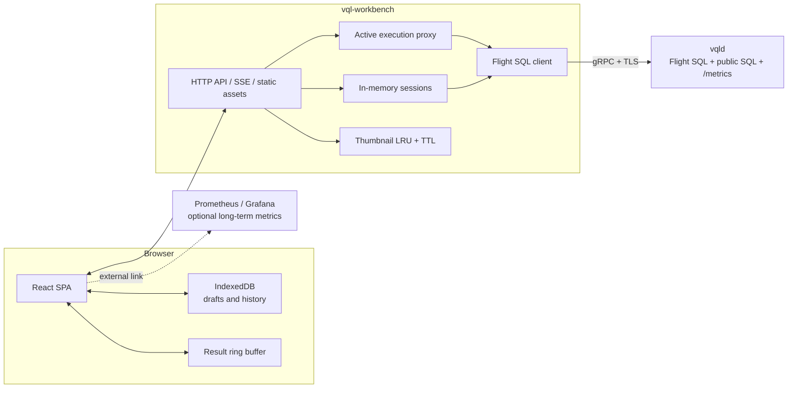
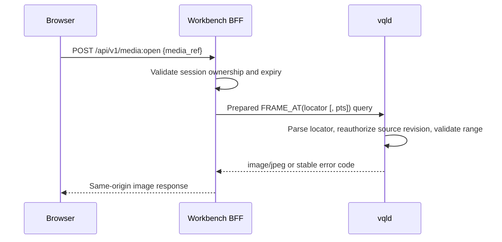

# Workbench

This proposal derives Workbench from [VisionQL PRD](../prd.md) §3.8, [System Design](../design.md), and the [vqld Service proposal](./2026-08-06-vqld-service.md). Workbench is the multimodal SQL client shipped with the v0.3 `vqld` service. It runs queries, previews results, and operates continuous queries without owning business data or depending on private engine interfaces.

## 1. Product Positioning and Scope

### 1.1 Problem

General SQL clients can execute VisionQL SQL but cannot naturally render `IMAGE`, `BOX2D`, detection arrays, or continuous results. Workbench provides three specialized experiences:

1. **Development and debugging:** write SQL and inspect images, detection boxes, and live results directly.
2. **Catalog exploration:** browse tables, streams, models, functions, and Sinks and insert object names into the editor.
3. **Operations:** inspect continuous-query state, actual inference cost, dropped frames, and source outages, and then pause, resume, or stop jobs.

Workbench is not a notebook, general-purpose BI tool, VMS, labeling platform, or independent identity-management system.

### 1.2 v0.3 Scope

The [PRD](../prd.md) §3.8 capability list is authoritative. v0.3 includes SQL editing and execution, multimodal result rendering, live stream preview, catalog browsing, continuous-query operations, and an actual-cost panel. Sections 6–10 define their implementation. `EXPLAIN` cost estimates, a video timeline, permission or audit views, server-saved queries, and team sharing are not scheduled and will be reconsidered after real feedback.

### 1.3 Design Principles

1. **Only public engine protocols.** Queries, catalogs, operations, and metrics use Arrow Flight SQL or public SQL. There are no Workbench-only engine RPCs.
2. **No persistent business state.** Workbench keeps login sessions, active previews, thumbnails, and short-term metrics in memory. A restart may require login and rerunning an interactive query but never affects durable jobs in `vqld`.
3. **Do not alter SQL semantics.** Result limits apply to transport. Workbench never injects `LIMIT`, filters, or sampling into user SQL.
4. **Transfer fewer pixels by default.** Results first return references and thumbnails; originals are fetched on demand. The engine writes large exports directly to a Sink.
5. **The engine defines errors and capabilities.** Workbench uses stable error codes and capability metadata. It does not parse prose errors or maintain a second authorization model.

## 2. User Tasks and Information Architecture

### 2.1 Primary Tasks

**Task A: debug a visual query**

1. Select a table or stream from the catalog.
2. Write or paste SQL.
3. Run the selected statement.
4. Inspect images and boxes in the result table.
5. Adjust the client-side confidence slider over existing results; edit and rerun SQL when necessary.
6. Inspect duration, row count, truncation, and errors.

**Task B: preview a live stream**

1. Execute an unbounded SELECT without a Sink.
2. Observe the newest N rows and live metrics.
3. Cancel the current preview before changing SQL.
4. Let the BFF cancel the Flight query when the result view or browser closes.

**Task C: operate a continuous query**

1. Create a durable job from Query with explicit `SUBMIT QUERY <name> AS INSERT INTO ...`.
2. Filter jobs by state, name, or source.
3. Inspect the definition revision, object dependencies, event time, delivery semantics, latency, drops, and inference cost.
4. Execute `PAUSE`, `RESUME`, or `STOP`.
5. Wait for the engine's new state. On failure, show the stable error code and actionable guidance.

### 2.2 Page Structure

```text
┌────────────────────────────────────────────────────────────────────┐
│ VisionQL   Endpoint / identity              Connection / Help      │
├──────────────┬─────────────────────────────────────────────────────┤
│ Query        │ Query workspace                                     │
│ Catalog      │ ┌─────────────────────────────────────────────────┐ │
│ Jobs         │ │ SQL editor / tabs                               │ │
│              │ └─────────────────────────────────────────────────┘ │
│ Catalog tree │ ┌─────────────────────────────────────────────────┐ │
│              │ │ Results: Table | Visual | Messages | Metrics    │ │
│              │ └─────────────────────────────────────────────────┘ │
└──────────────┴─────────────────────────────────────────────────────┘
```

| Page | Responsibility |
|---|---|
| Query | Editor, per-statement results, multimodal preview, and current execution state |
| Catalog | Full catalog and object details; Query has a compact tree |
| Jobs | Continuous-query list, detail, metrics, and operations |

v0.3 has no dashboard home page. Login opens Query directly to minimize time to first result.

### 2.3 Query Workspace

- The catalog tree is collapsible; double-clicking an object inserts a correctly quoted identifier.
- The editor supports multiple local tabs, each backed by a browser-local draft.
- The result area creates a tab per script statement. DDL shows a message; SELECT shows schema and data.
- Results show elapsed time, received rows and bytes, truncation state, query ID, and a cancel button.
- Small screens remain readable, but v0.3 targets desktop browsers and does not promise a complete mobile editing experience.

## 3. System Architecture

### 3.1 Components



Workbench contains a browser SPA and a small BFF. The BFF exists because browser Flight SQL support is incomplete, engine credentials must not persist in browser storage, Arrow batches need typed UI conversion, thumbnail bytes need a same-origin cache, and a vanished browser connection must reliably cancel the server query.

### 3.2 Client Representation of `IMAGE`

The engine protocol returns references by default. The Workbench Flight session selects `image_mode=thumbnail`, so each result can carry a small preview. `IMAGE.uri` is display-only. Clicking the image calls public `FRAME_AT(locator [, pts_ms])` to obtain an original. The locator binds a source revision and media version and is reauthorized on every server read. File and object-store references can be reread. Live RTSP frames are available only while retained by the engine's bounded compressed-GOP ring; after expiry, the thumbnail remains and the UI explains the limitation. Sections 4.3–4.4 define the full transport and authorization path.

### 3.3 State Ownership

| State | Owner | Persistence |
|---|---|---|
| Tables, streams, models, functions, Sinks | `vqld` Catalog | Yes |
| Continuous-query definitions, state, checkpoints | `vqld` | Yes |
| Identity and permissions | `vqld` / external IdP | Not stored by Workbench |
| Workbench login session | BFF memory | No; login again after restart |
| Interactive queries and live previews | BFF memory + engine execution context | No; cancel on disconnect |
| Thumbnails and media locators | Per-session BFF LRU | No; evict at TTL |
| Editor drafts and query history | Browser IndexedDB | Current browser only |
| Long-term metrics | External system such as Prometheus | Not owned by Workbench |

Workbench has no persistent business state, but it is not runtime-stateless. Multiple replicas require session affinity. Losing an instance affects only its sessions and previews, not engine jobs.

### 3.4 Technology Choices

| Layer | Choice | Reason |
|---|---|---|
| BFF | Rust + axum + Arrow Flight client | Mature Arrow types, same protocol ecosystem, single-binary distribution |
| Front end | React + TypeScript + Vite | Mature ecosystem for tables, editors, and canvas rendering |
| Editor | CodeMirror 6 | Small, extensible VQL highlighting and catalog completion |
| Server push | SSE | One-way events, simple reconnection, broad proxy support |
| Local drafts | IndexedDB | Structured capacity beyond localStorage while remaining browser-local |
| Short-term charts | uPlot or equivalent | Lightweight time-series plots for query detail |

v0.3 does not ship Arrow JS in the browser. The BFF converts only bounded interactive results, avoiding two parallel Arrow and JSON rendering paths. Direct browser transport can be evaluated later if the ecosystem matures.

## 4. Public Engine Contract

### 4.1 Flight SQL Capability Matrix

| Workbench feature | Public engine capability |
|---|---|
| Login and session | Flight Handshake / auth middleware over TLS; send and validate the Handshake token on every RPC |
| Query and DDL | Statement query/update; prepared result metadata describes kind, boundedness, and side effect; prepared statements for parameterized media reads |
| Result schema | Arrow schema and batches through `GetSchema` and `DoGet` |
| Query identity | `VisionqlFlightInfoV1` in `FlightInfo.app_metadata` supplies query ID, statement kind, and mode |
| Long queries and cancellation | `PollFlightInfo`, `CancelFlightInfo`, and cancellation propagation on disconnect |
| Table catalog | `GetCatalogs`, `GetDbSchemas`, `GetTables`, `GetTableTypes` |
| Other catalog objects | `SHOW STREAMS/MODELS/FUNCTIONS/SINKS`, `DESCRIBE`, `SHOW CREATE` |
| Continuous queries | `SUBMIT QUERY`, `SHOW/DESCRIBE QUERY`, `SHOW QUERY DEPENDENCIES`, `PAUSE`, `RESUME`, `STOP` |
| Metrics | Prometheus endpoint configured at deployment; BFF filters labels such as `query_id` |
| Errors | Standard gRPC status plus `visionql-error-bin` trailing metadata |
| Compatibility | Fixed vendor `GetSqlInfo` IDs for protocol, dialect, `IMAGE` extension version, and capabilities |

Workbench never reads the SQLite Catalog or engine process files. It reads only the public Prometheus-format endpoint; external Prometheus/Grafana owns long-term storage.

### 4.2 Version Negotiation

After login, the BFF reads fixed vendor SqlInfo:

```text
10000 visionql_protocol_version : string
10001 sql_dialect_version       : string
10002 visionql_image_version    : string
10003 capabilities              : list<string> {
  unbounded_do_get,
  poll_flight_info,
  cancel_flight_info,
  statement_info_v1,
  image_thumbnail_mode,
  frame_at_v1,
  query_control_v1,
  ...
}
```

- Reject an incompatible protocol major and show the supported range.
- If one capability is missing, disable only its UI and explain the required engine version.
- Before v1.0, tolerate appended columns and capabilities and ignore unknown fields.
- Do not infer behavior from version numbers; use capabilities. Versions are diagnostic.

With `statement_info_v1`, read these result-schema metadata fields from prepare:

```text
visionql.statement_info.version = 1
visionql.statement.kind = query | update | ddl | persistent_submission
visionql.query.mode = bounded | unbounded | not_applicable
visionql.statement.side_effect = read_only | write
```

Workbench does not infer these semantics with a local parser. `statement_info_v1` is required for Query execution in v0.3. Without it, retain connection diagnostics and read-only catalog browsing but block SQL execution instead of guessing the result lifecycle.

### 4.3 `IMAGE` Transport

On connection, Workbench sets:

```sql
SET vql.result.image_mode = 'thumbnail';
SET vql.result.thumbnail_max_edge = 256;
SET vql.result.thumbnail_quality = 75;
```

The result remains a standard Arrow Struct with `ARROW:extension:name=visionql.image` and `ARROW:extension:metadata={"version":1}`, matching SqlInfo `visionql_image_version="1"`. The BFF reads:

- sanitized display `uri`, opaque `locator`, `pts_ms`, `frame_id`, dimensions, and other reference fields;
- JPEG or PNG thumbnail bytes in `encoded`;
- field metadata `content_kind=thumbnail`, preventing a thumbnail from being mistaken for an original.

A 256-pixel thumbnail is generally tens of KiB, but the actual result-byte budget is the contract; this estimate is not.

### 4.4 Original-media Read

The browser cannot submit an arbitrary URI or locator. During result conversion, the BFF creates a session-scoped `media_ref` associated with the returned locator, optional target PTS, query ID, and login session. The browser receives only sanitized URI and `media_ref`.



- File and object-store references can be reread.
- Live RTSP frames are readable only before engine-ring expiry. On expiry, keep the thumbnail, show “original frame expired,” and do not rerun the query.
- `$1` for `FRAME_AT` comes only from the locator stored by the BFF. Omitting `$2` uses the locator PTS; specifying it may select only within the same authorized video object.
- Do not expose the locator in an independent image URL or let the client modify locator or PTS.
- Distinguish `INVALID_MEDIA_LOCATOR`, `MEDIA_LOCATOR_EXPIRED`, `PERMISSION_DENIED`, `SOURCE_REVISION_UNAVAILABLE`, and `FRAME_NOT_AVAILABLE` instead of collapsing them into a generic load failure.
- Bind blobs and media references to the login session and clear them immediately on logout.

### 4.5 System SQL Results

Jobs uses `SHOW QUERIES`; detail uses `DESCRIBE QUERY <id>`; dependencies use `SHOW QUERY DEPENDENCIES <id>`. Workbench depends only on the minimum columns fixed by the [vqld Service proposal](./2026-08-06-vqld-service.md).

- Render unknown states as their original strings rather than failing the page.
- Derive metric units from Prometheus suffixes and HELP metadata, never guesses.
- Preserve historical definition and final errors after `STOP`.
- Treat an operation as successful only after engine confirmation and observation of the target state in a later `SHOW QUERIES`; HTTP 200 is not final state.

### 4.6 Structured Errors

The engine uses standard gRPC status plus the versioned `VisionqlErrorV1` Protobuf envelope from the [vqld Service proposal](./2026-08-06-vqld-service.md) in `visionql-error-bin` trailing metadata:

```text
version, code, message, hint,
source_start, source_end,
query_id, retryable
```

Read stable `code`, span, `query_id`, and `retryable` only from the envelope; never match error types from `message`. The BFF adds `statement_index` for the statement it is executing. If the extension is missing or invalid, preserve the standard gRPC code, show that structured details were unavailable, and never expose raw metadata to the browser.

## 5. Workbench BFF API

The HTTP API serves only the same-origin SPA. It is not an engine API and makes no third-party compatibility promise.

### 5.1 Endpoints

| Method and path | Purpose |
|---|---|
| `POST /api/v1/session` | Establish an in-memory session from user-supplied engine credentials |
| `DELETE /api/v1/session` | Logout, cancel active previews, and clear blobs |
| `GET /api/v1/capabilities` | Return filtered engine capabilities |
| `POST /api/v1/executions` | Create a script execution and immediately return a Workbench execution ID |
| `GET /api/v1/executions/{id}/events` | Receive schema, batches, state, and errors over SSE |
| `DELETE /api/v1/executions/{id}` | Cancel the Flight query |
| `GET /api/v1/catalog` | Read and cache catalog data |
| `GET /api/v1/jobs` | Convert `SHOW QUERIES` results |
| `GET /api/v1/jobs/{id}` | Combine `DESCRIBE QUERY` and `SHOW QUERY DEPENDENCIES` |
| `POST /api/v1/jobs/{id}/actions` | Map pause/resume/stop to public SQL |
| `GET /api/v1/jobs/{id}/metrics` | Read engine metrics and filter by `query_id` |
| `GET /api/v1/blobs/{id}` | Return a current-session thumbnail |
| `POST /api/v1/media:open` | Open original media from a current-session `media_ref` |

Every state-changing endpoint requires a CSRF token. Validate job IDs as UUIDs or identifiers and quote them correctly before SQL construction; never concatenate arbitrary browser input.

### 5.2 Execution Events

After `POST /executions` returns an ID, the front end subscribes to SSE:

```text
execution_started
statement_started     { index, kind, mode, side_effect }
schema                { fields[] }
batch                 { rows[], blobs[], sequence }
statement_progress    { rows, bytes, elapsed_ms }
statement_completed   { affected_rows?, truncated? }
statement_error       { code, message, hint, statement_index, span? }
execution_completed
execution_cancelled
heartbeat
```

Each schema field contains at least name, Arrow storage type, VisionQL logical type, nullability, and field metadata. `batch.rows` is an array aligned to the schema so column names are not repeated per row. Thumbnail bytes stay outside JSON; rows contain session-protected blob IDs.

### 5.3 SSE Reconnection

- Keep a small event ring per active execution and assign monotonically increasing IDs.
- Use `Last-Event-ID` to replay events after a brief disconnect.
- Allow a five-second reconnection grace period by default. Cancel the Flight query if no client returns.
- If the requested event was evicted, return `event_gap`; show incomplete results and never rerun SQL automatically.
- SSE reconnection must never start a new engine query, preventing duplicate DDL or DML.

### 5.4 Backpressure

- Let gRPC and HTTP flow control pause bounded-result reads naturally.
- Bound the Arrow-to-JSON channel and SSE queue by bytes. If a browser remains too slow after the bound is reached, cancel the interactive query and return `CLIENT_TOO_SLOW`.
- Keep only the newest N unbounded-preview rows in the browser. Eviction removes already-delivered display rows, not engine input. Show cumulative received and display-evicted row counts.
- Never cache an unwatched preview without bound.

## 6. SQL Editing and Execution

### 6.1 Editor

v0.3 provides syntax highlighting for SQL, VQL DDL, types, built-ins, and table functions; bracket matching, comments, formatting, find/replace, and basic diagnostics; catalog completion for relations, columns, models, functions, and Sinks; “run selection” and “run current statement”; `Cmd/Ctrl+Enter` to run and `Esc` or a button to cancel; and source-span navigation when available.

The syntax package handles highlighting and statement boundaries, not final semantics. Completion may briefly be stale; the engine always decides execution.

### 6.2 Multi-statement Scripts

The BFF uses a lexer that understands semicolons, strings, quoted identifiers, and line/block comments without copying the full VQL parser. It finds statement boundaries only. Each statement is prepared and executed sequentially, and §4.2 metadata is the sole authority for kind, mode, and side effect.

- Create an independent result tab per statement.
- Stop at the first error; v0.3 has no continue-on-error mode.
- Cancel a bounded SELECT and mark it truncated at the display limit, then continue the script.
- Ordinary unbounded `SELECT` and `INSERT INTO ... SELECT ...` attach and do not complete naturally, so they must be the last statement. If prepare finds one earlier, stop before executing it and ask the user to split the script; never convert it to a background job.
- Explicit `SUBMIT QUERY <name> AS INSERT INTO ... SELECT ...` has kind `persistent_submission`. It immediately returns query ID, name, state, and definition revision, allowing later script statements. Link its “submitted” result to Jobs.
- Ordinary unbounded `INSERT` displays the fixed attached status stream. Cancellation, page exit, or session expiry terminates the Sink query without creating a durable job.
- A script is not an implicit transaction. Later statements may depend on earlier DDL, so global semantic preflight is impossible. If a later unbounded statement is invalidly positioned, already completed statements do not roll back. Atomic DDL must be provided by the individual engine statement.

Share golden lexer cases with the engine parser for strings, comments, quoted identifiers, and VQL DDL. Any boundary mismatch blocks release. Runtime semantic classification still trusts only engine metadata.

A “submit as durable job” action requires a name, generates and displays the complete `SUBMIT QUERY ... AS ...` SQL, and sends it through the same execution API only after confirmation. Workbench never silently changes the lifecycle of ordinary `INSERT`.

### 6.3 Transport Limits

Default bounded-result limits are 1,000 rows, 8 MiB of JSON plus blobs, and 256 KiB per thumbnail. Reaching any limit cancels the result stream and reports the exact reason.

An unbounded preview cannot use cumulative 1,000-row or 8 MiB caps. It uses a fixed browser row ring, byte-bounded BFF/SSE queues, per-row and per-thumbnail limits, rate limits, and a configurable maximum preview duration. Cumulative rows may grow while the page remains connected and no protection triggers; only old display rows leave the ring.

Deployment may tighten these values but the page cannot expand them without bound. Workbench does not rewrite SQL: aggregation, sorting, and inference retain complete query semantics. Bounded limits only constrain browser transport; unbounded limits only constrain preview resources.

Large exports bypass the BFF. The export assistant generates `INSERT INTO` or CTAS SQL, displays it, and lets the user confirm before `vqld` writes directly to Lance, Parquet, or another Sink.

### 6.4 Query History and Drafts

- Store drafts and history in browser IndexedDB, partitioned by an irreversible digest of engine endpoint and principal.
- The BFF receives SQL transiently for execution but never persists drafts or history or synchronizes them across devices.
- History stores SQL, time, duration, and success/failure, not results.
- By default, logout preserves local drafts but offers “also clear local data.” Shared-computer mode may clear them automatically.
- SQL may contain sensitive URIs. Encourage engine secret references instead of embedded passwords. Best-effort history previews redact common URI userinfo and sensitive query keys, but redaction is not a security boundary.

## 7. Multimodal Results

### 7.1 General Table

- Virtualize rows and columns; do not mount every thumbnail or canvas at once.
- Render Arrow null separately from empty string, empty array, zero, or invalid media.
- Show nested values as a compact summary with an expandable typed view.
- Keep column names and logical types visible while scrolling.
- Copy and CSV export include scalar values and sanitized media-reference summaries, never binary image data.
- When truncated, keep a persistent warning above the table and include warning text in screenshots or copies.

### 7.2 `IMAGE`

- Preserve aspect ratio, lazy-load thumbnail blobs, and show a stable placeholder plus reason on failure.
- Clicking opens a viewer and requests the original on demand. Label “thumbnail” and “original” explicitly.
- Preserve the thumbnail if the original expired, permission was revoked, or the source is not replayable.
- The engine normalizes image rotation and EXIF orientation while encoding thumbnails; `BOX2D` coordinates refer to that display orientation.
- Copy a sanitized reference summary, never binary content or a signed URL.

### 7.3 `BOX2D` and Detection Arrays

Automatically overlay only when a row has exactly one `IMAGE` column and one `BOX2D` or detection-array column. With multiple candidates, show image-column and detection-column selectors and store the choice only in the current result tab. Transform normalized `[0,1]` coordinates against the actual content area and device pixel ratio. Draw labels and confidence at the box edge using a stable label hash for color. Skip non-finite or out-of-range coordinates and flag invalid data in row detail.

The confidence slider filters only already-returned detection arrays or rows. Keep the message “Filters this preview only; SQL is not rerun” visible. Do not silently initialize it from a model threshold; show all detections returned by the query by default.

### 7.4 `VECTOR` and `VIDEO`

- Collapse `VECTOR(n)` to dimension, norm, and the first four values; allow per-row expansion without charting large vectors.
- Show sanitized URI summary, duration, fps, resolution, and codec for `VIDEO`.
- v0.3 has no video player or timeline. Use SQL `FRAMES` or `FRAME_AT` to inspect a frame.

### 7.5 Accessibility

- Make image viewers, result tabs, action buttons, and errors keyboard-operable.
- Provide a textual detection list beside canvas overlays; color cannot be the only label cue.
- Meet contrast requirements and allow overlays to be disabled.
- Announce live rows through a non-interrupting ARIA live region without stealing focus for every row.
- Respect `prefers-reduced-motion`; do not force animation in live lists.

## 8. Live Preview

### 8.1 Lifecycle

```text
STARTING → LIVE ⇄ RECONNECTING → CANCELLED
                 └────────────→ FAILED
```

- In `LIVE`, show last event time, receive rate, cumulative rows, current ring size, and preview duration.
- Retain the newest 500 browser rows by default within a bounded configurable range.
- “Pause scrolling” freezes rendering, not the engine query; distinguish the two clearly.
- Cancel truly stops the query. Switching tabs may keep it running; closing its result tab, logging out, or leaving Workbench cancels it.
- After abnormal browser disconnect, apply the short §5.3 grace period and then cancel to prevent orphan queries.
- Allow rerun in the same tab only after cancellation completes, preventing two live result streams from interleaving.

### 8.2 Separate Data and Metrics

Result batches arrive through the active Flight `DoGet`. The BFF fetches Prometheus metrics for that preview at low frequency, every two seconds by default.

- A metrics failure does not stop result preview.
- A `DoGet` failure does not fabricate zero metrics.
- When the page is hidden, reduce metrics polling to ten seconds; continue or cancel the result stream according to the user's choice.
- Keep only one hour of recent metrics in memory; Workbench does not store history.

## 9. Catalog Browsing

### 9.1 Data Sources

| Object | Public source |
|---|---|
| Table / View | Flight SQL `GetTables`, including schema when needed |
| Stream | `SHOW STREAMS` + `DESCRIBE STREAM` |
| Model | `SHOW MODELS` + `DESCRIBE MODEL` |
| Function | `SHOW FUNCTIONS` + `DESCRIBE FUNCTION` |
| Sink | `SHOW SINKS` + `DESCRIBE SINK` |
| DDL | Sanitized `SHOW CREATE ...` |

The engine returns only objects visible to the current principal. Workbench does not simulate permission filtering in the client.

### 9.2 Cache and Invalidation

- Cache catalog data in the BFF per user session for 30 seconds; the browser caches only the current page's needs.
- Invalidate related entries immediately after successful catalog DDL.
- Allow manual refresh. On failure, retain the old snapshot and mark it “may be stale.”
- Completion uses the latest successful snapshot and shows object type to disambiguate same-named Tables and Streams.

### 9.3 Object Detail

Show only public, queryable information: schema, logical types, and nullability; source kind, sanitized location, event time, and watermark; Model type, source digest, Runtime kind/protocol, processor kinds, canonical schema, and constraints; Function signature, implementation language/body digest, and volatility; Sink format and sanitized target; and copyable sanitized DDL.

v0.3 does not edit objects on the detail page. Generate SQL and return to Query for changes, preserving a declarative and reviewable path.

## 10. Continuous-query Operations and Cost

### 10.1 Jobs List

At minimum, show attached/persistent lifecycle, name and query ID; `STARTING / RUNNING / PAUSED / RECOVERING / FAILED / STOPPED`; batch/stream mode, source kind and health, and delivery semantics; runtime, last update, Query Manifest identity, and latest error-code summary; input fps, inference fps, P95 latency, and dropped frames. A query may be `RUNNING` while its source is `DISCONNECTED`.

Default to durable jobs, with an option to show attached queries visible to the current principal. Attached queries remain cancellable by their originating execution and do not show `PAUSE/RESUME`. Sort non-terminal jobs first, then newest update. Filtering and sorting apply only to fetched data. If results exceed one response, use public engine pagination parameters or filtering SQL; the BFF must not pretend it loaded everything.

Fetch list metrics once and merge by `query_id`, not once per row. Detail reuses the matching subset.

### 10.2 Detail Page

First run `DESCRIBE QUERY '<query_id>'`, then `SHOW QUERY DEPENDENCIES '<query_id>'` for the resolved Function, Model, source, and Sink identities and semantic fingerprints in the Query Manifest. Never infer dependencies from saved SQL.

Show four groups:

1. **Definition:** name, lifecycle, read-only SQL, Query Manifest identity, resolved Model and Function fingerprints, and complete object dependencies.
2. **Runtime:** last event time, watermark, epoch, and checkpoint where applicable.
3. **Quality:** decode and inference errors, late rows, drop reasons, and source gaps.
4. **Actual cost:** processed frames, inference count, actual batch size, GPU seconds, and P50/P95 inference latency.

If metrics are absent, show “No data” or “Unsupported,” never zero. Use engine-provided units exactly.

### 10.3 Operations

- `PAUSE`: confirm that pausing RTSP creates an unrecoverable gap.
- `RESUME`: explain that the existing Query Manifest remains in use. If Catalog definitions have changed, the user must stop and explicitly submit a new job, which receives a new query ID and Manifest.
- `STOP`: terminal and high-risk; require the query name or an explicit confirmation.
- Keep an action pending until `SHOW QUERIES` observes the target state or the engine fails it.
- Do not optimistically mutate state or mark a timed-out operation successful.
- Show engine permission errors directly. Capabilities may hide buttons, but hiding is not a security boundary.

### 10.4 Cost Boundary

v0.3 displays only measured values:

```text
processed_frames
inference_requests
model_invocations
gpu_seconds
average_batch_size
queue_wait_ms
```

Planned `EXPLAIN` cost estimates are unscheduled optimizer work. A future capability must show estimated and actual values side by side with time range, resolved Model fingerprint, and sampling rate; never merge them into a falsely precise number. Workbench does not convert GPU seconds to currency because pricing belongs to deployment or commercial configuration.

## 11. Sessions and Security

### 11.1 Login Session

- Deployment config fixes the engine endpoint and the login page shows it read-only. Accept only credential types supported by the engine, validate them immediately through Flight, and never let the browser choose an arbitrary backend.
- Keep credentials or short-lived engine tokens only in BFF memory, never logs, disk, IndexedDB, or cookies.
- Map each login to an independent logical Flight SQL session. `SET` options such as `image_mode` never cross users. Include the session token on every RPC and let the server validate it before selecting a Session; only then may underlying gRPC channels be shared.
- The browser cookie contains only a high-entropy session ID with `HttpOnly`, `Secure`, and `SameSite=Strict`; use `Lax` only when an external IdP redirect requires it.
- Expire after 30 minutes of inactivity by default. An active live preview counts as activity, but deployment may enforce an absolute lifetime.
- On logout, cancel interactive queries before clearing media cache and credentials.

### 11.2 Web Security Baseline

- Use TLS from browser to BFF and BFF to `vqld`.
- Require CSRF tokens for writes and allow only same-origin CORS.
- Default CSP blocks inline and third-party scripts and sets `frame-ancestors 'none'`.
- Keep React text escaped; never put SQL, errors, labels, or URIs into `dangerouslySetInnerHTML`.
- Blob URLs are unguessable, session-bound, and TTL-limited and return `nosniff` plus the correct MIME type.
- Media reads use server-stored `media_ref`; reject browser-supplied new URIs, locators, or PTS values.
- Redact Authorization, cookies, URI userinfo, and signed query parameters from errors, audit fields, and request logs.
- Rate-limit and bound concurrency for login, media reads, execution creation, and job actions.

### 11.3 Authorization Model

Workbench does not cache allow/deny decisions. The engine reauthorizes every query, `FRAME_AT`, and job action against the current identity. Catalog invisibility does not prove inaccessibility, so security tests directly attempt unauthorized SQL and forged, cross-session, revoked, and expired media references and locators.

### 11.4 Multiple Replicas

v0.3 requires load-balancer affinity on the session cookie. Active SSE, Flight streams, and blob caches remain on their creating instance. If health checks fail, the user logs in again, the original Flight connection drops, and the engine cancels it. Do not add Redis or shared persistence merely to preserve short-lived previews.

## 12. Errors, Observability, and Performance

### 12.1 Error Presentation

Display stable fields:

```text
version
code
message
hint
statement_index
source_start
source_end
query_id
retryable
```

Except for `statement_index`, fields come from §4.6. The source span is a half-open UTF-8 byte range in the current statement; the BFF converts it to full-script and browser-string positions before highlighting. Row-level errors appear as result NULLs and metrics, not query-failed popups. Permissions, missing capabilities, insufficient resources, expired media, and slow clients have distinct UI. Offer retry only for `retryable=true` read-only interactive queries; never automatically retry DDL, DML, or operations.

### 12.2 BFF Metrics

Expose login sessions, active executions, and SSE connections; Arrow-to-JSON duration, bytes sent, and truncation count; current and peak blob-cache size, hit rate, and eviction; Flight latency, cancellation latency, and failure codes; and queries cancelled because the browser disconnected or was too slow.

Correlate logs with `workbench_execution_id`, engine `query_id`, and an irreversible session digest. Do not log full SQL. Debug mode still redacts sensitive values first.

### 12.3 Performance Budget

| Item | Acceptance target |
|---|---|
| First static load | Keep compressed assets within a reasonable SPA budget fixed by the first build baseline |
| Catalog completion | Return locally on a cache hit; cold P95 depends on engine metadata queries |
| First result batch | Measure BFF conversion separately and keep it from becoming a material share of engine query time |
| Live preview | Run one hour with a 500-row ring and no memory growth |
| Thumbnail cache | Default 256 MiB per instance and 10-minute TTL; both may be tightened |
| Cancellation | At page-close grace expiry, issue Flight cancel and verify server resource release |

Measure front-end build size, BFF memory, and result limits in CI rather than documenting defaults only.

## 13. Deployment and Code Organization

### 13.1 Distribution

```bash
vql-workbench \
  --server grpc+tls://vqld.example.com:32010 \
  --listen 0.0.0.0:8080
```

- Embed front-end assets in the BFF binary and also publish a container image.
- Configure one `vqld` endpoint by default. v0.3 does not switch endpoints within a session.
- Deploy Workbench in a central or management network, not on every edge node.
- Browser TLS may terminate at Workbench or a reverse proxy; deployment documentation must define trusted headers and secure-cookie behavior.
- Readiness checks both BFF health and valid engine connection configuration. A temporarily unreachable engine does not prevent process startup; show a diagnostic page.

### 13.2 Repository Layout

```text
vql-workbench/
├── Cargo.toml              # independent Rust workspace
├── server/
│   ├── Cargo.toml
│   ├── src/session/        # in-memory sessions and Flight auth
│   ├── src/execution/      # Flight streams, SSE, cancellation, limits
│   ├── src/catalog/        # metadata / SHOW conversion
│   ├── src/media/          # blob cache and original-media reads
│   └── src/http/           # API, security middleware, static assets
├── web/
│   ├── package.json
│   ├── src/query/
│   ├── src/results/
│   ├── src/catalog/
│   ├── src/jobs/
│   └── src/session/
└── tests/
    ├── contract/
    └── e2e/
```

Hard constraints:

- `vql-workbench/server` does not depend on root-workspace `vql-kernel`, `vql-server`, or any engine crate.
- Protocol tests generate fixtures from Flight SQL schemas and public SQL, not copied Catalog Rust structs.
- Workbench generates its front/back API types internally, never from private engine types.
- Engine and Workbench have independent versions and CI and can be released separately.

## 14. Testing and Acceptance

### 14.1 Test Layers

| Layer | Coverage |
|---|---|
| Front-end unit | Type rendering, `BOX2D` coordinates, confidence filters, ring, state machines, error mapping |
| Accessibility | Keyboard, focus, textual detections, contrast, reduced motion |
| BFF unit | Script lexing, sequential prepare, result limits, Arrow-to-JSON, blob TTL, `media_ref`, injection prevention |
| Protocol contract | Fixed SqlInfo IDs/capabilities, all metadata RPCs, `statement_info_v1`, FlightInfo metadata, attached Sink status, prepared statements, cancel, per-RPC session token, Protobuf errors, `IMAGE` schema/version, system SQL |
| Integration | Mock Flight slow clients, disconnect, cancel, trailing-metadata errors, unknown capability/field fallback |
| Real engine E2E | Login, DDL, bounded query, multimodal rendering, live preview, Jobs actions, permission denial |
| Security | CSRF, XSS strings, forged/expired/revoked locators and media references, SSRF, log redaction, cross-user cache and Flight-session isolation |
| Stability | One-hour live preview, BFF restart, failed replica affinity, no orphan queries |

### 14.2 PRD Acceptance Mapping

| PRD §3.8 capability | Acceptance scenario |
|---|---|
| SQL editing and execution | Run a selection, current statement, and multi-statement script; verify metadata classification, explicit `SUBMIT`, attached ordinary unbounded INSERT, error positioning, and browser-only history |
| Transport limits | Do not rewrite aggregate SQL; after row/byte limits, show the reason and confirm engine cancellation |
| `IMAGE` / `BOX2D` | Correct thumbnails, originals, detection arrays, and `UNNEST`; clear degradation after live-original expiry |
| Confidence slider | No network query after adjustment; UI says it filters only the current preview |
| `VECTOR` | Collapsed by default; expansion does not degrade other rows |
| Live preview | Newest 500 rows; closing the tab, disconnect timeout, or logout cancels Flight |
| Catalog | Five object classes visible, schemas and DDL sanitized, cache invalidated after DDL |
| Operations | `SUBMIT QUERY` returns name and query ID; detail shows definition and dependencies; running jobs can Pause/Resume/Stop; RTSP pause warns of gaps; final state comes from engine |
| Cost panel | Show only measurements from the engine Prometheus endpoint; missing data is not zero |
| Independence | Workbench build graph contains no root engine crate; all E2E uses only public protocols |

### 14.3 Release Gates

Before the v0.3 Workbench release:

1. Pass the protocol contract suite against real `vqld`.
2. Complete “remote query → image and box preview → live cancellation → durable-query operations” end to end.
3. Leave no interactive query after the browser closes.
4. Reject unauthorized `FRAME_AT`, forged/expired/revoked locators and media references, and arbitrary URL reads.
5. Pass front-end and back-end unit tests, E2E, accessibility, and dependency-vulnerability checks.
6. Verify independent build, container startup, and reverse-proxy deployment documentation.

## 15. Explicit Non-goals

As defined in §1.1 and PRD §3.8, Workbench is not a notebook, general BI tool, VMS, labeling platform, or identity-management system. Identity and authorization have one source of truth in the engine; Workbench has no user or permission database. Prometheus/Grafana owns long-term metrics. Direct browser Flight SQL, multi-cell notebooks, server-saved queries and team sharing, a video player or timeline, multiple endpoints, and edge-fleet management are unscheduled and will be reconsidered from real feedback.

## 16. Open Questions

| Question | Current direction | Decision point |
|---|---|---|
| `IMAGE` thumbnail parameters | Engine defaults to reference; display-only `uri` and dereference locator are fixed; Workbench selects thumbnail; size, byte cap, and locator TTL remain open | Before v0.3 Flight schema freeze |
| Live original-frame retention | Bounded engine ring; keep thumbnail after expiry | After a real eight-stream load test |
| Pagination for large Jobs lists | Prefer public SQL filtering/pagination over loading everything into BFF | Before v0.3 production-scale test |
| External IdP login | Initially support engine token/basic capability; deployment or engine owns OIDC | Before v0.3 authentication freeze |
| Large-export UX | Generate explicit SQL and require confirmation; do not download through BFF | After v0.3 usability test |
| Video timeline, unscheduled | First measure `FRAME_AT` concurrency, cache hits, and object-store cost | Before scheduling |

## Appendix A: UI-to-engine Mapping

| UI action | Workbench BFF | `vqld` |
|---|---|---|
| Login | Create in-memory session | Flight auth Handshake |
| Execute SQL | Create execution and forward results | Statement query/update + `DoGet` |
| Cancel | DELETE execution | `CancelFlightInfo` / cancellation token |
| Load catalog | Aggregate and cache for 30 seconds | `GetTables` + `SHOW` / `DESCRIBE` |
| Show thumbnail | Session blob cache | `IMAGE` thumbnail in query result |
| Open original | Validate `media_ref` | Locator-backed Flight `DoGet` |
| Live preview | Flight-to-SSE with short event ring | Unbounded `DoGet` |
| Submit durable job | Display generated SQL and send through execution | `SUBMIT QUERY name AS INSERT INTO ...` |
| Show Jobs | Typed JSON | `SHOW QUERIES` |
| Show Job detail | Combine definition, state, dependencies | `DESCRIBE QUERY` + `SHOW QUERY DEPENDENCIES` |
| Pause / Resume / Stop | Validate ID and execute public SQL | Job state machine |
| Show actual cost | Read metrics and filter by `query_id` | Prometheus-format `/metrics` endpoint |

## References

- [Apache Arrow Flight SQL specification](https://arrow.apache.org/docs/format/FlightSql.html)
- [Apache Arrow Flight cancellation and PollFlightInfo](https://arrow.apache.org/docs/format/Flight.html)
- [Apache Arrow extension types](https://arrow.apache.org/docs/format/Columnar.html#extension-types)

## Changelog

| Date | Change |
|---|---|
| 2026-08-06 | Migrated from workbench.md design v0.3.0 without changing its internal section structure |
| 2026-08-09 | Converted metadata to front matter, adopted date-based naming, and translated to English |
| 2026-08-10 | Aligned Catalog and continuous-query views with Query Manifests and typed Model metadata |
