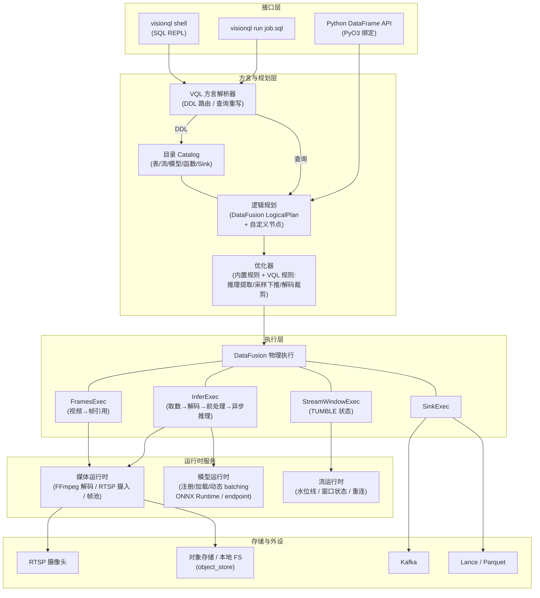
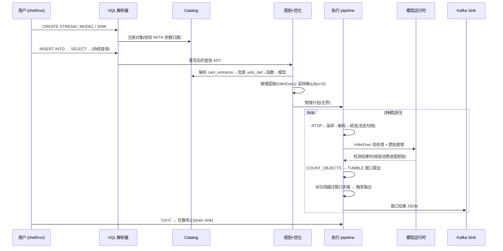

# VisionQL 系统设计文档

> 承接 [PRD](./PRD.md) v0.1,给出 VisionQL 引擎的技术架构与模块设计。以 v0.1(MVP,库态单机端到端)为详细设计范围,同时为 v0.2+(服务态、集群态)的每一处演进预留架构挂载点。

- **版本**: v0.3 (Draft)
- **日期**: 2026-07-31
- **对应 PRD**: v0.1.1
- **状态**: 评审中

---

## 1. 概述

### 1.1 目的与范围

本文档回答一个问题:**PRD 承诺的用户体验,用什么架构以可控的工程成本兑现?**

范围约定:

- **详细设计**:PRD 第 4 节 MVP 范围内的全部能力(类型系统、批表与 `FRAMES()`、RTSP 单流 + TUMBLE、模型/函数注册、Kafka/Lance Sink、帧采样下推、库态 + shell + DataFrame API);
- **框架设计**:PRD 3.6 所列执行层能力中超出 MVP 的部分(级联优化、`TRACK`、精确一次等),只设计**挂载点**,不展开实现;
- **不覆盖**:服务态/集群态的部署运维细节、Web 控制台、商业化功能。

### 1.2 阅读路径

- 想了解整体:§2 目标与原则 → §3 总体架构 → §4 技术选型;
- 想评审关键设计:§5 数据表示、§8 模型运行时、§9 优化器、§11 流运行时、§22 决策记录;
- 想评审扩展性:§21 扩展性设计;
- 想开工:§19 代码组织 → §20 测试 → 附录 A 需求追踪。

### 1.3 术语

| 术语 | 含义 |
|---|---|
| 引用态 / 池态 / 内联态 | 大对象列(`IMAGE` 等)的三种物理表示,见 §5.2 |
| InferExec | 承载模型推理的异步物理算子,见 §10.3 |
| 微批(RecordBatch) | Arrow 列式批,引擎内数据流动的最小单位 |
| 水位线(Watermark) | 事件时间进度信号,驱动窗口关闭 |
| 信封段(envelope segment) | 以 StreamMessage 为通道元素的计划段(无界计划全段 + 批计划的池态受控段),承载水位线/帧进度等批间控制信息,见 §11.1 |
| 消费进度回收 | 帧池按消费者顺序号水位释放帧的机制,见 §5.2 |
| TVF | 表值函数(表进表出),如 `FRAMES` |
| EP | ONNX Runtime Execution Provider(CUDA/TensorRT/CoreML/CPU) |

---

## 2. 设计目标、原则与约束

### 2.1 设计目标(从 PRD 派生)

| # | 目标 | 来源 | 架构含义 |
|---|---|---|---|
| G1 | **批流一体**:同一逻辑计划,有界/无界两种执行 | PRD 3.1/3.3.8 | 计划层不区分批流,边界性(boundedness)是计划属性;窗口算子双模 |
| G2 | **零运维嵌入式起步**:`pip install` 即查,无外部服务依赖 | PRD 3.5 | 内核为纯库(无进程假设);目录、模型运行时全部进程内;SQLite 级持久化 |
| G3 | **声明式可优化**:推理调用对优化器白盒可见 | PRD 2.4 | 模型调用不能藏在黑盒 UDF 里执行——规划期显式提取为计划节点 |
| G4 | **单二进制演进**:同一内核长出服务态/边缘态 | PRD 3.5 | 实现语言须能产出静态单二进制 + Python 扩展双形态;内核 crate 与宿主解耦 |
| G5 | **性能基线**:单消费级 GPU ≥ 8 路 1080p@5fps 检测 + 窗口聚合;批扫描打满硬件 | PRD 3.7 | 见 §2.2 性能四原则 |
| G6 | **不魔改内核**:一切 SQL 扩展降解为标量函数 / 表值算子 / 目录操作三类机制 | PRD 3.3.8 | 选型必须提供:自定义方言、自定义逻辑/物理计划节点、UDF、TableProvider、优化器规则六类扩展点 |
| G7 | **扩展机制化**:多模态场景横向生长不改内核 | PRD 2.3/2.5 | 每一类可预见的扩展(模型类型/前后处理/后端/连接器/算子/模态)对应一个明确的编译期扩展点,见 §21 |

### 2.2 性能四原则

数据引擎的性能是架构属性,不是事后调优。以下四条贯穿全部模块设计,评审任何算子实现先过这四问:

- **P1 像素不过算子边界**。解码帧(1080p RGB ≈ 6MB)是内存与带宽的头号敌人。算子间流转的 `IMAGE` 默认是引用态(KB 级);像素只存在于"解码点 → 消费点"的受控段内,且该段尽可能被融合进单个算子(§5.2、§10.3)。
- **P2 一切按 RecordBatch 向量化**。函数逐批执行、推理逐批提交、前处理 SIMD 逐批变换;不存在逐行解释路径。
- **P3 流水线并行**。取数(IO)/解码/前处理(CPU)/推理(GPU)四段资源异构,必须重叠:预取隐藏对象存储延迟,多批在途隐藏 GPU 往返(§10.3)。
- **P4 先删工作量,再省单位成本**。优化优先级:不解码(列裁剪)> 少解码(采样/时间谓词下推)> 少推理(级联,v0.3)> 单次更快(硬解/更大 batch)。EXPLAIN 的工作量归因按同一优先级展开(§9.4)。

### 2.3 硬约束

1. **PRD 3.3.8 的八项 SQL 可落地性原则是本设计的验收标准**(逐条对应见附录 A);
2. 多模态类型只使用标准列式类型组合(Struct/Binary/FixedSizeList),不要求引擎具备用户自定义类型内核;
3. 引擎内核不内嵌 Python 解释器;Python 运行时仅在注册了 Python 函数时激活;
4. 官方模型接入层只内置宽松许可模型的接入路径(RT-DETR 系、CLIP 等);受限许可模型(YOLO 等)走用户显式引入,引擎不分发其权重(processor 为独立实现,不含上游代码,不受权重许可约束)。

### 2.4 反过度设计守则与"刻意不做"清单

三条守则:

1. **未来能力只买挂载点,不买实现**:挂载点的合法形态是枚举值、trait、保留字段、报错占位——成本以行计;任何"提前实现一半"的功能都被拒绝(半成品的维护与误导成本高于收益);
2. **复用优先于自造**:窗口聚合复用 DataFusion 累加器、TopK 复用引擎原生、UNNEST 原生映射、存储用 Lance/Parquet——自造仅发生在"视觉原生"的差异化处(帧通路、推理调度、采样下推);
3. **MVP 组件必须被验收场景直接使用**,否则从 MVP 划出。

据此,以下内容**刻意不做**(区别于"没想到"):

| 不做 | 理由 | 何时再议 |
|---|---|---|
| 独立流引擎 / actor 框架 | 长驻的向量化 pipeline 已覆盖(ADR-2) | 不再议 |
| 运行时插件系统(dylib/WASM 加载器) | 扩展点全部是编译期 trait + cargo feature(ADR-9) | 多租户用户代码出现时(v1.0,WASM UDF) |
| 自研存储格式 / 向量索引 | Lance/Parquet + 引擎 TopK 够用 | 不再议 / v0.2 接 Lance 索引 |
| MVP 阶段的物化视图目录登记 | 只登记不维护是半成品;解析后明确报"v0.2 支持" | v0.2 服务态 |
| 模型显存 LRU 换出 | MVP 模型数量少;显存不足直接报错并提示 `DROP MODEL` 或改 endpoint | v0.2 GPU 池化 |
| GPU 前处理 / nvJPEG / 分段并行解码 | CPU SIMD 前处理与解码在基线下均有富余(§17) | 批吞吐撞到解码墙时 |
| 分布式执行的任何预埋代码 | 规划/执行分层 + Arrow 序列化天然是前提,无需额外预埋 | v1.0 |

---

## 3. 总体架构

### 3.1 分层视图



### 3.2 组件职责一览

| 组件 | 职责 | MVP 形态 |
|---|---|---|
| VQL 方言解析器 | 识别 VQL DDL 与语法糖(`<->`、`.center`、`FRAMES(TABLE …)`),DDL 落目录,查询重写后交 DataFusion | 基于 sqlparser-rs 扩展 |
| 目录 Catalog | 表/流/模型/函数/Sink 五类对象的注册、校验、持久化 | 进程内 + SQLite 持久化 |
| 逻辑规划 + 优化器 | SQL/DataFrame → 统一逻辑计划;VQL 优化规则 | DataFusion + 4 条自定义规则 |
| 媒体运行时 | 解码、RTSP demux、帧池(内存预算与背压)、图片解码 | FFmpeg(libav)+ libjpeg-turbo 封装 |
| 模型运行时 | 权重解析下载、会话管理、动态 batching、前后处理 | ONNX Runtime + HTTP endpoint 双后端 |
| 流运行时 | 水位线生成与传播、窗口状态、断流重连、查询生命周期 | 进程内长驻 pipeline |
| Sink | Kafka(JSON)、Lance/Parquet 写入 | rdkafka / lance / parquet crate |

### 3.3 一次查询的生命周期

以 PRD 3.2 的"每分钟人数入 Kafka"为例:



批回算路径完全相同,仅两处不同:`FROM` 解析到有界 `VIDEOS` 表 + `FRAMES` 展开;计划标记为有界,`TUMBLE` 降解为普通时间分桶(`date_bin`)聚合,无水位线状态。**这就是 G1 批流一体的落地位置:分叉发生在物理规划的最后一步,而非语言层或逻辑层。**

### 3.4 三形态映射(演进视图)

| 组件 | 库态(MVP) | 服务态(v0.2) | 集群态(v1.0) |
|---|---|---|---|
| 内核(规划+执行+运行时) | 进程内 | 同一内核,常驻进程 | 计算节点复用同一内核 |
| 接口 | 进程内调用 / PyO3 | + Arrow Flight SQL 前端 | 同服务态 |
| 目录 | SQLite 文件 | 同格式,加并发控制 | 外置元数据服务 |
| 持续查询 | 前台进程即查询 | 查询管理器(命名/恢复/`SHOW QUERIES`) | 跨节点调度 |
| 模型运行时 | 进程内单 GPU | GPU 池化、多查询共享 | 独立模型服务层可拆出 |
| Python UDF | 进程内 | 进程外 worker(Arrow IPC) | WASM 沙箱 |

架构保障:内核以纯库 crate 组织,**不持有任何"我在哪个进程里"的假设**(无全局单例、无信号处理、无端口监听);宿主(CLI/PyO3/未来的 `visionqld`)负责生命周期。这是"同一个引擎内核,三种宿主形态"的工程兑现。

---

## 4. 技术选型

| 领域 | 选型 | 理由 | 主要备选与放弃原因 |
|---|---|---|---|
| 实现语言 | **Rust** | 单二进制 + cdylib(Python 扩展)双产物;无 GC 停顿(流式低延迟);FFmpeg/ONNX/Arrow 生态绑定成熟;边缘 ARM 交叉编译 | C++(工程效率与内存安全代价);Python(无法满足 G4/G5) |
| 查询引擎基座 | **Apache DataFusion** | Arrow 原生向量化(RecordBatch 流即微批);扩展点完备:自定义方言重写、`TableProvider`、UDF/UDAF、`UserDefinedLogicalNode` + `ExtensionPlanner`(自定义物理算子)、`OptimizerRule`——恰好覆盖 G6 要求的全部六类;执行模型本身是 `Stream<RecordBatch>`,天然可长驻做流;tokio 异步适配远程推理;纯 Rust 可嵌入 | **DuckDB**:嵌入体验标杆,但 C++ 内核,扩展面向标量/表函数,深度定制流运行时与优化器需改内核,且难以与 Rust 单二进制目标共存;**Velox**:无 SQL 前端;**自研**:违背 G6"不魔改内核"的成本逻辑 |
| SQL 解析 | **sqlparser-rs**(自定义 Dialect + Statement 扩展) | DataFusion 同源,AST 互通 | 自写 parser(成本高、方言漂移) |
| 内存格式 | **Apache Arrow** | 列式向量化、跨语言零拷贝(C Data Interface)、Flight SQL 铺路 | 无 |
| 视频处理 | **FFmpeg(libav,经 Rust 绑定)** | 解码 + RTSP demux + seek 一站;硬解(NVDEC/VideoToolbox)可选启用 | GStreamer(管线模型重,依赖部署复杂) |
| 图片解码 | **libjpeg-turbo**(+ FFmpeg 兜底其他格式) | 批图片表的解码主路径,SIMD,单核 ~200MP/s | 纯 FFmpeg(JPEG 路径慢 2~3x) |
| 模型推理 | **ONNX Runtime(ort crate)** + **HTTP endpoint 后端** | 单运行时覆盖 CUDA/TensorRT/CoreML/CPU 四类 EP,开发机(macOS)与生产(NVIDIA)同一路径;检测/嵌入类模型 ONNX 化成熟;endpoint 后端承接 VLM 与自托管服务 | 内嵌 PyTorch(违背 2.3-3);TensorRT 直连(锁死 NVIDIA,失去开发机路径,留作 EP 启用) |
| 表格存储 | **Lance**(主)+ **Parquet**(互换) | 多模态原生(blob 列)、版本化、后续向量索引同库 | 仅 Parquet(大 blob 与点查体验差) |
| Kafka | rust-rdkafka | 事实标准 | — |
| 对象存储 | object_store crate | s3://、file:// 等统一抽象,DataFusion 原生集成 | — |
| 目录持久化 | **SQLite**(经 rusqlite) | 零依赖、事务、单文件;服务态可平滑加并发层 | JSON 文件(无事务);外置 DB(违背 G2) |
| Python 绑定 | PyO3 + maturin | 事实标准;Arrow FFI 零拷贝 | — |
| CLI | clap + rustyline | — | — |

**DataFusion 版本策略**:锁定一个基线版本,每季度评估升级;所有对 DataFusion 的扩展只使用公开 API,禁止 fork(G6)。DataFusion 新近提供的异步标量 UDF 能力不用于模型推理(推理需要跨查询 batching 与独立并发控制,见 §10.3),仅作为轻量远程调用的备选路径。

---

## 5. 类型系统与数据表示

### 5.1 类型映射总表

VQL 类型名只存在于 DDL 与文档层(PRD 3.3.8-6),物理上全部映射为标准 Arrow 类型 + extension 元数据(`ARROW:extension:name = visionql.<type>`):

| VQL 类型 | Arrow 物理类型 | 说明 |
|---|---|---|
| `IMAGE` | `Struct`(见 §5.2) | 三态表示,惰性解码 |
| `VIDEO` | `Struct{uri: Utf8, duration_ms: Int64, fps: Float64, width: Int32, height: Int32, codec: Utf8, nb_frames: Int64}` | 纯引用型,永不内联字节 |
| `AUDIO` / `MASK` | 保留 extension 名,MVP 不实现 | 落地时复用 §5.2 大对象三态模式,无新机制(§21) |
| `BOX2D` | `Struct{x: Float32, y: Float32, w: Float32, h: Float32}` | 归一化坐标 [0,1],原点左上 |
| `VECTOR(n)` | `FixedSizeList<Float32, n>` | 维度进类型参数,规划期校验 |
| 检测结果 | `List<Struct{label: Dictionary<Utf8>, confidence: Float32, box: BOX2D}>` | `OBJECT_DETECTION` 标准返回;label 字典编码(低基数列省内存、等值比较快) |
| `POINT2D` | `Struct{x: Float32, y: Float32}` | `.center`、`ST_CONTAINS` 参数 |

### 5.2 大对象列的三态表示(核心设计)

`IMAGE` 是"大对象列"的首个实例(AUDIO/MASK 未来复用同一模式)。一列三态:

```
IMAGE := Struct {
  -- ① 引用态:知道帧在哪,还没解码(算子间流转的默认形态)
  source_uri : Utf8    (nullable),   -- 视频 URI 或图片 URI
  pts_ms     : Int64   (nullable),   -- 视频内时间戳;图片为 NULL
  -- ② 池态:已解码,像素在进程内帧池(仅限受控段,见下)
  pool_handle: UInt64  (nullable),   -- (source_id << 32) | seq
  -- ③ 内联态:编码字节随列携带(跨进程/落盘)
  data       : Binary  (nullable),   -- JPEG/PNG 编码字节
  format     : Utf8    (nullable),
  -- 公共元数据(尽力而为填充)
  width      : Int32,  height: Int32
}
```

**形态使用规则**(P1 原则的具体化):

| 形态 | 允许出现的位置 | 说明 |
|---|---|---|
| 引用态 | 任意算子间 | KB 级,随便流转;批路径的常态 |
| 池态 | 仅"解码点 → 像素消费点"之间,且该段由规划器验证 | 流路径的常态(源解码 → InferExec);批路径单消费者时被融合掉,根本不出现在算子间 |
| 内联态 | 跨进程边界(Python UDF、客户端)、落盘(Lance/Parquet)、消息队列 | 编码为 JPEG(质量可配) |

**帧池:按消费进度回收(结构性内存安全)**

早期方案(逐帧引用计数)有一个结构性缺陷:任何中间算子丢弃行(如 Filter),句柄的计数减操作就永远不会发生,长驻流查询必然泄漏。改为**顺序号 + 消费进度水位**回收。进度是批间控制信息,不能寄生在行数据上(行会被 Filter 丢掉;整批滤空时消费者甚至收不到任何句柄),因此由信封段的 `FrameProgress` 控制消息承载(§11.1)——正确性只依赖信封段的消息转发契约(由规划器构造保证),不依赖任何算子的业务语义配合:

- 每个解码点(流源、共享解码算子)持有一个**环形帧仓**:帧按解码顺序获得单调 `seq`,句柄 = `(source_id, seq)`;解码点每发出一个数据批,随即发出 `FrameProgress{source_id, seq_hi = 该批 seq 上界}`;
- 每个像素消费点(InferExec、编码点)在其前序数据批全部处理完后消费 `FrameProgress`,向帧仓上报"已处理至 `seq_hi`"。**整批被 Filter 滤空也不阻塞进度**——控制消息不参与过滤、不被合并,照常按序到达;
- **消费者注册协议**:像素消费点在执行启动时向帧仓注册;正常结束、被取消(如下游 LIMIT 提前终止)、错误退出时注销。帧仓释放 `seq ≤ min(所有在册消费者进度)` 的全部帧——注销即退出 min 计算,不留僵尸消费者卡死水位;
- 内存预算:全局默认 1GB,按解码点均分(全链路预算见 §11.6);帧仓满时默认**丢弃最旧未消费帧**(live 流的合理降级,`dropped_frames` 指标计数),`strict` 模式与批路径改为阻塞背压——进度经控制消息推进、不依赖存活行,阻塞不会因"下游整批被滤空"退化为死锁;
- **淘汰语义确定**:消费点解引用已被淘汰的句柄 → 该行 `IMAGE` 置 NULL(§5.3 错误行语义),`evicted_refs` 指标独立计数并 WARN。这只可能发生在 live 丢帧模式;strict 与批路径靠阻塞背压将其排除;
- 帧缓冲区复用:释放的像素 buffer 回收进 slab 重用,避免 6MB 级分配的 malloc churn。

**单消费者融合(快路径)**:批查询中若像素只有一个消费点(最常见:`yolo_det(frame)`),规划器把解码直接融合进 InferExec 的输入流水线(§10.3)——帧的生命周期完全在单算子内,连帧仓都不经过。帧仓机制只在以下两种情况启用:流源(解码发生在摄入线程,天然与消费点分离)、一次解码多处消费(如同一帧既推理又存证据)。

### 5.3 NULL 与错误行

单帧解码/推理失败默认置 NULL 并计入每查询错误指标(PRD 3.7 错误语义);`SET vql.on_error = 'fail'` 切换严格模式。NULL 的 `IMAGE` 参与任意函数返回 NULL(SQL 常规语义),不触发推理调用。

---

## 6. SQL 方言层

### 6.1 语句路由

解析入口对每条语句二分:

1. **VQL DDL**(`CREATE STREAM/MODEL/FUNCTION/SINK`、`ALTER MODEL/FUNCTION`、`SHOW …`)→ 自有 AST → 目录操作,不进入查询规划(PRD 3.3.8-1c);
2. **查询/DML**(`SELECT`、`INSERT INTO`、`CREATE TABLE … AS`)→ 前置重写(§6.2)→ DataFusion 逻辑规划。

`CREATE TABLE … USING IMAGES/VIDEOS` 属 DDL,落目录为外部表定义。`CREATE MATERIALIZED VIEW` 与 `CREATE INDEX` 在 MVP **解析但拒绝执行**,报错明确指向 v0.2(守则 2.4-1:不做只登记不生效的半成品)。

### 6.2 查询前置重写(语法糖归一化)

全部在 AST 层完成,进入 DataFusion 前方言已"消失"——每条糖都有函数等价形式(PRD 3.3.8-5):

| 糖 | 重写为 |
|---|---|
| `a <-> b` | `L2_DISTANCE(a, b)` |
| `expr.center`(BOX2D) | `BOX_CENTER(expr)` |
| `POLYGON('(…)')` | `ST_POLYGON('…')`(解析期常量折叠) |
| `FRAMES(TABLE t, fps => n)` | 自定义逻辑节点 `FramesNode{input: t, fps: n}`(sqlparser 的表因子扩展识别 `TABLE` 实参,不走 DataFusion UDTF——后者不支持表实参) |
| `TUMBLE(ts, i)`(出现在 SELECT/GROUP BY) | 有界输入:`date_bin(i, ts)`;无界输入:保留为 `StreamWindowNode` 标记(§11.4)。判定推迟到规划期,语法层不区分——这是"TUMBLE 双模一致"的实现位置 |
| `TRACK(TABLE …)` / `HOP` / `SESSION` | v0.2 挂载点:同 `FRAMES` 的表值算子路径,解析器已预留节点类型,MVP 报"未实现"错误 |

### 6.3 语义检查

- 函数解析:标识符先查 VQL 函数注册表(含 SQL 宏内联展开,见 §7.3),再落 DataFusion 内置;
- `WITH` 参数归属校验:MODEL 与 FUNCTION 各持一张参数白名单(资源类 vs 语义类),写错位置直接报错并提示正确归属(PRD 3.3.3 律令);
- `VECTOR(n)` 维度、`IMAGE` 入参类型在规划期静态校验。

---

## 7. 目录与函数框架

### 7.1 目录对象模型

SQLite 单文件(默认 `./.visionql/catalog.db`,可经 `VISIONQL_HOME` 重定向),核心表:

| 表 | 关键字段 |
|---|---|
| `tables` | name, kind(IMAGES/VIDEOS/LANCE/PARQUET), location, options(JSON), schema(Arrow IPC) |
| `streams` | name, uri, format, fps, event_time_col, watermark_interval_ms, options |
| `models` | name, type(OBJECT_DETECTION/EMBEDDING;VQA 为 v0.3 保留值), source_uri, revision, **weights_sha256**, license, processor, constraints(JSON: precision/latency_slo/…) |
| `functions` | name, impl_kind(MODEL/PYTHON/SQL_MACRO), signature(Arrow IPC), model_ref, entrypoint, macro_body, bound_params(JSON) |
| `sinks` | name, uri, format, options |
| `meta` | catalog 格式版本(schema 迁移锚点;v0.2 加物化视图表零成本) |

设计要点:

- 所有 DDL 是**单事务目录操作**;`CREATE MODEL … FUNCTION f` 语法糖展开为同事务内两条插入(PRD 3.3.2);
- schema 以 Arrow IPC 序列化存储,避免自造类型编码;
- 模型权重缓存在 `$VISIONQL_HOME/models/<name>/<revision>/`,目录记录 sha256,加载时校验(防篡改,PRD 3.7 安全);
- `ALTER FUNCTION … SET MODEL` 只改 `model_ref` 一列——换绑不触碰接口层的承诺由数据模型直接保证。

### 7.2 模型 `TYPE` 注册表

`TYPE` 是模型能力的枚举,每个 TYPE 定义三样东西:**标准签名、默认 processor 族、成本画像口径**。新增 TYPE 只扩这张表,解析器/规划器/执行器零改动(§21):

| TYPE | 标准签名 | 阶段 |
|---|---|---|
| `OBJECT_DETECTION` | `(IMAGE) -> List<Struct{label, confidence, box BOX2D}>` | MVP |
| `EMBEDDING` | `(IMAGE) -> VECTOR(d)` 或 `(STRING) -> VECTOR(d)`(d 从模型元数据读取;CLIP 类双塔模型允许两个函数各绑一个入口) | MVP |
| `VQA` | `(IMAGE, STRING) -> STRING`(签名在此先行固定) | **v0.3**(随 VLM 谓词,对齐 PRD 路线图与 MVP 范围"仅检测/嵌入两类");MVP 对 `TYPE VQA` 解析后明确报"v0.3 支持"(守则 2.4-1,同物化视图处理) |
| *(预留示例)* `OCR` / `POSE` / `SEGMENTATION` | 落地时按同一模式登记签名与 processor,見 §21 扩展配方 1 | — |

### 7.3 函数三形状的落地

| 形状 | 注册产物 | 执行路径 |
|---|---|---|
| `USING MODEL` | DataFusion `ScalarUDF` **存根**(只有签名,body 会 panic——保证它绝不在投影里被直接求值) | 规划期被规则 R1 提取到 `InferExec` 异步算子(§10.3)。这是 G3 的关键:模型调用永远是计划中的显式节点 |
| `LANGUAGE PYTHON AS 'mod:fn'` | `ScalarUDF`,body 经宿主注入点 `PythonUdfHost` 调用宿主 Python(PyO3 实现住 vql-python,内核不链接 Python,§19.1) | 库态进程内:Arrow 零拷贝传批,按 RecordBatch 粒度持 GIL(原生库内部释放);服务态进程外 worker 为 v0.2 挂载点 |
| `AS (<表达式>)` SQL 宏 | 仅存目录,**不注册运行时实体** | 解析期内联展开:形参替换 + 卫生性检查(禁止宏体引用外部列),展开后参与全部下推优化(PRD 3.3.8-1a) |

`WITH` 绑定参数(如 `person_det` 的 `classes/min_confidence`)**不降解为行级 `Filter`**——检测输出是一行内的 `List<Detection>`(§5.1),行级过滤丢弃的是整帧而非数组元素;且 YOLO 类模型的 confidence/IoU 参与 NMS 后处理(§8.3),事后行过滤不等价。绑定参数在规划期折叠进 `InferenceNode` 的 **PostprocessSpec**(processor 后处理的参数化部分):

- 后端前向调用按(模型 sha256 × 输入表达式)去重(R1)——绑定不同参数的多个函数共享同一次 GPU 前向,各自的 PostprocessSpec 在原始输出上分别应用(CPU 级代价);
- PostprocessSpec 参与结果语义与缓存键:v0.3 推理缓存以模型**原始输出**为值、(模型 sha256 × 帧指纹)为键,读出时应用 PostprocessSpec(§21.1),不同绑定参数的函数因此共享缓存条目。

### 7.4 内置函数清单(MVP)

| 函数 | 签名 | 实现 |
|---|---|---|
| `COUNT_OBJECTS(dets, label, min_conf)` | `(List<Det>, Utf8, Float32) -> Int64` | 向量化数组遍历,免 lambda(PRD 3.3.8-2) |
| `L2_DISTANCE(a, b)` / `COSINE_DISTANCE` | `(VECTOR(n), VECTOR(n)) -> Float32` | SIMD 友好实现 |
| `ST_CONTAINS(poly, pt)` / `ST_POLYGON(text)` | 空间谓词 | 射线法,MVP 仅简单多边形 |
| `BOX_CENTER(b)` / `BOX_AREA(b)` | BOX2D 访问器 | 结构体字段运算 |
| `TO_JPEG(img [, quality])` | `(IMAGE) -> Binary` | 显式内联化入口(Sink 见 §12) |
| `date_bin` 等时间函数 | DataFusion 内置 | `TUMBLE` 批模式的降解目标 |

元属性(确定性、可 batch、成本画像)由实现类型自动推导,存于函数注册表,仅优化器消费(PRD 3.3.3 槽位五)。

---

## 8. 模型运行时

### 8.1 组件结构

```
ModelRegistry ──解析/下载/校验──▶ 权重缓存
     │ load
     ▼
ModelSession(每模型一个)
     ├── backend: trait ModelBackend(OnnxBackend | EndpointBackend)
     ├── processor: trait Processor(前后处理,按模型家族注册)
     └── InferenceScheduler:请求队列 + 动态 batcher
```

```rust
trait ModelBackend {
    /// 输入:预处理后的张量批;输出:原始模型输出批
    async fn infer(&self, batch: TensorBatch) -> Result<TensorBatch>;
    fn max_batch(&self) -> usize;
}

trait Processor {
    /// Arrow 批(池态/内联态 IMAGE 等)→ 模型输入张量;SIMD,可并行
    fn preprocess(&self, input: &RecordBatch) -> Result<TensorBatch>;
    /// 模型输出张量 → Arrow 列(按 TYPE 标准签名)
    fn postprocess(&self, output: TensorBatch) -> Result<ArrayRef>;
}
```

两个 trait 即模型侧的全部扩展面:新硬件/新服务 = 新 `ModelBackend`;新模型家族 = 新 `Processor`(§21)。

### 8.2 模型来源解析

| URI scheme | 行为 |
|---|---|
| `hf://org/repo[@revision]` | 从 HF Hub 下载;优先取 repo 内 ONNX 工件;无 revision 时解析当前 commit 并**固定写入目录**(可复现);记录 sha256 |
| `file://` / 本地路径 | 直接加载 ONNX,记录 sha256 |
| `endpoint://http…` | 不下载权重;健康检查后注册;OpenAI 兼容 /v1 与自定义 JSON 两种适配 |

许可信息从模型卡读取写入目录,`CREATE MODEL` 回显(PRD 2.5 模型许可风险);官方文档示例以宽松许可模型为准(检测:RT-DETR;嵌入:CLIP/SigLIP)。

### 8.3 前后处理(processor 注册表)

推理正确性的一半在前后处理。processor 按**模型家族**实现并注册(编译期注册表 + cargo feature 裁剪),`CREATE MODEL` 时自动探测(读 repo 配置/命名),`WITH (processor = '…')` 显式覆盖:

| processor | 前处理 | 后处理 |
|---|---|---|
| `rtdetr` | resize + 归一化(family 规格) | logits → (label, conf, box),无需 NMS |
| `yolo` | letterbox + 归一化 | 解码 + NMS(IoU/conf 阈值为语义参数,属 FUNCTION `WITH`,经 PostprocessSpec 传入,§7.3) |
| `clip_image` / `clip_text` | resize/center-crop + tokenizer(text 塔) | L2 归一化向量 |
| `raw` | 透传(配合 Python UDF 自理前后处理) | 透传 |

前处理在 CPU 侧向量化执行(SIMD resize 用独立实现,不借 media 的 swscale——models 不依赖 media,§19.1;rayon 批内并行),写入**预分配的张量缓冲**(复用,避免每批分配),与 GPU 推理流水线重叠(P3)。

### 8.4 动态 batching 与调度

- **每模型一个请求队列**,所有查询的 `InferExec` 都往同一队列提交——跨查询共享 batching 天然成立(为 v0.3"公共推理复用"铺路);
- 攒批双阈值(先到先触发),**按计划边界性分 profile**:
  - **批 profile**(有界输入):`max_batch` 按显存探测取大(上限 64)、`max_wait` 放宽(50ms)——目标是 GPU 饱和吞吐;
  - **流 profile**(无界输入):`max_batch` 不变、`max_wait` 默认 10ms,`latency_slo` 声明时进一步收紧——目标是延迟可控。流的单批天然很小(5fps 单流每批 1~4 帧),跨流/跨查询在队列里合批,这正是共享队列的价值;
- **队列优先级(批不得侵蚀流 SLO)**:同一模型队列内,流 profile 请求恒优先于批 profile;批请求只以流请求填充后的剩余 batch 容量合批。声明 `latency_slo` 的模型为流请求设 deadline,超期 WARN 并计数(服务态 v0.2 起可依此对批任务限流);
- GPU 放置 MVP:单设备,EP 选择顺序 TensorRT(显式启用)> CUDA > CoreML > CPU;模型首次使用时加载、常驻;**显存不足直接报错**并提示 `DROP MODEL` 或改 endpoint(LRU 换出为 v0.2,守则 2.4-1);
- `precision = 'fp16'` 映射到 EP 会话配置;
- `EndpointBackend`:并发上限(默认 8)、超时、指数退避重试 2 次,失败落 NULL 行语义(§5.3)。

---

## 9. 查询规划与优化器

### 9.1 自定义逻辑节点

| 节点 | 语义 | 物理算子 |
|---|---|---|
| `FramesNode{input, fps, time_range}` | 视频表 → 帧引用表(原列透传) | `FramesExec` |
| `InferenceNode{model_fn, input_expr, batch_hint}` | 一次模型调用,输出新列 | `InferExec` |
| `StreamWindowNode{window_kind, ts_col, interval, group_keys, aggs}` | 无界窗口聚合 | `StreamWindowExec` |
| `SinkNode{sink_ref, input}` | 写出 | `SinkExec` |
| `TrackNode` 等 | v0.2 挂载点 | — |

均实现 `UserDefinedLogicalNode`,经 `ExtensionPlanner` 落到物理算子——不触碰 DataFusion 内核(G6)。

### 9.2 规划流程

```
AST(已重写) → LogicalPlan
  → VQL 分析规则(TUMBLE 双模判定、函数解析、宏展开确认、无界可执行性校验 §9.5)
  → VQL 优化规则 R1~R4
  → DataFusion 内置优化(谓词/列裁剪/常量折叠…)
  → 物理规划(ExtensionPlanner;含解码-消费融合判定,见 §10.3)
```

### 9.3 MVP 优化规则(按 P4 优先级排列)

**R1 推理调用提取(必选,正确性级别)**
把投影/过滤表达式中的 `USING MODEL` 函数调用提取为独立 `InferenceNode`,原位置替换为列引用;同一输入表达式上的相同调用**去重合并**(`yolo_det(frame)` 在 SELECT 与 WHERE 各出现一次 → 只推理一次);去重作用于后端前向调用层,键 =(模型 sha256 × 输入表达式)——绑定参数不同的函数共享同一次前向、各自应用 PostprocessSpec(§7.3)。这同时是:异步执行的前提、跨行 batching 的前提、v0.3 级联/缓存优化的挂载点、`EXPLAIN` 成本核算的挂载点。

**R2 像素列裁剪(P4 第一级:不解码)**
查询未消费 `IMAGE` 像素(仅元数据/URI)时,计划中不存在解码阶段——引用态列直通。依托 DataFusion 列裁剪 + `FramesNode` 按需输出列声明,`FramesExec` 只 demux 时间戳不触碰解码器。

**R3 帧采样下推(P4 第二级:少解码;MVP 承诺的优化,PRD 第 4 节)**
`FramesNode.fps` 与 `CREATE STREAM` 的 fps 下推到**解码会话内部**:按 PTS 间隔选帧;采样率显著低于关键帧密度时切换"仅关键帧 + 按帧 seek"模式(跳过的 GOP 连 demux 都不做),密集采样时顺序解码丢弃(seek 反而更慢,会话自行按采样比选择策略)。稀疏 seek 的实际收益依赖 GOP 结构/VFR/存储介质,以 §23-7 的 PoC 为准。聚合粒度反推 fps(TUMBLE 分钟级 → 自动降 fps)列为 v0.3 规则,挂载点同此。

**R4 时间谓词下推到解码(P4 第二级)**
`WHERE ts BETWEEN …` 且源为视频文件 → 转为 `FramesNode.time_range` → 容器级 seek,范围外不 demux。MVP 只做时间维度;空间 ROI 裁剪为 v0.3。

### 9.4 EXPLAIN(MVP 文本版)

MVP 展示计划树 + 每个 `InferenceNode` 的**预计帧数逐级归因**(原始帧数 → 采样后 → 时间裁剪后),让用户看见每级优化删掉了多少工作量(P4 的可观测化);流查询显示"每分钟预估推理次数"。**成本预估整体归 v0.3**(PRD 路线图把"EXPLAIN 成本预估"列在 v0.3):单帧均摊成本画像的采集(模型 warmup 测量入目录)与 `帧数 × 成本` 的时长/费用数字随 v0.3 一并落地,MVP 不提前实现半套(守则 2.4-1)。

### 9.5 无界可执行性校验(streamability validator)

DataFusion 的"流式执行"指逐批拉取,**不等于任意 SQL 都能运行在无界输入上**:全局聚合要等输入结束才有结果,无界 ORDER BY 状态无限增长。规划期在边界性判定之后、物理规划之前,对无界计划做白名单校验:

- **MVP allowlist**(无界计划允许的节点):流源、`Filter`、`Projection`、`InferenceNode`、`StreamWindowNode`(TUMBLE)及其上聚合、`SinkNode`;
- **明确拒绝并给出改写建议**:无窗口的全局/分组聚合(提示加 TUMBLE);无界 `ORDER BY`(含 `ORDER BY … LIMIT k` TopK——需全量输入,提示改窗口内排序);`DISTINCT`(窗口聚合内的 `COUNT(DISTINCT …)` 除外,状态随窗口清理);一切 JOIN(MVP 无多输入流算子);`OVER` 窗口函数。

DataFusion 自带的计划 sanity check 会兜底拒绝部分 pipeline-breaking 算子,但报错是引擎视角;VQL validator 在其之前拦截,报错面向用户(指明不可流式的节点与替代写法)。allowlist 随 `TRACK`/`HOP`/流 JOIN 的落地逐版本放宽(扩展类别 5/8)。

---

## 10. 批执行层

### 10.1 IMAGES / VIDEOS TableProvider

- 目录扫描经 object_store(s3://、file://),`recursive` 选项控制;按扩展名过滤;
- **schema 即元数据惰性化**:`uri/size/mtime` 来自列表操作零成本;图片 `width/height/captured_at`(EXIF)与视频 `duration/fps/codec`(ffprobe 级探测,经 `MediaProber` 契约由 media 实现、core 装配注入,§19.1)只在被查询引用时提取(列裁剪驱动);
- 扫描并行:文件列表分片为多分区,并行度默认为 CPU 核数;
- `IMAGE`/`VIDEO` 列产出**引用态**——像素永远不在扫描层出现(P1)。

### 10.2 FramesExec

- 输入:视频行;输出:**引用态**帧行(uri + pts_ms),原表列透传(表进表出,PRD 3.3.8-1b)。不解码——解码推迟到消费点(P1/P4);
- 采样与时间裁剪参数(R3/R4)随引用行携带,供下游解码会话执行;
- 每输入分区内按视频文件串行、跨文件并行;产出批粒度 64 行。

### 10.3 InferExec(核心物理算子)

物理规划期,若像素输入来自引用态且本算子是唯一消费点(批路径常态),解码被**融合进本算子的输入流水线**;流路径则从帧仓取池态帧(§5.2)。完整流水线:

```
上游批(引用态) → [取数] → [解码] → [前处理] → [推理提交] → [后处理] → 输出批(保序)
                  异步预取     会话复用      SIMD/并行     异步攒批
```

1. **取数**:对象存储异步预取,默认 16 路并发、read-ahead 深度 32 个对象——S3 单对象 50~100ms 延迟被完全隐藏(P3);本地文件直接 mmap/读取;
2. **解码**:图片走 libjpeg-turbo;视频帧按 (uri) 维护**解码会话缓存**(同一文件的帧引用按 pts 有序到达,会话顺序推进,等效于解码期就地展开,避免逐帧重开文件/重复 seek);硬解开关 `vql.decode.hwaccel = auto|nvdec|videotoolbox|off`,失败自动回退软解;
3. **前处理**:processor 执行(§8.3),写入复用张量缓冲;
4. **推理提交**:按 profile 攒批提交 `InferenceScheduler`,**异步 await,不阻塞 tokio 线程**;允许 `k` 个批在途(批 profile 默认 4,流 profile 默认 2)——取数/解码/前处理/GPU 四段重叠,这是 G5 吞吐的来源;
5. **输出**:后处理拼接输出列,与透传列合并;**保序**(按输入批序号重排),窗口聚合的事件时间序依赖此;信封段内,控制消息(Watermark/FrameProgress)进入同一保序队列,barrier 语义见 §11.1;
6. 失败行为见 §5.3;每批更新指标(推理次数/延迟/错误/预取命中)。

### 10.4 其余批算子

- `UNNEST`:DataFusion 原生(`FROM t, UNNEST(expr) AS x` 直接映射,PRD 3.3.8-3);
- 向量检索:`ORDER BY L2_DISTANCE(…) LIMIT k` 走 DataFusion TopK(堆式,不全排序)。`CREATE INDEX … USING HNSW` 与 ANN 改写为 v0.2 挂载点:规划器在此已按"存在索引则改写"预留判定位;
- 元数据/已物化结果的交互查询(NFR P95 < 1s):Lance/Parquet 统计信息谓词裁剪 + 列裁剪,走 DataFusion 常规路径,无特殊设计;
- `CREATE TABLE … AS SELECT` 落 Lance/Parquet,复用 §12 写出路径。

---

## 11. 流执行层

### 11.1 执行模型:长驻流水线与信封段

不引入独立的流引擎。流查询仍是 DataFusion 的拉取式物理计划——**叶子为无界源、含状态算子、永不结束的同一种计划**。MVP 一条持续查询即一个前台 tokio runtime(`visionql run`),服务态把同一 pipeline 挂到查询管理器名下(§21)。

必须正面处理的接口事实:`ExecutionPlan::execute` 的通道元素是 `RecordBatch`,**原生算子(Filter/Projection/Repartition)收不到、也转发不了任何批间控制信息**——水位线与帧仓进度都不可能"透明穿过"原生算子。因此执行层划分**信封段(envelope segment)**:

- **范围**:无界计划的全部算子链,以及批计划中的池态受控段(解码点 → 最后一个像素消费点,§5.2)。段内通道元素为 `StreamMessage`;段外(纯批部分)仍是原生 `RecordBatch` 流,零额外开销;
- **消息模型**:

```rust
enum StreamMessage {
    Data(RecordBatch),
    Watermark(i64),                                // 事件时间毫秒(仅无界段发送)
    FrameProgress { source_id: u32, seq_hi: u64 }, // 帧仓消费进度上界(§5.2),不随行过滤丢失
    // Barrier(u64),                               // v1.0 精确一次挂载点,MVP 不发送
}
```

- **信封算子**:物理规划最后一步(与批流分叉同一位置,§3.3)把信封段内的原生算子替换为**表达式级包装**:`EnvelopeFilterExec`/`EnvelopeProjectExec` 复用 DataFusion 同一套 `PhysicalExpr` 求值,只对 `Data` 应用表达式,控制消息原样按序转发;`InferExec`/`StreamWindowExec`/`SinkExec` 本就是自定义算子,原生消费 `StreamMessage`。复用的是规划、表达式与累加器,不复用原生算子的流封装——这是 ADR-2"不建独立流引擎"的精确边界(ADR-10);
- **保序与 barrier 语义**:控制消息与 `Data` 共享同一有序通道。`InferExec` 的保序重排队列(§10.3-5)对控制消息一体生效:`Watermark`/`FrameProgress` 在其**前序全部 `Data` 完成推理并输出后**才向下游转发——水位线不越过在途批,窗口不会提前关闭;
- **分区规则**:MVP 无界计划恒为单分区,规划器校验信封段内不出现 `Repartition`(出现即规划期错误,而非运行时未定义行为)。多分区规则先立:任何多输入/多分区汇聚点的水位线取各上游 frontier 最小值,`FrameProgress` 按 source_id 分别取最小值——随 v0.2 并行流计划启用。

### 11.2 RTSP 源

- 专用摄入线程(非 tokio):FFmpeg 打开 RTSP(优先 TCP interleaved)→ demux → 解码 → 按 `fps` 采样 → 帧入帧仓(池态)→ 攒批(100ms)→ 有界通道发给 pipeline。live 流是帧间编码,**解码量按源帧率计而非采样率**(25/30fps 源即 25/30fps 解码)——采样只减少进入帧仓与下游(前处理/推理)的帧量,不成比例减少解码,容量核算见 §17.1;
- 时间戳:`capture_time` 取 RTP/RTCP 发送方报告映射的绝对时间,不可得时回退 `ingest_time`(取回退路径时打 WARN 并在指标标注——事件时间语义降级必须可见);
- **断流重连**:指数退避(1s 起,上限 30s,不封顶重试);重连成功后从 live 续读。断流期间水位线**冻结**(不虚推进,避免把迟到数据错杀);恢复后由新帧推进。`SHOW METRICS` 暴露断流次数与累计缺口时长(PRD 3.7 容错:缺口如实反映在聚合值里,不伪造)。

Kafka 帧源(`FORMAT FRAME_JPEG`)**为 v0.2 交付**(PRD MVP 流源仅 RTSP,不提前实现):契约在此先行固定——consumer 线程,消息体为 JPEG 字节 → 内联态 `IMAGE`(惰性解码到消费点),offset frontier 语义见 §11.5;经扩展类别 4(§21)接入,执行层零改动。

### 11.3 水位线

Bounded out-of-orderness:源维护 `max_event_time`,周期性(默认 200ms)发射 `Watermark(max_event_time - watermark_interval)`,单调不回退。`watermark_interval` 来自 `CREATE STREAM WITH (watermark = …)`。

### 11.4 StreamWindowExec(TUMBLE)

- 状态:`HashMap<(window_start, group_key), 累加器>`,复用 DataFusion 聚合累加器实现(SUM/AVG/MAX/COUNT/COUNT DISTINCT 等零成本继承)——**这是 TUMBLE 双模一致的执行层兑现:批流共用同一套累加器,差别只在触发时机**;
- 触发:收到 `Watermark(w)` 后,对所有 `window_end ≤ w` 的窗口 emit 结果并清理状态;
- 迟到数据:`ts < 当前水位线` 的行丢弃并计数(`late_rows` 指标);`allowed_lateness` 选项预留,MVP 默认 0;
- 状态仅在内存(MVP):进程崩溃即窗口状态丢失。对不可重放的 RTSP 源,这体现为缺口(尽力而为语义,§11.5);对可重放源(Kafka,v0.2),至少一次**不靠状态持久化**,而靠 offset frontier 延迟提交(§11.5)——崩溃后从 frontier 重放,足以完整重建全部未关闭窗口。状态检查点为 v1.0 精确一次挂载点(Barrier 已在消息模型预留)。

### 11.5 投递语义(按源分档)

"至少一次"只对可重放源成立。按源如实分档,不做统一口径的过度承诺:

| 源 | 语义 | 实现 |
|---|---|---|
| RTSP(live,不可重放) | **尽力而为(best-effort)** | 崩溃重启从 live 续读;断流/主动丢帧的缺口如实体现在窗口值(不伪造、不补齐);sink 侧不去重。live 流物理上无法做到至少一次,不冒称 |
| Kafka 源(v0.2,契约先行) | **至少一次** | **offset frontier 延迟提交**。仅"sink 成功后提交 offset"不够:已消费的高 offset 消息可能贡献于尚未关闭的窗口,提交后崩溃即永久丢失该贡献(退化为 at-most-once)。正确规则:每分区维护可提交 frontier = 所有未关闭窗口所贡献消息的最小 offset,sink ack 后仅提交至 frontier。崩溃后从 frontier 重放:未关闭窗口完整重建,已输出窗口可能重复发出 = 至少一次;重放量受乱序界 + 窗口长度约束,天然有界,无需状态 checkpoint(ADR-11) |

幂等/事务 sink(消除重复)为 GA 精确一次挂载点。

### 11.6 背压、降级与统一内存预算

**内存预算覆盖全链路,不止帧仓**。自定义算子与运行时服务统一接入 DataFusion `MemoryPool`(reservation 记账),预算即背压依据:

| 环节 | 默认预算 | 超限行为 |
|---|---|---|
| 帧仓(池态像素) | 1GB,按解码点均分 | live 丢最旧未消费帧;strict/批路径阻塞(§5.2) |
| S3 预取缓冲(压缩对象) | 256MB | 收缩 read-ahead 深度(§10.3 的 16 并发/32 对象是上限,预算优先) |
| 张量缓冲 | 每模型:在途批数 k × max_batch,预分配复用 | 结构性有界,不增长 |
| 推理队列 | 有界(2 × 批 profile 深度) | 提交端 await,背压上传导 |
| 窗口状态 | 256MB | 高基数 group key 是首要风险:超限报错终止查询,提示收窄 group key 或加过滤(MVP 不做 spill,随 v0.2 评估) |

背压链:帧仓预算(§5.2)→ 摄入线程有界通道 → 源头降级。原则:**宁可降低采样率,不让内存增长**;丢帧永远发生在最上游(帧仓丢最旧未消费帧,`dropped_frames` 计数),代价最小。持续丢帧超阈值打 WARN:瓶颈在推理时提示降 fps 或换小模型;瓶颈在解码时(live 源解码量按源帧率计,降采样无效,§11.2)提示启用硬解或改接摄像头子码流。批路径为拉取式,天然背压,不丢数据。

### 11.7 前台运行与停止

`visionql run job.sql`:顺序执行 DDL,遇持续查询(无界 `INSERT INTO`)转前台运行,打印周期性指标行。Ctrl-C:停源 → drain 在途批 → **已完结窗口正常输出,未完结窗口丢弃**(半窗数据一旦输出会污染下游聚合,宁缺毋假)→ flush sink → 退出。二次 Ctrl-C 强杀。

---

## 12. Sink

| Sink | 关键设计 |
|---|---|
| **Kafka** | rdkafka producer;`FORMAT JSON`:标量常规序列化,时间戳 ISO-8601;**`IMAGE` 列默认序列化为元数据对象** `{"uri":…,"pts_ms":…,"width":…,"height":…}`,不含像素——需要像素时显式 `TO_JPEG(frame)`(Binary 列 → base64)。理由:防止用户无意间把 6MB/帧打进消息队列;显式优于隐式 |
| **Lance 表** | `INSERT INTO` 追加写,IMAGE 内联化(JPEG)后作为 blob 列存储;流式场景按批 commit(秒级粒度),依赖 Lance 版本化保证读一致;PRD"证据帧留存"场景的落点 |
| **Parquet** | 批场景互换格式;流式追加以滚动文件方式实现(按时间/大小切文件) |
| Webhook / 告警 | v0.2 |

`CREATE SINK` 只登记目录;schema 在首次 `INSERT INTO` 规划时与查询输出校验。

---

## 13. DataFrame API 与 Python 绑定

### 13.1 架构

```
visionql (pip 包)
 ├─ 纯 Python API 层:Session / DataFrame / fn / col / tumble …
 └─ _visionql (PyO3 cdylib):内核绑定
      └─ vql-core(与 CLI 完全同一套 crate)
```

- DataFrame 的每个方法是**逻辑计划构造器**:`.track()/.window().agg()/.with_column()` 直接构造与 SQL 同一套 `LogicalPlan`(含自定义节点)——"SQL 之下是同一套逻辑计划"(PRD 3.4)按字面实现,`sess.sql(…)` 返回 DataFrame 因而是自然结果;
- 求值边界:`collect()/show()/write.*()` 触发规划与执行;`write.kafka(…).start()` 返回持续查询句柄(`.stop()`/`.metrics()`);
- 数据交换:Arrow C Data Interface 零拷贝到 pandas/polars;`show()` 中 `IMAGE` 列显示 `[IMAGE 1920x1080 @ref]` 摘要,notebook 富显示(缩略图,内联化小图)走 `_repr_html_`。

### 13.2 Python UDF(库态)

宿主进程本就是 Python:UDF 经 PyO3 回调进程内执行,入参为 Arrow 批(pyarrow 对象,零拷贝),`IMAGE` 参数先内联化为编码字节(跨进程/跨语言边界规则,§5.2)。GIL 按批持有;重计算应走 `USING MODEL` 路径的引导写入文档与错误提示(PRD 3.6-7)。CLI 宿主(非 Python 进程)在 MVP 遇到 Python UDF 时报错并提示改用库态——服务态进程外 worker(v0.2)解除此限制。

---

## 14. CLI

| 命令 | 行为 |
|---|---|
| `visionql shell` | rustyline REPL:多行输入、历史、`\d`(列出对象)、`\timing`;结果表格渲染,IMAGE/VIDEO 列摘要显示 |
| `visionql run job.sql [--server host:port]` | 多语句脚本:DDL 顺序执行 → 持续查询前台运行(§11.7);`--server` MVP 仅占位报错("服务态 v0.2"),参数形状先行固定,兑现"notebook 验证,一条命令上线"的路径承诺 |
| `visionql explain query.sql` | 输出 §9.4 格式 |

---

## 15. 可观测性(MVP)

- **每查询指标**:输入帧数、丢帧数、推理次数/延迟 P50/P95、错误行数、迟到丢弃行数、窗口输出延迟、断流次数与缺口时长、预取命中率、解码会话缓存命中;
- **每模型指标**:队列深度与流/批分类等待时间(§8.4 优先级的可观测面)、实际 batch 大小分布、单帧均摊延迟、显存占用;
- **帧仓指标**:占用水位、消费进度滞后、丢帧数、淘汰句柄引用数(`evicted_refs`,§5.2);
- **内存指标**:MemoryPool 各环节 reservation 占用(§11.6);
- 暴露方式:`SHOW METRICS`(shell)、持续查询前台周期打印、结构化日志(tracing crate,JSON 可选);Prometheus 端点随服务态(v0.2);
- 指标名不承诺稳定(PRD 3.7 兼容性)。

---

## 16. 安全(MVP)

- 模型权重:下载即记 sha256 于目录,加载时校验;`hf://` 无 revision 自动固定 commit;
- 凭证:S3/Kafka 凭证走标准环境变量与配置文件引用,目录中只存引用不存明文;
- 库态无网络监听面,故无认证面;TLS/认证/表流级权限全部随 Arrow Flight SQL 前端在 v0.2 引入(挂载点:Flight 中间件层);
- "数据不出域"由架构自然满足:除用户显式声明的 Sink 与 `endpoint://` 模型外,引擎不产生任何出站流量(hf 下载发生在 DDL 时且可用本地路径替代)。

---

## 17. 性能设计与容量预算

### 17.1 流基线推演(8 路 1080p@5fps,轻量检测 + TUMBLE)

推演区分四个量:**输入码率、解码帧率(= 源帧率,live 路径先解码后采样,§11.2)、采样输出率、推理率**,不可混同。源帧率按 25~30fps 计;输入码率 8 × 4Mbps ≈ 4MB/s,可忽略。

| 资源 | 需求推演 | 预算结论 |
|---|---|---|
| 解码 | 按源帧率:8 × 25~30fps = **200~240 fps** 软解 1080p H.264(采样不省解码,§11.2);现代单核软解约 200+ fps | 1~1.5 核,仍有余量;解码墙对策:NVDEC 硬解、摄像头子码流 |
| 采样输出 | 按 fps=5 采样后 8×5 = 40 fps 进入帧仓与下游 | 前处理/推理/帧仓均按 40 fps 计 |
| 前处理 | 40 fps × SIMD resize/归一化 1~2ms | <1 核 |
| 推理 | 40 fps × RT-DETR-R18(640 输入)fp16 batched 2~4ms/帧(RTX 4060 级) | 约 10~15% GPU,支撑 20+ 路或更大模型 |
| 帧仓内存 | 每源 2s 深度 = 10 帧 × 6.2MB ≈ 62MB × 8 源 ≈ 500MB | 预算 1GB,水位降级(§11.6) |
| 端到端延迟 | 攒批 100ms + 推理等待 ≤10ms + 水位线 2s 后窗口关闭 | 分钟窗结果在窗口结束后 ~2.5s 内可见 |

### 17.2 批回扫吞吐模型(诚实的瓶颈分析)

批回扫的瓶颈位置**取决于负载形态**,设计必须让两种形态都打满各自的瓶颈资源(P3),并如实呈现给用户(EXPLAIN):

| 负载形态 | 瓶颈 | 8 核 + RTX 4060 级估算 |
|---|---|---|
| 元数据查询(不解码,R2 生效) | 对象列表/统计 IO | 秒级,P95 < 1s(NFR) |
| 全帧率 + 全帧推理 | **GPU**(检测 300~500 fps < 解码 ~1600 fps) | 1 小时 25fps 视频 ≈ 4 分钟处理 |
| 采样推理(如 fps=1,R3 生效) | 趋向**解码/IO**(推理量降 25x) | 1 小时视频 ≈ 9 秒推理,约 400 小时视频/小时 |
| 图片批打标(JPEG + 嵌入) | 解码与推理接近平衡(turbo ~800 img/s/8 核 vs CLIP ~1000 img/s) | S3 预取深度是关键变量(§10.3) |

结论:PRD"批扫描以解码为瓶颈打满硬件"的承诺,**在采样(MVP 的 R3)与级联(v0.3)生效后成立**;全帧率全量推理时 GPU 先饱和——这正是 PRD 2.4"优化器省钱"叙事的量化依据,EXPLAIN 的逐级帧数归因(§9.4)让用户看见这一点。

采样形态的吞吐估算以稀疏 seek 策略(§9.3-R3)的实际收益为前提;§23-7 的 PoC(不同 GOP 结构、VFR、S3 range-read)完成前,采样行的数字不作为对外性能承诺。

### 17.3 基准测试资产

`benches/` 内置:解码吞吐、前处理吞吐、每模型推理 micro-bench、端到端 8 路模拟流(本地 RTSP mock 回放固定视频)、批回扫吞吐(§17.2 各形态)。CI 记录趋势,回归 >10% 报警。PRD 成功指标"优化器默认配置 GPU 时长 ≥5x 下降"的对照基线(逐帧全量推理)脚本一并入库。

---

## 18. 错误处理与容错汇总

| 故障 | 行为 | 对齐 NFR |
|---|---|---|
| 单帧解码失败 | 该行 IMAGE 为 NULL,`decode_errors` +1,不中断 | 错误语义 |
| 单批推理失败 | 重试 2 次(endpoint)→ 整批行输出列置 NULL,`infer_errors` 计数 | 错误语义 |
| 失败率超阈值(默认 5%/5min) | WARN 告警日志;`on_error='fail'` 时终止查询 | 错误语义 |
| RTSP 断流 | 指数退避重连;水位线冻结;缺口如实反映 | 容错 |
| Kafka sink 不可达 | 重试 + 背压上传导;超时终止查询(数据无处可去) | 容错 |
| 进程崩溃(流) | RTSP:重启从 live 续(尽力而为,缺口如实);Kafka 源(v0.2):从 offset frontier 重放,未关闭窗口完整重建(至少一次,§11.5) | 容错 |
| 显存不足 | 建模/首用时报错,提示 `DROP MODEL` 或 endpoint(非运行时 OOM) | — |
| 目录损坏 | SQLite 事务保证一致;启动校验格式版本 | 容错 |

---

## 19. 代码组织与构建

### 19.1 Crate 布局(Cargo workspace)

| crate | 内容 | 依赖要点 |
|---|---|---|
| `vql-common` | 类型定义(三态 IMAGE、BOX2D…)、`StreamMessage` 通道契约类型(§11.1)、`MediaProber` 探测契约(§10.1)、错误、配置 | arrow |
| `vql-catalog` | 目录对象模型与 SQLite 持久化 | rusqlite |
| `vql-sql` | 方言、DDL AST、查询重写 | sqlparser, vql-catalog(解析期宏展开/函数解析查目录,§6.3) |
| `vql-planner` | 自定义逻辑节点、优化规则 R1~R4 | datafusion |
| `vql-exec` | ExtensionPlanner(物理规划)+ FramesExec/InferExec/DecodeExec(共享解码,§5.2)/StreamWindowExec/SinkExec/信封包装算子(EnvelopeFilter/Project,§11.1)+ 流运行时(消息处理/水位线推进/窗口状态) | datafusion, tokio, vql-planner |
| `vql-media` | FFmpeg/turbojpeg 封装、RTSP 摄入、帧仓、编码 | ffmpeg-next |
| `vql-models` | ModelRegistry、后端(ort/endpoint)、processor、batcher | ort, reqwest |
| `vql-connectors` | object_store 表(含 IMAGES/VIDEOS TableProvider)、Kafka、Lance/Parquet 读写 | datafusion(TableProvider), object_store, rdkafka, lance |
| `vql-core` | 内核装配层:Session、执行入口(**无进程假设**,G4) | 上述全部 |
| `vql-cli` | shell / run / explain(bin) | vql-core, clap |
| `vql-python` | PyO3 绑定(cdylib) | vql-core, pyo3 |

依赖方向严格单向无环:宿主(cli/python)→ core → 查询层(exec → planner → sql)→ 运行时服务(media/models/connectors)→ catalog/common。查询层内部同样单向:exec 依赖 planner 取逻辑节点定义,planner 不依赖 exec——ExtensionPlanner 的职责是把逻辑节点翻译成物理算子,必须能构造 FramesExec 等类型,故随物理算子落在 exec(DataFusion 生态惯例:物理规划器与物理算子同住)。运行时服务之间互不依赖(models 不知道 media,media 不知道 planner);查询层只有 exec 触碰运行时服务;catalog/common 是公共底层,任意上层可直接依赖(如 sql 在解析期查目录做宏展开)。`StreamMessage` 契约类型下沉至 vql-common:摄入线程(media)是生产方、信封段算子(exec)是消费方,类型若留在 exec 会构成 media → exec 反向依赖;契约类型住最底层、水位线/窗口**逻辑**住 exec,§21-4"新流源只实现摄入线程 + 通道契约"由此在依赖图上成立。连接器与 processor 以 **cargo feature** 组织(默认全开,边缘/精简构建裁剪)。

**两条跨层能力的注入规则**(能力需求穿越依赖方向时,一律由契约 trait + core 装配解决,不开反向依赖口子):

- **pyo3 止步 vql-python**:`LANGUAGE PYTHON` 函数的执行经 vql-core 定义的 `PythonUdfHost` 注入点,由 vql-python 构建 Session 时注入 PyO3 实现;CLI 宿主不注入,遇 Python UDF 报错(§13.2)——"内核不带 Python"(硬约束 2.3-3/ADR-6)与 G4 单二进制由依赖图直接保证,而非靠纪律;
- **connectors 不依赖 media**:IMAGES/VIDEOS 表的 ffprobe 级元数据探测经 `MediaProber` 契约(定义在 vql-common),vql-media 实现、vql-core 装配时注入(§10.1)——"运行时服务互不依赖"保持成立。

流运行时并入 `vql-exec`(消息模型与窗口状态本就是算子的一部分,独立 crate 是虚假边界);服务态 crate 到 v0.2 再建(守则 2.4-1)。

### 19.2 构建与发布

- Python 包经 maturin 构建 manylinux/macOS(arm64/x86_64)wheel,FFmpeg 静态链接(LGPL 合规评估后定,构建脚本可切换动态);ONNX Runtime 以动态库随 wheel 分发;
- CLI 发布 Linux(x86_64/aarch64)与 macOS 单二进制;
- CI:Linux + macOS 矩阵;GPU 用例打 `#[ignore]` 标签在自托管 GPU runner 上跑每日任务。

---

## 20. 测试与验收

| 层 | 手段 |
|---|---|
| SQL 语义 | **sqllogictest** 金样(DataFusion 同款框架):方言重写、类型、函数、UNNEST、TUMBLE 批模式 |
| 流语义 | 确定性流测试:mock 源注入带乱序/迟到/断流的脚本化帧序列 + 人工水位线,断言窗口输出(不依赖真实时钟);信封段专项:水位线不越过在途推理批(barrier)、整批滤空后 FrameProgress 照常推进;§9.5 拒绝清单逐条负例断言报错;offset frontier 崩溃重放(随 v0.2 Kafka 源) |
| 帧仓 | 消费进度回收专项:中间 Filter 丢行/整批滤空断言不泄漏、不阻塞、不死锁;消费者取消注销后水位继续推进;live 淘汰句柄解引用置 NULL 并计数(§5.2 的设计动机即测试用例) |
| 媒体 | 固定测试视频资产(合成生成,可重复);解码采样正确性(fps=1 时帧 PTS 间隔断言);seek 模式切换阈值 |
| 模型 | 固定小模型 + 固定输入 → 输出数值回归(容差);processor 前后处理单测 |
| 端到端 | MVP 验收场景脚本化:本地 RTSP mock 回放 → PRD 3.2 全查询 → 校验 Kafka 消息;同一 SQL 换 `FROM` 历史视频表回算,**断言两者结果一致(相同模型与采样率)**——直接对应 PRD 成功指标"正确性"行 |
| 性能 | §17.3 基准套件,CI 趋势跟踪,回归 >10% 报警 |

---

## 21. 扩展性设计

多模态场景的横向生长(PRD 2.3:场景包机制)必须不改内核。每一类可预见的扩展对应一个编译期扩展点,并以"**禁止触碰哪些 crate**"作为扩展性的验收契约:

| # | 扩展类别 | 实现什么 | 禁止触碰 | 例子 |
|---|---|---|---|---|
| 1 | 新模型 TYPE | TYPE 注册表登记:标准签名 + 默认 processor 族 + 成本口径(§7.2) | vql-sql / vql-planner / vql-exec | OCR、POSE、SEGMENTATION、CLASSIFICATION |
| 2 | 新模型家族前后处理 | 实现 `Processor` trait + 注册(§8.3) | processor 注册表以外的一切 | 新检测器家族、新 VLM 的 prompt 协议 |
| 3 | 新推理后端 | 实现 `ModelBackend` trait(§8.1) | 调度器、processor | TFLite/RKNN(边缘 NPU)、Triton 客户端 |
| 4 | 新流源 / 新 Sink | 源:摄入线程 + `StreamMessage` 通道契约(§11.1);Sink:写出 trait | 规划器、执行算子 | WebRTC、GB28181、HLS;Webhook、Iceberg |
| 5 | 新表值算子 | AST 节点 + `UserDefinedLogicalNode` + 物理算子三件套(§6.2/§9.1,`FRAMES` 即样板) | DataFusion 内核、其他算子 | `TRACK`、`HOP`/`SESSION`、用户自定义跟踪器 |
| 6 | 新函数 | DDL 即可(`USING MODEL`/Python/宏),零引擎代码(§7.3) | 一切 | 场景包中的业务函数 |
| 7 | 新模态类型 | extension 类型登记 + 该模态的解码器接入媒体运行时;大对象三态直接复用(§5.2) | 类型系统机制、执行层 | AUDIO(直播审核音画同判)、MASK |
| 8 | 新优化规则 | `OptimizerRule` 挂载(计划节点已白盒,§9.1) | 计划节点定义 | 级联改写、缓存查找、粒度反推 fps |

两点说明:

- **扩展点全部是编译期机制**(trait + 注册表 + cargo feature),不做运行时插件加载(守则 2.4;多租户用户代码的动态性由 v1.0 WASM UDF 承接);
- 契约列("禁止触碰")进 CI:扩展类 PR 触碰契约外 crate 需要显式豁免标签——扩展性从口号变成可执行检查。

### 21.1 路线图能力的挂载点对照

| 未来能力 | 本设计已预留的挂载点 |
|---|---|
| 服务态 `visionqld`(v0.2) | 内核无进程假设(§3.4);Flight SQL 前端为新增宿主 crate;目录 SQLite 加并发层;持续查询从"前台进程"改挂"查询管理器"(pipeline 本身不变);`--server` 参数形状已定(§14) |
| `TRACK` / `HOP` / `SESSION`(v0.2) | 扩展类别 5;`TRACK` 的跨帧状态复用 §11.4 状态框架 |
| 向量索引(v0.2) | 规划器 TopK 改写判定位已留(§10.4);Lance 原生 HNSW/IVF |
| 物化视图维护(v0.2) | 目录 schema 版本迁移(§7.1);持续查询框架承载维护作业 |
| Kafka 帧源(v0.2) | 契约已定:内联态 IMAGE + 惰性解码(§11.2)、offset frontier 至少一次(§11.5);扩展类别 4 接入,执行层零改动 |
| 模型级联(v0.3) | R1 已把推理孤立为 `InferenceNode`;级联 = 节点改写为"小模型 + Filter + 大模型"子计划,同 `TYPE` 模型集合来自目录 |
| 推理结果物化/缓存(v0.3) | 缓存以模型**原始输出**为值,键 =(模型 sha256)×帧指纹,PostprocessSpec 读出时应用(§7.3);目录已存 sha256;挂在 InferExec 之前的查找算子 |
| 精确一次(v1.0) | `Barrier` 已在消息模型(§11.1);Kafka 事务 sink;状态检查点接 §11.4 状态表 |
| Python worker 进程外(v0.2)/ WASM UDF(v1.0) | 跨进程边界必内联化已是既定规则(§5.2);函数实现子句是枚举槽位,`LANGUAGE WASM` 不动语法框架 |
| MCP 服务器(v0.2) | 服务态 Flight SQL 之上的薄适配层 |
| 边缘/中心切分(v1.x) | 规划层与执行层分离 + Arrow 序列化是前提,均已成立,无预埋代码(守则 2.4) |

---

## 22. 设计决策记录(ADR 摘要)

| # | 决策 | 理由 | 放弃了什么 |
|---|---|---|---|
| ADR-1 | Rust + DataFusion 为引擎基座 | 扩展点完备覆盖 G6;单二进制 + PyO3 双产物覆盖 G4;Arrow 原生覆盖 G5 | DuckDB 的极致嵌入体验;C++ 生态部分 CV 库直连 |
| ADR-2 | 流执行 = 长驻的同一套向量化 pipeline(微批),不建独立流引擎 | 批流一体在执行层零分叉;RecordBatch 粒度天然匹配推理 batching | 逐事件毫秒级延迟(视觉场景窗口秒/分钟级,不需要) |
| ADR-3 | 大对象三态表示;帧池按**消费进度水位**回收,而非逐帧引用计数 | 引用计数在"中间算子丢行"时结构性泄漏;进度改由信封控制消息承载(ADR-10),正确性只依赖规划器构造的转发契约,实现仍是一环形仓 + 一水位 | 帧的最长驻留时间由最慢消费者决定(可接受:消费者间进度差即流水线深度,天然有界) |
| ADR-4 | 模型调用提取为显式计划节点(InferExec),UDF 仅是注册存根 | G3 的根:优化器看得见才谈得上级联/缓存/成本核算;异步 + 跨查询 batching 需要算子级控制 | UDF 直接求值的实现简单性 |
| ADR-5 | 解码延迟到消费点并尽量融合进消费算子;`FramesExec` 只产引用 | P1 的结构性保证:像素默认不出算子;列裁剪(R2)自然成立;批路径连帧仓都免了 | 解码结果在多查询间的直接共享(v0.3 结果缓存以更通用的方式解决) |
| ADR-6 | 推理后端 ONNX Runtime 优先,endpoint 兜底,不内嵌 PyTorch | 单运行时覆盖四类硬件;内核不带 Python(硬约束 2.3-3);VLM 等重模型走 endpoint 本就是合理部署形态 | 少数无 ONNX 导出路径的模型需用户走 endpoint/Python UDF |
| ADR-7 | 目录用 SQLite | 零依赖 + 事务 + 单文件,三形态共用同一格式 | 纯文件的可 diff 性;外置 DB 的并发能力(v0.2 再补) |
| ADR-8 | JSON Sink 默认不带像素;停止时未完结窗口丢弃不输出 | 防带宽事故;半窗数据污染下游聚合,宁缺毋假 | 表面便利 |
| ADR-9 | 扩展点全部为编译期 trait + 目录枚举 + cargo feature,不做运行时插件系统 | 覆盖全部可预见扩展(§21)且零运行时成本、零安全面;插件系统是 MVP 阶段最典型的过度设计 | 第三方免编译分发扩展(v1.0 WASM UDF 承接其中用户代码部分) |
| ADR-10 | 无界计划与池态受控段以**信封段**执行(通道元素 StreamMessage);段内原生算子替换为表达式级包装(EnvelopeFilter/Project) | DataFusion 原生算子接口只有 RecordBatch,水位线/帧进度等批间控制信息无法穿过;包装复用规划、表达式与累加器,控制信息获得确定的有序通道 | 原生物理算子在流路径的直接复用;段内每消息一次 enum 分支的微小开销 |
| ADR-11 | Kafka 源至少一次靠 **offset frontier 延迟提交**,不做窗口状态 checkpoint;RTSP 明确标为尽力而为 | 未关闭窗口的贡献靠崩溃后重放重建,重放量受乱序界 + 窗口长度约束;checkpoint 复杂度留给 v1.0 精确一次一并解决;live 流物理上无法至少一次,不冒称 | 崩溃后需重放窗口长度级的数据(可接受);"全部源统一至少一次"的表述简洁性 |

---

## 23. 开放技术问题

1. **FFmpeg 链接与分发合规**:LGPL 动态链接 vs 静态链接的发布策略,含 wheel 体积权衡(§19.2 暂按静态,待法务确认);
2. **RTSP `capture_time` 可信度**:大量廉价摄像头 RTCP SR 缺失或时钟漂移,回退 ingest_time 的比例需在设计伙伴现场实测,决定是否需要 NTP 校正选项;
3. **Lance 流式追加成熟度**:高频小批 commit 的版本膨胀与压实策略,需 PoC 验证,否则流式证据留存先落 Parquet 滚动文件;
4. **ort 在边缘 ARM(含 NPU)的 EP 覆盖**:影响 v1.x 边缘形态是否需要第二后端(扩展类别 3 已为此留好 trait 边界);
5. **`IMAGE` 在客户端协议中的表示**(PRD 开放问题 5):引用 vs 内联影响 Flight SQL schema 设计,v0.2 前需定——三态模型两者皆可承载,倾向"默认引用 + 会话选项内联";
6. **DataFusion 升级节奏**:自定义节点 API 历史上有破坏性变更,首次升级时评估是否需要薄适配层;
7. **稀疏采样 seek 策略的实测(PoC)**:§9.3-R3 的"仅关键帧 + 按帧 seek"在不同 GOP 结构、VFR、S3 range-read 下的实际收益需 PoC 验证,§17.2 的采样吞吐估算以此为前提——在对外性能承诺前完成。

---

## 附录 A:需求追踪矩阵

### A.1 PRD MVP 范围(第 4 节)→ 设计章节

| PRD 条目 | 设计落点 |
|---|---|
| 类型系统 IMAGE/VIDEO/BOX2D/VECTOR | §5 |
| 图片/视频目录表、`FRAMES()`、`UNNEST` | §10.1 / §10.2 / §10.4 |
| RTSP 单流、TUMBLE、投递语义(RTSP 尽力而为,§11.5) | §11.2 / §11.4 / §11.5 |
| `CREATE MODEL` + `CREATE FUNCTION`(两类模型 + 语法糖)+ Python UDF | §7 / §8 / §13.2 |
| Sink:Kafka、Parquet/Lance | §12 |
| 库态 + shell + DataFrame API + `visionql run` | §13 / §14 |
| 帧采样下推 | §9.3-R3 |
| MVP 验收场景 | §20 端到端行 |

### A.2 PRD 3.3.8 八项 SQL 原则 → 设计保障

| 原则 | 保障位置 |
|---|---|
| 1a 标量函数机制 | §7.3(三形状)、§7.4(内置函数) |
| 1b 表值算子降解为自定义计划节点 | §9.1、§6.2(不走 correlated lateral / UDTF 表实参) |
| 1c DDL→目录操作,不进查询计划 | §6.1、§7.1 |
| 2 无 lambda,一阶表达式 | §7.4 `COUNT_OBJECTS` 等命名函数 |
| 3 UNNEST 唯一展开原语 | §10.4(DataFusion 原生映射) |
| 4 TUMBLE 双模一致 / WINDOW 不占用 | §6.2(判定推迟到规划期)、§11.4(共用累加器) |
| 5 算子皆有函数等价形式 | §6.2 重写表 |
| 6 类型建立在标准列式类型上 | §5.1(extension 元数据,无自定义类型内核) |

### A.3 PRD 3.6 执行层能力 → 设计章节

| PRD 3.6 条目 | 设计落点 | MVP 覆盖度 |
|---|---|---|
| 1 优化器(采样/裁剪/级联/CSE/缓存) | §9.3 | R1~R4;级联/缓存挂载点(§21.1) |
| 2 帧数据通路(零拷贝/惰性解码) | §5.2、§10.2/§10.3 | 全量 |
| 3 GPU 感知调度(batching/背压) | §8.4、§11.6 | 单卡全量;共置调度 v0.2+ |
| 4 流语义(事件时间/水位线/投递语义/重连) | §11 | RTSP 尽力而为如实分档;至少一次(offset frontier)契约已定,随 v0.2 Kafka 源生效;精确一次挂载点 |
| 5 存储(Lance/Parquet、物化视图) | §12 | 写出全量;MV 维护 v0.2 |
| 6 可观测(EXPLAIN 成本/指标) | §9.4、§15 | 文本版(帧数逐级归因);成本预估与面板 v0.3 |
| 7 代码型函数执行(双模) | §13.2 | 库态进程内;进程外 worker v0.2 |

### A.4 PRD 3.7 NFR → 设计章节

| NFR | 设计落点 |
|---|---|
| 性能基线 | §17.1/§17.2 推演、§17.3 基准 |
| 容错 | §11.2/§11.5、§18 |
| 错误语义 | §5.3、§18 |
| 安全与隐私 | §16 |
| 兼容性承诺 | §7.1(目录格式版本锚点)、§15(指标名不承诺) |

---

## 修订记录

| 版本 | 日期 | 变更 |
|---|---|---|
| v0.1 | 2026-07-30 | 初版,对应 PRD v0.1 |