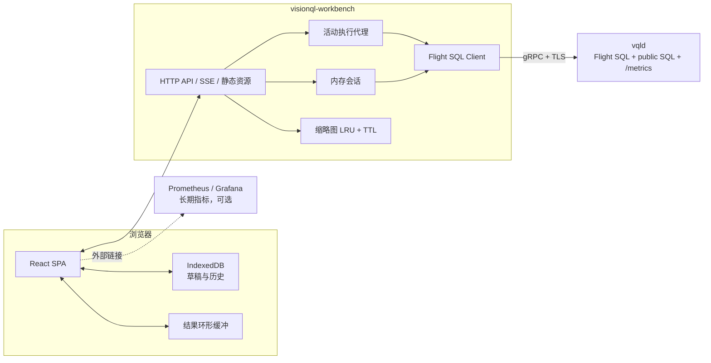
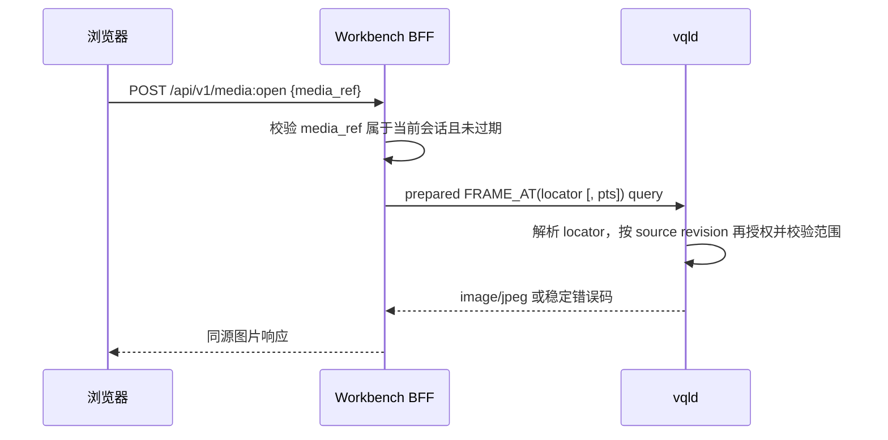

# VisionQL Workbench 设计

> 本文根据 [VisionQL PRD](./prd.md) 3.8 和 [引擎设计](./engine.md) 设计 Workbench。Workbench 是与 `vqld` 服务态在 v0.2 同期交付的多模态 SQL 客户端，负责查询、结果预览和持续查询运维，不拥有业务数据，也不依赖引擎私有接口。

- **设计版本**：v0.3.0（Draft）
- **日期**：2026-08-05
- **对应 PRD**：v0.1.6
- **对应引擎设计**：v0.5.0
- **状态**：评审中

---

## 1. 产品定位与范围

### 1.1 Workbench 解决什么问题

通用 SQL 客户端可以执行 VisionQL SQL，却无法自然显示 `IMAGE`、`BOX2D`、检测数组和持续结果。Workbench 提供三类专门体验：

1. **开发与调试**：编写 SQL，直接查看图片、检测框和实时结果；
2. **目录探索**：浏览表、流、模型、函数和 Sink，并将对象插入编辑器；
3. **运行维护**：查看持续查询状态、实际推理成本、丢帧和断流，并执行暂停、恢复和停止。

Workbench 不是 notebook、通用 BI、VMS、标注平台或独立的用户管理系统。

### 1.2 v0.2 交付范围

能力清单以 [PRD](./prd.md) 3.8 为准：SQL 编辑与执行、多模态结果预览、流结果实时预览、目录浏览、持续查询运维和成本面板，全部随 v0.2 交付；各能力的实现口径见本文 §6～§10。`EXPLAIN` 成本预估、视频时间轴、权限/审计展示、服务端保存查询和团队共享均未排期，待真实反馈后再评估。

### 1.3 设计原则

1. **引擎接口只有公开协议。** 查询、目录、运维和指标都走 Arrow Flight SQL 或公开 SQL；不增加 Workbench 专用引擎 RPC。
2. **不持久化业务状态。** Workbench 只有内存中的登录会话、活动预览、缩略图和短期指标；进程重启最多要求重新登录并重跑交互查询，不影响 `vqld` 中的持续作业。
3. **不改变 SQL 语义。** 结果限制发生在传输端，Workbench 不自动向用户 SQL 注入 `LIMIT`、过滤或采样。
4. **默认少传像素。** 查询先返回引用和缩略图，原图按需读取；大结果导出由引擎直接写 Sink。
5. **错误和能力由引擎决定。** Workbench 使用稳定错误码和 capability 信息，不解析自然语言错误，也不维护第二套权限模型。

---

## 2. 用户任务与信息架构

### 2.1 三个主要任务

**任务 A：调试一个视觉查询**

1. 从目录选择表或流；
2. 在编辑器中编写或粘贴 SQL；
3. 执行选中语句；
4. 在表格中查看图片和检测框；
5. 调整前端置信度滑杆观察已有结果，必要时修改 SQL 重新执行；
6. 查看执行时间、行数、是否截断和错误。

**任务 B：预览实时流**

1. 执行不带 Sink 的无界 SELECT；
2. 观察最近 N 行和实时指标；
3. 修改 SQL 前先取消当前预览；
4. 关闭结果页或浏览器后，由后端取消 Flight 查询。

**任务 C：维护持续查询**

1. 在 Query 页用显式 `SUBMIT QUERY <name> AS INSERT INTO ...` 创建持久作业；
2. 在查询列表中按状态、名称或来源筛选；
3. 查看定义修订、对象依赖、事件时间、投递语义、延迟、丢帧和推理成本；
4. 执行 `PAUSE`、`RESUME` 或 `STOP`；
5. 等待引擎返回新状态，失败时显示稳定错误码和下一步建议。

### 2.2 页面结构

```text
┌────────────────────────────────────────────────────────────────────┐
│ VisionQL   Endpoint / identity              Connection / Help      │
├──────────────┬─────────────────────────────────────────────────────┤
│ Query        │ Query workspace                                     │
│ Catalog      │ ┌─────────────────────────────────────────────────┐ │
│ Jobs         │ │ SQL editor / tabs                               │ │
│              │ └─────────────────────────────────────────────────┘ │
│ Catalog tree │ ┌─────────────────────────────────────────────────┐ │
│              │ │ Results: Table | Visual | Messages | Metrics    │ │
│              │ └─────────────────────────────────────────────────┘ │
└──────────────┴─────────────────────────────────────────────────────┘
```

路由和职责：

| 页面 | 主要内容 |
|---|---|
| Query | 编辑器、脚本结果、多模态预览、当前执行状态 |
| Catalog | 全量目录浏览和对象详情；Query 页左栏提供精简树 |
| Jobs | 持续查询列表、详情、指标和运维动作 |

v0.2 不增加首页仪表盘。登录后直接进入 Query，缩短首次得到结果的路径。

### 2.3 Query 工作区

- 左侧目录树可收起，双击对象名插入带引号的标识符；
- 中间编辑器支持多个本地 tab，每个 tab 对应一份浏览器本地草稿；
- 下方结果区按脚本语句建立结果 tab，DDL 显示消息，SELECT 显示 schema 和数据；
- 结果区同时显示运行时长、已接收行数/字节、截断状态、query ID 和取消按钮；
- 小屏设备保持可读，但 v0.2 以桌面浏览器为主要目标，不承诺手机上的完整编辑体验。

---

## 3. 系统架构

### 3.1 组件图



Workbench 包含浏览器 SPA 和一个轻量 BFF。BFF 的必要性不是增加业务后端，而是：

- 浏览器端缺少成熟、完整的 Flight SQL 客户端；
- 引擎凭证不应长期保存在浏览器存储；
- Arrow batch 需要转换为适合 UI 渲染的类型化结果；
- 缩略图字节需要独立缓存和同源访问；
- 浏览器连接消失时，必须可靠取消服务端查询。

### 3.2 客户端中的 `IMAGE` 表示

Workbench 采用 PRD 开放问题 4 的当前方案：引擎协议默认返回引用；Workbench 的 Flight 会话设置 `image_mode=thumbnail`，让结果同时带小尺寸预览。`IMAGE.uri` 只用于展示，用户点击时通过公开的 `FRAME_AT(locator [, pts_ms])` 读取原图；locator 绑定来源 revision 与媒体版本，服务端每次重新授权。文件与对象存储引用可以重读，实时 RTSP 帧只在引擎受限的压缩 GOP 环形缓存中可用，过期后保留缩略图并明确提示。完整传输契约和权限流程见 §4.3～§4.4。

### 3.3 状态所有权

| 状态 | 所有者 | 持久化 |
|---|---|---|
| 表、流、模型、函数、Sink | `vqld` Catalog | 是 |
| 持续查询定义、状态与检查点 | `vqld` | 是 |
| 身份、权限 | `vqld` / 外部 IdP | Workbench 不保存 |
| Workbench 登录会话 | BFF 内存 | 否；重启后重新登录 |
| 交互查询与实时预览 | BFF 内存 + 引擎执行上下文 | 否；连接丢失后取消 |
| 缩略图与媒体 locator | BFF 会话 LRU | 否；TTL 到期清理 |
| 编辑器草稿和查询历史 | 浏览器 IndexedDB | 仅当前浏览器 |
| 长期指标 | Prometheus 等外部系统 | Workbench 不负责 |

因此 Workbench 是“无持久业务状态”，不是“运行时完全无状态”。多副本部署需要会话粘滞；实例丢失只影响该实例上的登录会话和预览，不影响引擎作业。

### 3.4 技术选型

| 层 | 选择 | 原因 |
|---|---|---|
| BFF | Rust + axum + Arrow Flight client | Arrow 类型处理成熟；与引擎协议生态一致；可发布单二进制 |
| 前端 | React + TypeScript + Vite | 生态成熟，适合复杂表格、编辑器和 canvas 组合 |
| 编辑器 | CodeMirror 6 | 体积较小，可扩展 VQL 关键字与目录 completion source |
| 服务端推送 | SSE | 只需要服务端到浏览器的事件；断线恢复和反向代理支持简单 |
| 本地草稿 | IndexedDB | 容量和结构化数据支持优于 localStorage；仍属于浏览器本地 |
| 短期图表 | uPlot 或同级轻量时序库 | 适合查询详情中的少量实时曲线 |

浏览器 v0.2 不引入 Arrow JS。BFF 只转换受限的交互结果，避免同时维护 Arrow 与 JSON 两套前端渲染路径。以后若浏览器直连生态成熟，再单独评估。

---

## 4. 与引擎的公开契约

### 4.1 Flight SQL 能力矩阵

| Workbench 功能 | 引擎公开能力 |
|---|---|
| 登录与会话 | Flight Handshake / auth middleware，TLS；Handshake token 随后在每个 RPC 携带并逐请求验证 |
| 查询与 DDL | statement query/update；prepared result schema metadata 提供语句类型、有界性和副作用；参数化媒体查询使用 prepared statement |
| 结果 schema | `GetSchema` 和 `DoGet` 返回 Arrow schema/batch |
| 查询身份 | `FlightInfo.app_metadata` 中的 `VisionqlFlightInfoV1` 提供 query ID、statement kind 和 mode |
| 长查询与取消 | `PollFlightInfo`、`CancelFlightInfo`；连接断开也传播 cancellation token |
| 表目录 | `GetCatalogs`、`GetDbSchemas`、`GetTables`、`GetTableTypes` |
| 其他目录对象 | `SHOW STREAMS/MODELS/FUNCTIONS/SINKS`、`DESCRIBE`、`SHOW CREATE` |
| 持续查询 | `SUBMIT QUERY`、`SHOW/DESCRIBE QUERY`、`SHOW QUERY DEPENDENCIES`、`PAUSE`、`RESUME`、`STOP` |
| 指标 | 引擎 Prometheus 指标端点，BFF 按 `query_id` 等标签筛选；端点地址来自部署配置 |
| 错误 | 标准 gRPC status + `visionql-error-bin` trailing metadata |
| 兼容协商 | 固定 vendor `GetSqlInfo` ID：协议、方言、IMAGE 扩展版本和 capability |

Workbench 不直接访问 SQLite Catalog 或引擎进程文件；指标只读引擎公开的 Prometheus 格式端点，长期指标存储由外部 Prometheus/Grafana 承担。

### 4.2 版本协商

登录成功后，BFF 读取固定的 vendor SqlInfo：

```text
10000 visionql_protocol_version : string
10001 sql_dialect_version       : string
10002 visionql_image_version    : string
10003 capabilities              : list<string> {
  unbounded_do_get,
  poll_flight_info,
  cancel_flight_info,
  statement_info_v1,
  image_thumbnail_mode,
  frame_at_v1,
  query_control_v1,
  ...
}
```

- 协议 major 不兼容时阻止进入工作区并给出支持范围；
- 单项 capability 缺失时只关闭对应 UI，并解释需要的引擎版本；
- v1.0 前允许新增列和 capability，BFF 必须忽略未知字段；
- Workbench 不根据版本号猜功能，版本号只用于诊断，行为以 capability 为准。

`statement_info_v1` 存在时，BFF 从 prepare 返回的 result schema metadata 读取：

```text
visionql.statement_info.version = 1
visionql.statement.kind = query | update | ddl | persistent_submission
visionql.query.mode = bounded | unbounded | not_applicable
visionql.statement.side_effect = read_only | write
```

Workbench 不用本地 parser 推断这些语义。`statement_info_v1` 是 v0.2 Query 工作区的必需 capability；缺失时保留连接诊断和只读目录浏览，但阻止 SQL 执行，不用猜测结果生命周期。

### 4.3 `IMAGE` 传输契约

Workbench 连接建立后设置：

```sql
SET vql.result.image_mode = 'thumbnail';
SET vql.result.thumbnail_max_edge = 256;
SET vql.result.thumbnail_quality = 75;
```

返回列仍是标准 Arrow Struct，并带 `ARROW:extension:name=visionql.image` 和 `ARROW:extension:metadata={"version":1}`；它必须与 SqlInfo `visionql_image_version="1"` 一致。BFF 读取：

- `uri` 作为脱敏展示值，`locator` 作为不透明定位值，以及 `pts_ms`、`frame_id`、宽高等引用信息；
- `encoded` 中的 JPEG/PNG 缩略图；
- 字段元数据中的 `content_kind=thumbnail`，避免把缩略图误认为原图。

默认 256px 缩略图通常只有几十 KB；真实限制以结果字节预算为准，不把估算当协议。

### 4.4 原图点查

浏览器不能把任意 URI 或 locator 直接交给引擎。BFF 在转换结果时为每个 IMAGE 生成会话内 `media_ref`，其中关联引擎返回的 locator、可选目标 PTS、query ID 和登录会话；浏览器只取得脱敏 URI 与 `media_ref`。用户点击原图时：



- 文件或对象存储引用可以重新读取；
- RTSP live 帧只在引擎环形缓存未过期时可读；过期后 UI 保留缩略图并显示“原帧已过期”，不自动重跑查询；
- `FRAME_AT` 的 `$1` 只能取自 BFF 保存的 locator；`$2` 省略时使用 locator 自带 PTS，指定时也只能在同一个已授权视频对象内选点；
- BFF 不把 locator 返回给独立图片 URL，也不允许客户端修改 locator 或 PTS；
- `INVALID_MEDIA_LOCATOR`、`MEDIA_LOCATOR_EXPIRED`、`PERMISSION_DENIED`、`SOURCE_REVISION_UNAVAILABLE` 和 `FRAME_NOT_AVAILABLE` 分别显示对应状态，不合并成“图片加载失败”；
- blob 和 media_ref 都绑定登录会话，登出时立即清理。

### 4.5 系统 SQL 输出

Jobs 列表使用 `SHOW QUERIES`，详情使用 `DESCRIBE QUERY <id>`，对象依赖使用 `SHOW QUERY DEPENDENCIES <id>`，并只依赖 [引擎设计](./engine.md) §11.6 固定的最小列。Workbench 对状态和错误码使用枚举映射：

- 未知状态按原字符串显示，不把页面渲染失败；
- 指标单位以引擎 Prometheus 指标名后缀与 HELP 元数据为准，BFF 不自行猜测；
- `STOP` 后仍可查看历史定义和最终错误；
- 操作成功指引擎确认并且下一次 `SHOW QUERIES` 观察到目标状态，不以 HTTP 200 代替最终状态。

### 4.6 结构化错误

引擎用标准 gRPC status 表示错误大类，并在 `visionql-error-bin` trailing metadata 中按 [引擎设计](./engine.md) §11.4 的 Protobuf `VisionqlErrorV1` 返回版本化字段：

```text
version, code, message, hint,
source_start, source_end,
query_id, retryable
```

BFF 只从该 envelope 读取稳定 `code`、source span、`query_id` 和 `retryable`，不从 `message` 匹配错误类型；多语句脚本的 `statement_index` 由 BFF 根据当前顺序附加。缺少或无法解析扩展时保留标准 gRPC code，并显示“服务端未返回结构化详情”，不能把原始 metadata 暴露给浏览器。

---

## 5. Workbench BFF API

Workbench 自己的 HTTP API 只服务同源 SPA。它不是引擎 API，也不向第三方承诺兼容。

### 5.1 端点

| 方法与路径 | 用途 |
|---|---|
| `POST /api/v1/session` | 使用用户提交的引擎凭证建立内存会话 |
| `DELETE /api/v1/session` | 登出、取消该会话活动预览、清理 blob |
| `GET /api/v1/capabilities` | 返回经过筛选的引擎 capability |
| `POST /api/v1/executions` | 创建脚本执行，立即返回 Workbench execution ID |
| `GET /api/v1/executions/{id}/events` | SSE 接收 schema、batch、状态与错误 |
| `DELETE /api/v1/executions/{id}` | 取消 Flight 查询 |
| `GET /api/v1/catalog` | 读取并缓存目录数据 |
| `GET /api/v1/jobs` | 转换 `SHOW QUERIES` 结果 |
| `GET /api/v1/jobs/{id}` | 合并 `DESCRIBE QUERY` 与 `SHOW QUERY DEPENDENCIES` |
| `POST /api/v1/jobs/{id}/actions` | 将 pause/resume/stop 映射为公开 SQL |
| `GET /api/v1/jobs/{id}/metrics` | 抓取引擎指标端点并按 `query_id` 标签筛选转换 |
| `GET /api/v1/blobs/{id}` | 获取当前会话缩略图 |
| `POST /api/v1/media:open` | 按当前会话 media_ref 读取原图 |

所有状态变更端点要求 CSRF token。job ID 在进入 SQL 前必须通过 UUID/标识格式校验和正确引用，不能直接拼接任意浏览器输入。

### 5.2 执行事件

`POST /executions` 返回 ID 后，前端订阅 SSE。事件类型：

```text
execution_started
statement_started     { index, kind, mode, side_effect }
schema                { fields[] }
batch                 { rows[], blobs[], sequence }
statement_progress    { rows, bytes, elapsed_ms }
statement_completed   { affected_rows?, truncated? }
statement_error       { code, message, hint, statement_index, span? }
execution_completed
execution_cancelled
heartbeat
```

schema field 至少包含 `name`、Arrow storage type、VisionQL logical type、nullable 和字段元数据。`batch.rows` 使用与 schema 对齐的数组，避免每行重复列名。缩略图字节不进入 JSON，只返回受会话保护的 blob ID。

### 5.3 SSE 重连

- 每个活动执行在 BFF 保存一个小型事件 ring，并为事件分配递增 ID；
- 浏览器使用 `Last-Event-ID` 在短暂断线后补收事件；
- BFF 默认给重连 5 秒宽限期。宽限期内没有客户端回来，就取消 Flight 查询；
- 事件已从 ring 淘汰时返回 `event_gap`，前端显示结果不完整，不自动重新执行 SQL；
- SSE 重连永远不能触发一份新的引擎查询，避免 DDL 或 DML 被重复执行。

### 5.4 背压

- 有界结果由 gRPC 和 HTTP 流控自然暂停读取；
- BFF 的 Arrow→JSON 通道和 SSE 队列都有字节上限；达到上限且浏览器持续过慢时取消交互查询，并返回 `CLIENT_TOO_SLOW`；
- 无界预览在浏览器只保留最近 N 行。丢弃的是已经传到浏览器的旧展示行，不是引擎输入行；UI 显示累计收到和已从视图淘汰的行数；
- BFF 不为无人查看的预览无限缓存结果。

---

## 6. SQL 编辑与执行

### 6.1 编辑器

v0.2 提供：

- SQL 关键字、VQL DDL、类型、内置函数和表值函数高亮；
- 括号匹配、注释、格式化、查找替换和基础诊断；
- 表/流名称、列、模型、函数和 Sink 的目录补全；
- “运行选中内容”和“运行当前语句”；没有选区时根据光标定位语句；
- `Cmd/Ctrl+Enter` 执行，`Esc` 或按钮取消；
- 错误 span 可用时在编辑器中定位。

编辑器的语法包只负责高亮和语句边界，不承担最终语义判断。目录补全可能短暂过期，执行结果始终以引擎为准。

### 6.2 多语句脚本

BFF 使用独立的词法切分器识别分号、字符串、引用标识符和行/块注释，不复制完整 VQL parser。它只负责确定语句边界；每条语句都按顺序 prepare，并以 §4.2 的 schema metadata 作为类型、有界性与副作用的唯一判断：

- 每条语句有独立结果 tab；
- 第一条错误会停止后续语句，v0.2 不提供“错误后继续”；
- 有界 SELECT 达到显示上限后被取消并标记为截断，随后脚本可以继续；
- 普通无界 `SELECT` 和 `INSERT INTO ... SELECT ...` 都是附着执行，不会自然完成，因此必须是脚本最后一条语句；若当前 prepare 后发现它不是最后一句，BFF 在执行当前语句前停止并提示拆分，不能自动转成后台作业；
- 显式 `SUBMIT QUERY <name> AS INSERT INTO ... SELECT ...` 的 kind 为 `persistent_submission`，执行后立即返回 query ID、名称、状态和定义 revision，可以继续执行后续语句；结果 tab 显示“已提交”以及 Jobs 详情链接；
- 普通无界 `INSERT` 的附着式 DoGet 显示引擎固定的状态流；取消、页面离开或 session 过期都会终止 Sink 查询，不创建持久作业；
- 脚本不是隐式事务。后续语句可能依赖前面的 DDL，因此不能在开始前完成全局语义预检；如果执行到中途才发现后续无界语句位置不合法，之前成功的语句不会回滚；需要原子性的 DDL 必须由单条引擎语句自身保证。

完整脚本切分需要与引擎 parser 共享金样用例，覆盖字符串、注释、引用标识符和 VQL DDL；任何不一致都必须在协议契约测试中阻止发布。运行时的语义分类仍只信任引擎 metadata。

Query 页提供“提交为持久作业”动作时，必须要求用户填写名称，生成并展示完整 `SUBMIT QUERY ... AS ...` SQL，用户确认后再通过同一执行接口发送。Workbench 不在后台静默改写普通 `INSERT` 的生命周期。

### 6.3 传输限制

有界查询的默认限制：

- 最多 1000 行；
- 最多 8MiB JSON + blob；
- 单个缩略图最大 256KiB；
- 先达到任一限制就取消结果 stream，并显示具体原因。

无界预览不能套用累计 1000 行或 8MiB 上限，否则它很快就不再“实时”。它改用固定的浏览器行 ring、BFF/SSE 队列字节上限、单行/单缩略图上限、速率限制和可配置的最长预览时长。只要页面仍连接且没有触发这些保护，累计接收行数可以继续增长，旧行仅从展示 ring 淘汰。

这些值可以由部署配置收紧，但不能由页面无限放大。Workbench 不改写 SQL，因而聚合、排序和模型调用仍按原查询完整语义执行；有界限制只决定多少结果被传到浏览器，无界限制只约束预览资源。

大结果不经 BFF 导出。导出向导只生成并展示 `INSERT INTO` 或 CTAS SQL，用户确认后由 `vqld` 直接写入 Lance/Parquet/Sink。

### 6.4 查询历史与草稿

- 草稿和历史保存在浏览器 IndexedDB，按“引擎 endpoint + principal 不可逆摘要”隔离；
- BFF 会为执行临时接收 SQL，但不持久化草稿/历史，也不提供跨设备同步；
- 历史记录包含 SQL、时间、耗时和成功/失败，不保存结果数据；
- 登出时默认保留本地草稿，但提供“一并清除本地数据”；共享电脑模式可以配置登出即清除；
- SQL 可能包含敏感 URI。界面明确提示使用引擎 secret 引用，不把密码写进 SQL；历史预览对常见 URI userinfo 和敏感 query key 做尽力脱敏，但不把这当作安全边界。

---

## 7. 多模态结果

### 7.1 通用表格

- 表头显示列名和逻辑类型；嵌套类型可展开；NULL 与空数组必须视觉区分；
- 浏览器只对已经收到的行做分页，默认每页 50 行，不把“下一页”伪装成服务端全量分页；
- 行详情使用树状查看 STRUCT/ARRAY；时间戳按用户时区显示，同时可查看 UTC 原值；
- Binary 默认只显示大小和哈希摘要，不直接下载；
- 结果被截断时，在表格顶部持续显示警告，截图或复制时也保留提示文本。

### 7.2 IMAGE

- 单元格按宽高比显示缩略图，懒加载 blob；加载失败显示稳定占位符和错误原因；
- 点击打开图片查看器，按需调用原图点查；查看器明确标记“缩略图”或“原图”；
- 原图过期、无权限或源不可重放时仍保留缩略图；
- 图片旋转和 EXIF orientation 由引擎编码缩略图时规范化。BOX2D 坐标必须对应规范化后的显示方向；
- 复制单元格时复制脱敏引用摘要，不把二进制或带签名 URL 放进剪贴板。

### 7.3 BOX2D 与检测数组

自动叠加规则：

1. 同一行正好有一列 IMAGE 和一列 `BOX2D` 或检测数组时自动配对；
2. 多个候选列时不猜测，显示“选择图片列 / 检测列”控件；用户选择只保存在当前结果 tab；
3. BOX2D 使用 `[0,1]` 归一化坐标，canvas 按实际内容区域和 device pixel ratio 变换；
4. 标签和置信度绘制在框边，颜色由标签稳定哈希产生；
5. 越界或非有限坐标不绘制，并在行详情标记无效数据。

置信度滑杆只过滤已经返回的检测数组或行，旁边持续显示“仅过滤当前预览，不会重新执行 SQL”。滑杆初始值不偷偷采用模型阈值；默认展示查询返回的全部检测。

### 7.4 VECTOR 和 VIDEO

- `VECTOR(n)` 默认显示维度、范数和前 4 个值，可展开查看当前行完整数组；大量向量不绘制图表；
- `VIDEO` 显示 URI 摘要、时长、fps、分辨率和 codec；
- v0.2 不实现视频播放器或时间轴。用户需要具体画面时，通过 SQL 使用 `FRAMES` 或 `FRAME_AT`。

### 7.5 可访问性

- 图片查看器、结果 tab、操作按钮和错误提示支持键盘操作；
- canvas 叠加旁提供文本检测列表，不能只靠颜色表达标签；
- 标签颜色满足对比度要求，并允许关闭框叠加；
- 实时新增行使用非打断式 aria live 区域，不让屏幕阅读器逐行抢占焦点；
- 尊重 `prefers-reduced-motion`，实时列表不使用强制动画。

---

## 8. 实时预览

### 8.1 生命周期

无界 SELECT 的结果 tab 有明确状态：

```text
STARTING → LIVE ⇄ RECONNECTING → CANCELLED
                 └────────────→ FAILED
```

- `LIVE` 时显示最后事件时间、接收速率、累计行数、当前 ring 大小和预览时长；
- 浏览器默认保留最近 500 行，可在受限范围内调整；
- 用户暂停“页面滚动”只冻结渲染，不暂停引擎查询，界面必须区分；
- 真正停止使用 Cancel 按钮；切换到其他 Query tab 可以继续，关闭结果 tab、登出或离开 Workbench 会取消；
- 浏览器异常断开后使用 §5.3 的短宽限期，随后取消，避免孤儿查询；
- 取消完成后才允许用同一 tab 重新执行，防止两个 live 查询结果交叉。

### 8.2 指标与数据分离

结果 batch 经当前 Flight DoGet 到达。该预览的引擎指标由 BFF 低频抓取引擎 Prometheus 指标端点获得，默认每 2 秒一次：

- 指标请求失败不终止结果预览；
- 结果 DoGet 失败也不伪造指标为 0；
- 页面隐藏时指标轮询降到 10 秒，结果 stream 仍按用户选择继续或取消；
- 长期历史不保存在 Workbench，页面只画内存中的最近 1 小时。

---

## 9. 目录浏览

### 9.1 数据来源

| 对象 | 获取方式 |
|---|---|
| Table / View | Flight SQL `GetTables`，需要时包含 schema |
| Stream | `SHOW STREAMS` + `DESCRIBE STREAM` |
| Model | `SHOW MODELS` + `DESCRIBE MODEL` |
| Function | `SHOW FUNCTIONS` + `DESCRIBE FUNCTION` |
| Sink | `SHOW SINKS` + `DESCRIBE SINK` |
| DDL | `SHOW CREATE ...`，输出必须脱敏 |

引擎只返回当前 principal 可见的对象。Workbench 不在前端再次模拟权限过滤。

### 9.2 缓存与失效

- BFF 按用户会话缓存目录 30 秒；浏览器只缓存当前页面需要的数据；
- 成功执行目录 DDL 后立即使相关缓存失效；
- 用户可以手动刷新；刷新失败时保留旧数据显示“可能过期”；
- 补全使用最近一次成功快照，选择项显示对象类型，避免同名 Table/Stream 混淆。

### 9.3 对象详情

对象详情只展示公开可查询信息：

- schema、逻辑类型和 nullable；
- 来源种类、脱敏位置、事件时间与 watermark；
- Model type、固定 revision/hash 摘要和约束；
- Function revision、签名、稳定 `model_id` 和结果语义参数；Model 当前 head revision 作为单独字段展示；
- Sink format 和脱敏目标；
- 可复制的脱敏 DDL。

v0.2 不在详情页编辑对象。变更通过生成 SQL 回到 Query 页执行，保留声明式、可审查的操作路径。

---

## 10. 持续查询运维与成本

### 10.1 Jobs 列表

列表至少展示：

- `attached` / `persistent` lifecycle、名称和 query ID；持久作业有名称，附着查询名称为 NULL；
- `STARTING / RUNNING / PAUSED / RECOVERING / FAILED / STOPPED`；
- batch / stream 模式、源种类、source health 和投递语义；查询可以在 `RUNNING` 时同时标记源 `DISCONNECTED`；
- 运行时长、最近更新时间和定义修订；
- 最近错误码摘要；
- 当前输入 fps、推理 fps、P95 延迟和丢帧数。

Jobs 页默认只展示持久作业，并允许切换查看当前 principal 可见的附着查询；附着查询仍由创建它的 Query execution 取消，不显示 `PAUSE/RESUME`。列表默认按非终态优先、最近更新倒序。筛选和排序只作用于已从引擎取得的列表；数据量超过一次结果限制时，使用引擎提供的公开分页参数或过滤 SQL，不能在 BFF 内假装拿到了全量。

列表指标通过一次指标端点抓取按 `query_id` 标签合并，不能为每行发起一次请求；详情页复用同一抓取结果的对应子集。

### 10.2 详情页

页面先执行 `DESCRIBE QUERY '<query_id>'` 取得定义与状态，再执行 `SHOW QUERY DEPENDENCIES '<query_id>'` 取得固定的 Function、Model、source 和 Sink revision/semantic fingerprint；不能从保存的 SQL 文本猜依赖。

详情分为四块：

1. **定义**：名称、lifecycle、只读 SQL、定义快照、模型与函数修订及完整对象依赖；
2. **运行状态**：最后事件时间、水位线、epoch、检查点（如适用）；
3. **质量**：解码错误、推理错误、迟到行、丢帧原因和断流缺口；
4. **实际成本**：处理帧、推理次数、实际 batch、GPU seconds、P50/P95 推理延迟。

没有指标时显示“暂无数据”或“不支持”，不能显示 0。单位完全使用引擎返回值。

### 10.3 运维动作

- `PAUSE`：二次确认中说明 RTSP 暂停会产生不可恢复缺口；
- `RESUME`：显示将继续使用现有 definition snapshot；如果目录已有新修订，提示必须停止旧作业并显式 `SUBMIT` 新作业才能采用，新作业会获得新的 query ID；
- `STOP`：高风险终态操作，要求输入查询名或明确确认；
- 操作发送后按钮进入 pending，直到 `SHOW QUERIES` 观察到目标状态或引擎返回失败；
- Workbench 不做乐观状态修改，不在超时时把动作标成成功；
- 对没有权限的动作直接展示引擎权限错误，按钮可依据 capability 隐藏，但隐藏不是安全边界。

### 10.4 成本阶段边界

v0.2 只展示实测：

```text
processed_frames
inference_requests
model_invocations
gpu_seconds
average_batch_size
queue_wait_ms
```

计划估算（`EXPLAIN` 成本预估）属于未排期的“优化器降本”方向；届时以新增 capability 引入，并并排显示“估算”和“实际”，两者标明时间范围、模型修订和采样率，不合并成一个看似精确的数字。

Workbench 不把 GPU seconds 换算为货币；价格和计费属于部署/商业配置。

---

## 11. 会话与安全

### 11.1 登录会话

- v0.2 的引擎 endpoint 由部署配置并在登录页只读显示；登录页只收集引擎支持的凭证，BFF 立即通过 Flight 验证，浏览器不能指定任意后端地址；
- BFF 只在内存中保存凭证或短期引擎 token，不写日志、磁盘、IndexedDB 或 cookie；
- 每个登录会话对应一个独立的 Flight SQL 逻辑 session，`image_mode` 等 `SET` 选项不能跨用户复用；BFF 必须在每个 Flight RPC 上携带该会话的 token，服务端逐请求验证后才选择 Session。满足这一条件时底层 gRPC channel 才可以共享；
- 浏览器 cookie 只包含高熵会话 ID，使用 `HttpOnly`、`Secure`、`SameSite=Strict`；需要外部 IdP 回跳时才按部署要求改为 `Lax`；
- 会话默认 30 分钟无操作过期。活动 live 预览算作操作，但部署可以设置绝对最长时长；
- 登出先取消活动交互查询，再清理媒体缓存和凭证。

### 11.2 Web 安全基线

- 浏览器到 BFF 和 BFF 到 `vqld` 都使用 TLS；
- 所有写操作使用 CSRF token，API 只允许同源 CORS；
- CSP 默认禁止内联脚本和第三方脚本，`frame-ancestors 'none'`；
- React 文本渲染保持转义，SQL、错误、标签和 URI 不进入 `dangerouslySetInnerHTML`；
- blob URL 不可猜、绑定会话、有 TTL，并返回 `nosniff` 与正确 MIME；
- 媒体点查使用服务端保存的 media_ref，不接受浏览器提供的新 URI、locator 或 PTS；
- 错误、审计字段和请求日志统一脱敏 Authorization、cookie、URI userinfo 和签名 query；
- BFF 对登录、媒体点查、执行创建和查询操作设置速率限制与并发上限。

### 11.3 权限模型

Workbench 不缓存“允许/拒绝”决定。每次查询、`FRAME_AT` 和作业动作都由引擎按当前身份重新授权。目录不可见不等于无法访问，因此安全测试必须直接尝试越权 SQL，以及伪造、跨会话复用、撤权后复用和过期的 media_ref/locator。

### 11.4 多副本

v0.2 多副本需要负载均衡器按 session cookie 做粘滞：

- 活动 SSE、Flight stream 和 blob cache 留在创建它们的实例；
- 健康检查失败后用户重新登录，原实例的 Flight 连接断开并由引擎取消；
- 不引入 Redis 等共享状态，只为保住短期预览而增加持久依赖不符合首发范围。

---

## 12. 错误、可观测性与性能

### 12.1 错误呈现

错误面板按稳定字段显示：

```text
version
code
message
hint
statement_index
source_start
source_end
query_id
retryable
```

- 除 `statement_index` 外，字段来自 §4.6 的 `visionql-error-bin`；BFF 不解析 message/hint 推断类型；
- source span 是当前 statement UTF-8 文本的半开字节区间；BFF 先换算到完整脚本位置和浏览器字符串索引，再定位编辑器；
- 行级错误通过结果 NULL 和指标展示，不弹出“查询失败”；
- 权限、能力缺失、资源不足、媒体过期和客户端过慢使用不同 UI；
- “重试”只用于 `retryable=true` 的只读交互查询。Workbench 不自动重试 DDL、DML 或运维动作。

### 12.2 BFF 指标

Workbench 自身暴露：

- 登录会话数、活动执行数和 SSE 连接数；
- Arrow→JSON 转换时间、发送字节和截断次数；
- blob cache 当前/峰值、命中率和淘汰；
- Flight 请求延迟、取消延迟和失败码；
- 因浏览器断开或过慢而取消的查询数。

日志关联 `workbench_execution_id`、引擎 `query_id` 和会话的不可逆摘要，不记录 SQL 全文；调试模式也必须先脱敏。

### 12.3 性能预算

首发验收目标：

| 项目 | 目标 |
|---|---|
| 静态页面首次加载 | 压缩后前端资源保持在合理单页应用体积，具体阈值由构建基线固定 |
| 目录补全 | 缓存命中后本地返回；冷加载 P95 由引擎元数据查询决定 |
| 首批结果 | BFF 转换开销不超过引擎查询耗时的显著比例；单独记录而非混在查询时间中 |
| 实时预览 | 500 行 ring 下页面持续运行 1 小时无内存增长 |
| 缩略图缓存 | 默认每实例 256MiB 上限，TTL 10 分钟；两者均可收紧 |
| 取消 | 页面关闭后在宽限期结束即发起 Flight cancel，并在测试中验证服务端资源释放 |

前端构建预算、BFF 内存和结果限制要在 CI 中测量，不能只写在配置默认值里。

---

## 13. 部署与代码组织

### 13.1 发布形态

```bash
visionql-workbench \
  --server grpc+tls://vqld.example.com:32010 \
  --listen 0.0.0.0:8080
```

- 前端构建产物嵌入 BFF 单二进制，同时提供容器镜像；
- 默认只配置一个 `vqld` endpoint。v0.2 不在一个会话中切换多端点；
- Workbench 部署在中心或管理网络，不部署到每个边缘节点；
- 浏览器 TLS 可以由 Workbench 或反向代理终止，部署文档必须说明信任头和 secure cookie 配置；
- readiness 要同时检查 BFF 可用和引擎连接配置合法，但引擎暂时不可达时进程仍可启动并显示诊断页。

### 13.2 仓库布局

```text
vql-workbench/
├── Cargo.toml              # 独立 Rust workspace
├── server/
│   ├── Cargo.toml
│   ├── src/session/        # 内存会话和 Flight auth
│   ├── src/execution/      # Flight stream、SSE、取消和限制
│   ├── src/catalog/        # metadata / SHOW 转换
│   ├── src/media/          # blob cache 与原图点查
│   └── src/http/           # API、安全中间件、静态资源
├── web/
│   ├── package.json
│   ├── src/query/
│   ├── src/results/
│   ├── src/catalog/
│   ├── src/jobs/
│   └── src/session/
└── tests/
    ├── contract/
    └── e2e/
```

硬约束：

- `vql-workbench/server` 不依赖根 workspace 中的 `vql-core`、`vql-daemon` 或其他引擎 crate；
- 协议测试从 Flight SQL schema 和公开 SQL 生成 fixtures，不复制 Catalog Rust struct；
- 前后端 API 类型在 Workbench 内生成，不能从引擎内部类型生成；
- 引擎和 Workbench 使用独立版本与 CI，可按目录分别发布。

---

## 14. 测试与验收

### 14.1 测试分层

| 层 | 内容 |
|---|---|
| 前端单元 | 类型渲染、BOX2D 坐标、置信度过滤、ring、状态机、错误映射 |
| 前端可访问性 | 键盘、焦点、文本检测列表、对比度、reduced motion |
| BFF 单元 | 脚本词法切分、顺序 prepare、结果限制、Arrow→JSON、blob TTL、media_ref、防注入 |
| 协议契约 | 固定 SqlInfo ID/capability、全部 metadata RPC、`statement_info_v1`、FlightInfo app metadata、附着 Sink 状态流、prepared、cancel、逐 RPC session token、Protobuf 错误、IMAGE schema/version、系统 SQL |
| 集成 | mock Flight server 的慢客户端、断线、取消、trailing metadata 错误、未知 capability/字段降级 |
| 真实引擎 E2E | 登录、DDL、批查询、多模态显示、live preview、Jobs 操作、权限拒绝 |
| 安全 | CSRF、XSS 字符串、伪造/过期/撤权 locator 与 media_ref、SSRF、日志脱敏、跨用户缓存和 Flight session 隔离 |
| 稳定性 | live 预览 1 小时、BFF 重启、多副本粘滞失败、无孤儿查询 |

### 14.2 PRD 验收映射

| PRD 3.8 能力 | 验收场景 |
|---|---|
| SQL 编辑与执行 | 分别运行选区、当前语句和多语句脚本；验证 statement metadata 分类、显式 `SUBMIT`、普通无界 INSERT 保持附着、错误定位；历史仅保存在本地 |
| 传输端限制 | 聚合 SQL 不被改写；超过行/字节限制后显示原因并确认引擎查询已取消 |
| IMAGE / BOX2D | 缩略图、原图、检测数组和 UNNEST 形态均正确；live 原图过期有清晰降级 |
| 置信度滑杆 | 调整后无网络查询，UI 明确标记只过滤当前预览 |
| VECTOR | 默认折叠，展开不影响其他行性能 |
| 实时预览 | 最近 500 行；关闭 tab、断网超时、登出都会取消 Flight 查询 |
| 目录 | 五类对象可见、schema/DDL 正确脱敏，DDL 后缓存失效 |
| 运维 | `SUBMIT QUERY` 返回名称/query ID；详情显示定义和依赖；Running 作业可 Pause/Resume/Stop；RTSP pause 显示缺口警告；最终状态来自引擎 |
| 成本面板 | 只展示来自引擎 Prometheus 指标端点的实测数据；没有数据不显示为 0 |
| 独立性 | Workbench 构建图中不存在根 workspace 引擎 crate 依赖；全部 E2E 只使用公开协议 |

### 14.3 发布门槛

v0.2 Workbench 发布前必须满足：

1. 通过真实 `vqld` 的协议契约套件；
2. 端到端完成“无需本地安装的查询 → 图片和框预览 → live 取消 → 持续查询运维”；
3. 浏览器关闭后没有遗留交互查询；
4. 越权 `FRAME_AT`、伪造/过期/撤权 locator 与 media_ref 和任意 URL 读取均被拒绝；
5. 前后端单元、E2E、可访问性和依赖漏洞检查全部通过；
6. 独立构建、镜像启动和反向代理部署文档经过验证。

---

## 15. 明确不做的能力

§1.1 与 PRD 3.8 已界定 Workbench 不是 notebook、通用 BI、VMS、标注平台或独立的用户管理系统。补充两条设计层边界：身份与授权只有引擎一份真相，Workbench 不建自己的用户/权限数据库；长期指标存储由 Prometheus/Grafana 承担。浏览器直连 Flight SQL、notebook 多 cell、服务端保存查询与团队共享、视频播放器/时间轴、多 endpoint 与边缘车队管理均未排期，按真实反馈重新评估。

---

## 16. 开放问题

| 问题 | 当前倾向 | 决策时间 |
|---|---|---|
| `IMAGE` 缩略图参数 | 引擎默认 reference；`uri` 只展示、locator 负责读取已固定；Workbench 会话使用 thumbnail，待确定尺寸/字节上限和 locator TTL | v0.2 Flight schema 冻结前 |
| live 原图缓存时长 | 引擎短期环形缓存；过期保留缩略图 | 真实 8 路负载测试后 |
| Jobs 列表大规模分页 | 优先定义公开 SQL 过滤/分页，不在 BFF 全量拉取 | v0.2 生产规模测试前 |
| 外部 IdP 登录 | 首发先支持引擎 token/basic 能力；OIDC 由部署层或引擎统一 | v0.2 认证方案冻结前 |
| 大结果导出 UX | 生成明确 SQL 并由用户确认，不经 BFF 下载 | v0.2 可用性测试后 |
| 视频时间轴（未排期） | 先测 `FRAME_AT` 并发、缓存命中和对象存储费用 | 排期前 |

---

## 附录 A：界面动作到引擎协议的映射

| 界面动作 | Workbench BFF | `vqld` |
|---|---|---|
| 登录 | 创建内存 session | Flight auth handshake |
| 执行 SQL | 创建 execution，转发结果 | statement query/update + DoGet |
| 取消 | DELETE execution | CancelFlightInfo / cancellation token |
| 加载目录 | 聚合并缓存 30 秒 | GetTables + SHOW / DESCRIBE |
| 查看缩略图 | 会话 blob cache | 查询结果的 IMAGE thumbnail |
| 打开原图 | 校验 media_ref | prepared `TO_JPEG(FRAME_AT(...))` |
| 实时预览 | Flight→SSE，维护短事件 ring | 无界 DoGet |
| 显式提交持久作业 | 展示生成 SQL 并经 execution 发送 | SUBMIT QUERY name AS INSERT INTO ... |
| 查看 Jobs | 类型化 JSON | SHOW QUERIES |
| 查看 Job 详情 | 合并定义、状态与依赖 | DESCRIBE QUERY + SHOW QUERY DEPENDENCIES |
| Pause / Resume / Stop | 校验 ID，执行公开 SQL | 作业状态机 |
| 查看实际成本 | 抓取指标端点并按 `query_id` 筛选 | Prometheus 格式 /metrics 端点 |

---

## 参考资料

- [Apache Arrow Flight SQL 规范](https://arrow.apache.org/docs/format/FlightSql.html)
- [Apache Arrow Flight：取消与 PollFlightInfo](https://arrow.apache.org/docs/format/Flight.html)
- [Apache Arrow：扩展类型](https://arrow.apache.org/docs/format/Columnar.html#extension-types)
