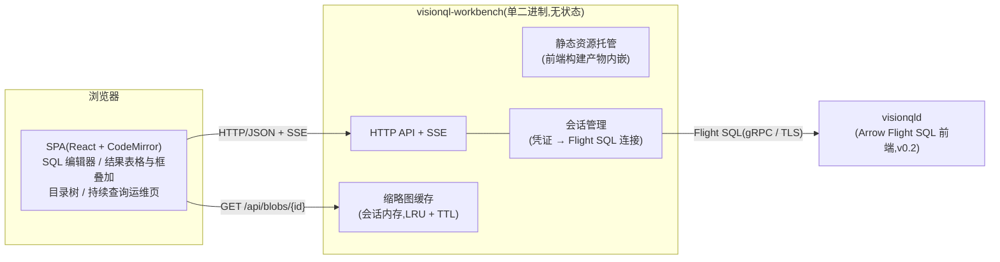

# VisionQL Workbench 设计文档

> 本文承接 [PRD](./prd.md) 3.8。Workbench 是随服务态（v0.2）提供的 Web 工作台，用于执行 SQL、预览多模态结果，以及监控持续查询和运行成本。它是一个独立的轻量子项目，通过 Arrow Flight SQL 连接 `visionqld`，不使用任何引擎私有接口。

- **版本**：v0.1（Draft）
- **日期**：2026-08-03
- **对应文档**：PRD v0.1.3（3.8 节）、[系统设计](./system_design.md) v0.3.2（§21.1 Workbench 行）
- **状态**：评审中

---

## 1. 概述

### 1.1 定位与范围

Workbench 是 `visionqld` 的官方图形客户端，而不是一套独立的后端产品。它依赖服务态；库态用户仍然通过 shell 或 notebook 查看结果（系统设计 §13/§14）。

通用 SQL 客户端可以通过 JDBC/ADBC 连接 `visionqld`，但通常只会把 `IMAGE` 显示为二进制，把检测结果显示为结构体文本。Workbench 的核心价值，是让用户直接看到图片、检测框和实时结果，并围绕视觉查询提供更合适的调试和运维体验（PRD 3.8）。

本文详细说明 v0.2 的首发能力，并说明 v0.3 成本面板需要预留的接口。Flight SQL 前端、`FRAME_AT` 函数等引擎能力只在这里列出需求（§3.2），具体设计见系统设计 §21.1。

### 1.2 三条设计原则

1. **只使用 Flight SQL**：查询执行、目录访问、运维操作和指标读取，都通过 SQL 语句或 Flight SQL 标准 RPC 完成。Workbench 同时也是标准客户端协议的完整性验证：如果某项操作无法通过公开协议完成，其他客户端同样会遇到问题。引擎不会为了 Workbench 额外提供一套私有管理 API。
2. **保持无状态**：Workbench 不持久化业务数据。认证凭证只转发给引擎，用户会话保存在内存中，保存的查询放在浏览器 localStorage。进程可以随时重启或水平扩容，用户只需重新登录。
3. **控制部署复杂度**：前端静态资源内嵌在单个二进制中，不依赖数据库、消息队列或后台任务。浏览器端不引入 Arrow 运行时；后端会将受行数限制的查询结果转换为 JSON（§4.1）。

---

## 2. 总体架构



| 组件 | 职责 |
|---|---|
| 前端 SPA | 提供编辑器、结果表格、多模态渲染（缩略图和检测框叠加）、目录树和持续查询运维页面。前端不承载业务逻辑，所有数据都来自后端 API |
| Workbench 后端 | 托管静态资源；在 HTTP/SSE 与 Flight SQL 之间转换；管理会话和凭证；将 Arrow 结果转换为 JSON，并通过 HTTP 返回 `IMAGE` 字节 |
| `visionqld` | 提供查询执行、目录、权限和指标等实际能力 |

**为什么需要后端，而不是让浏览器直接连接 `visionqld`？** Flight SQL 基于 gRPC，浏览器没有原生 gRPC 支持，gRPC-Web 和 JavaScript Flight SQL 客户端也还不成熟。后端还负责保管凭证，避免凭证落到浏览器中，并转发图片字节。未来如果 JavaScript 客户端生态成熟，后端可以简化为静态资源托管和凭证代理（§8 开放问题 4）。

---

## 3. 与引擎的接口

### 3.1 一切经 Flight SQL

| Workbench 功能 | 对应 SQL / Flight SQL 能力 |
|---|---|
| 执行查询 / DDL / DML | 使用 `Execute` / `ExecuteUpdate`。Workbench 识别字符串和注释后切分多语句脚本，按顺序执行并逐条展示结果 |
| 查询取消 | 使用 Flight SQL `CancelQuery`，处理用户取消、页面关闭或达到结果上限等情况（§4.1/§4.3） |
| 目录浏览 | 表使用 Flight SQL 标准元数据 RPC（如 `GetTables`）；流、模型、函数和 Sink 使用 `SHOW STREAMS/MODELS/FUNCTIONS/SINKS` 与 `DESCRIBE`，并支持查看 DDL |
| 编辑器补全 | 使用上述目录数据，并在会话内缓存 30 秒 |
| 持续查询列表与指标 | 轮询 `SHOW QUERIES` / `SHOW METRICS`（§4.4） |
| 运维操作 | `PAUSE` / `RESUME` / `STOP <query>` |
| 成本面板（v0.3） | 使用 `EXPLAIN` 展示成本预估，并通过 `SHOW METRICS` 展示实际数据 |

### 3.2 对引擎的需求清单

Workbench 是 v0.2 中第一个覆盖完整协议面的 Flight SQL 客户端，因此它的需求也构成 Flight SQL 前端的验收清单。这些需求分为两类。

**需要新增的能力**只有两项，而且都可以通过现有扩展点实现：

1. **结果集中 `IMAGE` 的会话级表示选项**：`SET vql.result.image_mode = reference | thumbnail | inline`，默认值为 `reference`。该模式只返回引用态元数据 Struct，不包含像素，相当于将系统设计 §5.2 的跨进程规则落实到协议层。`thumbnail` 模式由服务端在生成结果时附带 JPEG 缩略图，默认最长边 256px、质量 75。Workbench 默认使用 `thumbnail`，这样图片可以直接显示在表格中。每行预计占用 10～30KB，100 行结果约为 2MB。
2. **按引用取帧函数 `FRAME_AT(uri, pts_ms)`**：函数根据引用字段解码指定帧并返回 `IMAGE`；如果图片行的 `pts_ms` 为 NULL，则读取原文件。Workbench 使用 `TO_JPEG(FRAME_AT(?, ?), 90)` 获取原图。这个函数对 BI 插件和 notebook 等其他客户端同样有用，不属于 Workbench 私有能力。引擎实现复用解码会话缓存（系统设计 §10.3）。权限应与表/流级权限一致；v0.2 暂时按用户是否有权读取底层存储位置来判断（§8 开放问题 1）。

**现有能力的验收用例**不增加新功能，但需要纳入 Flight SQL 前端的测试范围：

- 五类目录对象都能通过 `SHOW` / `DESCRIBE` 查询，覆盖 shell `\d` 的同源能力；
- 无界 SELECT 可以通过 `DoGet` 持续返回结果，并能通过 `CancelQuery` 终止。§4.3 的实时预览依赖这一能力。

---

## 4. 关键设计

### 4.1 查询执行通路

```mermaid
sequenceDiagram
    participant B as 浏览器
    participant C as Workbench 后端
    participant D as visionqld

    B->>C: POST /api/statements {sql}
    C->>D: Flight SQL Execute(多语句切分,顺序执行)
    D-->>C: Arrow 批流(IMAGE 列含缩略图,会话选项 thumbnail)
    C->>C: Arrow→JSON;缩略图字节入会话缓存,JSON 中放 blob 引用
    C-->>B: 行数据(达到取数上限即截断并 CancelQuery)
    B->>C: GET /api/blobs/{id}(表格  按需拉取)
    C-->>B: image/jpeg
    B->>C: 点击查看原图:POST /api/frames {uri, pts_ms}
    C->>D: SELECT TO_JPEG(FRAME_AT(?, ?), 90)
    D-->>C: 原图字节
    C-->>B: image/jpeg(模态框展示)
```

- **在传输端截断结果，不改写 SQL**：交互查询默认最多返回 1000 行或 8MB 数据，以先达到的限制为准。达到上限后，Workbench 调用 `CancelQuery`，并在界面上提示“结果已截断”。Workbench 不会自动注入 `LIMIT`，因为这可能改变聚合查询的语义。
- **将 Arrow 转换为 JSON**：标量按常规方式转换，时间戳使用 ISO-8601。`VECTOR` 只展示前 k 个元素和总维度。`IMAGE` 的元数据（uri、pts_ms、宽高）写入 JSON；缩略图字节不写入 JSON，而是保存到会话内存缓存中。缓存使用 LRU + TTL，默认总上限为 256MB。JSON 只包含 `/api/blobs/{id}` 引用，表格中的 `` 按需加载；blob 访问受会话 cookie 保护。
- 全量导出不经过上述截断流程。Workbench 生成 `INSERT INTO` 或 CTAS 语句，让引擎直接写入 Parquet/Lance。这样导出仍然通过 SQL 完成，Workbench 不需要逐行转发数据（§8 开放问题 2）。

### 4.2 多模态结果渲染

- **`IMAGE` 单元格**：显示缩略图。用户点击后，后端通过 `TO_JPEG(FRAME_AT(?, ?), 90)` 获取原图，并在弹窗中展示。
- **检测框叠加**：如果同一行同时包含 `IMAGE` 和检测结果列（`List<Struct{label, confidence, box}>`），前端使用 canvas 将归一化 `BOX2D`、标签和置信度绘制在图片上。置信度滑杆只在前端过滤结果，调整阈值时不需要重新执行查询。`UNNEST` 后的一行一个检测框也使用同一套渲染逻辑。
- **`VIDEO` 单元格**：显示时长、分辨率和编码摘要。视频时间轴预览需要先评估大量 `FRAME_AT` 点查对引擎的压力，暂定在 v0.3 再决定（§8 开放问题 3）。

### 4.3 流式结果与指标（SSE）

- **无界 SELECT**：Workbench 将响应转换为 SSE。后端从 Flight `DoGet` 持续读取批次，并逐批推送 JSON 行；前端通过环形缓冲显示最近 N 行，默认 500 行。关闭页面、切换页面或网络中断时，后端立即调用 `CancelQuery`，避免遗留无人管理的预览查询。用户可以修改 SQL、观察几秒实时结果，再继续调整。
- **指标推送**：后端每 2 秒执行一次 `SHOW QUERIES` / `SHOW METRICS`，再按页面订阅通过 SSE 推送。当前轮询频率低、查询开销小，因此不额外设计指标推送协议。长期监控仍由 v0.2 的 Prometheus 端点（系统设计 §15）和 Grafana 负责。

### 4.4 持续查询运维与成本面板

- 查询列表页展示 `SHOW QUERIES` 的结果，包括状态、运行时长、推理量、延迟、丢帧和断流指标。用户可以在行内执行 `PAUSE`、`RESUME` 和 `STOP`；危险操作需要二次确认。
- 详情页展示该查询的 `SHOW METRICS` 指标，范围与系统设计 §15 一致。
- **Workbench 不持久化趋势数据**。内存中的环形缓冲只保留最近一段时间的数据，默认 1 小时，用于详情页中的迷你趋势图；进程重启后这些数据会丢失。长期趋势由 Prometheus/Grafana 保存，Workbench 只提供跳转链接。
- 成本面板分两个阶段。v0.2 根据 `SHOW METRICS` 展示实际推理次数和单帧平均延迟；v0.3 再结合 `EXPLAIN` 展示各阶段帧数变化和 GPU 成本预估（系统设计 §9.4）。

### 4.5 会话、认证与 Web 安全基线

- 登录页收集引擎凭证。后端通过 Flight SQL Handshake 向 `visionqld` 验证凭证，随后创建保存在内存中的服务端会话；cookie 只保存会话引用。凭证不会写入磁盘或浏览器存储。
- **每个用户会话对应一条 Flight SQL 连接**，因为 `image_mode` 等选项属于连接状态。会话空闲超过 30 分钟后，默认关闭连接并清理会话。
- Workbench 不自行判断权限。表/流级权限由 v0.2 的引擎统一管理，Workbench 只展示引擎返回的权限错误，避免维护两套可能不一致的权限模型。
- Workbench 到 `visionqld` 使用 gRPC TLS。浏览器到 Workbench 的 TLS 由部署层反向代理提供，也可以由 Workbench 自身配置证书。
- Web 安全基线包括：cookie 使用 `SameSite=Strict`，状态变更请求使用 CSRF token，依赖 React 默认转义防止 XSS，blob 只能由同源会话读取，并设置 `X-Frame-Options: DENY`。

---

## 5. 技术选型

| 领域 | 选型 | 理由 | 主要备选与放弃原因 |
|---|---|---|---|
| 后端 | **Rust + axum** | 与引擎使用同一种语言；`arrow-flight` crate 已提供 Flight SQL 客户端；可以将静态资源内嵌到单个二进制中 | Node/TS：JavaScript Flight SQL 客户端不成熟；Go：引入第二种后端语言没有明显收益；Python：部署体积和依赖更重 |
| 前端 | React + TypeScript + Vite | 生态成熟，团队容易招聘和维护 | Svelte/Vue：没有足以抵消切换成本的优势 |
| SQL 编辑器 | **CodeMirror 6** | 体积明显小于 Monaco；可以扩展 VQL 关键字，并通过自定义 completion source 实现目录感知补全 | Monaco：体积较大，当前也不需要 LSP 级能力 |
| 服务端推送 | SSE | 当前只需要单向推送；SSE 支持自动重连，对反向代理也更友好 | WebSocket：双向能力用不上，部署和运维更复杂 |
| 图表（v0.3） | uPlot 等轻量时序库 | 渲染快，体积小 | ECharts：当前需求下体积偏大 |

前端暂不引入 arrow-js。后端已经将结果转换为 JSON，浏览器不需要额外的列式运行时。只有在未来考虑浏览器直连时，才重新评估这一选择（§8 开放问题 4）。

---

## 6. 部署、兼容与代码组织

- **部署形态**：发布独立二进制 `visionql-workbench --server grpc+tls://host:32010 --listen :8080`，同时提供容器镜像，不依赖其他服务。
- **不部署到边缘节点**：边缘设备只运行 `visionqld`。中心 Workbench 可以配置多个端点并连接边缘实例（§8 开放问题 5）。
- **版本兼容**：Workbench 使用独立的版本号和发布节奏。登录时读取引擎版本，如果 SQL 方言或协议不兼容，界面会明确提示。兼容范围跟随引擎对 SQL 方言和 Flight SQL 的稳定性承诺（PRD 3.7）。
- **代码组织**：在 monorepo 顶层，Workbench 与引擎是两个并列子项目，互不出现在对方的构建文件中。两套工具链和 CI 流水线按目录分别触发：

```
visionql/
 ├─ docs/            # PRD 与设计文档(跨子项目共享)
 ├─ engine/          # 引擎 cargo workspace(vql-* crates,系统设计 §19.1)
 └─ workbench/
     ├─ server/      # Rust crate(独立 workspace):axum + arrow-flight 客户端
     └─ web/         # Vite 项目;构建产物由 server 经 rust-embed 内嵌
```

依赖约束很简单：`workbench/server` **不能依赖任何 `vql-*` crate**。目录结构和依赖图应直接保证两个子项目解耦。Workbench 使用独立 CI 流水线，包括前端 lint/test、后端测试，以及基于 `visionqld` mock 的集成测试。

---

## 7. v0.2 不包含的能力

| 能力 | 暂不支持的原因 | 重新评估时间 |
|---|---|---|
| BI 图表 / 仪表盘编排 | BI 工具可以通过 Flight SQL/JDBC 直接连接引擎。Workbench 只负责结果预览和运维；成本面板也是运维视图，不是通用 BI 功能 | 暂不计划支持 |
| Workbench 自有用户体系与权限 | 权限统一由引擎管理，避免两套权限模型不一致 | 暂不计划支持 |
| 保存查询的服务端存储 / 团队共享 | 需要额外的持久化和归属模型，会破坏当前无状态设计；首发版本使用 localStorage | 企业版治理阶段 |
| 指标历史持久化 | 长期监控由 Prometheus/Grafana 负责；Workbench 只在内存中保留最近一段数据（§4.4） | 引擎提供指标系统表后重新评估（§8 开放问题 6） |
| 浏览器直连（gRPC-Web） | JavaScript Flight SQL 生态不成熟，而且凭证仍需由后端保管 | JavaScript 生态成熟后重新评估（§8 开放问题 4） |
| notebook 式多 cell / 可视化编排 | 当前编辑器和查询历史已经覆盖基本调试需求 | 根据用户反馈决定 |

---

## 8. 开放问题

1. **`FRAME_AT` 的权限粒度**：v0.2 是按底层存储位置的读取权限判断，还是进一步根据目录对象的来源关系判断，即只能解引用用户有权查询的对象所返回的 uri？后者更精确，但实现成本也更高，暂定先采用前者。
2. **大结果导出的交互**：Workbench 会生成 CTAS 或 `INSERT INTO` SQL，由引擎直接完成导出。目标路径和格式选择应如何呈现，仍需设计。
3. **视频时间轴预览**：`FRAME_AT` 配合时间轴可以提供逐帧 seek，但要先实测大量点查对解码会话缓存命中率和并发能力的影响。
4. **浏览器直连的长期方案**：JavaScript Flight SQL 客户端成熟后，是否将 Workbench 后端简化为静态资源托管和凭证代理？
5. **多端点切换**：如何配置和管理多个 `visionqld` 实例或边缘节点，以及对应的会话？
6. **指标历史由谁保存**：如果引擎未来提供持久化的指标系统表，Workbench 趋势图应改为查询系统表，并移除当前的内存缓冲。
