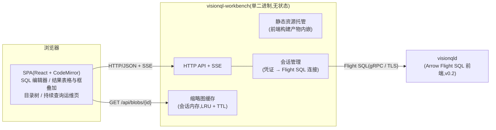

# VisionQL Workbench 设计文档

> 承接 [PRD](./prd.md) 3.8。Workbench 是随服务态(v0.2)提供的 Web 工作台:执行 SQL、预览多模态查询结果、监控持续查询与成本。定位为**独立的轻量子项目**,后端以 Arrow Flight SQL 连接 `visionqld`,与引擎之间不存在任何私有接口。

- **版本**: v0.1 (Draft)
- **日期**: 2026-08-03
- **对应文档**: PRD v0.1.3(3.8 节)、[系统设计](./system_design.md) v0.3.2(§21.1 Workbench 行)
- **状态**: 评审中

---

## 1. 概述

### 1.1 定位与范围

Workbench 是 `visionqld` 的图形界面,不是独立产品:没有服务态就没有 Workbench(库态用户的界面是 shell 与 notebook 富显示,系统设计 §13/§14)。它的存在理由是**多模态结果需要被"看见"**——通用 SQL 客户端经 JDBC/ADBC 也能连上 `visionqld`,但只会把 `IMAGE` 显示成二进制、把检测结果显示成结构体文本;Workbench 的差异化就是多模态富预览与视觉查询的调试/运维体验(PRD 3.8)。

本文档覆盖 v0.2 首发能力的详细设计与 v0.3 成本面板的挂载点。引擎侧配套能力(Flight SQL 前端、`FRAME_AT` 函数等)在此**只提需求不做设计**(§3.2),落点见系统设计 §21.1。

### 1.2 三条设计原则

1. **纯 Flight SQL 客户端**:Workbench 与引擎之间只有 Arrow Flight SQL——查询、目录、运维、指标全部降解为 SQL 语句或 Flight SQL 标准 RPC。它因此是"客户端走标准列式协议"(PRD 3.5-3)的持续验证者:Workbench 做不到的事,第三方客户端也做不到,倒逼协议面完整;引擎能力不在 Workbench 里长出第二套管理 API;
2. **无状态**:业务数据零持久化——认证凭证透传引擎、用户会话在内存、保存的查询在浏览器 localStorage。Workbench 进程可随起随灭、可水平复制,重启的代价只是重新登录;
3. **轻**:单二进制(前端静态资源内嵌)、无数据库、无消息队列、无后台任务;浏览器侧不引入 Arrow 运行时(后端转 JSON,行数受限,§4.1)。

---

## 2. 总体架构



| 组件 | 职责 |
|---|---|
| 前端 SPA | 编辑器、结果表格与多模态渲染(缩略图、框叠加)、目录树、持续查询运维页;不含业务逻辑,一切数据来自后端 API |
| Workbench 后端 | 静态资源托管;HTTP/SSE ↔ Flight SQL 翻译;会话管理(凭证保管、每会话一条 Flight SQL 连接);结果转码(Arrow → JSON、`IMAGE` 字节 → HTTP 图片响应) |
| `visionqld` | 一切真实能力:执行、目录、权限、指标 |

**为什么需要后端(而非浏览器直连 `visionqld`)**:Flight SQL 是 gRPC 协议,浏览器无原生 gRPC;gRPC-Web 通道叠加 JS 侧 Flight SQL 客户端的生态均不成熟。后端同时承担凭证保管(不落浏览器)与图片字节流转发。若未来 JS 侧 Flight SQL 客户端成熟,后端可退化为"静态托管 + 凭证代理"(§8 开放问题 4)。

---

## 3. 与引擎的接口

### 3.1 一切经 Flight SQL

| Workbench 功能 | 对应 SQL / Flight SQL 能力 |
|---|---|
| 执行查询 / DDL / DML | `Execute` / `ExecuteUpdate`;多语句脚本由 Workbench 切分(识别字符串与注释)后顺序执行,逐条展示结果 |
| 查询取消 | Flight SQL `CancelQuery`(用户取消、页面关闭、取数上限触发,§4.1/§4.3) |
| 目录浏览 | 表走 Flight SQL 标准元数据 RPC(`GetTables` 等);流/模型/函数/Sink 走 `SHOW STREAMS/MODELS/FUNCTIONS/SINKS` + `DESCRIBE`(含 DDL 回显) |
| 编辑器补全 | 同上目录数据,会话内 30s 缓存 |
| 持续查询列表与指标 | `SHOW QUERIES` / `SHOW METRICS`(轮询,§4.4) |
| 运维操作 | `PAUSE` / `RESUME` / `STOP <query>` |
| 成本面板(v0.3) | `EXPLAIN` 成本预估 + `SHOW METRICS` 实测口径 |

### 3.2 对引擎的需求清单

Workbench 是 Flight SQL 前端(v0.2)的第一个重客户端,它的需求即协议面的验收清单。分两类:

**新增能力(仅两项,均落在既有扩展点)**:

1. **结果集 `IMAGE` 表示的会话选项**——PRD 开放问题 5 的第一个消费者答案:`SET vql.result.image_mode = reference | thumbnail | inline`,默认 `reference`(引用态元数据 Struct,不含像素,系统设计 §5.2 跨进程边界规则的协议化)。`thumbnail` 模式由服务端在结果物化时生成内联 JPEG 缩略图(默认最长边 256px、质量 75),连同引用态元数据一并返回。Workbench 会话默认 `thumbnail`:表格内直接可见,单行 10~30KB,百行结果约 2MB,可接受;
2. **按引用取帧函数 `FRAME_AT(uri, pts_ms)`**:输入引用态字段,解码该帧返回 `IMAGE`(图片行 `pts_ms` 为 NULL 即读原文件);Workbench 组合 `TO_JPEG(FRAME_AT(?, ?), 90)` 做原图点查。该函数对所有客户端(BI 插件、notebook)同样有用,不是 Workbench 私有能力;引擎侧实现复用解码会话缓存(系统设计 §10.3)。权限语义:可解引用范围应与表/流级权限一致,先按"对底层存储位置的读权限"粗粒度落地(§8 开放问题 1)。

**既有能力的验收用例(不新增,列为 Flight SQL 前端验收项)**:

- 五类目录对象的 `SHOW` / `DESCRIBE` 语句完整性(shell `\d` 的同源能力 SQL 化);
- 无界 SELECT 经 `DoGet` 持续流式返回、`CancelQuery` 可终止——协议天然支持,首发验收(§4.3 依赖此项)。

---

## 4. 关键设计

### 4.1 查询执行通路

```mermaid
sequenceDiagram
    participant B as 浏览器
    participant C as Workbench 后端
    participant D as visionqld

    B->>C: POST /api/statements {sql}
    C->>D: Flight SQL Execute(多语句切分,顺序执行)
    D-->>C: Arrow 批流(IMAGE 列含缩略图,会话选项 thumbnail)
    C->>C: Arrow→JSON;缩略图字节入会话缓存,JSON 中放 blob 引用
    C-->>B: 行数据(达到取数上限即截断并 CancelQuery)
    B->>C: GET /api/blobs/{id}(表格  按需拉取)
    C-->>B: image/jpeg
    B->>C: 点击查看原图:POST /api/frames {uri, pts_ms}
    C->>D: SELECT TO_JPEG(FRAME_AT(?, ?), 90)
    D-->>C: 原图字节
    C-->>B: image/jpeg(模态框展示)
```

- **取数截断而非 SQL 改写**:交互查询默认取回上限(1000 行 / 8MB,先到为准),到限即 `CancelQuery` 并在界面标注"结果已截断"。不注入 `LIMIT`——改写会改变聚合类查询的语义,截断不会;
- **Arrow → JSON**:标量常规转换,时间戳 ISO-8601;`VECTOR` 折叠为前 k 项 + 维度;`IMAGE` 列拆两份——元数据(uri/pts_ms/宽高)进 JSON,缩略图字节**不进 JSON**,存入会话内存缓存(LRU + TTL,总量上限默认 256MB),JSON 中放 `/api/blobs/{id}` 引用,由表格 `` 按需拉取(blob 访问受会话 cookie 约束);
- 全量导出不走截断通路:Workbench 生成一条 `INSERT INTO` / CTAS 语句交引擎执行落 Parquet/Lance——导出也降解为 SQL(原则 1),Workbench 不做行级中转(§8 开放问题 2)。

### 4.2 多模态结果渲染

- **`IMAGE` 单元格**:缩略图 ``;点击 → 后端以 `TO_JPEG(FRAME_AT(?, ?), 90)` 取原图,模态框展示;
- **检测框叠加**:同一行内检测结果列(`List<Struct{label, confidence, box}>`)与 `IMAGE` 列同现时,前端在图上以 canvas 叠加归一化 `BOX2D`(标签 + 置信度);**置信度滑杆为纯前端过滤**——调阈值看效果不用重跑查询,这是视觉查询调试体验的核心;`UNNEST` 展开后的行(box 为标量 Struct)同样支持,一行一框;
- **`VIDEO` 单元格**:显示时长/分辨率/编码摘要;帧级时间轴预览依赖 `FRAME_AT` 点查压力评估,列 v0.3 再议(§8 开放问题 3)。

### 4.3 流式结果与指标(SSE)

- **无界 SELECT**:响应转为 SSE 流,后端从 Flight `DoGet` 持续读批、逐批推送 JSON 行;前端环形缓冲显示最近 N 行(默认 500)。SSE 连接断开(关页、切页、网络中断)→ 后端立即 `CancelQuery`——**预览不留孤儿查询**。这是流查询"所见即所查"的调试体验:改一版 SQL、看几秒实时输出、再改;
- **指标推送**:后端每 2s 执行 `SHOW QUERIES` / `SHOW METRICS`,按页面订阅推送 SSE。不设计推送协议——轮询频率低、语句便宜;长期监控是 Prometheus 端点(系统设计 §15,v0.2)+ Grafana 的事,不是 Workbench 的事。

### 4.4 持续查询运维与成本面板

- 查询列表页 = `SHOW QUERIES` 界面化(状态、运行时长、推理量、延迟、丢帧/断流指标),行内操作 `PAUSE` / `RESUME` / `STOP`(危险操作二次确认);
- 详情页 = 该查询的 `SHOW METRICS` 指标(系统设计 §15 每查询指标全集);
- **趋势数据不持久化**(原则 2 的推论):Workbench 在内存环形缓冲保留最近窗口(默认 1h,进程重启即失),用于详情页火花线;长期趋势走 Prometheus/Grafana 正道,Workbench 详情页放外链占位;
- 成本面板分两档:**v0.2 实测口径**(每查询推理次数 × 单帧均摊延迟,来自 `SHOW METRICS`);**v0.3 叠加预估可视化**(`EXPLAIN` 逐级帧数归因与 GPU 成本预估,系统设计 §9.4)——PRD 2.5"把省钱做成产品能力"的界面落点。

### 4.5 会话、认证与 Web 安全基线

- 登录页收集引擎凭证 → 后端向 `visionqld` 建 Flight SQL 连接完成 Handshake 校验 → server-side session(内存,cookie 仅存会话引用);凭证只在 Workbench 进程内存持有,不落盘、不落浏览器;
- **每用户会话对应一条 Flight SQL 连接**(`image_mode` 等会话选项是连接态);空闲超时(默认 30min)关闭连接与会话;
- Workbench 自身**不做权限判定**:权限模型全在引擎侧(v0.2 表/流级),Workbench 只如实展示引擎返回的权限错误——不存在第二套权限体系可漂移(PRD 3.8 原则);
- 传输:Workbench → `visionqld` 走 gRPC TLS;浏览器 → Workbench 由部署层反代或自带证书配置;
- Web 基线:cookie `SameSite=Strict` + CSRF token(状态变更 POST)、React 默认转义防 XSS、blob 仅同源会话可取、`X-Frame-Options: DENY`。

---

## 5. 技术选型

| 领域 | 选型 | 理由 | 主要备选与放弃原因 |
|---|---|---|---|
| 后端 | **Rust + axum** | 与引擎同语言(团队技能统一);`arrow-flight` crate 现成 Flight SQL 客户端;单二进制 + 静态资源内嵌(rust-embed),延续产品"单二进制零依赖"基因 | Node/TS 全栈(JS 侧 Flight SQL 客户端不成熟,而这是 Workbench 的生命线);Go(引入第二语言无决定性收益);Python(部署重) |
| 前端 | React + TypeScript + Vite | 生态与人才密度 | Svelte/Vue(无决定性优势) |
| SQL 编辑器 | **CodeMirror 6** | 比 Monaco 轻一个量级;SQL 模式可扩 VQL 关键字,目录感知补全走自定义 completion source | Monaco(体积大,LSP 级能力当前用不上) |
| 服务端推送 | SSE | 单向足够(命令走 HTTP)、自动重连、反代友好 | WebSocket(双向能力用不上,运维成本更高) |
| 图表(v0.3) | uPlot 级轻量时序库 | 渲染快、体积小 | ECharts(重) |

前端**不引入 arrow-js**:后端已转 JSON,浏览器保持零列式运行时(原则 3);若未来浏览器直连(§8 开放问题 4)再重估。

---

## 6. 部署、兼容与代码组织

- **形态**:独立单二进制 `visionql-workbench --server grpc+tls://host:32010 --listen :8080`,容器镜像同发;无外部依赖;
- **不随边缘**:边缘盒上的 `visionqld` 不部署 Workbench;由中心 Workbench 配置多端点连接边缘实例(§8 开放问题 5);
- **版本兼容**:Workbench 独立版本号与发布节奏;登录时读取引擎版本,方言/协议不兼容时显式提示;兼容承诺跟随引擎 SQL 方言与 Flight SQL 的稳定性承诺(PRD 3.7);
- **代码组织**:monorepo 顶层按子项目平级切分,Workbench 与引擎互为 peer——两者互不出现在对方的构建文件中(引擎 workspace 无需 `exclude` 寄居的第二 workspace),Rust 与 Rust + Node 两套工具链、两条 CI 流水线按目录前缀独立:

```
visionql/
 ├─ docs/            # PRD 与设计文档(跨子项目共享)
 ├─ engine/          # 引擎 cargo workspace(vql-* crates,系统设计 §19.1)
 └─ workbench/
     ├─ server/      # Rust crate(独立 workspace):axum + arrow-flight 客户端
     └─ web/         # Vite 项目;构建产物由 server 经 rust-embed 内嵌
```

依赖契约(类比系统设计 §21 的"禁止触碰"):`workbench/server` **不依赖任何 `vql-*` crate**——独立子项目的解耦由目录结构与依赖图直接保证,而非靠纪律;CI 独立流水线(前端 lint/test + 后端 test + 对 `visionqld` mock 的集成测试)。

---

## 7. 刻意不做(v0.2)

| 不做 | 理由 | 何时再议 |
|---|---|---|
| BI 图表 / 仪表盘编排 | BI 工具经 Flight SQL/JDBC 直连是正道(PRD 3.5-3);Workbench 只做结果预览与运维,成本面板是运维视图不是 BI | 不再议 |
| Workbench 自有用户体系与权限 | 权限是引擎的事;双轨权限必然漂移 | 不再议 |
| 保存查询的服务端存储 / 团队共享 | 需要持久化与归属模型,破坏无状态;localStorage 起步 | 企业版(与治理一起) |
| 指标历史持久化 | 长期监控走 Prometheus/Grafana;Workbench 只留内存最近窗口(§4.4) | 引擎侧系统表出现时重估(§8 开放问题 6) |
| 浏览器直连(gRPC-Web) | JS Flight SQL 生态不成熟;凭证保管仍需后端 | JS 生态成熟后(§8 开放问题 4) |
| notebook 式多 cell / 可视化编排 | 编辑器 + 历史已覆盖调试需求 | 按用户反馈 |

---

## 8. 开放问题

1. **`FRAME_AT` 权限粒度**:按存储位置的读权限(粗)vs 按目录对象血缘(细,"仅可解引用有权查询的对象产出的 uri")——细粒度实现成本高,v0.2 先粗后细;
2. **大结果导出的产品面**:导出即生成 CTAS/`INSERT INTO` SQL 交引擎执行(保持"一切降解为 SQL"),但目标路径、格式选择的交互形态待定;
3. **视频时间轴预览**:`FRAME_AT` + 时间轴组件的帧级 seek 体验价值高,但点查对引擎解码会话缓存的压力(命中率、并发)需实测后定;
4. **浏览器直连的远期形态**:JS 侧 Flight SQL 客户端成熟后,Workbench 后端是否退化为"静态托管 + 凭证代理";
5. **多端点(多 `visionqld` / 边缘车队)切换**的配置与会话模型;
6. **指标历史的归属**:若引擎侧未来提供指标系统表(目录持久化),Workbench 趋势图改查系统表,内存缓冲退役。

